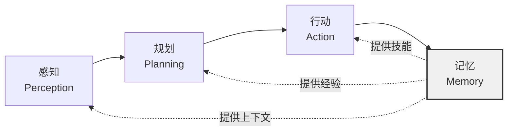
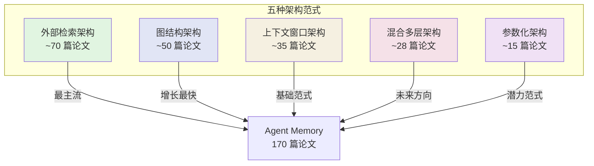
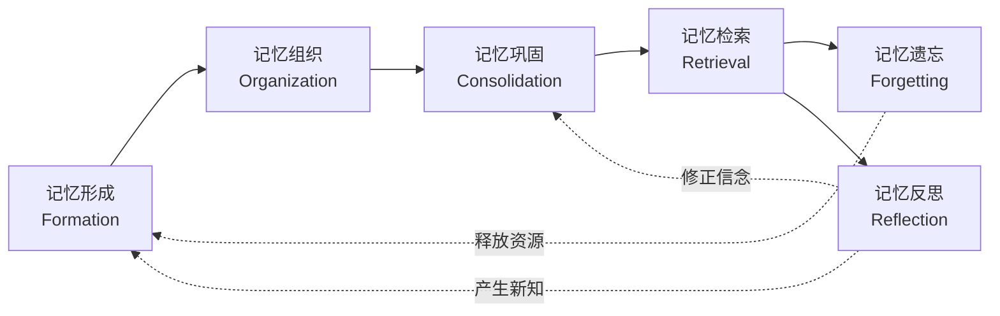

# 第1章 Agent Memory 全景地图

> **本章摘要**：本章为《智能体记忆工程》的开篇全览。我们首先剖析大语言模型"无记忆"的本质根源，进而论证 Agent Memory 为何在 2023 年成为一个独立的工程与研究领域。随后，基于 170 篇核心论文和 1092+ 个本体概念的系统分析，绘制领域地图——涵盖五种架构范式与五大功能范式，并梳理 2021-2026 年的演进轨迹。本章还建立了关键术语表，预览了 Generative Agents、MemGPT、MemoryBank 三个代表性案例，为后续深入本体论框架与各记忆层次的技术细节奠定基础。

---

## 1.1 LLM 的"无记忆"本质

要理解 Agent Memory 为何必要，必须先理解大语言模型（Large Language Model, LLM）为何"没有记忆"。这不是设计缺陷，而是由其底层计算范式决定的结构性特征。

### 自回归生成的零起点特性

LLM 的核心推理机制是自回归（Autoregressive）令牌预测：给定一个令牌序列 $x_1, x_2, \ldots, x_n$，模型以概率 $P(x_{n+1} | x_1, \ldots, x_n)$ 预测下一个令牌。每一次推理调用——无论来自同一用户还是不同用户——对模型而言都是从零开始的独立事件。模型的状态完全由当前输入令牌序列和固定的模型参数决定，不存在任何跨调用的内部状态延续。

这意味着：当你与一个 LLM 进行第一轮对话后关闭页面，再打开新页面发起第二轮对话，模型对第一轮对话一无所知。它不会"记得"你们聊过什么，也不会"认出"你是同一个人。这种"失忆"不是模型能力不足，而是其架构本身不包含状态持久化的机制。每一次 `generate()` 调用都是一次重生。

### Context Window 的本质：输入缓冲区，不是记忆

一个常见的误解是将上下文窗口（Context Window）等同于记忆。事实上，上下文窗口只是一个**输入缓冲区**——它限定了模型在单次推理中能够"看到"的令牌数量上限。当你在对话中发送新的消息时，系统会将历史对话（或其中的摘要）与新消息拼接在一起，作为输入送给模型。

上下文窗口与真正的记忆有本质区别：

| 特性 | 上下文窗口 | 真正的记忆 |
|------|-----------|-----------|
| 持久性 | 推理结束即消失 | 跨时间持久存储 |
| 容量 | 固定上限（4K-200K tokens） | 理论上无限 |
| 选择性 | 被动接收全部输入 | 主动筛选与编码 |
| 检索 | 线性扫描，无索引 | 可按语义/关联检索 |
| 演化 | 静态不变 | 可更新、巩固、遗忘 |

将上下文窗口当作记忆使用，就像试图用电脑的运行内存（RAM）当作硬盘（Disk）——一旦关机，一切归零。随着上下文窗口的不断扩大（从早期的 4K tokens 到如今部分模型的 200K+ tokens），这种误解愈发普遍。但无论窗口多大，它始终是一个有限的、易失的、无索引的输入缓冲区。

### "遗忘"的必然性：窗口溢出与信息丢失

当对话或任务的信息量超出上下文窗口容量时，信息丢失是必然的。这种遗忘有两种形式：

1. **主动截断**：系统丢弃最旧的令牌以腾出空间，遵循简单的 FIFO（先进先出）策略。被截断的信息永远消失，模型无法再引用它。
2. **注意力稀释**：即使信息仍在窗口内，随着上下文增长，模型对早期信息的注意力权重会衰减。研究表明，LLM 对上下文中间位置的信息（"中间迷失"现象，Lost in the Middle）召回率显著低于开头和结尾。

这两种遗忘都是不可控的——系统无法判断哪些信息重要、哪些可以舍弃。在复杂任务中（如多轮心理咨询对话、长期项目管理），这种无差别的信息丢失可能导致灾难性后果：忘记用户的过敏史、遗漏关键约束条件、重复犯同样的错误。

### 2023 年：为什么成为转折点

2023 年之所以被视为 Agent Memory 领域的元年，源于两股力量的交汇：

**第一股力量是上下文窗口的指数级扩展。** 2023 年初，主流模型的上下文窗口从 4K 迅速扩展到 32K、100K 乃至 200K。这表面上缓解了"记不住"的问题，却反而暴露了更深层的矛盾：更大的窗口并不等于更好的记忆。当上下文膨胀到数万令牌时，注意力稀释、推理延迟和成本飙升成为新的瓶颈。人们意识到，单纯的窗口扩展无法解决记忆的根本问题。

**第二股力量是 Agent 范式的兴起。** 2023 年，研究者开始将 LLM 从"聊天机器人"重新定位为"智能体"——能够自主感知、规划、行动并持续与环境和用户交互的实体。智能体的本质特征是**跨时间的持续存在性**，这与 LLM 的零起点特性产生了根本性冲突。如果没有记忆机制，Agent 就无法维持身份一致性、积累经验和建立个性化关系。

这两股力量的碰撞催生了一个核心认知：**我们必须为 LLM 构建外部记忆系统，而不能指望模型自身或更大的上下文窗口来解决记忆问题。** 这一认知在 2023 年引发了论文爆发——Generative Agents、MemGPT、MemoryBank、Reflexion 等标志性工作在同一年密集涌现，标志着 Agent Memory 正式成为一个独立的研究与工程领域。

*理解了 LLM 无记忆的本质，我们就能看清：Agent Memory 不是 LLM 能力的补充，而是 Agent 范式成立的必要条件。下一节将探讨这一范式转变如何催生了一个全新的领域。*

---

## 1.2 Agent Memory 为什么成为独立领域

### 从"让 LLM 记住"到"为 LLM 构建记忆"

在 2022 年及之前，LLM 的记忆问题主要通过两种方式应对：一是简单地截断对话历史以适应窗口限制，二是对话系统开发者手动维护对话状态。这两种方式都是**工程补丁**，而非系统性解决方案。

2023 年发生了一个关键的范式转变：研究者不再试图让 LLM 自身"记住"更多，而是开始**为 LLM 构建外部记忆系统**。这类似于计算机科学史上从"让 CPU 计算更快"到"为 CPU 设计存储器层次结构"的转变。当单个组件的能力达到瓶颈时，真正的突破来自架构创新。

这一转变的核心洞察是：**记忆不应该被理解为模型的内在能力，而应该被理解为系统的外部架构。** 就像人类大脑的记忆也不仅仅依赖神经元本身，而是依赖海马体、皮层等多结构的协同工作，Agent 的记忆同样需要多层次的系统架构来支撑。

### 2023 年关键论文集群效应

2023 年，Agent Memory 领域出现了罕见的论文集群效应——多篇奠基性工作在数月内密集发表，形成了领域的理论基石：

| 时间 | 论文 | 核心贡献 | 架构范式 |
|------|------|---------|---------|
| 2023 年 4 月 | Generative Agents | 记忆流 + 反思 + 检索的认知架构 | 外部检索 |
| 2023 年 5 月 | MemoryBank | 艾宾浩斯遗忘曲线 + 分层记忆 + 用户画像 | 外部检索 |
| 2023 年 10 月 | MemGPT | 虚拟上下文管理 + 分层内存 + 自主分页 | 上下文窗口 |
| 2023 年 10 月 | Reflexion | 自我反思循环 + 经验存储 | 混合多层 |

这一集群效应不是巧合。它反映了一个领域成熟的标志性问题：**问题已经明确，方法已经多元，社区已经形成。** 四篇论文分别从认知架构、心理学模型、操作系统理论、强化学习等不同视角切入，却共同指向同一个结论——LLM 需要系统化的记忆机制。

### Agent 三大能力缺口

在没有记忆机制的情况下，Agent 面临三个无法弥补的能力缺口：

**1. 长期一致性缺口。** Agent 无法在不同会话之间保持一致的身份认知。今天被告知"我喜欢猫"，明天再见面时又需要重新介绍自己。在多轮交互中，Agent 的回答可能前后矛盾——这并非模型推理能力不足，而是缺乏持久的事实存储和一致性校验机制。

**2. 个性化缺口。** 没有记忆就没有个性化。每个用户面对的都是同一个"白板" Agent，无法积累用户偏好、使用习惯、知识水平等个性化信息。这使得 Agent 在客服、教育、医疗等需要深度个性化理解的场景中难以实用。

**3. 经验积累缺口。** 人类通过试错积累经验，而传统的 LLM 每次交互都是全新的开始。Agent 无法从过去的成功中提炼最佳实践，也无法从失败中诊断问题根源。这种"永远从零开始"的模式，严重限制了 Agent 在复杂任务中的长期表现。

### 记忆作为 Agent 的"第四支柱"

当前 Agent 架构普遍认同三大核心能力：**感知**（理解环境和用户输入）、**规划**（分解任务、制定策略）和**行动**（调用工具、执行操作）。然而，如果没有记忆，这三者都将成为无源之水：

记忆为感知提供个性化上下文（"这个用户上次问过类似问题"），为规划提供经验参考（"上次类似任务用方法 A 失败了"），为行动提供技能库（"这个 API 的调用方式我已经学会了"）。**感知-规划-行动-记忆**构成了 Agent 的四大支柱，缺一不可。记忆不仅是第四支柱，更是串联其他三者的粘合剂。

*确立了记忆作为 Agent 核心能力的地位后，我们需要看清整个领域的全貌——有哪些架构范式、功能分类和发展脉络。下一节将绘制完整的领域地图。*

---

## 1.3 领域地图

### 1.3.1 时间线：2021-2026 年的论文分布

Agent Memory 领域的论文发表呈现明显的加速增长趋势。基于本体论覆盖的 170 篇核心论文统计：

| 年份 | 论文数量 | 累计论文 | 关键特征 |
|------|---------|---------|---------|
| 2021 | 1 | 1 | 早期探索：知识编辑的初步尝试 |
| 2022 | 1 | 2 | 长视频对象分割中的记忆机制（XMem） |
| 2023 | 18 | 20 | **爆发年**：Generative Agents、MemGPT、MemoryBank、Reflexion 等奠基性工作 |
| 2024 | 23 | 43 | 分化与深化：图记忆、参数化记忆、多模态记忆涌现 |
| 2025 | 100+ | 148+ | 整合与工程化：Large Memory Models、治理框架、标准化、多模态扩展 |
| 2026 | 22+ | 170+ | 前沿突破：超图记忆、主动提取、代理遗忘、测试时扩展等 |

> 注：以上统计基于本书资料库收录的论文简报数量（共 170 篇）。本体论分析覆盖了其中的 170 篇，衍生出 1092+ 个唯一概念（2026 年新论文标注进行中）。2025 年论文数量显著增长，反映领域进入高速扩张期。

从数据可见，2023 年是明显的拐点——当年论文数量几乎是前两年总和的三倍。此后领域进入快速分化期，2024 年达到峰值。截至本体论 v1.2 编纂时，共覆盖 170 篇论文，衍生出 1092+ 个唯一概念，分布在 33 个子类别中。

### 1.3.2 五种架构范式

对 322 种记忆结构与 319 种记忆载体（数据来源：本体论 v1.2 形式维度聚类）的聚类分析表明，Agent Memory 系统在实践中收敛为五种主导架构范式：

| 架构范式 | 主要载体维度 | 典型功能 | 代表结构类型 | 论文覆盖量 |
|---------|-------------|---------|-------------|-----------|
| **外部检索架构** | External | Factual, Semantic | 向量数据库, 知识图谱, Memory Bank | ~70 |
| **图结构架构** | External / Latent | Factual, Semantic, Episodic | 知识图谱, 记忆图, 层次树, 超图 | ~50 |
| **上下文窗口架构** | Token-level | Working, Episodic | Context Window, Prompt Context | ~35 |
| **混合多层架构** | 多载体组合 | 全功能覆盖 | 分层系统, 双模块框架 | ~28 |
| **参数化架构** | Parametric | Factual, Procedural | LoRA, 模型权重, Hyper-network | ~15 |

**外部检索架构**是当前最主流的范式。它以向量数据库（FAISS、ChromaDB 等）和图数据库为核心载体，将记忆持久化于模型之外，通过语义检索注入推理上下文。其优势在于可扩展性强、检索效率高、与模型解耦，代表论文数量最多。

**图结构架构**是增长最快的范式。它将记忆建模为实体-关系网络，包含 44 种图/树结构变体。优势在于显式关系推理与可编辑性，是知识密集型场景的首选。2026 年的 HyperMem（2604.08256）将超图理论引入对话记忆，突破传统图结构仅处理成对关系的局限。

**上下文窗口架构**是最基础的范式。它以 LLM 上下文窗口为唯一载体，通过滑动窗口、优先级修剪等策略管理记忆。随着上下文窗口的持续扩大，该范式的重要性仍在上升。

**混合多层架构**代表了系统化演进的最终方向。它组合多种载体维度，构建"短期上下文窗口 + 中期外部存储 + 长期参数化"的分层记忆系统，辅以中央记忆控制器协调各层间的形成、检索、巩固与遗忘流程。

**参数化架构**将记忆编码入模型参数（LoRA 适配器、微调权重等），通过持续学习或模型编辑实现知识内化。其优势在于零推理延迟，但更新成本高、可解释性弱，目前论文覆盖量最少但增长潜力大。

### 1.3.3 五大功能范式

基于 325 个记忆功能概念的系统分析，Agent 记忆的功能定位可归纳为五大范式：

| 功能范式 | 认知定位 | 回答的问题 | 代表子类 |
|---------|---------|-----------|---------|
| **陈述性记忆** | 智能体所知 | "我知道什么？" | 事实记忆、语义记忆、情景记忆 |
| **程序与经验记忆** | 智能体所能 | "我会做什么？" | 程序记忆、经验记忆 |
| **工作记忆** | 智能体所思 | "我现在在想什么？" | 工作记忆、短期记忆、感官记忆 |
| **长期记忆** | 智能体所记 | "我记得什么？" | 跨会话存储、参数化记忆 |
| **反思与元记忆** | 智能体所学 | "我从中学到了什么？" | 反思经验、演化信念、自我模型 |

值得注意的是，功能维度中"Other Memory Type"（其他记忆类型）占比高达 72%，这反映了领域在通用记忆类型之上涌现了大量场景化、领域化的记忆子类——如用户画像记忆、对话记忆、社交记忆等，说明 Agent Memory 正在从通用框架向领域适配分化。

### 1.3.4 概念分布总览

本体论共收录 1092+ 个唯一概念（2026 年新论文标注进行中），分布在三个维度中：

| 维度 | 概念数量 | 最密集子类 | 占比 |
|------|---------|-----------|------|
| **形式维度 (Forms)** | 322 | Other Structure（115 个） | 36% |
| **功能维度 (Functions)** | 325 | Other Memory Type（233 个） | 72% |
| **动态维度 (Dynamics)** | 445 | Other Operation（228 个） | 51% |

形式维度中，Memory Storage（78 个概念，24%）和 Graph/Tree Structure（44 个，14%）占据主导，说明领域正在探索多样化的结构化表示方式。

功能维度中，Other Memory Type 占 72%，反映领域在通用记忆类型之上涌现了大量场景化的子类。

动态维度中，Retrieval（79 个概念，18%）是最受关注的操作类型，而 Other Operation 占 51% 反映了领域在操作语义上尚未收敛——大量辅助操作仍在被定义和标准化中。

### 1.3.5 记忆生命周期

445 个记忆操作概念可归纳为六个生命周期阶段，形成持续演化的闭环：

这一闭环揭示了 Agent Memory 的核心动态特征：记忆不是静态存储，而是一个持续形成、组织、巩固、检索、遗忘和反思的循环过程。其中，**检索**是概念最密集的阶段（79 个概念），而**反思**是唯一能产生增量知识的阶段——它将经验转化为新洞察，回注到记忆形成阶段。

*领域地图描绘了 Agent Memory 的全貌——五种架构范式、五大功能范式和六大生命周期阶段。下一节将建立关键术语表，统一我们讨论这些概念时所使用的语言。*

---

## 1.4 关键术语表

本节为本领域最核心的术语提供初步定义，为第 2 章本体论框架的深入展开奠定基础。

### 1.4.1 核心概念定义

| 术语 | 英文 | 定义 |
|------|------|------|
| **记忆** | Memory | Agent 对过往经验的持久化编码，可在后续任务中被检索和利用 |
| **记忆载体** | Memory Carrier | 记忆的物质承载形式，分为标记级（Token-level）、参数级（Parametric）、外部级（External）和隐式级（Latent） |
| **记忆类型** | Memory Type | 按功能定位分类的记忆，包括事实、语义、情景、程序、经验、工作和反思七类 |
| **记忆操作** | Memory Operation | 对记忆执行的生命周期行为，包括形成、检索、演化、遗忘、反思和关联 |
| **记忆结构** | Memory Structure | 记忆的组织形式，如向量索引、知识图谱、层次树、记忆流等 |
| **记忆系统** | Memory System | 管理多类记忆的组织、协调与调度的基础设施架构 |

### 1.4.2 核心辨析

**记忆 vs 知识库**

知识库（Knowledge Base）是静态的事实集合，通常由人工录入或批量导入。记忆（Memory）是动态的经验编码，具有生命周期——它会被形成、巩固、检索、遗忘和反思。知识库中的条目没有"重要性"或"时效性"的动态变化，而记忆的价值随使用频率和时间衰减而演化。简言之，知识库是"仓库"，记忆是"有机体"。

**记忆 vs 上下文**

上下文（Context）是单次推理的输入窗口，推理结束即消失。记忆（Memory）是跨会话的持久存储。上下文是被动的——它包含系统送入的所有内容；记忆是主动的——它通过检索策略选择性地注入上下文。上下文是记忆的"工作台"，而非记忆本身。

**记忆 vs 微调**

微调（Fine-tuning）通过更新模型参数来内化知识，属于参数化记忆载体。其优势是推理时零额外开销，劣势是更新成本高（需重新训练）、知识不可追溯、难以针对单个用户定制。外部记忆通过检索增强注入上下文，更新灵活、可解释、可个性化，但有检索延迟。两者互补而非替代：微调适合通用的、稳定的知识，外部记忆适合个性化的、频繁更新的知识。

### 1.4.3 三维分类坐标

本体论采用三维正交分类体系，每个记忆概念可由三个维度的坐标唯一确定：

| 维度 | 坐标值 | 含义 |
|------|--------|------|
| **载体维度 (Carrier)** | Token-level / Parametric / External / Latent | 记忆的物质承载形式 |
| **功能维度 (Function)** | Factual / Semantic / Episodic / Procedural / Experiential / Working / Reflection | 记忆的认知功能定位 |
| **动态维度 (Dynamic)** | Formation / Retrieval / Evolution / Forgetting / Reflection / Association | 记忆的生命周期操作 |

例如，一个存储在向量数据库中、记录用户偏好的记忆条目，其坐标为：`External (载体) + Factual (功能) + Retrieval (动态)`。这种三维分类使得每个记忆概念既有明确的功能定位，又有清晰的载体归属和操作特征。

### 1.4.4 八大核心类

本体论的类层级以 8 个顶层类为根节点：

| 顶层类 | 核心定位 |
|--------|---------|
| **Agent** | 记忆主体——记忆的拥有者与使用者 |
| **Memory** | 记忆载体——记忆的承载实体 |
| **MemorySystem** | 记忆管理架构——组织、协调与调度基础设施 |
| **MemoryEvent** | 记忆触发源——引发记忆操作的内部或外部事件 |
| **MemoryOperation** | 记忆操作行为——写入、检索、更新、遗忘等 |
| **Context** | 记忆关联场景——操作发生的环境与约束 |
| **Entity** | 记忆关联对象——记忆内容涉及的对象与关系 |
| **Policy** | 记忆操作规则——安全策略与访问规则 |

*术语表为后续章节提供了统一的语言基础。接下来，让我们通过三个代表性案例，将抽象的概念具象化。*

---

## 1.5 代表性案例预览

本节预览三篇奠基性论文，它们分别代表了三种不同的架构范式，共同勾勒出 Agent Memory 的设计空间。

### 案例一：Generative Agents —— 社交模拟中的记忆（外部检索架构）

**论文**：Park, J. S. et al. "Generative Agents: Interactive Simulacra of Human Behavior." UIST '23.

Generative Agents 将 25 个智能体部署在一个类似《模拟人生》的沙盒环境中，每个智能体都拥有完整的记忆-反思-规划架构。其核心创新是**记忆流（Memory Stream）**——一个以自然语言记录所有经验的数据库，配合三个关键机制：

1. **记忆存储**：智能体将观察到的事件以自然语言语句存入记忆流（如"Klaus Mueller 在图书馆看书"）。
2. **反思机制**：定期对记忆流中的条目进行合成，生成高层反思（如"Klaus Mueller 最近总是在图书馆，他可能在准备论文"）。
3. **检索机制**：根据当前情境，按相关性（近因性、重要性和关联性）从记忆流中检索相关条目，指导规划和行动。

消融实验证明，观察、规划和反思三个组件缺一不可——移除任何一个都会显著降低智能体行为的可信度。该架构成功涌现出复杂的社会行为，如智能体自主组织情人节派对、传播八卦、建立友谊等。

**范式定位**：典型的外部检索架构。记忆以自然语言形式存储在外部数据库中，通过语义相关性检索注入推理上下文。

### 案例二：MemGPT —— LLM 作为操作系统（上下文窗口架构）

**论文**：Packer, C. et al. "MemGPT: Towards LLMs as Operating Systems." arXiv:2310.08560, 2023.

MemGPT 提出了一种革命性的类比：**将 LLM 视为操作系统的处理器，上下文窗口视为内存，外部存储视为磁盘**。其核心架构包含：

1. **主上下文（Main Context）**：类比虚拟内存，包含系统指令（只读）、工作上下文（读写）和 FIFO 消息队列。
2. **外部存储（External Storage）**：类比磁盘，包含召回存储（全量消息）和归档存储（向量检索）。
3. **队列管理器（Queue Manager）**：监控上下文令牌使用率，在达到警告阈值（70%）时触发分页操作，将旧信息移出主上下文、将相关信息加载进来。

关键创新在于**自主分页**——LLM 通过函数调用（Function Calling）自主决定何时读写外部存储，而非由外部系统被动管理。在多跳查找任务中，基线模型在 3 层嵌套时准确率降为 0，而 MemGPT 能稳定完成。

**范式定位**：上下文窗口架构的代表，但通过分层内存设计模糊了上下文与外部记忆的边界，向混合多层架构演进。

### 案例三：MemoryBank —— 拟人化记忆（外部检索架构 + 心理学模型）

**论文**：Zhong, W. et al. "MemoryBank: Enhancing Large Language Models with Long-Term Memory." arXiv:2305.10250, 2023.

MemoryBank 的独特之处在于将**认知心理学理论**引入 Agent Memory 设计。其核心机制借鉴了艾宾浩斯遗忘曲线（Ebbinghaus Forgetting Curve）：

1. **分层存储**：原始对话按时间戳存储，LLM 生成每日总结和全局总结，形成"原始-每日-全局"三层结构。
2. **动态更新**：记忆强度随时间指数衰减（$R = e^{-t/S}$），被召回时强度重置并增强，模拟人类的"复习"机制。
3. **用户画像**：基于记忆内容动态构建用户画像，实现个性化交互。

在 15 个虚拟用户、10 天对话的评估中，MemoryBank 的中文记忆检索准确率超过 0.84，显著优于无记忆的基线模型。该系统已开源为 SiliconFriend AI 伴侣应用。

**范式定位**：外部检索架构，但通过引入心理学遗忘模型，在记忆管理策略上具有独特创新。分层总结机制也体现了上下文窗口架构的元素。

### 三种范式的对比

| 维度 | Generative Agents | MemGPT | MemoryBank |
|------|------------------|--------|-----------|
| **架构范式** | 外部检索 | 上下文窗口 | 外部检索 + 心理学模型 |
| **记忆载体** | 自然语言数据库 | 主上下文 + 外部存储 | 向量数据库（FAISS） |
| **核心机制** | 记忆流 + 反思 + 检索 | 虚拟分页 + 函数调用 | 遗忘曲线 + 分层总结 |
| **遗忘策略** | 无显式遗忘 | FIFO 驱逐 | 艾宾浩斯指数衰减 |
| **应用场景** | 社交模拟 | 长文档/长对话 | AI 伴侣/长期对话 |
| **关键洞察** | 自然语言是通用记忆接口 | OS 架构可迁移至 LLM | 心理学理论可指导算法设计 |

*三个案例展示了 Agent Memory 设计的多样性——没有单一"正确"的架构，只有适合不同场景的范式选择。下一章将建立系统的本体论框架，为这些范式选择提供理论依据。*

---

## 1.6 本章小结

本章为《智能体记忆工程》提供了全景式的领域导览，核心要点如下：

- **LLM 本质上是无记忆的**。自回归生成机制决定了每次推理从零开始，上下文窗口只是输入缓冲区而非记忆。窗口溢出导致的信息丢失是结构性的，无法通过扩大窗口来解决。
- **2023 年是 Agent Memory 领域的元年**。上下文窗口的指数级扩展与 Agent 范式的兴起两股力量交汇，催生了 Generative Agents、MemGPT、MemoryBank、Reflexion 等奠基性工作。
- **记忆是 Agent 的第四支柱**。感知-规划-行动-记忆构成 Agent 的四大核心能力，记忆不仅独立重要，更是串联其他三者的粘合剂。
- **领域已收敛为五种架构范式**：外部检索（最主流）、图结构（增长最快）、上下文窗口（最基础）、混合多层（未来方向）、参数化（潜力范式）。
- **记忆功能可归纳为五大范式**：陈述性（所知）、程序与经验（所能）、工作（所思）、长期（所记）、反思与元记忆（所学）。
- **记忆是动态的生命周期闭环**，而非静态存储。形成、组织、巩固、检索、遗忘、反思六个阶段持续循环，其中反思是唯一能产生增量知识的阶段。
- **本体论覆盖 170 篇论文、1092+ 个概念、33 个子类别**，为领域提供了统一的概念坐标系和分类体系。
- **架构选择取决于场景**。社交模拟适合外部检索，长文档处理适合上下文窗口管理，AI 伴侣适合心理学启发的动态更新，复杂系统适合混合多层架构。

---

## 1.7 延伸阅读

### 奠基性论文

1. **Park, J. S. et al.** (2023). "Generative Agents: Interactive Simulacra of Human Behavior." UIST '23. —— 首次将记忆流、反思和检索机制整合为生成式智能体架构。
2. **Packer, C. et al.** (2023). "MemGPT: Towards LLMs as Operating Systems." arXiv:2310.08560. —— 将操作系统内存管理理论引入 LLM 上下文管理。
3. **Zhong, W. et al.** (2023). "MemoryBank: Enhancing Large Language Models with Long-Term Memory." arXiv:2305.10250. —— 将艾宾浩斯遗忘曲线应用于 LLM 记忆更新机制。
4. **Shinn, N. et al.** (2023). "Reflexion: Language Agents with Verbal Reinforcement Learning." —— 通过自我反思循环实现经验积累。

### 综述与框架

5. **Lewis, P. et al.** (2020). "Retrieval-Augmented Generation for Knowledge-Intensive NLP Tasks." —— RAG 范式的奠基论文。
6. **Mialon, G. et al.** (2023). "Augmented Language Models: A Survey." —— 语言模型增强方法的系统性综述。
7. **(2026).** "Externalization in LLM Agents: A Comprehensive Survey." arXiv:2604.08224. —— 统一综述论文，覆盖外部化技术在 LLM Agent 中的全景应用。

### 背景阅读

8. **Tolman, E. C.** (1948). "Cognitive Maps in Rats and Men." —— 认知地图理论，为记忆的空间组织提供心理学基础。
9. **Ebbinghaus, H.** (1885). "Memory: A Contribution to Experimental Psychology." —— 遗忘曲线的原始研究，MemoryBank 的心理学基础。

### 开源工具

- **MemGPT**：https://github.com/cpacker/MemGPT —— 虚拟上下文管理的开源实现。
- **MemoryBank / SiliconFriend**：https://github.com/zhongwanjun/MemoryBank-SiliconFriend —— 基于遗忘曲线的长期记忆框架。
- **LangChain Memory**：LangChain 框架中的记忆模块实现。

*领域地图已经展开，关键术语已经建立，代表性案例已经预览。第 2 章将深入本体论框架，为这些概念建立严格的形式化体系。*
