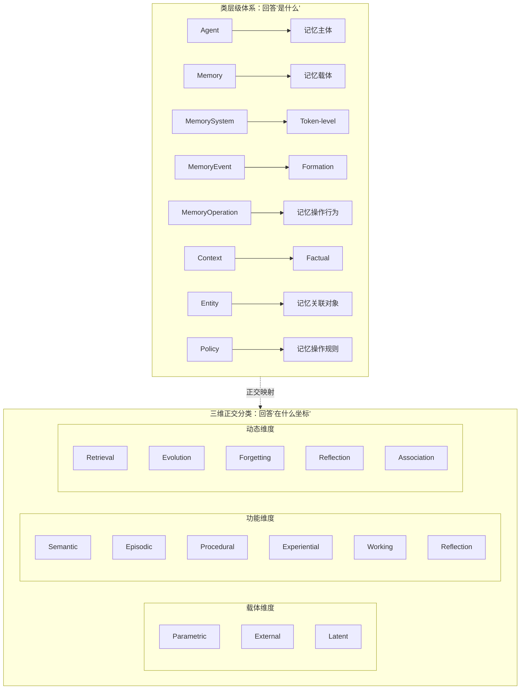
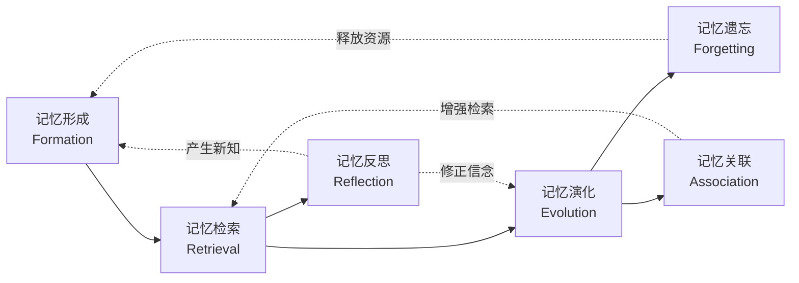

# 第2章 本体论框架

> **本章摘要**：本章建立 Agent Memory 领域的统一概念框架。我们提出"三维正交分类 + 类层级"双轨本体论，涵盖 4 种载体维度、7 种功能维度、6 种动态维度、8 个顶层类和 18 条公理。该框架从 170 篇论文、1092 个概念的系统分析中提炼而来，为后续章节的技术展开提供统一的分析语言和分类工具。

---

## 2.1 本体论的设计动机

如第1章所述，2023 年 Agent Memory 领域经历了爆发式增长——Generative Agents、MemGPT、MemoryBank、Reflexion 等标志性工作在一年内密集涌现。这一增长带来了两个未曾预料的问题：**领域碎片化**与**术语混乱**。

### 2.1.1 领域碎片化：170 篇论文的共同困境

我们对 2021 至 2026 年间 170 篇 Agent Memory 核心论文的系统分析揭示了一个令人担忧的现象：**同一领域内缺乏统一的概念语言**。

具体表现在三个层面：

- **术语碎片化**：同一概念在不同论文中使用数十种不同的名称。例如，"长期记忆"这一概念在文献中以 Long-Term Memory、Persistent Memory、Archival Memory、Episodic Store、Memory Bank、Knowledge Repository 等至少十余种术语出现。
- **概念重叠**：不同论文中使用相同术语指代不同的概念。"Working Memory"在某些工作中指上下文窗口内的活跃推理区，在另一些工作中则指短期对话历史，还有的指任务执行过程中的临时中间状态。
- **分类缺失**：缺乏系统性的分类框架。现有综述论文多采用罗列式（按发表时间或方法类型排列）而非分析式组织，读者难以理解各种方法之间的结构关系。

在功能维度（Function），我们统计到 325 个记忆功能概念，其中 "Other Memory Type"（领域专用记忆类型）高达 72%，说明绝大多数论文都在发明新的场景化子类，而非归入已有分类。在动态维度（Dynamics），445 个操作概念中 "Other Operation" 占比 51%，反映领域在操作语义上远未收敛。

### 2.1.2 现有综述的不足

现有的 Agent Memory 综述论文（如记忆架构综述、RAG 综述、持续学习综述等）虽各有贡献，但存在共同的结构性缺陷：

1. **缺乏系统性分析框架**：多数综述按技术路线（如"基于检索的方法"vs."基于微调的方法"）组织，但同一技术路线下的不同方法可能服务于完全不同的功能目标，而不同技术路线的方法可能实现相同的功能。
2. **概念边界模糊**：什么是"记忆"？上下文窗口是记忆吗？模型参数中的隐含知识是记忆吗？向量数据库中的嵌入向量是记忆吗？现有文献对这些问题的回答各不相同，缺乏统一的判定标准。
3. **维度混叠**：多数分类方案将载体、功能、操作混为一谈。例如将"向量数据库"（载体）与"语义检索"（操作）和"长期记忆"（功能）并列在同一层级，违反了分类的互斥性原则。

### 2.1.3 本体论作为"地图"而非"领土"

在展开本章之前，需要明确一个关键的元认知：**本体论是分析工具，不是现实本身**。

正如地图不是领土（The map is not the territory），本体论框架不是 Agent Memory 领域的全貌，而是我们用来理解、组织和导航这一领域的工具。它不声称自己是唯一正确的分类方式，也不试图取代原始论文的贡献。它的价值在于：

- **提供统一的术语表**，使不同工作的比较成为可能；
- **揭示概念间的结构关系**，帮助研究者发现未被探索的设计空间；
- **为工程实践提供架构蓝图**，指导系统设计中的概念选择与组合。

我们在构建本体论时遵循了五个核心原则：**语义唯一性**（每个概念在模型中具有唯一的语义标识）、**正交独立性**（三个维度相互独立）、**层级清晰性**（类归属与坐标值正交共存）、**工程适配性**（概念兼顾理论完整性与工程可实现性）、**可扩展性**（新增概念可归入现有维度）。

### 2.1.4 双轨架构概述

本章提出的本体论采用**双轨架构**：

- **轨道一：三维正交分类体系**——回答"在什么坐标"的问题。每个记忆概念由载体（Carrier）、功能（Function）、动态（Dynamic）三个相互正交的维度坐标唯一确定。
- **轨道二：类层级体系**——回答"是什么"的问题。8 个顶层类及其子类构成领域概念的语义归属树。

两条轨道正交共存，确保每个概念既有明确的语义定位（类层级），又可在多维坐标空间中被精确刻画（三维分类）。此外，18 条公理约束概念之间的关系，确保模型的逻辑一致性。

下图展示了双轨架构的整体结构：

本节概述了为什么需要本体论框架及其双轨架构。接下来，我们将分别展开三维分类、类层级和公理体系。

---

## 2.2 三维正交分类体系

三维正交分类体系是本本体论的核心分析工具。每个 Agent Memory 概念由三个维度的坐标唯一确定：**载体维度**（Carrier）定义记忆的物质承载形式，**功能维度**（Function）定义记忆的认知功能定位，**动态维度**（Dynamic）定义记忆的生命周期操作。三个维度相互正交——同一概念可在不同维度上同时拥有坐标值。

### 2.2.1 载体维度（Carrier）

载体维度回答"记忆存在于哪里"这一根本问题。记忆必须依附于某种物质或信息载体而存在，载体的性质直接决定了记忆的持久性、可访问性和更新成本。

#### （1）Token-level（标记级）

**定义**：以文本令牌为载体的记忆，驻留于模型的输入上下文中。

Token-level 记忆是最直接的记忆形式——将信息以原始文本、摘要或结构化文本的形式写入 LLM 的上下文窗口。这类记忆的特征是：

- **易失性**：随推理会话结束而消失，除非被外部系统重新注入。
- **即时可访问**：信息在当前上下文中立即可用，无需额外检索。
- **零工程开销**：直接拼接为输入文本即可，不需要额外的存储基础设施。

**典型实例**：
- 上下文窗口中的对话历史
- Prompt 序列中的系统指令（如"你是一个有用的助手，用户名叫小明"）
- 滑动窗口中的近期消息摘要
- MemGPT 中的主上下文（Main Context）——系统指令、工作上下文和 FIFO 消息队列的组合

**代表论文**：MemGPT（2310.08560）是 Token-level 载体的经典案例。它将 LLM 主上下文视为"虚拟内存"，划分为系统指令（只读）、工作上下文（读写）和 FIFO 消息队列三部分，当队列达到容量上限时触发分页操作，将旧消息移出至外部存储。这种设计精妙地利用了 Token-level 载体的即时可访问性，同时通过外部存储解决了其易失性问题。

#### （2）Parametric（参数）

**定义**：以模型权重为载体的记忆，通过训练或编辑将知识内化于模型参数中。

Parametric 记忆是最"内化"的记忆形式——知识被编码到模型的权重矩阵中，成为模型推理能力的一部分。这类记忆的特征是：

- **零推理延迟**：知识已融入模型本身，推理时无需额外检索步骤。
- **高更新成本**：修改参数级记忆需要微调、持续学习或模型编辑，计算开销远高于外部存储更新。
- **低可解释性**：知识分布在数百万至数千亿参数中，难以定位特定知识的存储位置。

**典型实例**：
- 通过 SFT（监督微调）将领域知识注入模型
- LoRA 适配器——将特定领域知识编码为低秩参数矩阵
- KnowledgeEditor（2104.08164）——使用超网络预测权重更新 Delta，直接编辑模型参数中的事实知识
- MLP 记忆模块——在 Transformer 中引入可更新的记忆参数

**代表论文**：Editing Factual Knowledge in Language Models（2104.08164）提出了 KnowledgeEditor 方法，使用一个超网络（Hyper-network）预测模型参数的更新量 Delta，实现对 Transformer 中特定事实的精准编辑。该方法形式化了模型编辑的约束优化问题，定义了局部性（Locality）和泛化性（Generalization）指标，证明了参数级记忆可以在不重训的情况下进行高效更新。

#### （3）External（外部）

**定义**：以外部存储为载体的记忆，独立于模型本身，持久化于外部数据库中。

External 记忆是当前最主流的载体形式——将信息持久化于向量数据库、知识图谱或文件系统中，需要时通过检索注入上下文。这类记忆的特征是：

- **强持久性**：独立于模型生命周期，数据持久保存。
- **可扩展性**：存储容量理论上不受限，可随需求扩展。
- **检索延迟**：每次使用需要检索步骤，增加响应延迟和计算成本。

**典型实例**：
- 向量数据库（FAISS、ChromaDB、Pinecone）中的嵌入向量
- 知识图谱中的实体-关系三元组
- MemoryBank（2305.10250）中的分层记忆数据库（原始对话 + 每日总结 + 全局总结）
- HippoRAG（2405.14831）中的知识图谱 + Personalized PageRank 索引
- 文件系统或关系数据库中的对话日志

**代表论文**：MemoryBank（2305.10250）是 External 载体的典型代表。它设计了三层记忆存储结构（原始对话、每日总结、全局总结），并使用 FAISS 向量索引实现高效检索。其创新在于引入艾宾浩斯遗忘曲线模拟记忆的动态更新——记忆强度随时间指数衰减 $R = e^{-t/S}$，被召回时强度重置并增强，模拟人类的"复习"机制。HippoRAG（2405.14831）则进一步将 External 载体与图结构结合，通过知识图谱中的实体-关系网络实现跨段落知识整合，用 Personalized PageRank 实现单次检索完成多跳推理，比迭代检索方法快 6-13 倍。

#### （4）Latent（隐式）

**定义**：以隐式表示为载体的记忆，存在于模型的隐藏状态或潜在表征中。

Latent 记忆是最难直接观测和操控的记忆形式——它不是以显式文本或参数形式存在，而是编码在模型的隐状态、注意力模式或潜在向量空间中。这类记忆的特征是：

- **隐式性**：不直接可读，需要通过模型前向传播间接体现。
- **高密度**：压缩了大量信息于低维向量中。
- **难编辑**：缺乏直接修改隐式表征的有效手段。

**典型实例**：
- Transformer 各层的隐藏状态（Hidden States）
- 注意力矩阵中的关注模式（Attention Patterns）
- 潜在表征向量（Latent Representation Vectors）
- LM2（2502.06049）中的记忆向量（Memory Vectors）——作为独立的上下文表示仓库，通过跨注意力与输入令牌交互

**代表论文**：LM2（2502.06049）是 Latent 载体的前沿探索。它提出了"大型记忆模型"（Large Memory Models）架构，在 Decoder-only Transformer 中引入一个独立的记忆库（Memory Bank），该记忆库中的记忆向量通过跨注意力机制与输入令牌交互，并通过输入（I）、输出（O）、遗忘（F）三个门控机制进行更新。与标准 Transformer 相比，LM2 在长上下文推理基准 BABILong 上比 Llama-3.2 提升了 86.3%，比记忆增强基线 RMT 提升了 37.1%，且在通用任务 MMLU 上仍保持 5.0% 的提升。

#### 载体维度的正交关系

载体维度与功能维度、动态维度相互正交，这意味着：

- 同一功能（如 Factual 事实记忆）可以由不同载体实现：可以是 Token-level 的 Prompt 注入、Parametric 的模型编辑、External 的向量数据库检索，或 Latent 的记忆向量。
- 同一载体（如 External 外部存储）可以服务于不同功能：可以存储 Factual 事实、Semantic 语义网络、Episodic 情景历史或 Procedural 操作流程。
- 同一载体-功能组合可以执行不同动态操作：External+Factual 可以用于 Formation（写入新事实）、Retrieval（检索已有事实）、Evolution（更新过时事实）或 Forgetting（淘汰低价值事实）。

下表展示了载体维度的完整分类：

| 载体类型 | 物质基础 | 持久性 | 更新成本 | 访问延迟 | 可解释性 | 代表论文 |
|----------|---------|--------|---------|---------|---------|---------|
| Token-level | 文本令牌 | 低（会话级） | 低 | 零 | 高 | MemGPT |
| Parametric | 模型权重 | 高（模型级） | 高 | 零 | 低 | 2104.08164 |
| External | 外部存储 | 高（系统级） | 低 | 中 | 高 | MemoryBank, HippoRAG |
| Latent | 隐式表征 | 中（推理级） | 中 | 低 | 低 | LM2 |

### 2.2.2 功能维度（Function）

功能维度回答"记忆做什么"这一问题——即记忆在智能体认知架构中扮演的角色。我们从认知心理学和 Agent 架构两个视角出发，定义了 7 种功能类型。

#### （1）Factual（事实）

**定义**：存储离散客观信息的记忆功能。

Factual 记忆是 Agent 对世界的"事实库"，包含具体的、可验证的客观信息。这类记忆的特征是：

- **离散性**：每个事实单元是独立的（如"用户小明住在上海"）。
- **可验证性**：事实有明确的真值（True/False）。
- **时效性**：事实可能随时间变化（如"某国总统"）。

**典型实例**：
- 用户偏好（喜欢猫、不吃辣）
- 世界常识（地球围绕太阳转）
- 结构化事实（公司成立于 2020 年）
- KnowledgeEditor 编辑的事实三元组（如关系提取中的实体对关系）

Factual 记忆是 KnowledgeEditor（2104.08164）的核心功能定位——该论文专门解决模型参数中存储的事实知识的编辑问题。

#### （2）Semantic（语义）

**定义**：组织概念关联与知识网络的记忆功能。

Semantic 记忆超越孤立事实，关注概念之间的关联关系和知识结构。这类记忆的特征是：

- **关联性**：以关系网络而非原子事实的形式组织。
- **层级性**：概念之间存在上下位关系（如"猫" 是 "动物"的子类）。
- **推理性**：支持基于关系网络的推理（如"如果 A 是 B 的朋友，B 是 C 的同事，则 A 和 C 可能相识"）。

**典型实例**：
- 知识图谱中的实体-关系网络
- HippoRAG 构建的知识图谱——将文档中的概念提取为节点，关系提取为边，形成跨段落的知识关联网络
- 语义锚点（Semantic Anchors）——用于记忆检索的语义参照点
- 概念层级（Ontology/Taxonomy）——领域概念的层次分类

Semantic 记忆是 HippoRAG（2405.14831）的核心创新——通过知识图谱显式建模概念间的语义关联，使检索系统能够沿图边进行多跳推理，而不仅仅是匹配文本相似度。

#### （3）Episodic（情景）

**定义**：记录交互事件与时间线索的记忆功能。

Episodic 记忆是 Agent 的"自传式记忆"——记录与用户或环境交互的具体事件，包含时间、地点、参与者等上下文信息。这类记忆的特征是：

- **时序性**：事件按时间顺序组织。
- **情境依赖性**：同一事件在不同情境下意义不同。
- **叙事性**：可以组织为连贯的事件叙事。

**典型实例**：
- 对话历史（用户与 Agent 的完整交互记录）
- 交互轨迹（Agent 在任务执行中的行动序列）
- 事件图（Event Graph）——事件之间的因果关系网络
- MemoryBank 中的原始对话日志和每日总结

#### （4）Procedural（程序）

**定义**：存储可执行技能与操作流程的记忆功能。

Procedural 记忆是 Agent 的"技能库"——编码如何执行特定任务的知识。这类记忆的特征是：

- **可执行性**：可以被 Agent 直接调用执行。
- **模块化**：可以组合和复用（如"先搜索，再总结，最后回答"）。
- **可迁移性**：同一技能可应用于不同场景。

**典型实例**：
- 工具调用序列（搜索 API -> 过滤结果 -> 生成回答）
- SOP（标准操作流程）编码
- API 技能库
- Reflexion 中存储的自我改进策略

#### （5）Experiential（经验）

**定义**：记录成功/失败轨迹与迁移知识的记忆功能。

Experiential 记忆是 Agent 的"经验库"——从过往任务中提炼的启发式知识和教训。这类记忆的特征是：

- **诊断性**：包含对失败原因的分析。
- **迁移性**：跨场景的通用经验可应用于新任务。
- **启发式**：通常以规则或模式形式存在，而非精确算法。

**典型实例**：
- 跨域经验（在代码调试中积累的"常见错误模式"）
- 反馈诊断（"当用户说'不对'时，通常意味着理解偏差而非事实错误"）
- 启发式策略（"遇到数学问题时，先列式再计算"）

#### （6）Working（工作）

**定义**：作为即时认知工作区的记忆功能。

Working 记忆是 Agent 的"思维桌面"——承载当前任务处理所需的活跃信息。这类记忆的特征是：

- **容量受限**：同时处理的信息量有限。
- **高更新频率**：随任务进展频繁更新。
- **临时性**：任务完成后通常被释放。

**典型实例**：
- 动态上下文工作区（MemGPT 的工作上下文）
- 活跃推理链（CoT 推理中的中间步骤）
- 任务执行的中间状态

#### （7）Reflection（反思）

**定义**：实现元认知与自我觉察的记忆功能。

Reflection 记忆是 Agent 的"自省能力"——对自身认知过程的监控、评估和重构。这类记忆的特征是：

- **元层次**：关于认知的认知，而非直接关于外部世界。
- **增量性**：反思必然产生新的知识，而非仅仅回顾已有信息。
- **自我模型**：包含 Agent 对自身能力、限制和信念的表征。

**典型实例**：
- 反思经验（Reflexion 中对推理困境的分析）
- 演化信念（对自身能力动态更新的评估）
- 自我模型（Creed、能力清单等元描述）

#### 功能维度的正交关系

功能维度与载体维度的正交性意味着同一功能可由不同载体实现。例如，Factual 事实记忆可以是：
- Token-level：Prompt 中的"用户叫小明"
- Parametric：通过微调内化的领域知识
- External：向量数据库中的用户画像
- Latent：记忆向量中的用户特征编码

功能维度与动态维度的正交性意味着同一功能可经历不同的生命周期操作。例如，Semantic 语义记忆可以被形成（构建知识图谱）、检索（图遍历查询）、演化（添加新关系）、遗忘（移除过时节点）和关联（建立跨图谱链接）。

| 功能类型 | 认知定位 | 信息粒度 | 典型载体 | 典型动态 | 代表论文 |
|----------|---------|---------|---------|---------|---------|
| Factual | 离散客观信息 | 原子事实 | External, Parametric | Formation, Evolution | 2104.08164 |
| Semantic | 概念关联网络 | 关系结构 | External, Latent | Association, Retrieval | HippoRAG |
| Episodic | 交互事件线索 | 事件序列 | External, Token-level | Formation, Forgetting | MemoryBank |
| Procedural | 可执行技能 | 操作流程 | Parametric, External | Formation, Evolution | Reflexion |
| Experiential | 成败迁移知识 | 启发规则 | External, Token-level | Reflection, Formation | Reflexion |
| Working | 即时认知工作区 | 活跃状态 | Token-level, Latent | Formation, Retrieval | MemGPT |
| Reflection | 元认知自我觉察 | 元描述 | Token-level, External | Reflection, Evolution | Reflexion |

### 2.2.3 动态维度（Dynamic）

动态维度回答"记忆如何变化"这一问题——即记忆从创建到淘汰的完整生命周期。我们定义了 6 种核心操作类型，它们构成一个闭环：形成 -> 检索 -> 演化 -> 遗忘 -> 反思 -> 关联。

#### （1）Formation（形成）

**定义**：记忆的创建与编码过程。

Formation 是记忆生命周期的起点。系统将外部信号（用户输入、环境感知、任务输出）转化为可存储的记忆表征，并写入相应的载体。

**典型操作**：
- **直接写入（MEM_WRITE / Add / Insertion）**：将信息直接存入存储介质。
- **门控写入（Gated Write/Update）**：通过门控机制决定是否写入及写入内容，如 LM2 的输入门（I-Gate）。
- **惊喜度驱动编码（Surprise-Driven Encoding）**：当输入与已有记忆存在显著偏差时触发编码。
- **编码压缩（Encoding/Summarization）**：将原始信息压缩为更紧凑的表征（如 MemoryBank 的每日总结）。

**技术实例**：KnowledgeEditor（2104.08164）中的超网络生成权重更新 Delta，本质上是一种参数级 Formation——将新事实编码为参数增量。MemoryBank（2305.10250）的分层总结（原始对话 -> 每日总结 -> 全局总结）是一种典型的形成阶段信息压缩策略。

#### （2）Retrieval（检索）

**定义**：从记忆库中召回与当前任务相关的信息。

Retrieval 是 Agent Memory 领域研究最密集的操作（占动态维度概念的 18%）。高质量的检索需要在召回率（找到所有相关信息）和精确度（避免无关信息干扰）之间找到平衡。

**典型操作**：
- **语义检索（Semantic Retrieval）**：基于向量相似度匹配（如 FAISS 的 ANN 搜索）。
- **图遍历检索（Graph Traversal）**：沿知识图谱的边进行多跳查询（如 HippoRAG 的 Personalized PageRank）。
- **混合检索（Hybrid Retrieval）**：结合关键词匹配与语义相似度。
- **上下文感知检索（Context-aware Retrieval）**：根据当前任务上下文动态调整检索策略。
- **层次检索（Hierarchical Retrieval）**：先粗后细的多层级检索（如 MemoryBank 先检索全局总结，再检索相关每日总结）。

**技术实例**：HippoRAG（2405.14831）使用 Personalized PageRank 在知识图谱上进行检索，将查询映射为图谱上的起始节点，通过随机游走计算所有节点的相关性得分。这种图遍历检索的优势在于：单次检索即可获得多跳推理所需的全部上下文，无需迭代式检索。

#### （3）Evolution（演化）

**定义**：知识的更新、整合与结构调整。

Evolution 确保记忆系统能够适应环境变化和知识更新，避免信息过时和矛盾积累。

**典型操作**：
- **记忆更新（Memory Update）**：直接修改已有记忆内容。
- **知识融合（Knowledge Fusion）**：整合多个来源的冲突信息。
- **冲突消解（Conflict Resolution）**：当新旧记忆矛盾时，通过时间权重、置信度或人工干预选择保留版本。
- **增量编辑（Incremental Delta Update）**：KnowledgeEditor 式的参数级微小更新。

**技术实例**：KnowledgeEditor（2104.08164）定义了模型编辑的演化范式——通过最小扰动（Minimal Perturbation）更新参数中的事实，同时通过局部性约束（Locality Constraint）确保不影响无关知识。MemoryBank（2305.10250）的记忆强度更新机制 $S_{new} = S_{old} + \Delta S$ 也是一种演化操作——检索事件触发记忆强化。

#### （4）Forgetting（遗忘）

**定义**：有计划地淘汰低价值或过时记忆。

Forgetting 并非系统的缺陷，而是其设计特性——有限的存储资源要求系统优先保留高价值信息。遗忘的主动性是 Agent Memory 区别于传统数据库的关键特征。

**典型操作**：
- **时间衰减（Time-based Decay / Forgetting Curve）**：如 MemoryBank 的 $R = e^{-t/S}$ 指数衰减模型。
- **LFU 淘汰（Least Frequently Used Eviction）**：淘汰访问频率最低的记忆。
- **基于效用的删除（Utility-based Deletion）**：根据记忆对任务成功的贡献度决定保留与否。
- **竞争性抑制（Competitive-Inhibitory Forgetting）**：新记忆的形成主动抑制相似但过时的旧记忆。

**技术实例**：MemoryBank（2305.10250）的遗忘机制是本体的经典案例——它模拟人类艾宾浩斯遗忘曲线，记忆保留率随时间指数衰减，当低于阈值时被自动淘汰。这种遗忘不是简单的删除，而是"自然淘汰"——被频繁检索的记忆因强度增强而存活，不被使用的记忆随时间衰减而遗忘。

#### （5）Reflection（反思）

**定义**：对记忆内容的元层次评估与重构。

Reflection 是唯一能产生增量知识的动态操作——其他操作都是在已有知识空间内移动信息，而反思操作能够生成全新的知识实例。

**典型操作**：
- **反思生成（Reflection Generation）**：从过往交互中提炼新的洞察。
- **夜间自评（Nightly Self-Critique）**：定期对自身表现进行系统性回顾。
- **洞察提取（Insight Extraction）**：从失败案例中提取可迁移的经验。
- **轨迹反思（Trajectory Reflection）**：对完整任务执行路径的回顾分析。

**技术实例**：Reflexion 架构中的自我反思循环——Agent 在任务失败后生成语言反馈，评估自身表现，并将反思结果存储为经验记忆，指导后续尝试。这是 Reflection 动态的典型实现。

#### （6）Association（关联）

**定义**：跨记忆关联的建立与维护。

Association 操作将孤立的记忆节点连接为网络，使 Agent 能够进行跨记忆的推理和迁移。

**典型操作**：
- **上下文集成（Context Integration）**：将当前任务上下文与已有记忆关联。
- **关系感知链接（Relation-aware Linking）**：在实体间建立语义关系边。
- **跨模态关联（Cross-modal Association）**：将文本记忆与图像、音频等其他模态关联。

**技术实例**：HippoRAG（2405.14831）的知识图谱构建本质上是一种 Association 操作——LLM 从文档中提取实体和关系，将它们组织为图结构，使原本孤立的文本段落通过图边建立语义关联。这种关联使单次检索即可获取多跳推理所需信息。

#### 动态维度的正交关系与生命周期闭环

三个维度的正交关系总结如下：

| 维度 | 回答问题 | 变化影响 | 独立于 |
|------|---------|---------|--------|
| 载体（Carrier） | 记忆存在哪里？ | 改变载体不改变功能和操作类型 | 功能、动态 |
| 功能（Function） | 记忆做什么？ | 改变功能不改变载体和生命周期阶段 | 载体、动态 |
| 动态（Dynamic） | 记忆如何变化？ | 改变生命周期阶段不改变载体和功能 | 载体、功能 |

六个动态操作构成记忆生命周期的闭环：

这一闭环体现了记忆的持续演化特性：记忆不是静态存储的数据，而是通过不断的使用、更新、淘汰和反思而动态生长的认知系统。

---

## 2.3 类层级体系

如果说三维分类体系回答"在什么坐标"的问题，类层级体系则回答"是什么"的问题。8 个顶层类及其子类构成 Agent Memory 领域的语义归属树，覆盖从记忆主体到操作规则的完整概念空间。

### 2.3.1 八个顶层类及其职责

| 顶层类 | 核心定位 | 职责范围 | 子类示例 |
|--------|---------|---------|---------|
| **Agent** | 记忆主体 | 记忆的拥有者与使用者，执行记忆操作，维持身份一致性 | LLM Agent, Human User, Multi-Agent System |
| **Memory** | 记忆载体 | 记忆的承载实体，包含内容、质量属性和生命周期元数据 | ParametricMemory, ExternalMemory, TokenMemory, LatentMemory |
| **MemorySystem** | 记忆管理架构 | 记忆的组织、协调与调度基础设施 | MemoryOrchestrator, RetrievalEngine, IndexManager, StorageBackend |
| **MemoryEvent** | 记忆触发源 | 引发记忆操作的内部或外部事件 | UserInput, AgentOutput, TimerSignal, EnvironmentChange |
| **MemoryOperation** | 记忆操作行为 | 对记忆执行的具体操作 | MemoryWrite, MemoryRead, MemoryUpdate, MemoryForget, MemoryReflect |
| **Context** | 记忆关联场景 | 操作发生的环境与约束条件 | TaskContext, SessionContext, TemporalContext, SecurityContext |
| **Entity** | 记忆关联对象 | 记忆内容涉及的对象与关系 | Person, Concept, Event, Relation, Document |
| **Policy** | 记忆操作规则 | 控制记忆行为的安全策略与访问规则 | AccessControl, PrivacyPolicy, RetentionPolicy, EditingPolicy |

### 2.3.2 核心类详解

**Agent 类**是记忆系统的主体。Agent 拥有记忆、使用记忆并执行记忆操作。在本体论中，Agent 不是被动的记忆容器，而是主动的记忆管理者——它决定什么信息值得记忆、何时检索、如何更新。如第1章所述，Agent 的记忆能力是其在长期交互中维持身份一致性和个性化的前提。

**Memory 类**是记忆的承载实体。它包含记忆的内容（文本、向量、参数等）和元数据（创建时间、访问计数、重要性评分、质量三元组等）。Memory 与载体维度紧密对应——ParametricMemory 对应 Parametric 载体，ExternalMemory 对应 External 载体，等等。

**MemorySystem 类**是记忆的管理基础设施。它不是记忆本身，而是组织、协调和调度记忆的架构。MemGPT（2310.08560）中的队列管理器（Queue Manager）、HippoRAG（2405.14831）中的索引-检索双阶段架构、LM2（2502.06049）中的门控记忆模块，都属于 MemorySystem 的实例。

**MemoryEvent 类**是触发记忆操作的源头。没有无来源的记忆——每条记忆必须关联至少一个 MemoryEvent。用户输入（UserInput）、Agent 输出（AgentOutput）、定时器信号（TimerSignal）和环境变化（EnvironmentChange）是最常见的事件类型。

**MemoryOperation 类**是对记忆执行的具体行为。写入（MemoryWrite）、检索（MemoryRead）、更新（MemoryUpdate）、遗忘（MemoryForget）和反思（MemoryReflect）是五种核心操作。动态维度（Dynamic）的六种类型正是对 MemoryOperation 的高层分类。

**Context 类**定义了操作发生的环境与约束。同一操作在不同上下文中可能产生不同结果——例如，在安全上下文（SecurityContext）受限的情况下，检索操作可能只返回脱敏后的记忆。

**Entity 类**是记忆内容涉及的对象与关系。用户、概念、事件、文档等都是 Entity 的实例。知识图谱中的节点和边本质上都是 Entity 的子类。

**Policy 类**定义了记忆操作的规则和约束。访问控制策略（AccessControl）决定谁可以读写哪些记忆，隐私策略（PrivacyPolicy）规定敏感信息的处理方式，保留策略（RetentionPolicy）决定记忆的生命周期上限，编辑策略（EditingPolicy）约束参数级记忆的更新行为。

### 2.3.3 类层级与三维分类的互补性

类层级和三维分类并非竞争关系，而是正交互补的分析维度：

| 分析维度 | 核心问题 | 分类方式 | 示例 |
|---------|---------|---------|------|
| 类层级 | 这个概念**是什么**？ | 语义归属（is-a 树） | Memory -> ExternalMemory -> VectorDBMemory |
| 三维分类 | 这个概念**在什么坐标**？ | 坐标映射（Carrier, Function, Dynamic） | (External, Factual, Retrieval) |

一个具体的技术可以同时从两个角度分析。以 MemoryBank 为例：
- **类层级分析**：它是 MemorySystem 的一个实例，包含 Memory（分层记忆存储）、MemoryOperation（检索/更新/遗忘）、MemoryEvent（用户输入触发）、Policy（遗忘阈值策略）等多个类的协作。
- **三维分类分析**：它的核心记忆载体是 External（向量数据库），功能定位是 Factual + Episodic（用户事实 + 对话历史），动态操作覆盖 Formation（写入/总结）、Retrieval（FAISS 检索）、Evolution（强度增强）和 Forgetting（时间衰减）。

类层级关注系统的**结构组成**（有哪些组件），三维分类关注组件的**功能坐标**（每个组件在什么位置）。两者结合，才能完整刻画一个记忆系统的全貌。

---

## 2.4 公理体系

公理是本体论中不可再分的断言，构成领域模型的推理基础。以下 18 条公理从 Agent Memory 领域的结构性规律中归纳得出，分为存在、操作、质量、安全和演进五大类。

### 2.4.1 存在公理

存在公理定义记忆实例存在的基本条件。

**公理 1：载体必要性（Carrier Necessity）**

> 每个记忆实例必须占据至少一个载体维度位置（Token-level / Parametric / External / Latent），不存在无载体的记忆。

这一公理排除了"纯粹的记忆"这一形而上学概念——记忆必须有物质或信息的承载体。在工程实践中，这意味着每条记忆对象必须明确声明其载体类型。例如，KnowledgeEditor 中编辑的事实存储在 Parametric 载体（模型权重）中，MemoryBank 中的对话历史存储在 External 载体（向量数据库）中。

**公理 2：事件依赖性（Event Dependency）**

> 没有无来源的记忆——每条记忆必须关联至少一个 MemoryEvent（用户输入、系统输出、环境信号等）。

这一公理确保记忆的可追溯性。在工程实现中，每条 Memory 实例应记录其 SourceEvent 字段，以便审计、调试和回溯。

**公理 3：多维共存（Multi-dimensional Coexistence）**

> 一个记忆实例可同时具有多个维度的坐标值（如 External 载体 + Factual 功能 + Retrieval 操作）。

这一公理允许概念在多维空间中的丰富刻画。例如，HippoRAG 的知识图谱可以同时占据 External 载体、Semantic 功能和 Association 动态三个坐标。

### 2.4.2 操作公理

操作公理约束记忆操作的执行条件与效果。

**公理 4：索引约束（Index Constraint）**

> 任何 MemoryRetrieval 操作必须有对应的 Index 结构支撑，无索引即无法检索。

索引结构可以是向量索引（FAISS IVF/PQ）、图索引（邻接表）、文本索引（倒排索引）或参数索引（超网络映射）。这一公理强调了索引设计在记忆系统中的核心地位——没有索引的记忆等于没有记忆。

**公理 5：遗忘不可逆（Forgetting Irreversibility）**

> MemoryForgetting 操作不产生可恢复的记忆副本，遗忘是单向的信息损失过程。

这一公理区分了"遗忘"与"归档"——归档是将记忆移至冷存储（仍可检索），而遗忘是永久删除。在工程实现中，Policy 类可以通过 RetentionPolicy 配置是否允许归档替代遗忘。

**公理 6：反思增量性（Reflection Incrementality）**

> MemoryReflection 操作必然产生至少一个新增概念实例——反思不只是回顾，而是知识生成。

这一公理将反思与其他操作区分开来。如果一次"反思"没有产生新知识（新的 Factual 事实、新的 Procedural 技能或新的 Experiential 经验），那么它只是检索，不是反思。

**公理 7：操作闭合性（Operational Closure）**

> 所有 MemoryOperation 的输入和输出均在本体论定义的类空间内，不存在域外操作。

这一公理确保模型的封闭性——任何操作都可以用本体论中的类来描述其输入和输出类型。

### 2.4.3 质量公理

质量公理定义记忆质量的度量方式和演化规律。

**公理 8：质量三元组（Quality Triplet）**

> 记忆质量是新鲜度（Freshness）、一致性（Consistency）与置信度（Confidence）的函数，三者缺一不可。

- **新鲜度**：记忆内容与当前状态的时效匹配度。例如，"2024 年奥运会举办地"这一事实在 2024 年后新鲜度下降。
- **一致性**：记忆内容与其他记忆及全局知识的一致性程度。例如，用户今天说"我喜欢猫"与昨天说"我对猫毛过敏"可能冲突。
- **置信度**：记忆内容来源的可靠性和生成过程的置信水平。例如，用户明确陈述的事实置信度高于系统推断的假设。

**公理 9：属性非独立性（Attribute Non-independence）**

> 质量维度作为 Memory 的属性而非独立类存在——质量内生于记忆实例。

**公理 10：时效衰减律（Temporal Decay Law）**

> 记忆的新鲜度随时间单调递减，除非通过检索或巩固操作刷新。

这一定律是 MemoryBank（2305.10250）遗忘曲线 $R = e^{-t/S}$ 的理论基础。它表明即使记忆内容本身不变（如用户出生日期），其新鲜度也会随时间降低——因为系统缺乏对其"仍然有效"的确认信号。

### 2.4.4 安全公理

安全公理约束记忆系统的安全边界与防护策略。

**公理 11：风险正比律（Risk Proportionality）**

> 记忆检索深度与隐私泄露风险正相关——检索越深，暴露越多。

深层检索可能触及用户未曾明示但隐含在交互历史中的敏感信息（如健康状态、情绪模式、经济状况）。这一公理要求 MemorySystem 在检索策略中引入深度限制参数。

**公理 12：攻击面差异（Attack Surface Differentiation）**

> 格式化检索（基于关键词/模板）比语义检索更易受提示词操纵攻击。

格式化检索（如精确匹配、正则表达式）的输入-输出映射是确定性的，攻击者可以通过构造特定输入精确触发目标检索。而语义检索的向量相似度匹配具有模糊性和不可预测性，攻击难度更高。

**公理 13：隔离必要性（Isolation Necessity）**

> 敏感记忆操作必须在安全沙箱中执行，防止记忆内容被未授权访问。

敏感操作包括：涉及 PII（个人身份信息）的读写、跨用户记忆共享、参数级记忆的编辑等。沙箱隔离确保即使操作被恶意利用，影响范围也被限制在可控区域内。

### 2.4.5 演进公理

演进公理描述记忆系统随时间的演化规律。

**公理 14：使用强化律（Usage Reinforcement）**

> 记忆随使用而强化——accessCount 增加导致 importance 增加，频繁访问的记忆更持久。

这是 MemoryBank 记忆强度增强机制的理论基础：$S_{new} = S_{old} + \Delta S$。在工程中，importance 评分通常与 accessCount 正相关。

**公理 15：时间衰减律（Temporal Attenuation）**

> 记忆随时间而衰减——长期未访问的记忆 importance 递减，直至触发遗忘。

与时效衰减律（公理 10）不同，此公理关注的是记忆的重要性评分（importance），而非新鲜度（freshness）。一条记忆可能内容仍然新鲜（事实仍然成立），但因长期未被访问而降权。

**公理 16：最小扰动原则（Minimal Perturbation）**

> 记忆编辑（如 Knowledge Editing）应遵循最小权重变更原则，避免灾难性遗忘。

KnowledgeEditor（2104.08164）的核心贡献之一就是将这一原则形式化为约束优化问题：$\min ||\Delta \theta||$，subject to $f(x; \theta + \Delta \theta) = a$。这意味着编辑一个事实时，参数变化应尽可能小，以保护其他知识不受影响。

**公理 17：一致性优先（Consistency Priority）**

> 当新旧记忆冲突时，系统应优先维护全局一致性而非局部精确性。

例如，用户从"我喜欢猫"变为"我现在对猫毛过敏"，系统不应简单地添加新记忆而保留旧记忆，而应通过冲突消解机制更新或标注旧记忆，确保全局画像一致。

---

## 2.5 本体论分析实战

本节选取 5 篇代表性论文，演示如何使用本本体论框架进行完整的分析。每篇论文的分析遵循以下步骤：（1）从简报中提取记忆类型、结构、操作和载体；（2）映射到三维坐标；（3）标注类层级归属；（4）一句话总结其在本体论中的定位。

### 2.5.1 论文一：2104.08164 — Editing Factual Knowledge in Language Models

**提取分析**：

| 维度 | 内容 |
|------|------|
| Memory Types | Parametric Factual Knowledge, Editable Knowledge State |
| Memory Structures | Hyper-network Weight Generator, Perturbation Vector (Delta) |
| Memory Operations | Constraint-based Editing, Local Weight Update, Test-time Editing |
| Memory Carriers | Transformer Model Parameters, Hyper-network Parameters |

**三维坐标映射**：

| 坐标 | 位置 | 理由 |
|------|------|------|
| 载体 | **Parametric** | 知识编码于 Transformer 模型权重中 |
| 功能 | **Factual** | 编辑目标是事实性知识（实体关系三元组） |
| 动态 | **Evolution** | 核心操作是知识更新（增量编辑） |

**类层级归属**：

| 类 | 角色 |
|------|------|
| Memory | ParametricMemory——模型权重中的事实知识 |
| MemoryOperation | MemoryUpdate——通过超网络预测的 Delta 进行参数编辑 |
| MemoryEvent | UserInput——待编辑的查询和目标答案 |
| Policy | EditingPolicy——局部性约束（不影响无关知识） |

**本体论定位**：KnowledgeEditor 是 **Parametric 载体 + Factual 功能 + Evolution 动态** 坐标上的典型实例，证明了参数级记忆可以在不重训的情况下进行精准、局部化的知识编辑。

### 2.5.2 论文二：2305.10250 — MemoryBank

**提取分析**：

| 维度 | 内容 |
|------|------|
| Memory Types | Raw Dialogue Memory, Summarized Memory (Daily/Global), User Profile Memory |
| Memory Structures | Hierarchical Memory Storage, Vector Index (FAISS), Memory Strength Parameter |
| Memory Operations | Memory Consolidation (Summarization), Memory Decay (Forgetting), Memory Reinforcement (Retrieval) |
| Memory Carriers | Text Embeddings, Dialogue Logs, Profile Tags |

**三维坐标映射**：

| 坐标 | 位置 | 理由 |
|------|------|------|
| 载体 | **External** | 记忆存储于外部向量数据库（FAISS） |
| 功能 | **Episodic** + **Factual** | 对话历史（情景）+ 用户画像（事实） |
| 动态 | **Formation** + **Retrieval** + **Evolution** + **Forgetting** | 覆盖完整生命周期 |

**类层级归属**：

| 类 | 角色 |
|------|------|
| MemorySystem | 三层记忆管理（原始/每日/全局）+ FAISS 检索引擎 |
| Memory | ExternalMemory——向量嵌入形式的对话记忆 |
| MemoryOperation | MemoryWrite（写入）、MemoryRead（检索）、MemoryForget（衰减淘汰）、MemoryUpdate（强度增强） |
| MemoryEvent | UserInput（对话输入）、TimerSignal（时间衰减触发） |
| Policy | RetentionPolicy——基于遗忘曲线的动态保留策略 |

**本体论定位**：MemoryBank 是 **External 载体 + Episodic/Factual 功能 + 完整生命周期动态** 坐标上的典范，首次将艾宾浩斯遗忘曲线引入 LLM 记忆管理，实现了拟人化的记忆衰减与强化机制。

### 2.5.3 论文三：2310.08560 — MemGPT

**提取分析**：

| 维度 | 内容 |
|------|------|
| Memory Types | Virtual Context Memory, Main Context, Archival Memory, Recall Memory |
| Memory Structures | Hierarchical Memory System, Queue Manager, FIFO Message Buffer |
| Memory Operations | Virtual Context Paging, Memory Eviction/Loading, Autonomous Function Calling |
| Memory Carriers | Context Window Tokens, External Vector/Relational Database |

**三维坐标映射**：

| 坐标 | 位置 | 理由 |
|------|------|------|
| 载体 | **Token-level** + **External** | 主上下文（Token）+ 外部存储（External）的混合载体 |
| 功能 | **Working** + **Episodic** | 工作上下文（Working）+ 归档历史（Episodic） |
| 动态 | **Formation** + **Retrieval** + **Forgetting** | 写入、分页检索、上下文溢出淘汰 |

**类层级归属**：

| 类 | 角色 |
|------|------|
| MemorySystem | 分层内存系统（主上下文 + 外部存储）+ 队列管理器 |
| Memory | TokenMemory（主上下文）、ExternalMemory（归档/召回存储） |
| MemoryOperation | MemoryWrite（写入上下文）、MemoryRead（从外部检索）、MemoryForget（FIFO 溢出淘汰） |
| MemoryEvent | UserInput、SystemOverflow（上下文容量告警触发分页） |
| Agent | LLM 作为自主记忆管理者——自行决定何时分页、何时检索 |

**本体论定位**：MemGPT 是 **Token-level + External 混合载体 + Working 功能 + 自主分页动态** 坐标上的开创性工作，首次将操作系统虚拟内存架构引入 LLM 上下文管理，赋予模型自主管理记忆的能动性。

### 2.5.4 论文四：2405.14831 — HippoRAG

**提取分析**：

| 维度 | 内容 |
|------|------|
| Memory Types | Neurobiologically Inspired Long-Term Memory, Hippocampal Index Memory |
| Memory Structures | Knowledge Graph (Cortex-like Storage), Hippocampal Index, PPR Graph Index |
| Memory Operations | Offline Index Construction, Personalized PageRank Retrieval, Cross-Passage Knowledge Integration |
| Memory Carriers | Text Passages, Graph Nodes & Edges, LLM Context Window |

**三维坐标映射**：

| 坐标 | 位置 | 理由 |
|------|------|------|
| 载体 | **External** | 知识图谱持久化于外部存储 |
| 功能 | **Semantic** + **Factual** | 图结构语义关联 + 段落事实 |
| 动态 | **Association** + **Retrieval** | 图谱关联构建 + PPR 检索 |

**类层级归属**：

| 类 | 角色 |
|------|------|
| MemorySystem | 两阶段架构：离线图谱构建（新皮层模拟）+ 在线 PPR 检索（海马体模拟） |
| Memory | ExternalMemory——知识图谱形式的长期记忆 |
| MemoryOperation | MemoryWrite（图谱节点/边插入）、MemoryRead（PPR 检索） |
| MemoryEvent | UserInput（查询触发检索） |
| Entity | Concept（图谱节点）、Relation（图谱边） |
| Context | TaskContext——多跳问答任务上下文 |

**本体论定位**：HippoRAG 是 **External 载体 + Semantic 功能 + Association 动态** 坐标上的独特实例，通过知识图谱 + Personalized PageRank 实现了单次检索完成多跳推理，将神经生物学的海马体索引理论成功映射到 AI 架构。

### 2.5.5 论文五：2502.06049 — LM2: Large Memory Models

**提取分析**：

| 维度 | 内容 |
|------|------|
| Memory Types | Explicit Auxiliary Memory, Context Representation Memory |
| Memory Structures | Independent Memory Bank, Gated Memory Unit, Cross-Attention Connectivity |
| Memory Operations | Cross-Attention Read, Gated Write/Update, Forget Operation |
| Memory Carriers | Memory Vectors, Token Representations |

**三维坐标映射**：

| 坐标 | 位置 | 理由 |
|------|------|------|
| 载体 | **Latent** + **Parametric** | 记忆向量（Latent 隐式表征）+ 门控参数（Parametric） |
| 功能 | **Working** + **Factual** | 长上下文推理工作区 + 多跳信息合成 |
| 动态 | **Formation** + **Retrieval** + **Forgetting** | 门控写入 + 跨注意力读取 + 遗忘门淘汰 |

**类层级归属**：

| 类 | 角色 |
|------|------|
| Memory | LatentMemory——记忆向量形式的显式辅助记忆 |
| MemorySystem | Decoder-only Transformer + 独立 Memory Bank + 跨注意力层 |
| MemoryOperation | MemoryWrite（I-Gate/O-Gate 门控更新）、MemoryRead（Cross-Attention）、MemoryForget（F-Gate） |
| MemoryEvent | InputTokens（输入触发跨注意力交互） |
| Policy | GatingPolicy——门控信号控制的信息流约束 |

**本体论定位**：LM2 是 **Latent 载体 + Working 功能 + 门控生命周期动态** 坐标上的前沿探索，通过独立记忆库 + 三门类控机制证明了显式记忆可以在不损害通用能力的前提下大幅提升 Transformer 的长上下文推理能力。

### 2.5.6 五篇论文的本体论坐标总览

下表将五篇论文映射到统一的本体论坐标空间，直观展示它们在三维分类体系中的分布：

| 论文 | 载体维度 | 功能维度 | 动态维度 | MemorySystem 子类 | 一句话定位 |
|------|---------|---------|---------|------------------|-----------|
| 2104.08164 KnowledgeEditor | Parametric | Factual | Evolution | N/A（模型级操作） | 参数级事实的精准编辑器 |
| 2305.10250 MemoryBank | External | Episodic + Factual | Formation + Retrieval + Evolution + Forgetting | 分层检索系统 | 拟人化的长期记忆管理框架 |
| 2310.08560 MemGPT | Token-level + External | Working + Episodic | Formation + Retrieval + Forgetting | 虚拟上下文管理器 | LLM 的操作系统架构 |
| 2405.14831 HippoRAG | External | Semantic + Factual | Association + Retrieval | 图索引检索系统 | 海马体启发的多跳推理引擎 |
| 2502.06049 LM2 | Latent + Parametric | Working + Factual | Formation + Retrieval + Forgetting | 门控记忆增强 Transformer | 显式辅助记忆的长程推理模型 |

这一映射揭示了一个关键洞察：**五篇论文分别占据了本体论坐标空间中的不同区域，彼此互补而非重叠**。KnowledgeEditor 独占 Parametric+Evolution 区域，MemoryBank 和 HippoRAG 共享 External 载体但功能定位不同（Episodic vs. Semantic），MemGPT 独占 Token-level+External 混合区域，LM2 独占 Latent+Parametric 区域。这意味着 Agent Memory 领域在三维坐标空间中仍有大量未探索区域——如 Parametric+Procedural+Formation（程序性知识的参数化编码）、External+Reflection+Reflection（外部反思记忆的生成）等坐标组合。

---

## 2.6 本章小结

- **统一语言是领域成熟的前提。** 170 篇论文中的术语碎片化和概念重叠揭示了 Agent Memory 领域迫切需要统一的分析框架。本体论提供了这种统一语言。

- **三维正交分类是本体的核心分析工具。** 载体（Carrier）、功能（Function）、动态（Dynamic）三个维度相互正交，每个记忆概念由三个坐标唯一确定。载体定义"记忆存在哪里"，功能定义"记忆做什么"，动态定义"记忆如何变化"。

- **类层级提供语义归属。** 8 个顶层类（Agent、Memory、MemorySystem、MemoryEvent、MemoryOperation、Context、Entity、Policy）构成领域概念的语义归属树，与三维分类正交互补。

- **18 条公理约束模型的逻辑一致性。** 存在公理（3 条）定义记忆存在的基本条件，操作公理（4 条）约束操作的执行规则，质量公理（3 条）定义质量的度量方式，安全公理（3 条）划定安全边界，演进公理（4 条）描述记忆随时间的演化规律。

- **本体论框架已验证于 5 篇代表性论文。** 分析结果表明，现有工作在三维坐标空间中分布稀疏且互补，大量坐标区域尚未被探索，预示着领域仍有广阔的设计空间。

- **本体论是地图而非领土。** 框架的价值在于提供统一的分析语言和导航工具，而非取代原始论文的贡献。它将持续演进——新论文的发现将填充空白区域、挑战既有分类或触发维度扩展。

- **本章框架为后续章节奠定分析基础。** 第3章至第15章将依次展开各载体维度、功能范式和生命周期阶段的技术细节，每一章都将使用本章建立的本体论框架进行概念定位和关系分析。

---

## 2.7 延伸阅读

### 本体论与分类学基础

- Guarino, N. (1998). *Formal Ontology in Information Systems*. IOS Press. — 信息系统中形式本体论的经典教材。
- Smith, B. (2003). *Ontology*. In Blackwell Guide to the Philosophy of Computing and Information. — 本体论的哲学基础概述。
- Mizoguchi, R. & Sunagawa, E. (2022). *Introduction to Ontology Engineering*. — 本体工程学的入门指南。

### Agent Memory 领域综述

- Zhong, W. et al. (2023). *MemoryBank: Enhancing Large Language Models with Long-Term Memory*. arXiv:2305.10250. — 本章分析的 5 篇论文之一。
- Packer, C. et al. (2023). *MemGPT: Towards LLMs as Operating Systems*. arXiv:2310.08560. — 本章分析的 5 篇论文之一。
- Gutierrez, B. J. et al. (2024). *HippoRAG: Neurobiologically Inspired Long-Term Memory for Large Language Models*. NeurIPS 2024. — 本章分析的 5 篇论文之一。

### 认知心理学记忆理论

- Baddeley, A. (2000). *The episodic buffer: a new component of working memory?* Trends in Cognitive Sciences. — 工作记忆的多组件模型。
- Tulving, E. (1972). *Episodic and semantic memory*. — 情景记忆与语义记忆的经典区分。
- Ebbinghaus, H. (1885). *Memory: A Contribution to Experimental Psychology*. — 遗忘曲线的原始文献。

