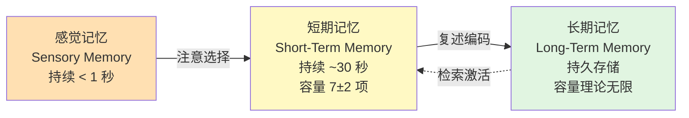
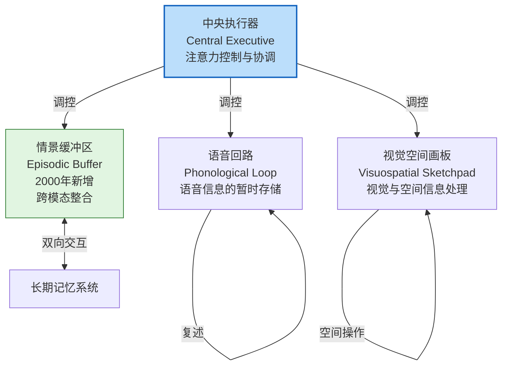
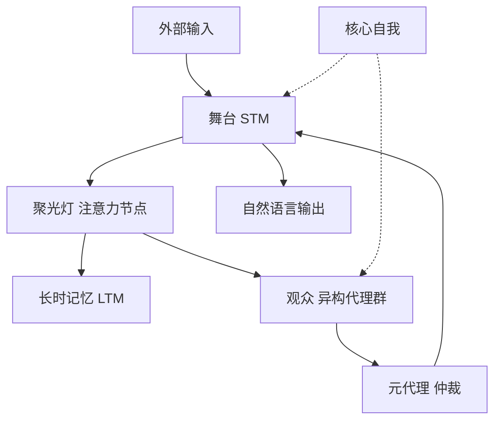

# 第3章 认知科学映射 — 人类记忆 → 计算记忆

> **本章摘要**：本章在人类认知科学与 Agent Memory 工程之间架设桥梁。我们首先回顾 Atkinson-Shiffrin 三存储模型、Baddeley 工作记忆模型和 Tulving 记忆三分法等经典认知理论，然后构建一个完整的计算映射矩阵，将六种人类记忆类型一一对应到 Agent 记忆的计算实现。最后，我们审视映射的边界与局限，明确本书的立场——借鉴认知理论的结构，但不模拟其机制。本章为后续技术章节提供了跨学科的视角和术语基础。

---

## 3.1 人类记忆模型回顾

认知科学对人类记忆的研究已有逾百年的历史。从 Ebbinghaus（1885）的遗忘曲线实验，到当代神经影像学的海马体功能定位，研究者逐步揭示了记忆的编码、存储、检索和遗忘机制。这些理论不仅刻画了人类认知的深层规律，也为计算记忆系统的设计提供了丰富的灵感来源。如第1章所述，MemoryBank（2305.10250）正是将艾宾浩斯遗忘曲线引入 LLM 记忆管理的先驱。本节回顾三个最具影响力的记忆模型，为后续的计算映射奠定理论基础。

### 3.1.1 Atkinson-Shiffrin 三存储模型（1968）

Atkinson 和 Shiffrin 在 1968 年提出的多存储模型（Multi-Store Model）是认知心理学中最具影响力的记忆理论之一。该模型将人类记忆系统划分为三个依次串联的存储结构：

**感觉记忆（Sensory Memory）**是信息进入认知系统的第一个门户。外界刺激（视觉、听觉、触觉等）在感觉通道中被瞬时保留，持续时间通常不超过 1 秒。感觉记忆的容量极大——它几乎完整记录了刺激的全部细节，但信息迅速衰退，除非被注意机制选择性地转入下一阶段。其中，视觉的感觉记忆被称为"图像记忆"（Iconic Memory），由 Sperling（1960）的部分报告法实验证实；听觉的感觉记忆被称为"回声记忆"（Echoic Memory），持续时间稍长（约 3-4 秒）。

**短期记忆（Short-Term Memory, STM）**是信息被注意选择后进入的有限容量存储。Miller（1956）的经典论文《神奇的数字 7±2》指出，人类短期记忆可同时保持约 7 个信息组块（Chunk）。后续研究（Cowan, 2001）将这一估计修正为约 4 个组块。短期记忆中的信息若不通过复述（Rehearsal）加以维持，将在约 15-30 秒内衰退消失。复述分为维持性复述（Maintenance Rehearsal，简单重复以延缓遗忘）和精细复述（Elaborative Rehearsal，将新信息与已有知识关联以促进长期编码）。

**长期记忆（Long-Term Memory, LTM）**是信息经过编码后进入的持久存储。与短期记忆不同，长期记忆的容量理论上不受限制，信息可保持数年至终生。但"存入"长期记忆并不等于"能想起来"——检索失败是日常遗忘的主要原因。长期记忆中的信息需要经过组织（Organization）、巩固（Consolidation）和整合（Integration），才能有效地在未来的情境中被召回。

三存储模型的核心贡献在于：它首次将记忆理解为一个**多阶段的信息加工系统**，而非单一的存储容器。信息从短暂的感觉登记，经由有限的短期加工区，最终固化为持久的长期知识——这一框架直接启发了计算机科学中的存储器层次结构（缓存 → 内存 → 硬盘）设计。

### 3.1.2 Baddeley 工作记忆模型（1974, 2000 更新）

短期记忆概念的局限在于它将记忆视为一个被动的、单一的存储缓冲区。Baddeley 和 Hitch（1974）提出了工作记忆（Working Memory）模型，将短期记忆重构为一个**主动加工系统**，包含多个功能组件：

**中央执行器（Central Executive）**是工作记忆的核心控制单元。它不存储信息，而是负责分配注意力资源、协调子系统的运作、抑制无关信息和在任务间切换。中央执行器类似于计算机的 CPU——它本身不"记住"数据，但决定了哪些数据被处理、以什么顺序处理、以及何时将结果输出。

**语音回路（Phonological Loop）**负责暂时存储和处理语音信息。它由两个子组件构成：语音存储（Phonological Store，信息保留约 2 秒的"内部耳朵"）和发音控制过程（Articulatory Control Process，通过内心复述刷新信息的"内部声音"）。语音回路解释了为什么我们在心算时需要默念数字——复述防止了语音衰退。

**视觉空间画板（Visuospatial Sketchpad）**独立于语音回路，负责处理和暂时存储视觉与空间信息。当你试图在脑中旋转一个三维物体或在心里"看到"一张地图时，你正在使用视觉空间画板。双任务实验表明，语音任务和空间任务可以同时高效执行，而两个语音任务则互相干扰——这证明了子系统的独立性。

**情景缓冲区（Episodic Buffer）**是 Baddeley 在 2000 年新增的组件。它是一个有限容量的临时存储区，能够将来自语音回路、视觉空间画板和长期记忆的信息整合为统一的情景表征（Episodic Representation）。情景缓冲区是工作记忆与长期记忆之间的桥梁——它从长期记忆中抽取相关知识，与当前感知信息整合，形成有意义的、时间有序的整体表征。

工作记忆模型对 Agent Memory 设计的启示是深远的：它表明"短期存储"不是单一缓冲区，而是由**一个中央控制器 + 多个专用子系统 + 一个整合接口**构成的复杂架构。这与第2章本体论中 MemorySystem 类（记忆管理架构）的角色高度一致——记忆系统不仅是存储设施，更是协调、调度和整合的基础设施。

### 3.1.3 Tulving 的记忆三分法（1972, 1985）

如果说 Atkinson-Shiffrin 模型关注记忆的**结构层次**（感觉 → 短期 → 长期），Baddeley 模型关注记忆的**加工机制**（中央执行 + 子系统），那么 Tulving 的分类则关注长期记忆的**内容类型**。Tulving 将长期记忆划分为三种性质迥异的系统：

| 记忆类型 | 内容 | 核心特征 | 典型问题 | 大脑区域 |
|---------|------|---------|---------|---------|
| **情景记忆（Episodic）** | 个人经历的具体事件 | 带时间戳、主观体验（"心理时间旅行"） | "我上周三做了什么？" | 海马体、前额叶 |
| **语义记忆（Semantic）** | 关于世界的一般知识 | 去时间化、客观事实、概念网络 | "巴黎是哪个国家的首都？" | 颞叶皮层 |
| **程序性记忆（Procedural）** | 技能和操作程序 | 内隐的、难以言语化的、通过练习获得 | "如何骑自行车？" | 基底核、小脑 |

**情景记忆**是个人经历的自传式记录。它具有鲜明的时间属性——每条记忆都标记了"何时发生"，并且伴随着主观的体验感（Autonoetic Consciousness）。情景记忆的核心特征是"心理时间旅行"——个体能够在意识中重新体验过去的事件。在 Agent 语境中，这对应于交互日志、对话历史和事件轨迹的存储。

**语义记忆**是脱离具体时间情境的事实性知识。它不记录"我何时学到这个"，只保留"这个是什么"。语义记忆以概念网络的形式组织，支持分类、推理和归纳。语义知识最初可能源自情景记忆（你通过某次具体经历学到了某个事实），但经过巩固后，时间信息被剥离，知识成为独立的事实单元。在 Agent 语境中，这对应于知识图谱、用户画像和领域常识的存储。

**程序性记忆**是"知道如何做"的知识——从骑自行车到打字，从游泳到使用工具。这类记忆的特征是：它是内隐的（难以用语言精确描述）、通过反复练习获得、一旦习得难以遗忘（"骑自行车的记忆永远不会消失"）。在 Agent 语境中，这对应于工具调用模式、API 技能和工作流程的编码。

Tulving 后来（1985）补充了**启动记忆（Priming Memory）**和**条件反射记忆**等更内隐的类型，但上述三分法构成了最核心的分类框架。值得注意的是，这三种记忆类型在神经解剖学上是独立的——海马体损伤患者（如著名的 H.M. 病例）可能丧失情景记忆能力，但语义记忆和程序性记忆依然完好。

### 3.1.4 编码、存储、检索、遗忘的认知机制

记忆的运作不仅仅是信息的"存入"和"取出"，而是一个包含四个核心阶段的动态过程：

**编码（Encoding）**是将外部信息转化为可存储的心理表征的过程。编码质量决定了记忆强度。两种关键编码策略已被实验证实：**精细编码**（Elaborative Encoding，将新信息与已有知识建立联系）比**机械编码**（Rote Encoding，单纯重复）产生更持久的记忆。这与 Agent Memory 中"惊喜度驱动编码"和"上下文感知编码"的设计理念一致——不是所有输入都值得同等对待，编码的深度应该与信息的价值成正比。

**存储（Storage）**是记忆表征在时间上的维持。存储并非静态——记忆在存储过程中经历**巩固（Consolidation）**，从脆弱的初始状态逐渐转变为稳定的表征。睡眠在记忆巩固中扮演关键角色——海马体在睡眠期间将短期记忆"回放"给皮层，促进长期整合。在 Agent 语境中，这对应于记忆的组织、索引和跨会话持久化过程。

**检索（Retrieval）**是从存储中召回信息的过程。检索不是被动读取——每一次检索都是一次**重建（Reconstruction）**。Bartlett（1932）的经典实验证明，回忆不是回放录像带，而是基于线索和图式（Schema）重新构建叙事。这意味着检索会修改记忆本身——被检索的记忆变得更易再次检索（测试效应，Testing Effect），同时也可能被后续信息污染（错误记忆效应）。在 Agent Memory 设计中，这提示我们：检索不仅是读取操作，更是触发记忆强化和更新的事件（如第2章"使用强化律"公理所述）。

**遗忘（Forgetting）**是记忆信息的丢失或不可访问。遗忘有两条独立路径：**存储衰退**（Trace Decay，记忆痕迹随时间自然弱化）和**检索失败**（Retrieval Failure，信息仍在但无法找到访问线索）。Ebbinghaus 遗忘曲线表明，遗忘在最初几小时内最为剧烈，随后逐渐减缓。主动遗忘（Motivated Forgetting）——有意识地抑制某些记忆——也是遗忘的重要机制。在 Agent Memory 中，遗忘不是缺陷而是必要特性——有限资源要求系统淘汰低价值信息，如第2章"遗忘不可逆"公理所定义。

---

## 3.2 计算映射矩阵

基于上述认知科学理论，我们构建一个完整的映射矩阵，将人类记忆的类型、机制和过程对应到 Agent Memory 的计算实现。这一映射不是简单的类比——每个映射对都经过严格的对照分析，明确其相似点和差异点。

### 3.2.1 总览：六对映射

| 人类记忆类型 | 计算对应物 | 关键相似点 | 关键差异 |
|-------------|-----------|-----------|---------|
| 感觉记忆 | 输入 Token 流 | 瞬时保留、容量受限、需注意选择 | 感觉记忆有模态分化，Token 流仅文本 |
| 短期/工作记忆 | Context Window + 注意力机制 | 容量受限、主动加工、需复述维持 | 注意力分配 vs 中央执行器控制 |
| 长期情景记忆 | 向量检索 + 时间线 | 带时间戳、事件绑定、可检索回忆 | 精确检索 vs 模糊重建 |
| 长期语义记忆 | 知识图谱 + 参数编辑 | 去时间化、可推理、概念网络 | 可灵活更新 vs 参数难修改 |
| 程序性记忆 | 工具调用模式 + 经验库 | 可复用、模块化、通过实践获得 | 显式编码 vs 内隐学习 |
| 反思记忆 | 自我评估 + 夜间自评 | 元认知、增量知识、策略更新 | 计算可追踪 vs 主观反思 |

### 3.2.2 感觉记忆 → 输入 Token 流

**相似点**：感觉记忆和输入 Token 流都是信息处理系统的第一道关卡。感觉记忆在不到一秒的时间内完整保留视觉和听觉刺激的全部细节；输入 Token 流在单次推理调用中将用户输入完整地送入模型。两者的共同特征是：**瞬时性**（不主动保存就会消失）和**全量性**（初始阶段不做筛选，全部接收）。

在人类认知中，感觉记忆的绝大部分信息会迅速衰退，只有被注意机制选中的极小部分进入短期记忆。在 Agent 架构中，输入 Token 流中的绝大部分令牌也会在后续处理中被"忽略"——注意力机制自动为不同令牌分配不同权重，低权重的令牌实质上经历了"功能性遗忘"。

**差异点**：感觉记忆具有模态分化——视觉的图像记忆和听觉的回声记忆在持续时间、容量和衰退速率上各不相同。输入 Token 流则是单模态的——无论是文本、代码还是结构化数据，最终都序列化为令牌序列。此外，感觉记忆的处理是前注意的（Pre-attentive），在意识介入之前就已发生；而 Token 流的处理是模型注意力的结果，属于计算层面的"注意"而非认知层面的"注意"。

**工程启示**：人类感觉记忆的快速衰退提示我们，输入 Token 流中的信息如果不能在第一时间被编码为更持久的记忆形式（如提取关键事实存入外部存储），就会随推理结束而永久消失。这正是第1章所述的"上下文窗口是输入缓冲区，不是记忆"的核心论点。

### 3.2.3 短期/工作记忆 → Context Window + 注意力机制

**相似点**：短期/工作记忆和 Context Window 的对应关系是最直观的映射。两者的核心相似点在于**容量受限**和**主动加工**。

人类工作记忆的容量约为 4-7 个组块，超过容量的信息无法被同时处理。LLM 的上下文窗口同样有固定上限（4K 到 200K+ tokens），超出窗口的令牌无法被模型"看到"。两者都面临"容量墙"问题。

Baddeley 的中央执行器负责分配注意力、协调子系统、抑制干扰。LLM 的注意力机制（Self-Attention）为输入序列中的每个令牌分配不同的权重，本质上也是一种注意力分配。高权重的令牌类似于工作记忆中"当前关注"的信息，低权重的令牌则类似于"背景信息"。

此外，人类工作记忆需要通过复述来维持信息，否则信息会衰退。类似地，Agent 的上下文窗口需要通过周期性地将信息重新注入（如重新检索相关记忆放入上下文）来维持其"活性"。

**差异点**：中央执行器是一个**通用的、任务无关的**控制单元，可以在不同认知任务间灵活切换注意力策略。而注意力机制的权重分配是由训练数据决定的、**任务相关的**模式——模型不能自主决定"此刻我应该关注什么"，而是按照学习到的模式被动分配注意力。

更深层的差异在于：人类工作记忆支持**多模态并行加工**（语音回路和视觉空间画板可同时运作），而 LLM 的上下文窗口是**单通道的序列化处理**——所有信息被线性排列，依次通过同一组注意力层。

**工程启示**：这一映射揭示了上下文窗口作为工作记忆的局限性。要突破单通道处理的瓶颈，需要引入类似 Baddeley 模型的**多组件工作区架构**——如 MemGPT（2310.08560）将主上下文划分为系统指令（只读）、工作上下文（读写）和 FIFO 消息队列三个功能区，实质上是在 Token-level 载体上模拟了工作记忆的多组件结构。

### 3.2.4 长期情景记忆 → 向量检索 + 时间线

**相似点**：情景记忆的核心特征是"带时间戳的个人经历记录"。在 Agent 架构中，向量数据库中的交互记录配合时间戳元数据，精确对应了这一功能。

Generative Agents（2023）的记忆流（Memory Stream）是这一映射的典型实现——每个观察到的事件被编码为自然语言语句（"Klaus Mueller 在图书馆看书"），并附带时间戳和重要性评分。检索时按近因性（Recency）、重要性（Importance）和关联性（Relevance）三个维度综合排序，这与人类回忆情景记忆时的线索匹配机制高度相似——我们更容易想起最近的、重要的、与当前情境相关的事件。

**差异点**：人类的情景记忆回忆是一个**重建过程**——每次回忆都在重新构建叙事，可能遗漏细节、添加想象、甚至扭曲事实（Loftus 的错误记忆研究）。向量检索则是**精确匹配过程**——相似度分数最高的条目被原样返回，不会"创造性地"修改记忆内容。

此外，人类情景记忆伴随着主观体验感（"我记得当时我很紧张"），而 Agent 的情景记录缺乏这种现象学维度。Agent 可以记录"用户表达了不满"，但无法"体验"那次交互的情感色调。

**工程启示**：精确检索的优势在于保真度高，但也意味着 Agent 的记忆缺乏人类回忆中的"灵活性"——人类可以从模糊线索中重建大致场景，而 Agent 必须依赖精确的相似度匹配。这提示我们在检索策略中引入模糊查询和多线索组合的重要性。

### 3.2.5 长期语义记忆 → 知识图谱 + 参数编辑

**相似点**：语义记忆存储"关于世界的知识"，去除了时间标签，以概念网络的形式组织。知识图谱（实体-关系-属性三元组）是语义记忆的直接计算对应物。

HippoRAG（2405.14831）是这一映射的典范——它将文档中的概念提取为知识图谱节点，关系提取为图边，通过 Personalized PageRank 实现沿语义关联的多跳检索。这模拟了人类语义记忆的特征：当被问及"巴黎"时，你不仅能回答"法国首都"，还能联想到"埃菲尔铁塔"、"浪漫之城"、"塞纳河"等关联概念。

**差异点**：人类语义记忆的形成通常是一个渐进的、跨多次经验的过程——你在不同时间、不同场景下多次接触某个概念，语义网络逐步扩展和修正。参数编辑（如 KnowledgeEditor 2104.08164）则是一次性的精准更新——直接修改模型权重以反映新事实。

更深层的差异在于语义记忆的**可塑性**。人类可以相对容易地修正一个错误信念（"哦，原来首都是堪培拉而不是悉尼"），但参数级记忆的修改需要精细的约束优化，且存在灾难性遗忘风险。外部载体（知识图谱）的语义记忆更新则更灵活——添加或删除图谱节点/边即可。

**工程启示**：语义记忆的载体选择至关重要。对于频繁更新的领域知识，External 载体（知识图谱）比 Parametric 载体（模型参数）更合适——前者支持灵活编辑，后者更新成本高且风险大。这与第2章载体维度的分析一致：不同载体适用于不同的功能-动态组合。

### 3.2.6 程序性记忆 → 工具调用模式 + 经验库

**相似点**：程序性记忆是"知道如何做"的知识。在 Agent 架构中，这对应于工具调用序列、API 技能库和工作流程模板。

程序性记忆的核心特征是**可复用性**和**模块化**——一旦学会"搜索 → 过滤 → 总结"的操作流程，就可以在多个任务中复用。Agent 的工具调用模式同样如此：定义一个可复用的工具链，在不同场景中实例化执行。

Reflexion 架构中的经验存储也体现了程序性记忆的特征——Agent 从失败中提炼出"下次遇到类似情况应该先检查 X 再做 Y"的策略规则，这类似于人类通过试错获得的程序性知识。

**差异点**：人类程序性记忆的获得是**内隐学习**（Implicit Learning）的结果——通过反复练习，程序逐渐自动化，最终变成"肌肉记忆"，难以用语言精确描述。Agent 的程序性记忆则是**显式编码**的——工具调用序列以结构化形式（JSON Schema、函数签名等）明确定义。

另一个差异在于程序性记忆的**迁移能力**。人类可以将骑自行车的平衡感迁移到骑摩托车上（两者有共同的感觉运动模式），而 Agent 的工具调用模式通常需要重新定义才能适应新的 API 或工具集。

**工程启示**：程序性记忆的设计应该追求更高的抽象层级和更强的泛化能力。与其为每个 API 编写独立的调用模板，不如构建可组合的"操作原语"（Primitives），让 Agent 能够像人类迁移技能一样，将已有模式适配到新场景。

### 3.2.7 反思记忆 → 自我评估 + 夜间自评

**相似点**：反思记忆是人类对自身认知过程的觉察和评估。在 Agent 架构中，这对应于自我反思循环（Reflexion）、夜间自评（Nightly Self-Critique）和元认知评估。

反思记忆的核心特征是**增量性**——反思不只是回顾已有信息，而是产生全新的知识。这恰好对应了第2章中的"反思增量性"公理：MemoryReflection 操作必然产生至少一个新增概念实例。

Generative Agents 的反思机制是这一映射的典范——智能体定期扫描记忆流，对高频出现的模式进行合成，生成高层反思（如"Klaus 最近总是在图书馆，他可能在准备论文"）。这不是对已有记忆的简单检索，而是从记忆数据中推导出新的洞察。

**差异点**：人类反思伴随着主观的自我意识和情感体验——你可能对过去的某个决定感到后悔，或者对一次成功感到自豪。Agent 的反思是纯计算的——它基于预定义的评估标准（如任务完成率、用户满意度评分）生成结构化输出，没有内在的主观体验。

**工程启示**：反思机制的设计应该确保其输出确实是**增量知识**，而非已有信息的重述。如果"反思"只是重复记忆流中的内容，那它只是检索，不是反思。如第2章公理 6 所述，反思操作必须有新增概念实例产出。

---

## 3.3 映射的局限与边界

尽管认知科学为 Agent Memory 设计提供了丰富的灵感，但人类记忆与计算记忆之间存在根本性差异。理解这些差异，避免过度类比，是构建有效记忆系统的前提。

### 3.3.1 人类有而 Agent 没有的记忆特征

**情感记忆（Emotional Memory）**：杏仁核与海马体的协同作用使得情感事件被优先编码和持久存储。"闪光灯记忆"（Flashbulb Memory）现象表明，人们能异常清晰地记住重大情感事件的细节。Agent 没有情感系统，无法体验"惊喜"或"创伤"，因此不存在情感驱动的记忆优先级。虽然一些系统（如 Generative Agents）使用"重要性评分"模拟情感强度，但这是外部标注，而非内在体验。

**内隐记忆（Implicit Memory）**：大量人类记忆是无意识的——启动效应（Priming）、经典条件反射、内隐偏见等。这些记忆影响行为但无法被主体察觉或报告。Agent 的所有记忆都是显式的——每条记忆的写入、检索和遗忘都可被追踪和审计。

**身体记忆（Embodied / Muscle Memory）**：小脑和基底核编码的感觉运动程序（如打字、游泳、乐器演奏）是身体与环境互动的产物。纯软件 Agent 没有身体，因此不存在身体记忆。具身智能体（Embodied Agent，如机器人）可能发展出某种形式的"身体记忆"，但其机制与人类的感觉运动学习仍有本质区别。

**社会记忆（Social / Collective Memory）**：人类记忆具有社会性——我们通过对话、共享经验和文化传承共同构建记忆。个人记忆与集体记忆相互交织。当前 Agent 的记忆系统大多是孤立的——每个 Agent 维护独立的记忆库，缺乏跨 Agent 的记忆共享和协商机制。

**主观时间感（Subjective Temporality）**：人类对时间的感知是主观的——"快乐的时光飞逝，痛苦的时光缓慢"。情景记忆的时间标签不是精确的钟表时间，而是模糊的时间框架（"大概是去年的某个夏天"）。Agent 的时间戳是精确的系统时间，缺乏人类时间感知的弹性和模糊性。

### 3.3.2 Agent 有而人类没有的记忆特征

**精确检索**：人类回忆是模糊的重建过程，容易出错和扭曲。向量数据库中的语义检索可以精确返回相似度最高的条目，零失真。这是 Agent 记忆相对于人类记忆的显著优势。

**跨会话一致性**：人类在不同时间对同一事件的回忆可能不同（记忆重构的变异性）。Agent 的记忆一旦写入，除非被显式更新或遗忘，否则保持不变。这种一致性在需要可审计性的场景（如医疗、法律）中至关重要。

**大规模并行处理**：人类工作记忆只能同时处理约 4-7 个组块。Agent 可以同时对数百万个记忆条目执行相似度计算，并在毫秒级返回结果。这种并行处理能力使 Agent 能在人类无法企及的规模上进行记忆关联和模式发现。

**完美复制与无损传输**：人类无法将自己的记忆"复制"给另一个人——只能通过语言描述，而语言描述不可避免地丢失信息。Agent 的记忆可以完美复制、跨实例迁移、甚至批量导入导出。

**可量化的遗忘**：人类的遗忘是无意识的、不可控的。Agent 可以精确定义遗忘策略——时间衰减曲线、LFU 淘汰阈值、效用函数等——使遗忘成为可控的系统行为而非被动的信息丢失。

### 3.3.3 "拟人化"记忆的危险

将 Agent 记忆过度拟人化——用人类的记忆特征来理解和评价 Agent 的记忆行为——是领域内一个需要警惕的倾向。其风险在于：

1. **期望错位**：如果用户期望 Agent 像人类一样"理解"和"共情"，他们会对 Agent 的情感记忆缺失感到失望；反之，如果用户期望 Agent 像数据库一样精确，他们会对 Agent 因注意力稀释导致的"遗忘"感到困惑。

2. **设计误导**：过度类比可能导致设计者盲目模仿人类记忆的"缺陷"。例如，有人认为 Agent 应该像人类一样"遗忘"不重要的信息——但人类遗忘是无意识的信息丢失，而 Agent 的遗忘应该是基于明确策略的资源优化。两者的目标和机制完全不同。

3. **评估偏差**：用人类记忆的标准（如回忆准确率、再认灵敏度）来评估 Agent 记忆系统，可能忽略了 Agent 的独特优势（如精确检索、大规模并行）。反之亦然。

### 3.3.4 本书的立场：认知启发 vs 认知模拟

在认知理论与计算实现之间，本书采取明确的**认知启发（Cognitive Inspiration）**立场，而非**认知模拟（Cognitive Simulation）**立场：

- **认知启发**意味着：我们借鉴认知理论的结构框架（如记忆的层次性、多维性、生命周期性）来指导 Agent Memory 的架构设计，但不试图在计算层面复制人类记忆的神经机制或主观体验。

- **认知模拟**意味着：我们试图在算法层面重现人类记忆的心理过程和神经机制——例如，严格模拟海马体的模式分离/模式完成功能，或复现睡眠期间的记忆回放过程。

本书选择认知启发而非认知模拟的理由有三：

1. **工程可行性**：Agent Memory 的首要目标是解决实际工程问题（跨会话一致性、个性化、经验积累），而非重现人类认知的生物学细节。启发式借鉴比模拟式复现更具工程价值。

2. **计算优越性**：在某些维度上（精确检索、并行处理、跨会话一致性），计算记忆天然优于人类记忆。放弃这些优势去模拟人类的"不完美"，是舍本逐末。

3. **理论独立性**：Agent Memory 的理论框架应该建立在计算科学和信息论的基础上，而非依附于认知心理学。认知理论提供灵感和参照，但 Agent Memory 的评价标准应该来自其自身的目标函数——信息保真度、检索效率、资源利用率和任务成功率。

这一立场贯穿本书的所有技术章节——我们从认知理论中汲取灵感，但以计算的标准来设计和评估记忆系统。

---

## 3.4 认知架构新进展

> **注**：本节基于 2026 年最新研究成果。

### 3.4.1 Theater of Mind — 全局工作空间理论的认知架构实现

**背景**：经典认知科学理论如何从理论框架走向计算架构？长期以来，全局工作空间理论（GWT）停留在认知理论层面，缺乏在 LLM 系统中的完整工程实现。

**方案**：Theater of Mind（2604.08206）首次将 GWT 完整映射至 LLM 多智能体系统，提出了全局工作空间代理（GWA）架构。系统通过离散动力学循环（认知节拍）运行，包含四个阶段：

1. **舞台（STM）**：中央状态张量，维护即时对话上下文，设置 Token 阈值触发压缩机制。
2. **聚光灯（注意力）**：桥接 STM 与 LTM，选择上下文向量，注意力权重计算需低延迟。
3. **观众（异构代理群）**：提供异构认知能力（生成/批判/执行），防止代理间通信开销过大。
4. **元代理（仲裁）**：进行元认知仲裁，决定状态转移。

关键创新在于引入**基于熵的内在驱动机制**——通过熵调节强制发散探索，有效避免同质化循环导致的认知死锁。同时，双层记忆管理（短时工作记忆 + 长时向量数据库）确保上下文窗口不溢出且认知连续性不中断。

**关键结果**：
- 通过熵驱动打破认知死锁，实现持续自主决策
- 双层记忆管理维持身份一致性，防止语义漂移
- 事件驱动激活信号替代全量轮询，减少无效计算

**工程启示**：该架构在理论层面验证了从被动响应向主动事件驱动系统转变的可行性。实际部署中需关注多代理轮询的延迟优化——可考虑异步通信或分层仲裁机制。"硬件级注入"核心自我的具体实现（Prompt 工程 vs 模型权重微调）仍需进一步验证。

### 3.4.2 与认知启发立场的一致性

Theater of Mind 的工作恰好印证了本书第 3.3.4 节提出的"认知启发"立场：它借鉴了 GWT 的结构框架（舞台-聚光灯-观众的三分法），但并未试图在计算层面复制人类记忆的神经机制或主观体验。元代理的仲裁是计算决策而非意识涌现，熵驱动是算法探索而非内在动机。这正是"借鉴认知理论的结构，但不模拟其机制"的典范。

---

## 3.5 本章小结

- **人类记忆是一个多层次的动态系统**，包含感觉记忆、短期/工作记忆和长期记忆（情景、语义、程序性）三个层次，每个层次有其独特的容量、持续时间和编码机制。
- **认知理论与计算实现之间存在系统性的映射关系**，但这些映射不是等价替换——每一对映射都有明确的相似点和差异点，需要在工程设计中有意识地处理。
- **Agent 记忆在精确检索、跨会话一致性、大规模并行处理和可量化遗忘方面超越人类记忆**，但在情感记忆、内隐记忆、身体记忆和社会记忆方面存在本质缺失。
- **拟人化记忆是一个需要警惕的设计陷阱**——过度类比人类记忆可能导致期望错位、设计误导和评估偏差。
- **本书采取"认知启发"而非"认知模拟"的立场**——借鉴认知理论的结构框架来指导架构设计，但以计算标准来评估记忆系统的效能。
- **工作记忆模型（Baddeley）对 Agent 架构设计的启示最为直接**：中央执行器 + 多组件子系统 + 情景缓冲区的架构，与 MemorySystem 类（记忆管理架构）的角色高度一致。
- **反思的增量性是 Agent 记忆区别于被动存储的核心特征**——反思产生新知识，而不仅仅是回顾已有信息，这与第2章"反思增量性"公理一致。

---

## 3.6 延伸阅读

### 认知心理学经典

1. **Atkinson, R. C. & Shiffrin, R. M.** (1968). "Human Memory: A Proposed System and Its Control Processes." —— 三存储模型的原始论文，奠定了现代记忆理论的基础。
2. **Baddeley, A. D. & Hitch, G.** (1974). "Working Memory." —— 工作记忆模型的开创性论文。
3. **Baddeley, A. D.** (2000). "The Episodic Buffer: A New Component of Working Memory." *Trends in Cognitive Sciences*. —— 工作记忆模型的 2000 年更新，新增情景缓冲区。
4. **Tulving, E.** (1972). "Episodic and Semantic Memory." —— 情景记忆与语义记忆的经典区分。
5. **Miller, G. A.** (1956). "The Magical Number Seven, Plus or Minus Two." —— 短期记忆容量的经典研究。

### Agent Memory 中的认知启发

6. **Park, J. S. et al.** (2023). "Generative Agents: Interactive Simulacra of Human Behavior." UIST '23. —— 将认知记忆理论（记忆流 + 反思 + 检索）应用于社交模拟智能体。
7. **Zhong, W. et al.** (2023). "MemoryBank: Enhancing Large Language Models with Long-Term Memory." arXiv:2305.10250. —— 将艾宾浩斯遗忘曲线引入 LLM 记忆管理。

### 认知科学与 AI 的交叉

8. **Lake, B. M. et al.** (2017). "Building Machines That Learn and Think Like People." *Behavioral and Brain Sciences*. —— 系统比较人类学习与机器学习的能力差异。
9. **Hassabis, D. et al.** (2017). "Neuroscience-Inspired Artificial Intelligence." *Neuron*. —— 神经科学启发 AI 设计的综述。
10. **Ebbinghaus, H.** (1885). *Memory: A Contribution to Experimental Psychology*. —— 遗忘曲线的原始文献，MemoryBank 的心理学基础。
11. **(2026).** "PASK: Intent-Aware Proactive Agents." arXiv:2604.08000. —— 意图驱动的主动代理认知架构。

*人类记忆与计算记忆的映射为后续技术章节提供了跨学科的视角。第4章将深入探讨上下文窗口作为记忆的机制与局限，第5章将展开上下文压缩与注意力分配的技术细节。*
