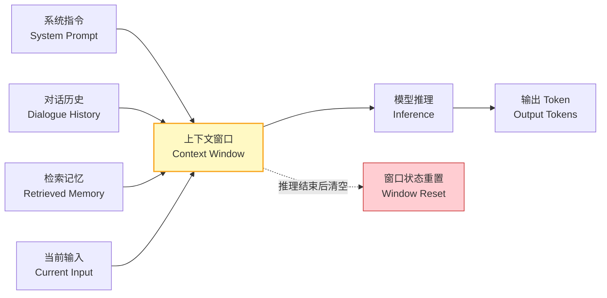
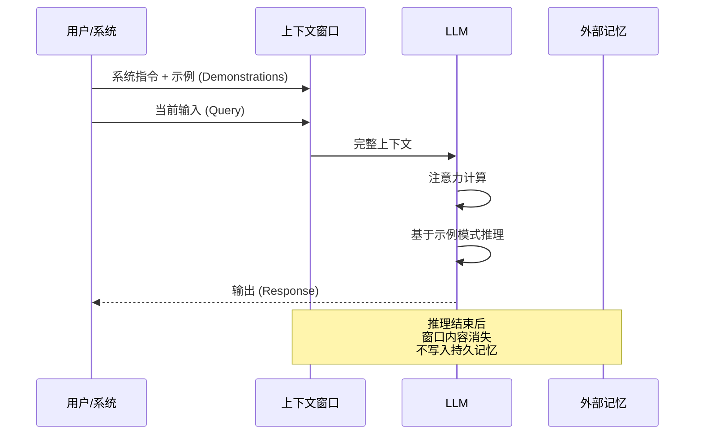
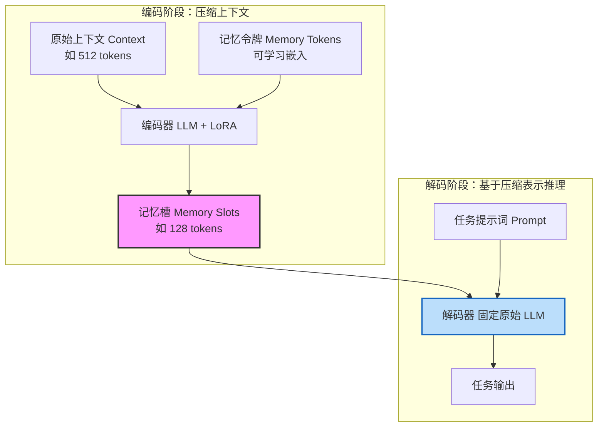
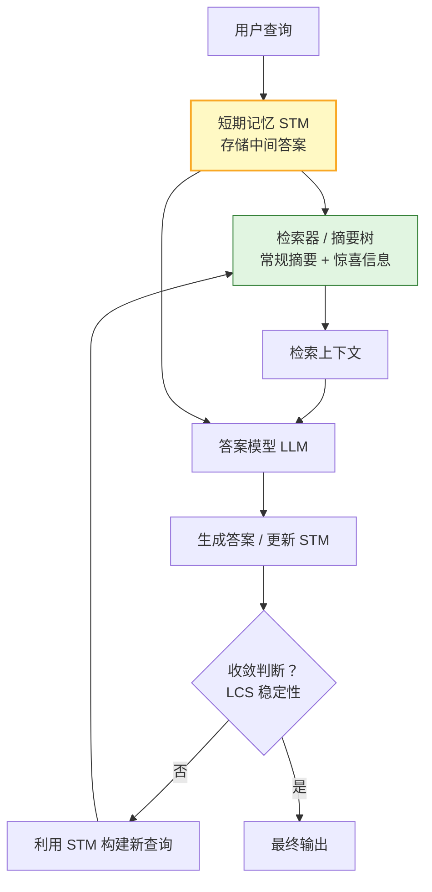
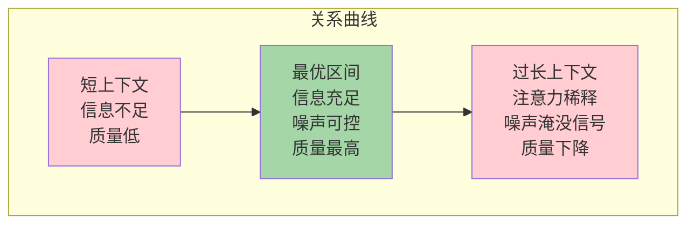

# 第4章 上下文窗口作为记忆

> **本章摘要**：本章深入探讨上下文窗口（Context Window）在 Agent Memory 体系中的角色——它既是记忆的"工作台"，又不是记忆本身。我们首先辨析上下文窗口的物理约束与逻辑含义，揭示"窗口变大 ≠ 记忆变强"的深层原因。随后分析 In-Context Learning 的认知机制和注意力模型中的记忆痕迹。最后，我们考察长上下文中的记忆衰减现象，包括"大海捞针"问题和"中间盲区"效应。本章使用第2章的载体维度（Token-level）和功能维度（Working）框架进行分析。

---

## 4.1 Context Window ≠ 记忆

如第1章所述，上下文窗口是 LLM 的输入缓冲区，不是记忆。这一辨析看似简单，却触及 Agent Memory 设计中最根本的概念混淆。本节从物理约束、逻辑含义和实际行为三个层面展开分析。

### 4.1.1 物理约束与逻辑含义

上下文窗口的**物理约束**是明确的：它是模型在一次推理调用中能够处理的令牌数量上限。这一上限由模型的架构设计决定——从早期的 GPT-3（约 4K tokens）到 Claude 3（200K tokens），再到部分模型支持的 1M+ tokens 窗口，上限在持续扩展，但"上限存在"这一事实不会改变。

上下文窗口的**逻辑含义**则更加微妙。从第2章本体论的三维分类来看，上下文窗口占据 `Token-level（载体）+ Working（功能）+ Formation（动态）` 的坐标位置：

- **Token-level 载体**：信息以文本令牌的形式驻留于模型输入中。
- **Working 功能**：承载当前任务处理所需的活跃信息，是即时认知工作区。
- **Formation 动态**：将信息写入上下文是记忆形成的一种形式——但只是形成，不是存储。

关键在于：上下文窗口是记忆的**消费场所**，而非**存储场所**。记忆被检索后注入上下文窗口，在此被模型"消费"（用于推理和生成），但推理结束后，窗口中的内容随推理会话一同消失——除非外部系统主动将其持久化。

这一区别类似于计算机体系结构中的寄存器（Register）与内存（Memory）：寄存器是 CPU 直接操作的临时存储区，速度最快但容量最小且断电即失；内存是持久存储，速度较慢但容量更大。上下文窗口就是 LLM 的"寄存器"——它是推理的直接输入，但不是记忆的持久载体。

### 4.1.2 为什么窗口变大不等于记忆变强

一个直觉上合理的假设是：上下文窗口越大，Agent 的记忆能力就越强——毕竟更大的窗口意味着可以容纳更多的历史信息。然而，这一假设在实践中被反复证伪。窗口扩展面临三个根本性瓶颈：

**第一，注意力稀释（Attention Dilution）**。随着上下文长度增加，模型对单个令牌的注意力权重被摊薄。即使信息仍在窗口内，模型也可能"看不到"它——不是因为信息被截断，而是因为注意力权重过低，该信息对输出预测的贡献微乎其微。这一现象被称为"大海捞针"（Needle in a Haystack）问题，将在 4.3 节详细讨论。

**第二，推理延迟与成本**。自注意力机制的计算复杂度随上下文长度呈 $O(n^2)$ 增长（其中 $n$ 为序列长度）。将上下文从 4K 扩展到 200K，理论上计算量增加 2500 倍。虽然工程优化（如 FlashAttention、KV Cache）显著降低了实际开销，但延迟和成本的增长仍然不可忽视。在实时交互场景中，过长的上下文会导致响应延迟超过用户可接受的阈值。

**第三，信噪比恶化**。更大的窗口意味着更多的信息被同时送入模型，但并非所有信息都对当前任务有用。无关信息（噪声）与有用信息（信号）混在一起，不仅浪费计算资源，还可能干扰模型的推理——无关的上下文片段可能激活不相关的参数，导致输出偏离预期。

因此，上下文窗口的大小与记忆质量之间不是线性关系，而是存在一个**最优区间**——窗口太小，信息不足；窗口太大，噪声淹没信号。找到这个最优区间是上下文管理策略的核心挑战。

### 4.1.3 "大海捞针"问题与位置偏置

"大海捞针"（Needle in a Haystack, NIAH）实验是评估 LLM 长上下文能力的最经典基准。实验范式很简单：将一段关键信息（"针"）隐藏在一篇长文档（"干草堆"）的某个位置，然后询问模型关于该信息的问题。如果模型能正确回答，说明它"找到"了针。

Liu et al.（2023）的系统性评估揭示了一个令人不安的模式：**模型对上下文不同位置的信息的召回率存在显著差异**。具体表现为：

- **首因效应（Primacy Effect）**：位于上下文开头的信息召回率最高。
- **近因效应（Recency Effect）**：位于上下文末尾的信息召回率也较高。
- **中间迷失（Lost in the Middle）**：位于上下文中间位置的信息召回率显著低于两端。

这一位置偏置（Position Bias）揭示了自注意力机制的一个结构性局限：位置编码（Position Encoding）并非完美地编码了每个令牌的独立可访问性。在长序列中，中间位置的令牌在注意力计算中被"夹在"大量其他令牌之间，其信号被稀释。

### 4.1.4 上下文窗口作为"瞬时记忆"的定位

综合以上分析，我们可以将上下文窗口在 Agent Memory 体系中的定位精确描述为**瞬时工作记忆（Ephemeral Working Memory）**——它是：

1. **短暂的**：推理结束即消失，除非被外部系统持久化。
2. **活跃的**：包含当前任务处理所需的全部上下文。
3. **有限的**：容量受模型架构约束。
4. **被动的**：内容由外部系统送入，窗口本身不决定保留什么、丢弃什么。
5. **可加工的**：模型在窗口内进行注意力计算和令牌预测，信息在此被"消费"。

用第2章的术语来说，上下文窗口是 MemorySystem 的**前端接口**——它是 MemoryRetrieval 操作的输出目的地，也是 MemoryFormation 操作的输入来源。但它不是 Memory 类本身——记忆的本体存在于外部存储、参数或隐式载体中，上下文窗口只是记忆的"临时展示台"。

理解了上下文窗口的定位和局限，我们才能正确理解 In-Context Learning 的机制，以及为什么长上下文中的记忆会衰减。

---

## 4.2 In-Context Learning 的机制

In-Context Learning（ICL，上下文学习）是 LLM 最具特色的能力之一——通过在输入上下文中提供示例（Demonstrations），模型可以在不更新参数的情况下学习新任务。从记忆的视角来看，ICL 本质上是一种**瞬时工作记忆**的利用机制。

### 4.2.1 ICL 作为"瞬时工作记忆"的认知解释

人类在执行新任务时，会将任务说明和示例放在"眼前"（工作记忆中），一边参考一边操作。ICL 的行为模式与此高度相似：模型在上下文中看到几个示例（输入-输出对），然后在生成新输出时参照这些示例的模式。

ICL 的认知解释有几个关键含义：

- **ICL 不修改模型参数**。知识临时驻留于上下文窗口中，推理结束后消失。这对应于第2章中 Token-level 载体的易失性特征。
- **ICL 是即时的**。模型在单次前向传播中"学会"示例中的模式，不需要迭代训练。这与人类通过观察示例快速掌握新任务的能力相似。
- **ICL 是上下文依赖的**。同一模型在不同上下文示例下表现出不同的行为——"学到了什么"完全取决于"看到了什么"。

### 4.2.2 注意力机制中的记忆痕迹

自注意力机制（Self-Attention）是 ICL 的底层计算引擎。对于输入序列中的每个令牌，注意力机制计算它与序列中所有其他令牌的关联权重，然后按权重加权聚合信息。

$$\text{Attention}(Q, K, V) = \text{softmax}\left(\frac{QK^T}{\sqrt{d_k}}\right)V$$

从记忆的视角，可以将注意力计算中的三个矩阵解释为：

- **Query（查询）**：当前令牌提出的"问题"——"我在寻找什么？"
- **Key（键）**：序列中每个令牌的"索引标签"——"我能回答什么问题？"
- **Value（值）**：序列中每个令牌的"实际内容"——"如果选中我，我能提供什么信息？"

注意力权重的分布实质上反映了模型的**即时记忆激活模式**——哪些令牌被"记住"（高权重），哪些被"忽略"（低权重）。ICL 的成功依赖于注意力机制能够正确地将 Query 与示例中的 Key 匹配，从而提取出相关的 Value 信息。

但注意力机制也有记忆层面的局限：

- **注意力容量有限**：虽然注意力可以关注序列中的所有令牌，但高权重的令牌数量是有限的——"注意力焦点"通常集中在少数几个令牌上。
- **注意力不区分事实与噪声**：模型不会主动判断哪些上下文信息是"正确的"、哪些是"干扰的"。如果上下文中包含矛盾信息，注意力机制可能同时关注两者，导致输出不确定。
- **注意力模式由训练决定**：模型"学会"的关注模式是训练数据的统计规律的产物，不是针对当前任务的理性推理。

### 4.2.3 位置编码与记忆顺序性

人类记忆的一个重要特征是顺序性——我们不仅记住"发生了什么"，还记住"以什么顺序发生"。在 LLM 中，位置编码（Positional Encoding）负责为序列中的每个令牌标记其位置信息。

绝对位置编码（Absolute Positional Encoding，如原始 Transformer 中的正弦编码）为每个位置分配一个固定的向量表示。但绝对位置编码在长序列中面临插值（Interpolation）问题——训练时未见过的更长序列位置，其编码向量可能不在训练分布内，导致性能下降。

相对位置编码（Relative Positional Encoding，如 RoPE、ALiBi）关注令牌之间的相对距离，而非绝对位置。这类编码在长序列泛化方面表现更好——模型不需要知道令牌的绝对位置编号，只需要知道"令牌 A 在令牌 B 前面 3 个位置"。

从记忆的顺序性角度看，位置编码的选择不影响记忆的**内容**，但影响记忆的**组织方式**。绝对位置编码类似于给每条记忆编号（"第 42 条记忆"），相对位置编码类似于记录记忆之间的时序关系（"这条记忆在那条之后发生"）。对于 Agent 的情景记忆而言，相对位置编码可能更自然——重要的是事件之间的先后顺序，而非绝对的时间戳（时间戳可以作为元数据单独存储）。

### 4.2.4 论文分析：ICAE 上下文自编码器

**论文**：Ge, T. et al. "In-context Autoencoder for Context Compression in a Large Language Model." arXiv:2307.06945.

ICAE（In-context Autoencoder）提出了一种新颖的上下文压缩范式，其核心洞察是：**上下文窗口中的信息存在冗余，可以用更紧凑的表示替代原始令牌序列**。

**架构设计**：ICAE 由两部分组成。编码器（Encoder）基于目标 LLM 添加 LoRA 适配器，将原始上下文压缩为固定数量的"记忆槽"（Memory Slots）——这些是可学习的连续向量，长度远小于原始上下文。解码器（Decoder）直接使用未经修改的原始 LLM，接收记忆槽作为输入进行任务推理。

**训练策略**：两阶段训练。第一阶段在 Pile 数据集上进行自编码预训练，目标是让记忆槽尽可能保留原始上下文的信息（BLEU 分数达 99.5%）。第二阶段在 PwC（Prompt-with-Context）数据集上进行指令微调，使模型学会基于记忆槽完成各类任务。

**实验结果**：ICAE 实现了 4 倍上下文压缩（512 tokens 压缩为 128 个记忆槽），推理速度提升 2-3.5 倍，显存节省显著（4096 长度上下文节省约 20GB）。在问答和推理任务上，性能与原始文本相当，某些推理任务甚至提升 16%。

**本体论映射**：ICAE 在三维分类中占据 `Latent（载体）+ Working（功能）+ Formation（动态）` 坐标。记忆槽是隐式表征（Latent 载体），承载当前任务的工作记忆（Working 功能），通过编码过程形成（Formation 动态）。

**工程意义**：ICAE 证明了上下文窗口的信息冗余度远超预期——4 倍压缩几乎不损失性能。这一发现对 Agent Memory 设计有直接启示：在将记忆注入上下文窗口之前，可以先进行有损压缩，以牺牲少量信息保真度为代价，换取更大的有效上下文容量。

**局限性**：ICAE 需要额外的编码步骤，引入了前置延迟。此外，压缩是不可逆的——记忆槽中丢失的信息无法恢复。这意味着 ICAE 更适合静态知识场景（可预先压缩缓存），而非动态对话场景（上下文持续变化）。

---

## 4.3 长上下文中的记忆衰减

随着上下文窗口的持续扩展（从 4K 到 200K 再到 1M+），一个关键问题日益凸显：更大的窗口是否意味着更好的长上下文性能？答案是否定的。本节分析长上下文中的记忆衰减现象及其对 Agent Memory 设计的启示。

### 4.3.1 Needle in a Haystack 现象的深层分析

Liu et al.（2023）的 NIAH 实验揭示的位置偏置只是冰山一角。后续研究进一步发现：

**窗口越大，位置偏置越严重**。在 4K 上下文中，位置偏置的影响相对有限——模型仍有足够的能力关注到大多数位置。但在 100K+ 的上下文中，中间位置的召回率可以降至接近随机水平。这意味着在 200K 的上下文中，位于 100K 位置附近的信息很可能被完全忽略。

**检索目标的类型影响召回率**。简单的事实性信息（"苹果的颜色是红色"）比复杂的逻辑信息（"如果 A 且 B 则 C，否则 D"）更容易被检索。这提示我们：上下文窗口中的记忆衰减不是均匀的——不同类型的信息以不同的速率衰减。

**模型规模的影响**。更大的模型（如 70B vs 7B）在 NIAH 测试中的表现更好，但位置偏置的模式依然存在。这表明位置偏置是 Transformer 架构的结构性问题，而非模型规模的工程问题。

### 4.3.2 注意力稀释与"中间盲区"

注意力稀释的本质是：在长度为 $n$ 的序列中，每个令牌的注意力权重总和为 1（softmax 归一化）。当 $n$ 增大时，平均注意力权重从 $1/n_{small}$ 降至 $1/n_{large}$。虽然注意力不是均匀分布的（某些令牌获得更高的权重），但权重的"峰值数量"是有限的——模型无法同时对成百上千个令牌保持高注意力。

"中间盲区"（Middle Blindness）是注意力稀释的直接后果。位于上下文中间的令牌面临双重不利：

1. **距离劣势**：在相对位置编码下，中间位置的令牌距离上下文两端都较远，与 Query 的位置距离较大，导致注意力权重较低。
2. **竞争劣势**：中间位置的令牌与大量其他令牌竞争注意力权重，而两端的令牌竞争对手较少。

在 Agent Memory 场景中，这意味着：如果你将检索到的相关记忆放在上下文的中间位置，它们被模型有效利用的概率显著低于放在开头或末尾。这一发现对上下文组装策略有直接的工程指导意义——**重要的记忆应该放在上下文的两端**。

### 4.3.3 论文分析：ILM-TR 内循环查询机制

**论文**：Tang, Y. et al. "Enhancing Long Context Performance in LLMs Through Inner Loop Query Mechanism." arXiv:2410.12859.

ILM-TR（Inner Loop Memory Augmented Tree Retrieval）针对长上下文中的信息遗漏问题，提出了一种"思考-检索-再思考"的闭环迭代机制。

**核心架构**：ILM-TR 由检索器和内环查询两部分组成。检索器基于改进的 RAPTOR 构建摘要树——将长文档分块，为每个块生成两种摘要：常规摘要（概括主要内容）和惊喜信息摘要（提取意外的、关键的信息）。摘要通过 GMM 聚类组织为层次树结构。

内环查询维护一个短期记忆（STM）存储区，存储中间答案。每一轮迭代中，系统利用 STM 内容 + 用户查询构建新的检索 Query，从摘要树中检索相关上下文，生成更新后的答案。收敛判断通过计算最长公共子序列（LCS）来检测 STM 内容是否稳定——如果连续两次迭代的答案变化很小，则认为已收敛。

**实验结果**：在 M-NIAH（多针大海捞针）和 BABILong（长上下文推理）基准上，ILM-TR 在 500K tokens 的上下文长度下保持稳健性能，显著优于 RAPTOR 等基线方法。消融实验表明，移除惊喜信息摘要或内环查询都会导致性能显著下降。

**本体论映射**：ILM-TR 的 STM 占据 `Token-level（载体）+ Working（功能）+ Formation + Retrieval（动态）` 坐标。摘要树是 `External（载体）+ Semantic（功能）+ Association（动态）` 的体现。整个框架展示了多载体协同工作的混合架构。

**工程意义**：ILM-TR 提供了一种对抗长上下文记忆衰减的策略——不是一次性将所有信息送入模型，而是通过迭代检索和中间记忆维持，逐步逼近正确答案。这与人类的"反复查阅"行为相似：遇到复杂问题时，我们不会一次性读完所有材料再回答，而是边读边想，边想边查。

**局限性**：多轮迭代导致推理延迟显著增加。实验使用 Llama3-70B 作为摘要和答案模型，显存和计算成本高。小模型（8B/7B）因指令遵循能力不足无法胜任摘要任务。这使得 ILM-TR 更适合对准确性要求高、对延迟不敏感的深度分析场景。

### 4.3.4 上下文长度 vs 记忆质量的权衡

综合以上分析，我们可以画出上下文长度与记忆质量之间的关系曲线：

这一关系曲线的关键启示是：

1. **上下文窗口不应被当作越大越好的资源**。最优的上下文长度取决于任务复杂度、信息密度和模型能力。
2. **上下文管理策略比窗口大小更重要**。一个精心管理的 8K 上下文可能优于一个混乱的 200K 上下文。
3. **记忆质量的核心决定因素是信噪比和注意力分配**，而非绝对信息量。

这一认识直接导向下一章的主题：如何通过上下文压缩和选择性注意力分配，在有限的窗口内容纳最高价值的记忆信息。

---

## 4.4 本章小结

- **上下文窗口是记忆的"工作台"而非"存储库"**。它是 Token-level 载体上的瞬时工作记忆，推理结束后消失，不是持久记忆的本体。
- **窗口变大不等于记忆变强**。注意力稀释、推理延迟和信噪比恶化三个瓶颈使得超大上下文窗口的实际效能远低于理论预期。
- **位置偏置是 Transformer 的结构性局限**。"大海捞针"实验揭示了首因效应和近因效应——上下文中间位置的信息召回率显著低于两端。
- **In-Context Learning 是瞬时工作记忆的利用机制**。模型通过注意力匹配在上下文中"找到"示例模式，但不修改参数、不形成持久记忆。
- **ICAE 证明了上下文信息存在高度冗余**。4 倍压缩几乎不损失性能，提示我们在注入上下文前应先进行有损压缩。
- **ILM-TR 的迭代检索策略对抗记忆衰减有效**。"思考-检索-再思考"的闭环机制在 500K tokens 上下文中保持稳健性能，但代价是推理延迟。
- **上下文长度与记忆质量呈倒 U 型关系**。存在一个最优区间——窗口太小信息不足，窗口太大噪声淹没信号。上下文管理策略比窗口大小更重要。

---

## 4.5 延伸阅读

### 上下文窗口与长上下文能力

1. **Liu, N. F. et al.** (2023). "Lost in the Middle: How Language Models Use Long Contexts." arXiv:2307.03172. —— 位置偏置和"中间迷失"现象的系统性研究。
2. **Packer, C. et al.** (2023). "MemGPT: Towards LLMs as Operating Systems." arXiv:2310.08560. —— 虚拟上下文管理，将上下文窗口视为"虚拟内存"的开创性工作。
3. **Xiao, G. et al.** (2023). "Efficient Streaming Language Models with Attention Sinks." arXiv:2309.17453. —— 发现注意力汇（Attention Sinks）现象，解释了位置偏置的部分原因。

### 上下文压缩

4. **Ge, T. et al.** (2023). "In-context Autoencoder for Context Compression in a Large Language Model." arXiv:2307.06945. —— 记忆槽压缩范式，本章 4.2.4 节详细分析。
5. **Jiang, H. et al.** (2023). "LLMLingua: Compressing Prompts for Accelerated Inference." arXiv:2310.05736. —— 基于令牌重要性评估的 Prompt 压缩方法。
6. **Pan, Z. et al.** (2024). "LLMLingua-2: Data Distillation for Efficient and Faithful Task-Agnostic Prompt Compression." arXiv:2403.12968. —— 任务无关的 Prompt 压缩进阶。

### 长上下文评估

7. **Bai, Y. et al.** (2023). "LongBench: A Bilingual, Multitask Benchmark for Long Context Understanding." arXiv:2308.14508. —— 长上下文理解的综合评估基准。
8. **Dong, Z. et al.** (2024). "BABILong: A Long-Context Reasoning Benchmark." —— 长上下文推理能力评估。
9. **Tang, Y. et al.** (2024). "Enhancing Long Context Performance in LLMs Through Inner Loop Query Mechanism." arXiv:2410.12859. —— 内循环查询机制，本章 4.3.3 节详细分析。

### 背景阅读

10. **Vaswani, A. et al.** (2017). "Attention Is All You Need." NeurIPS 2017. —— Transformer 和自注意力机制的原始论文。
11. **Su, J. et al.** (2023). "RoFormer: Enhanced Transformer with Rotary Position Embedding." —— 旋转位置编码（RoPE）方法。

*上下文窗口的局限性揭示了单纯依赖窗口扩容无法解决记忆问题。第5章将深入探讨上下文压缩与注意力分配的策略——如何在有限的窗口内容纳最高价值的记忆信息。*

---

## 4.6 框架深度剖析：上下文窗口管理

### 4.6.1 Claw Code — Tool-Use 边界保护的教训

**问题**：递归上下文压缩时，Tool-Use（工具调用请求）和 Tool-Result（工具返回结果）被拆分配到不同压缩块中，导致 LLM API 返回 400 错误——孤立的 Tool-Use 没有对应的 Tool-Result。

**方案**：压缩前扫描消息序列，识别 Tool-Use/Tool-Result 配对，将它们标记为"不可拆分单元"。压缩算法在决定截断位置时，跳过这些保护边界。

**代码路径**：
- `rust/crates/runtime/src/conversation.rs` — 对话运行时 (L1-1812)
- `rust/crates/runtime/src/compact.rs` — 上下文压缩 (L1-826)

**设计模式拆解**：
- Claw Code 采用"保护边界"模式：压缩算法不再是简单的 token 计数，而是理解消息语义
- 实现上，消息被标记为 `Atomic`（不可拆分）或 `Splittable`（可拆分）两种类型
- 压缩时先尝试压缩 Splittable 消息，如果仍超限，才考虑丢弃整个 Atomic 单元

**教训**：压缩策略必须理解消息的语义边界。纯按 token 截断的算法在处理结构化对话（工具调用、函数执行）时会破坏协议完整性。这对应于本章讨论的"上下文窗口作为输入缓冲区"的本质——缓冲区内容不是均质的令牌流，而是有结构的语义单元。

### 4.6.2 Hermes Agent — 冻结快照模式

**问题**：每次记忆写入后重新构建完整的 system prompt，导致 LLM API 的前缀缓存（prefix cache）失效。前缀缓存命中率从 95% 下降到 30%，延迟飙升，成本翻倍。

**方案**：MEMORY.md 和 USER.md 在会话加载时读取并冻结到 prompt 中。后续对记忆文件的写入只更新磁盘，不改变当前会话的 prompt。只有在下一次会话开始时，才重新加载冻结快照。

**代码路径**：
- `tools/memory_tool.py` — MemoryStore 冻结快照 (L100-437)
- `hermes_state.py` — SQLite + FTS5 (L115-1239)

**设计模式拆解**：
- 冻结快照将"记忆写入频率"与"prompt 重建频率"解耦
- 写入仍然持久化（磁盘更新），但不影响正在进行的推理
- 代价：会话内对记忆的修改不会在当前会话生效——这是可接受的 trade-off

**与本章理论映射**：
- 冻结快照模式直接回应了本章的核心论点：上下文窗口是输入缓冲区，不是实时同步的记忆
- 它区分了"读路径"（冻结快照 → prompt → 上下文窗口）和"写路径"（工具调用 → 磁盘更新）
- 对应本体论的 `MemoryCarrier` 迁移：Token 级载体（prompt）在推理周期内是只读的

### 4.6.3 理论映射总结

| 框架创新 | 对应本体论概念 | 对应章节 |
|---------|--------------|---------|
| Claw Code 保护边界 | MemoryStructure → Token 序列的语义分组 | ch05 |
| Hermes Agent 冻结快照 | MemoryCarrier → Token 载体与 External 载体的读写分离 | ch05, ch06 |
| 两者的共同点 | MemoryOperation → Evolution 不能破坏 Structure | ch02 |

## 4.7 工程决策卡片

| 维度 | 选项A: 纯滑动窗口 | 选项B: 滑动+摘要 | 选项C: 语义选择 | 推荐场景 |
|------|-----------------|-----------------|---------------|---------|
| 实现复杂度 | 极低 | 中等 | 较高 | 原型选A，生产选B |
| 信息保留率 | 低（FIFO丢失） | 中（摘要压缩） | 高（重要性筛选） | 关键任务选C |
| Token 效率 | 差（保留冗余） | 好（压缩30-50%） | 好（按需保留） | 大窗口选B/C |
| 延迟开销 | 无 | 摘要调用LLM | 嵌入模型排序 | 低延迟选A/B |

**参数推荐值**：
- 头部保护：保留 system prompt + 前 2-3 轮对话（约 500-1,000 tokens）
- 尾部保护：保留最近 1-2 轮完整对话
- 中间压缩：当 token 占比 > 80% 时触发
- 摘要最大长度：不超过原始对话的 30%
- 最小摘要间距：>= 5 次工具调用

## 4.8 反模式与陷阱

| 反模式 | 问题 | 正确做法 | 来源 |
|--------|------|---------|------|
| 纯 FIFO 截断 | 重要但早期的信息被优先丢弃 | 引入重要性评分 + 摘要保护关键信息 | 通用教训 |
| 拆分 Tool-Use/Result | 导致 API 400 错误 | 识别并保护消息配对边界 | Claw Code 教训 |
| 写入即更新 prompt | 前缀缓存失效，延迟飙升 | 冻结快照模式，会话内 prompt 不变 | Hermes Agent 经验 |
| 上下文窗口当作长期记忆 | 超过窗口容量时信息永久丢失 | 溢出时持久化到外部存储 | MemGPT OS 类比 |

