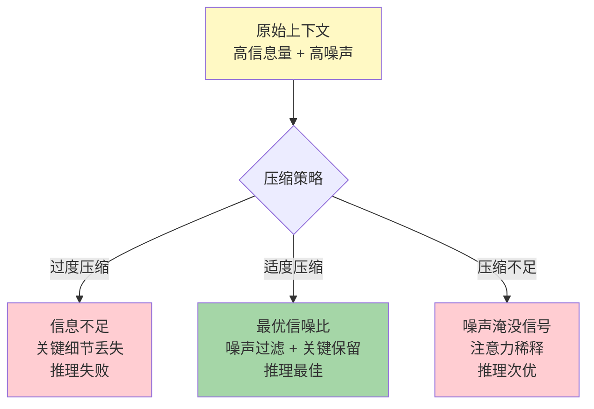
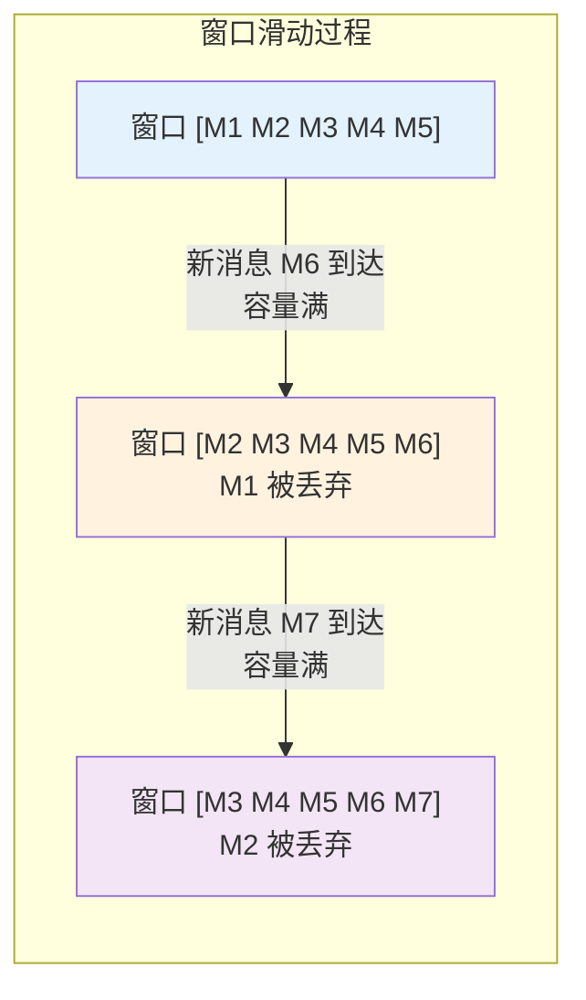
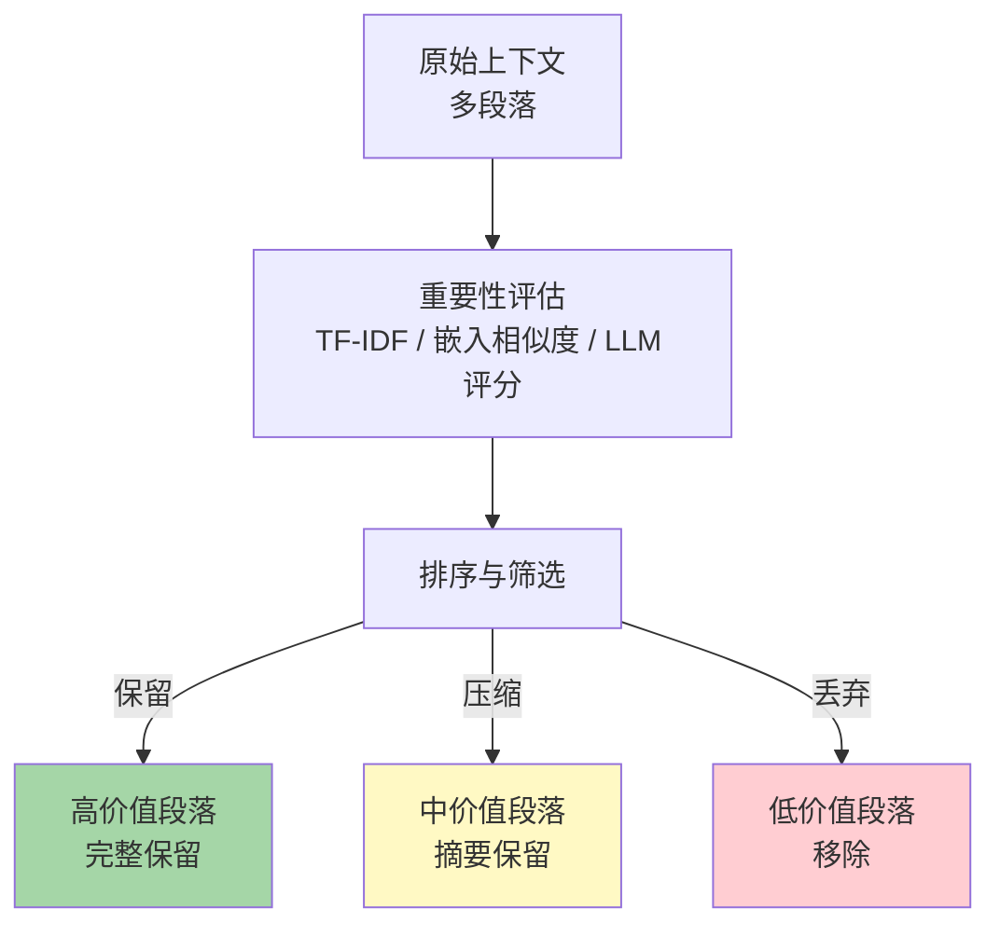
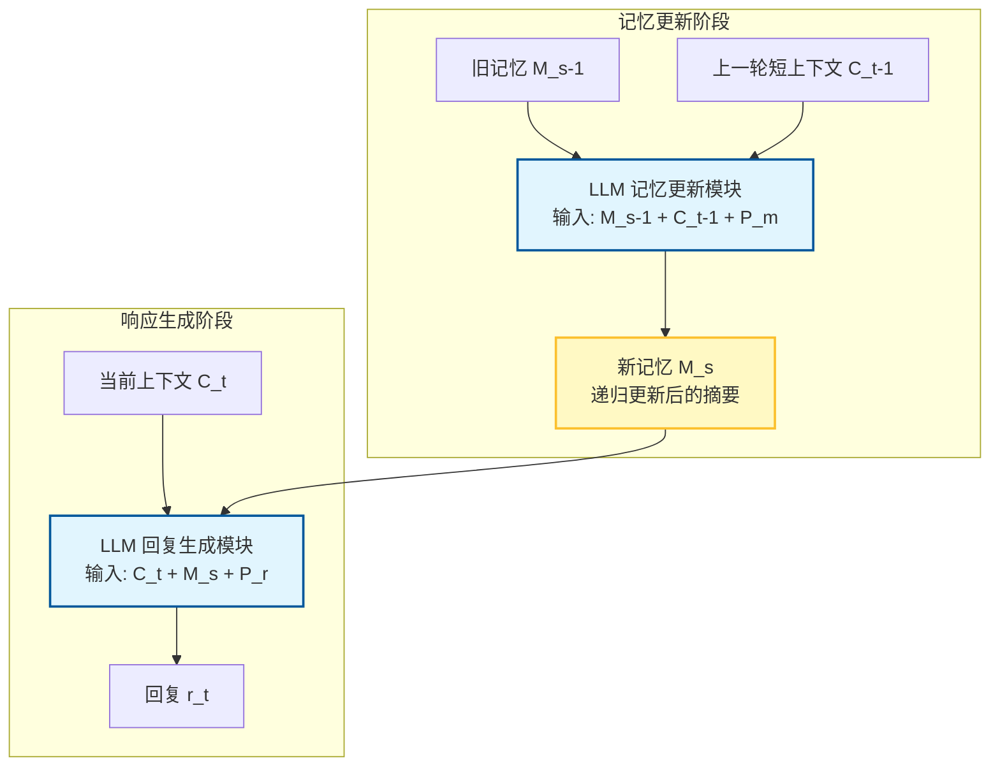
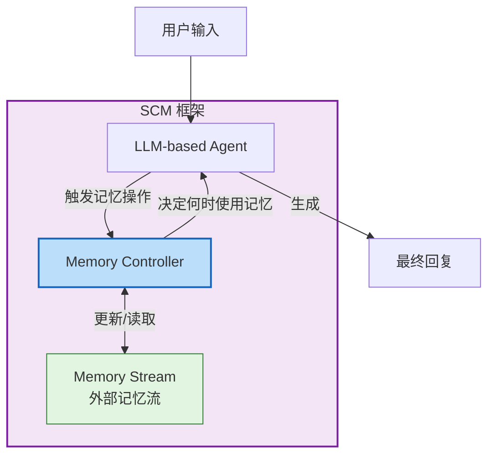
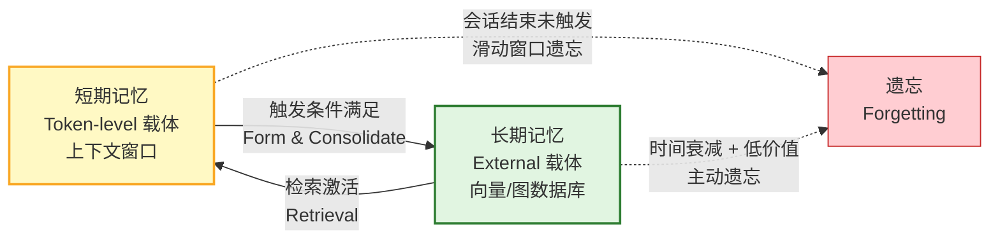

# 第5章 上下文压缩与注意力分配

> **本章摘要**：本章探讨 Agent Memory 系统中最核心的工程问题之一——如何在有限的上下文窗口内容纳最高价值的记忆信息。我们首先分析上下文压缩的基本原理：为什么需要压缩、保留什么丢弃什么、压缩的不可逆性。随后系统对比四种压缩策略（滑动窗口、语义压缩、摘要压缩、记忆槽压缩），并结合递归摘要和 SCM 两篇代表性论文进行深入分析。最后，我们探讨选择性注意力与遗忘的必要性——让 Agent 学会"此刻应该关注什么"，以及从短期记忆到长期记忆的触发条件。

---

## 5.1 上下文压缩原理

### 5.1.1 为什么需要压缩：上下文窗口的硬约束

第4章已论证，上下文窗口不是记忆的存储库，而是记忆的工作台——一个容量有限、易失的输入缓冲区。无论窗口多大（4K 还是 1M），它始终是一个有上限的资源。当 Agent 需要同时处理以下信息时：

- 系统指令（System Prompt）：定义 Agent 的身份、行为和约束
- 工具定义（Tool Descriptions）：可用 API 的结构化描述
- 检索记忆（Retrieved Memory）：从外部存储召回的相关记忆条目
- 对话历史（Dialogue History）：当前会话的交互记录
- 当前输入（Current Input）：用户的最新请求

这些内容的总量很容易超出窗口容量。此时，系统必须做出选择：**保留哪些信息，压缩哪些信息，丢弃哪些信息**？

上下文压缩的本质是**信息选择**——在容量约束下，最大化上下文的信息价值密度。这不是一个技术问题，而是一个价值判断问题：什么信息对当前任务最重要？

### 5.1.2 保留什么、丢弃什么：信息价值评估

信息价值（Information Value）是上下文压缩的核心概念。一条记忆的价值取决于三个维度：

| 价值维度 | 定义 | 评估方法 | 示例 |
|---------|------|---------|------|
| **任务相关性** | 与当前任务的关联程度 | 语义相似度、关键词匹配 | 用户询问"我的偏好"时，用户画像记忆价值高 |
| **时效性** | 信息的新鲜度和时效匹配 | 时间戳衰减函数、新鲜度指标 | 用户的当前地址比三年前搬家前的地址价值高 |
| **唯一性** | 信息是否可被其他来源替代 | 冗余度检测、覆盖分析 | 如果系统指令已包含某规则，重复的规则描述价值低 |

这三个维度共同决定了一条记忆在当前上下文中的"优先级分数"。高优先级的记忆应该以完整形式保留在上下文中；中等优先级的记忆可以压缩后保留；低优先级的记忆应该被丢弃或推迟检索。

值得注意的是，**信息价值是上下文依赖的**——同一条记忆在不同任务情境下的价值可能截然不同。用户在闲聊时，其生日信息价值低；在为其规划生日惊喜时，生日信息价值极高。因此，信息价值评估必须是动态的、任务感知的。

### 5.1.3 压缩的不可逆性：信息损失 vs 噪声过滤

上下文压缩本质上是**有损压缩**（Lossy Compression）——压缩后的上下文不包含原始信息的全部内容。这一不可逆性带来两个相互矛盾的效果：

**信息损失风险**。压缩过程中可能丢失关键细节。例如，将一段 500 字的对话摘要为"用户表达了对产品的不满"，丢失了具体的不满原因、情感强度和背景信息。如果后续任务需要这些细节（如生成道歉信），摘要中的信息就不够用了。

**噪声过滤收益**。压缩同时也是噪声过滤——去除冗余的、无关的、干扰性的信息，提升信噪比。第4章已论证，上下文中的噪声会干扰模型的推理。一个精心压缩的上下文可能比原始上下文产生更好的推理结果——不是因为信息更多，而是因为噪声更少。

压缩的不可逆性提示我们在工程设计中遵循**保守压缩原则**：当不确定一条信息是否重要时，保留它而非丢弃它。因为信息一旦丢失就无法恢复，而多保留一些信息的代价只是轻微的注意力稀释。

同时，压缩策略应该是**分层的**——关键信息以完整形式保留，次要信息以压缩形式保留，边缘信息不保留。这类似于 JPEG 图像压缩中的质量分级：高频细节（边缘信息）被大幅压缩，低频结构（关键信息）基本保留。

---

## 5.2 压缩策略对比

### 5.2.1 滑动窗口：FIFO 策略的优点与局限

**策略描述**：滑动窗口（Sliding Window）是最简单的上下文压缩策略——当上下文达到容量上限时，丢弃最旧的令牌（或消息），为新令牌腾出空间。这本质上是一个 FIFO（First In, First Out）队列。

**优点**：
- **实现简单**：无需额外的模型调用或复杂的评估逻辑。
- **确定性**：行为可预测——总是丢弃最旧的信息。
- **零额外成本**：不引入额外的推理延迟或计算开销。

**局限**：
- **信息价值盲区**：FIFO 策略不区分信息的重要性——一条关键的系统约束和一条寒暄用语以相同的方式被对待。
- **灾难性遗忘**：被滑出窗口的信息永久丢失，如果该信息包含关键约束或事实，后续推理可能完全错误。
- **无压缩，只有丢弃**：滑动窗口不是真正的"压缩"——它不做信息摘要或提炼，直接丢弃整段内容。

**本体论映射**：滑动窗口是 `Token-level（载体）+ Working（功能）+ Forgetting（动态）` 坐标上的最简单实现。其遗忘策略对应于第2章"遗忘不可逆"公理——被滑出的令牌无法恢复。

**适用场景**：适用于信息价值随时间单调递减的场景（如实时聊天流），或作为更复杂压缩策略的保底机制（当其他策略来不及执行时，回退到滑动窗口）。

### 5.2.2 语义压缩：基于重要性的段落筛选

**策略描述**：语义压缩（Semantic Compression）首先对上下文中的每个段落（或消息、句子）进行重要性评分，然后按分数排序，保留分数最高的段落，丢弃或压缩分数最低的段落。

重要性评分可以基于多种信号：
- **TF-IDF 或 BM25**：衡量段落的关键词密度和区分度。
- **嵌入相似度**：与当前查询的语义相似度。
- **LLM 评分**：使用 LLM 本身评估每条信息的重要性（"以下信息中哪些对回答问题最重要？"）。
- **混合评分**：结合多种信号，如 Generative Agents 的 Recency + Importance + Relevance 三维度评分。

**优点**：
- **信息价值感知**：只丢弃低价值信息，保留高价值信息。
- **灵活性**：评分函数可以针对任务场景定制。
- **可与其他策略组合**：语义筛选后再接摘要压缩，形成多级压缩管线。

**局限**：
- **评分成本**：如果使用 LLM 进行重要性评分，需要额外的推理调用，增加延迟和成本。
- **评分偏差**：评分函数可能高估某些类型的信息（如包含关键词但实际无关的段落），低估其他类型（如隐含但关键的约束条件）。
- **上下文依赖**：一条信息的重要性取决于当前任务——评分函数需要感知任务上下文。

### 5.2.3 摘要压缩：递归摘要 vs 单轮摘要

**策略描述**：摘要压缩（Summarization Compression）使用 LLM 将长段落压缩为简短摘要。根据摘要的生成方式，可分为单轮摘要和递归摘要。

**单轮摘要**：一次性将完整上下文送入 LLM，要求生成摘要。简单直接，但当上下文超出窗口容量时不可行。

**递归摘要**：将上下文分段，对每段生成摘要，然后将摘要再次合并、再次摘要，直到摘要长度达到目标。这一过程可以无限递归，理论上可以压缩任意长度的文本。

**递归摘要的优势**：
- **突破窗口限制**：通过分段处理，可以压缩超出窗口容量的内容。
- **层次化压缩**：不同层级的摘要保留不同粒度的信息——顶层摘要保留核心主题，底层摘要保留更多细节。
- **增量更新**：新信息到达时，只需更新受影响的摘要分支，无需重新压缩全部内容。

**递归摘要的风险**：
- **误差累积**：每层摘要都是对上一层摘要的再压缩，信息在递归过程中逐步丢失。经过多轮递归后，摘要可能严重偏离原始内容。
- **幻觉风险**：LLM 在摘要过程中可能添加原始文本中不存在的信息（幻觉），这些错误信息在后续递归中被当作事实继续压缩。
- **成本**：每轮递归都需要调用 LLM，总成本与递归深度和分段数量成正比。

### 5.2.4 论文分析：递归摘要实现长期对话记忆

**论文**：Wang, Q. et al. "Recursively Summarizing Enables Long-Term Dialogue Memory in Large Language Models." arXiv:2308.15022.

该论文提出了一种将记忆管理完全转化为文本生成任务的方案——利用 LLM 自身的生成能力，通过递归摘要维护长期对话记忆。

**架构设计**：系统分为两个阶段。在每个会话结束时，记忆更新模块接收旧记忆（$M_{s-1}$）和上一轮对话上下文（$C_{t-1}$），通过提示词 $P_m$ 指导 LLM 生成更新后的记忆摘要（$M_s = \text{LLM}(C_{t-1}, M_{s-1}, P_m)$）。在生成回复时，回复生成模块接收当前上下文（$C_t$）和最新记忆摘要（$M_s$），通过提示词 $P_r$ 生成回复。

**核心发现**：
- 自动生成的递归摘要记忆在长会话（Session 4 & 5）中的表现优于全上下文输入，接近人工标注的"黄金记忆"（Gold Memory）。在 Session 5 中，递归摘要方法的 F1 分数为 16.25，优于全上下文的 15.84，接近黄金记忆的 16.36（后者仅在人工标注质量上略优）。
- 生成记忆比人工标注记忆更流畅、更连贯，更适合作为 Prompt 被 LLM 理解。这是因为 LLM 生成的文本在风格和分布上与模型自身的训练数据更匹配。
- **One-shot 增强效果显著**：仅提供一个示例，记忆准确率（Mem_F1）从约 29% 跃升至 57%，证明了 ICL 对记忆生成任务的巨大提升。

**本体论映射**：递归摘要方法占据 `Token-level（载体）+ Episodic（功能）+ Formation + Evolution（动态）` 坐标。记忆摘要是 Token-level 载体上的情景记忆（Episodic 功能），通过递归更新实现记忆的形成和演化。

**工程意义**：该方法证明了 LLM 自身就是优秀的"记忆压缩机"——它生成的摘要比人类标注的更"适合"被自己理解。这为 Agent Memory 系统提供了一条轻量级的记忆压缩路径：无需额外的检索器或微调模型，直接调用 LLM 即可实现记忆管理。

**局限性**：论文实验仅覆盖 5 个会话，未验证更长期限（10+ 会话）下的误差累积效应。此外，递归摘要依赖 API 调用，成本较高——每个会话都需要额外的摘要生成调用。

### 5.2.5 论文分析：SCM 自控记忆框架

**论文**：Wang, B. et al. "SCM: Enhancing Large Language Model with Self-Controlled Memory Framework." arXiv:2304.13343.

SCM（Self-Controlled Memory）框架提出了一种插件式的记忆管理架构，无需修改或微调 LLM 即可实现超长文本处理。

**三组件架构**：
1. **LLM-based Agent**：框架的主干，负责处理用户指令和生成回复。
2. **Memory Stream**：存储 Agent 的记忆内容，是一个持续增长的文本流。
3. **Memory Controller**：核心控制模块，负责更新记忆流，并动态决定何时及如何从记忆流中使用记忆。

**核心创新**：SCM 的关键创新在于 Memory Controller 的**主动性**。与传统的被动检索（在每次生成前固定检索 Top-K 记忆）不同，SCM 的 Controller 自主决定：
- **何时**检索记忆（不是每轮都检索，而是在需要时检索）
- **使用什么**记忆（不是固定 Top-K，而是根据当前情境动态选择）
- **如何更新**记忆流（决定哪些新信息应该被存储，哪些应该被忽略）

这种"自控"机制使 SCM 避免了两个常见问题：**过度检索**（每轮都检索大量无关记忆，浪费上下文空间）和**检索不足**（固定检索策略遗漏关键信息）。

**工程意义**：SCM 的插件式范式（Plug-and-play）具有极高的工程价值——它不需要修改模型架构或进行微调，可以直接叠加在现有的指令遵循 LLM 之上。这使得记忆能力的升级可以独立于模型的升级，降低了部署门槛。

**本体论映射**：SCM 是一个典型的混合架构。Memory Stream 是 `External（载体）+ Episodic（功能）+ Formation + Retrieval（动态）`；Memory Controller 属于 `MemorySystem` 类——它是记忆的管理基础设施，而非记忆本身；Agent 对 Controller 的调用体现了 `Agent` 类作为记忆主体的角色。

**局限性**：基于提供的论文片段，Memory Controller 的具体实现逻辑（是基于规则还是另一个模型？）未能完全展开。此外，多次调用 LLM（Agent + Controller）可能显著增加推理延迟，需要评估 Token 消耗与记忆收益的性价比。

### 5.2.6 四种压缩策略对比总览

| 策略 | 压缩方式 | 信息保留率 | 计算成本 | 实现复杂度 | 适用场景 |
|------|---------|-----------|---------|-----------|---------|
| **滑动窗口** | 丢弃最旧内容 | 低（按时间，不按价值） | 零 | 极低 | 实时聊天、保底机制 |
| **语义压缩** | 按重要性筛选 | 中（保留高价值段落） | 中（评分需要计算） | 中 | 信息密度不均的上下文 |
| **递归摘要** | LLM 生成摘要 | 中-高（取决于递归深度） | 高（多轮 LLM 调用） | 中-高 | 长期对话、文档理解 |
| **记忆槽压缩** | 编码器压缩为向量 | 高（4 倍压缩几乎无损） | 中-高（需要编码器） | 高（需要训练） | 静态知识、缓存场景 |

没有一种策略在所有场景下都是最优的。实用的 Agent Memory 系统通常采用**多级压缩管线**：滑动窗口作为保底机制，语义压缩作为第一级筛选，摘要压缩作为第二级精炼，记忆槽压缩用于特定的静态知识场景。

---

## 5.3 选择性注意力与遗忘

### 5.3.1 让 Agent 决定"此刻应该关注什么"

第4章分析了模型层面的注意力分配（自注意力机制），但注意力分配不仅仅是模型内部的事——在将信息送入上下文窗口之前，系统就需要决定**哪些记忆应该被注入上下文**。这就是选择性注意力（Selective Attention）的设计问题。

人类的选择性注意力机制使我们能够在嘈杂的环境中专注于特定声音（鸡尾酒会效应），或在复杂的视觉场景中快速定位目标物体。Agent 的选择性注意力同样需要在"信息海洋"中快速定位当前任务所需的关键记忆。

选择性注意力的实现路径包括：

- **查询驱动的注意力**：根据当前查询的语义，从记忆库中检索最相关的条目。这是最常见的路径，对应于 RAG（检索增强生成）范式。
- **事件驱动的注意力**：当特定事件发生时（如用户提到某个关键词、系统检测到情绪变化），主动激活相关记忆。例如，用户说"我上次提到的那个项目"时，系统主动检索与该项目相关的所有记忆。
- **时间驱动的注意力**：基于时间线索激活记忆。例如，在用户生日临近时，主动将用户的生日和偏好信息注入上下文。
- **策略驱动的注意力**：基于元认知策略动态调整注意力范围。例如，当 Agent 发现当前回答质量下降时，扩大检索范围，引入更多上下文信息。

SCM 框架的 Memory Controller 就是选择性注意力的一个实现——它不是被动地检索固定数量的记忆，而是根据当前情境动态决定关注什么。

### 5.3.2 遗忘的必要性：不遗忘 = 无法工作

遗忘通常被视为记忆系统的缺陷，但在 Agent Memory 工程中，**遗忘是一个必要的设计特性**。原因如下：

**资源有限性**。上下文窗口的容量是有限的。如果系统拒绝遗忘任何信息，上下文窗口很快就会被填满，新信息无法注入，系统将陷入"记忆饱和"状态——拥有大量记忆但无法使用任何新记忆。

**注意力聚焦**。即使上下文窗口足够大，将所有历史记忆都保留在上下文中也不是好策略。第4章已论证，信息越多，注意力越稀释，信噪比越低。遗忘低价值信息实际上是**释放注意力资源**，让模型能够聚焦于当前任务的关键信息。

**一致性维护**。随着时间推移，部分记忆可能过时或与新信息矛盾。如果不遗忘（或不更新）这些过时记忆，系统中会积累矛盾信息，导致推理不一致。第2章"一致性优先"公理指出：当新旧记忆冲突时，系统应优先维护全局一致性。遗忘旧记忆是维护一致性的最直接手段。

**遗忘的主动性**。人类的遗忘在很大程度上是被动的（信息自然衰退），而 Agent 的遗忘应该是主动的、策略性的。主动遗忘（Active Forgetting）包括：

- **时间衰减**：随时间降低记忆的重要性评分，低于阈值时触发遗忘。
- **效用评估**：根据记忆对任务成功的贡献度决定保留与否。
- **竞争抑制**：新记忆的形成主动抑制相似但过时的旧记忆。
- **容量驱逐**：当存储介质达到容量上限时，按优先级淘汰最低价值的记忆。

### 5.3.3 上下文溢出时的退化行为

当上下文溢出（即信息量超过窗口容量）且系统没有有效的压缩/遗忘策略时，LLM 会表现出可预测的退化行为：

**截断退化**：最简单的处理方式是在令牌级别截断上下文。模型"看到"的是一个不完整的输入——可能截断在某条指令的中间、某个关键事实的半途。在这种情况下，模型的输出质量不可预测——可能完全正确（如果关键信息在被截断之前的部分），也可能完全错误（如果关键信息在被截断之后的部分）。

**注意力崩溃**：当上下文接近窗口上限时，注意力进一步向两端（开头和结尾）集中，中间位置几乎完全被忽略，加剧了"中间迷失"现象。

**指令遗忘**：系统指令通常位于上下文开头，按理应受到首因效应的保护。但在极长上下文中，即使开头的指令也可能被"淹没"——模型生成回复时，指令的影响被海量的上下文信息稀释。这表现为 Agent 违反系统约束、忽略安全规则等行为。

这些退化行为提示我们：**上下文溢出不是一个渐进的性能下降问题，而是一个可能导致系统性失效的临界点问题**。有效的上下文压缩和遗忘策略不是"优化"，而是"必需"。

### 5.3.4 从短期记忆到长期记忆的触发条件

在 Agent Memory 系统中，短期记忆（上下文窗口中的活跃信息）和长期记忆（外部存储中的持久信息）之间需要一条清晰的转换通道。什么样的信息应该从短期升级为长期？

借鉴认知科学的记忆巩固理论，我们定义以下触发条件：

| 触发条件 | 认知对应 | 计算实现 | 示例 |
|---------|---------|---------|------|
| **重复出现** | 精细复述促进长期编码 | 同一信息在多次会话中出现 | 用户多次提到"我喜欢猫"→ 编码为用户偏好 |
| **高情感/高价值标记** | 情感事件优先编码 | 重要性评分超过阈值 | 用户明确说"这件事很重要"→ 立即编码 |
| **会话边界** | 睡眠期间的记忆巩固 | 会话结束时触发记忆整理 | 对话结束→ 生成会话摘要并存入长期记忆 |
| **冲突检测** | 认知失调驱动整合 | 新旧记忆矛盾时触发 | 新信息与已有用户画像冲突→ 触发冲突消解 |
| **反思触发** | 元认知评估 | 定期运行反思任务 | 夜间自评→ 从交互历史中提取洞察 |

这些触发条件对应于第2章中的 **Formation（形成）** 和 **Consolidation（巩固）** 操作。触发后的信息从 Token-level 载体迁移到 External 载体（或 Parametric 载体），从短暂的工作记忆转化为持久的长期记忆。

**迁移过程不是单向的**。长期记忆在需要时被检索，重新注入上下文窗口——从 External 载体回到 Token-level 载体，从长期记忆激活为工作记忆。这一双向迁移构成了记忆系统的完整生命周期闭环。

---

## 5.4 本章小结

- **上下文压缩是 Agent Memory 系统的核心工程问题**。有限的上下文窗口要求系统在信息保留和信息压缩之间找到最优平衡点。
- **信息价值评估是压缩决策的基础**，由任务相关性、时效性和唯一性三个维度共同决定。价值评估必须是动态的、任务感知的。
- **压缩是不可逆的有损过程**，既带来信息损失风险，也带来噪声过滤收益。保守压缩原则建议：不确定时保留而非丢弃。
- **四种压缩策略各有适用场景**：滑动窗口（简单保底）、语义压缩（价值感知）、递归摘要（突破窗口限制）、记忆槽压缩（高效静态知识处理）。实用系统通常采用多级压缩管线。
- **递归摘要方法证明 LLM 自身就是优秀的记忆压缩机**——生成的摘要比人工标注的更"适合"被模型理解，且 One-shot 即可显著提升记忆准确率。
- **SCM 框架展示了主动记忆管理的优势**——Memory Controller 自主决定何时检索、使用什么记忆、如何更新记忆流，避免了过度检索和检索不足两个极端。
- **遗忘是必要的设计特性而非系统缺陷**。主动遗忘释放上下文资源、聚焦注意力、维护全局一致性。遗忘策略应该是策略性的、多维度的。
- **短期记忆到长期记忆的转换需要明确的触发条件**：重复出现、高价值标记、会话边界、冲突检测和反思触发。迁移是双向的——长期记忆可被检索激活为工作记忆。

---

## 5.5 延伸阅读

### 上下文压缩方法

1. **Wang, Q. et al.** (2023). "Recursively Summarizing Enables Long-Term Dialogue Memory in Large Language Models." arXiv:2308.15022. —— 递归摘要记忆机制，本章 5.2.4 节详细分析。
2. **Ge, T. et al.** (2023). "In-context Autoencoder for Context Compression in a Large Language Model." arXiv:2307.06945. —— 记忆槽压缩范式，第4章 4.2.4 节详细分析。
3. **Chen, H. et al.** (2023). "Compressing Context to Enhance Inference Efficiency of Large Language Models." arXiv:2310.06201. —— 上下文压缩对推理效率的影响分析。
4. **Jiang, H. et al.** (2023). "LLMLingua: Compressing Prompts for Accelerated Inference of Large Language Models." arXiv:2310.05736. —— 基于令牌重要性的 Prompt 压缩。
5. **(2026).** "AgentSwing: Adaptive Parallel Context Management." arXiv:2603.27490. —— 自适应并行上下文管理。

### 记忆管理与控制

6. **Wang, B. et al.** (2023). "SCM: Enhancing Large Language Model with Self-Controlled Memory Framework." arXiv:2304.13343. —— 自控记忆框架，本章 5.2.5 节详细分析。
7. **Packer, C. et al.** (2023). "MemGPT: Towards LLMs as Operating Systems." arXiv:2310.08566. —— 虚拟上下文管理，自主分页的记忆管理范式。
8. **Zhong, W. et al.** (2023). "MemoryBank: Enhancing Large Language Models with Long-Term Memory." arXiv:2305.10250. —— 遗忘曲线驱动的动态记忆管理。

### 注意力与遗忘

9. **Liu, N. F. et al.** (2023). "Lost in the Middle: How Language Models Use Long Contexts." arXiv:2307.03172. —— 位置偏置与"中间迷失"现象。
10. **Xiao, G. et al.** (2023). "Efficient Streaming Language Models with Attention Sinks." arXiv:2309.17453. —— 注意力汇现象与长上下文优化。
11. **Tang, Y. et al.** (2024). "Enhancing Long Context Performance in LLMs Through Inner Loop Query Mechanism." arXiv:2410.12859. —— 内循环查询机制对抗记忆衰减，第4章 4.3.3 节详细分析。

### 认知心理学背景

12. **Broadbent, D. E.** (1958). *Perception and Communication*. —— 选择性注意力理论的奠基著作。
13. **Anderson, J. R. & Schooler, L. J.** (1991). "Reflections of the Environment in Memory." *Psychological Science*. —— 记忆的环境适应性理论，为遗忘的合理性提供认知科学依据。

*上下文压缩与注意力分配是 Agent Memory 从理论走向工程实践的关键环节。第6章将展开外部检索架构的技术细节——当记忆不再驻留于上下文窗口，而是持久化于外部存储时，如何设计高效的检索、索引和检索-生成管线。*

---

## 5.6 框架深度剖析：上下文压缩策略

### 5.6.1 Hermes Agent — 可插拔 Context Engine 抽象

**问题**：不同场景需要不同的压缩策略（编程场景需要保留代码，对话场景需要保留用户意图），硬编码单一策略不满足多样性需求。

**方案**：定义 `ContextEngine` 抽象基类，实现可插拔的压缩策略。Hermes Agent 内置了三种引擎：SimpleTrim（简单裁剪）、RecursiveSummary（递归摘要）、TopicAware（主题感知压缩）。

**代码路径**：
- `agent/context_compressor.py` — 上下文压缩 (L60-821)
- `agent/memory_manager.py` — MemoryManager 编排 (L72-363)

**设计模式**：
- 策略模式 + 工厂模式：根据会话类型自动选择合适的 ContextEngine
- ContextEngine 接口：`compact(messages, target_tokens) → compressed_messages`
- 每个引擎有自己的适用场景和性能特征

**与本章理论映射**：Hermes Agent 的 Context Engine 抽象直接实现了第5章讨论的"压缩策略选择"问题——没有一种压缩算法适用于所有场景，系统需要根据任务类型动态选择。

### 5.6.2 Claw Code — 递归摘要保留 Highlights

**问题**：简单的摘要压缩会丢失对话中的关键细节（如用户明确表达的偏好），LLM 无法从摘要中恢复这些信息。

**方案**：递归压缩时保留之前摘要的 "highlights"——被标记为重要的事实片段——与新摘要合并。这样即使经过多轮压缩，核心信息仍然可追溯。

**代码路径**：
- `rust/crates/runtime/src/compact.rs` — 上下文压缩 (L1-826)

**设计模式**：
- 迭代摘要更新：`new_summary = llm_summarize(old_highlights + new_messages)`
- Highlights 提取：使用正则/关键词识别重要陈述（"I prefer", "My name is" 等）
- 多轮压缩不丢失 highlights——它们被显式传递到每次摘要中

### 5.6.3 MemGPT — 自动摘要触发机制

**问题**：何时触发摘要？手动触发不可靠，固定间隔触发浪费资源或错过关键时机。

**方案**：MemGPT 实现多级触发器：(1) Token 占比 > 90% 强制触发；(2) 对话轮数 > N 触发；(3) 检测到话题切换时触发。触发后可使用独立摘要 Agent 进行压缩，不阻塞主对话。

**代码路径**：
- `letta/services/summarizer/summarizer.py` — 上下文窗口摘要 (L36-200+)
- `letta/schemas/memory.py` — Memory 类 (L68-781)

**设计模式**：
- Sleeptime 架构：将摘要处理移到后台线程，不阻塞 Agent 响应
- 90% 容量触发 vs 80% 预防触发的 trade-off：90% 更省 LLM 调用，但更接近溢出风险

## 5.7 工程决策卡片

| 维度 | 选项A: 简单裁剪 | 选项B: 递归摘要 | 选项C: 主题感知 | 推荐场景 |
|------|---------------|---------------|---------------|---------|
| LLM 调用成本 | 无 | 高（每次调用LLM） | 中（仅嵌入模型） | 成本敏感选A/C |
| 信息保留质量 | 低 | 高（保留语义） | 中 | 质量敏感选B |
| 实现复杂度 | 极低 | 高 | 中 | 快速上线选A |
| 适用上下文大小 | < 4K tokens | 4K-100K | 任意 | 大窗口选B/C |

**触发阈值推荐**：
- Token 占比 > 80% 预防性触发（MemGPT 用 90%，建议调低到 80% 留安全余量）
- 消息数 > 50 条强制触发
- 话题切换检测（余弦相似度 < 0.3）选择性触发
- 最小间距：摘要间隔 >= 5 次工具调用，防止过度摘要

## 5.8 反模式与陷阱

| 反模式 | 问题 | 正确做法 | 来源 |
|--------|------|---------|------|
| 固定间隔摘要 | 可能在不必要时浪费 LLM 调用，或在必要时不触发 | 多级触发器（Token占比+消息数+话题切换） | MemGPT 经验 |
| 摘要丢失 highlights | 多轮压缩后核心信息不可恢复 | 保留 highlights 到新摘要的传递链 | Claw Code 经验 |
| 单压缩策略适用所有场景 | 编程场景和对话场景的压缩需求完全不同 | 可插拔 ContextEngine，按场景选择 | Hermes Agent 设计 |
| 摘要阻塞主循环 | 用户等待 LLM 摘要完成才能看到响应 | Sleeptime 架构，后台摘要 | MemGPT 设计 |
