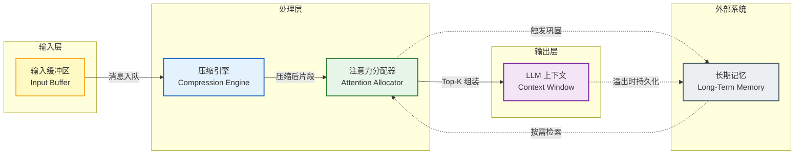
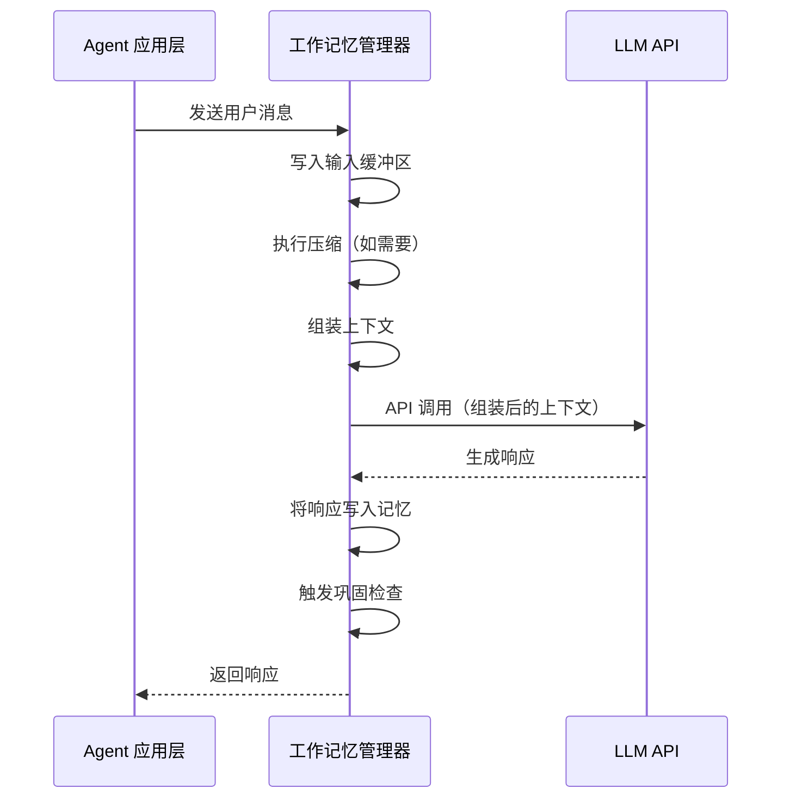
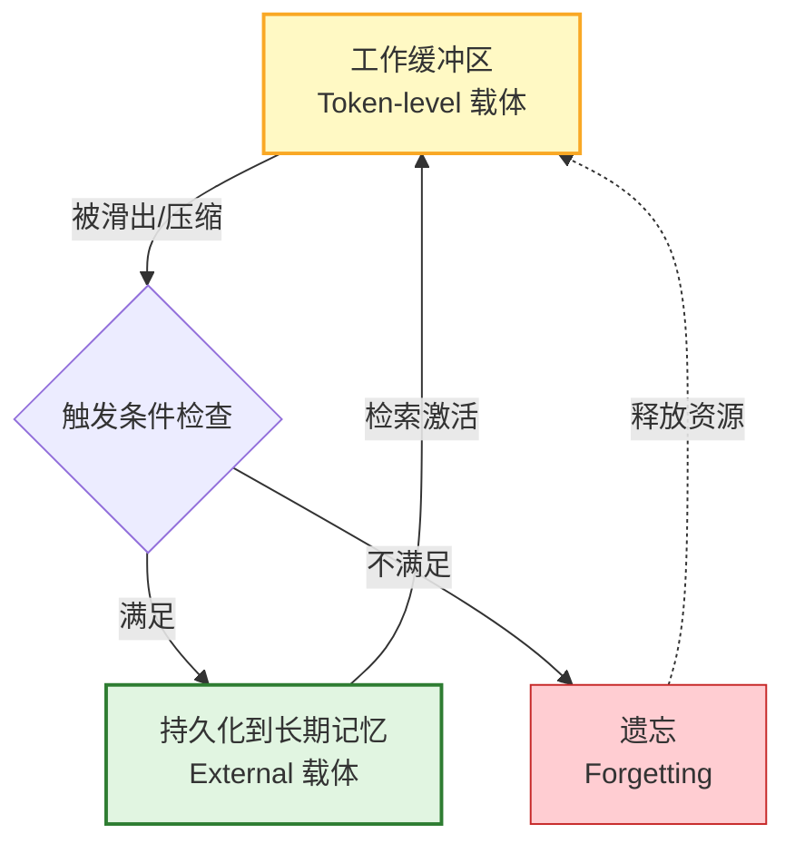
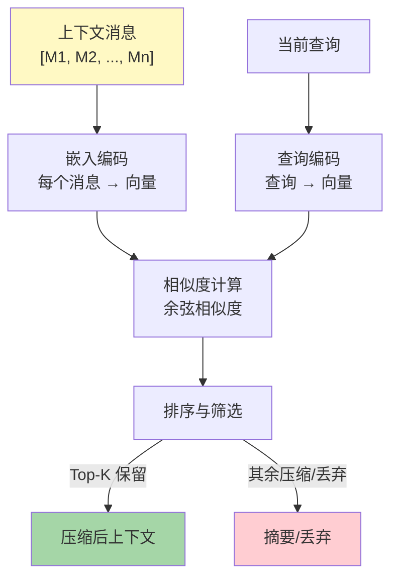

# 第6章 工作记忆管理器

> **本章摘要**：本章聚焦 Agent Memory 系统中最贴近 LLM 推理引擎的组件——工作记忆管理器（Working Memory Manager）。第5章讨论了上下文压缩的四种策略（滑动窗口、语义压缩、摘要压缩、记忆槽压缩），本章将这些策略工程化为一个完整的、可运行的记忆管理系统。我们首先设计系统架构，定义核心组件的职责与交互协议；随后分别实现滑动窗口管理、语义压缩和动态上下文组装三个核心模块；最终将它们集成为统一的 MemoryManager 类，并提供完整的对话集成示例。本章的代码示例均为完整可运行的 Python 实现，可直接嵌入到 Agent 框架中。

---

## 6.0 工作记忆管理器架构设计

### 6.0.1 系统架构

工作记忆管理器（Working Memory Manager）是 Agent Memory 系统中直接面向 LLM 推理引擎的组件。它在本体论框架中占据 `MemorySystem` 类的核心位置，其职责是管理 `Token-level（载体）+ Working（功能）` 坐标上的记忆生命周期——包括 `Formation（形成）`、`Retrieval（检索）`、`Forgetting（遗忘）` 和 `Evolution（演化）` 操作。



### 6.0.2 核心组件职责定义

工作记忆管理器由四个核心组件构成，每个组件对应记忆生命周期中的一个子集：

| 组件 | 职责 | 对应的动态操作 | 本体论坐标 |
|------|------|--------------|-----------|
| **输入缓冲区（Input Buffer）** | 接收新消息，分配初始重要性评分，维护消息序列 | Formation | MemorySystem + Formation |
| **压缩引擎（Compression Engine）** | 当上下文达到容量阈值时，执行语义压缩和摘要生成 | Evolution + Forgetting | MemorySystem + Evolution |
| **注意力分配器（Attention Allocator）** | 根据任务相关性、时效性和重要性，选择最优片段组装上下文 | Retrieval | MemorySystem + Retrieval |
| **上下文窗口（Context Window）** | 最终组装的上下文，直接送入 LLM 推理 | — | Token-level 载体 |

四个组件通过明确的数据管道连接：输入缓冲区产生候选消息，压缩引擎对其进行价值评估和压缩，注意力分配器根据当前任务选择最优子集，最终组装为 LLM 上下文。长期记忆系统通过检索接口与注意力分配器交互——当上下文中的本地信息不足以支撑当前任务时，注意力分配器触发检索操作，从长期记忆中召回相关条目。

### 6.0.3 与 LLM API 的交互协议

工作记忆管理器与 LLM API 的交互遵循以下协议：



关键协议约定：

1. **Token 预算约束**：每次 LLM 调用前，管理器确保上下文总令牌数不超过 `max_context_tokens` 减去 `max_output_tokens` 的预留空间。
2. **系统指令保护**：系统指令（System Prompt）始终保留在上下文开头，不参与压缩和驱逐。这对应于本体论中的 `Policy` 类——系统定义了不可压缩的记忆保护规则。
3. **幂等性保证**：相同的输入序列应产生相同的上下文组装结果，除非外部记忆状态发生变化。这保证了推理的可重复性。
4. **溢出回调**：当上下文溢出且压缩引擎无法进一步压缩时，管理器触发溢出回调，将最低优先级的消息持久化到长期记忆（`MemorySystem → ExternalMemory` 的载体迁移）。

### 6.0.4 与长期记忆的衔接点设计

工作记忆（`Token-level 载体`）与长期记忆（`External 载体`）之间的衔接是系统架构的关键设计点。两个衔接方向：

**上行通道（工作记忆 → 长期记忆）**：当一条消息被滑出工作窗口、或被压缩引擎判定为低价值时，并不直接遗忘（遵守"保守压缩原则"），而是检查是否满足长期记忆的触发条件（第5章 5.3.4 节讨论的五种触发条件）。满足条件的消息被持久化到长期记忆；不满足的直接遗忘。

**下行通道（长期记忆 → 工作记忆）**：注意力分配器在组装上下文时，除考虑工作缓冲区中的本地消息外，还向长期记忆发起检索请求，将最相关的长期记忆条目注入上下文。这对应于本体论中的 `MemoryRetrieval` 操作。



---

## 6.1 滑动窗口管理

### 6.1.1 Token 级别的保留/丢弃策略

滑动窗口（Sliding Window）是第5章讨论的最简单的压缩策略——当上下文达到容量上限时，丢弃最旧的令牌。但纯粹的 FIFO 策略存在"信息价值盲区"：一条关键的系统约束和一条寒暄用语以相同的方式被对待。

实用的滑动窗口管理器需要在 FIFO 基础上叠加重要性评分机制，实现**加权滑动窗口**（Weighted Sliding Window）：

| 策略 | 丢弃规则 | 信息保留率 | 适用场景 |
|------|---------|-----------|---------|
| **纯 FIFO** | 总是丢弃最旧消息 | 低（按时间，不按价值） | 简单聊天流 |
| **重要性保护** | 高重要性消息豁免于 FIFO | 中（保留高价值旧消息） | 含关键约束的对话 |
| **分层滑动** | 按优先级分层，先丢弃最低层 | 中-高（多层保护） | 多角色复杂对话 |
| **保守滑动** | 丢弃前先持久化到长期记忆 | 高（信息不丢失） | 需要审计的场景 |

### 6.1.2 实现代码：SlidingWindowManager

以下是一个完整可运行的加权滑动窗口管理器。每条消息带有重要性评分，当窗口容量满时，优先丢弃重要性最低的消息——但如果最低重要性消息不是最旧的，则从最旧消息中挑选重要性低于阈值的丢弃。

```python
import time
from dataclasses import dataclass, field
from typing import Optional


@dataclass
class Message:
    """对话消息，携带重要性评分和元数据。"""
    role: str                     # "system" | "user" | "assistant"
    content: str
    token_count: int
    importance: float = 0.5       # 0.0 ~ 1.0，初始重要性评分
    timestamp: float = field(default_factory=time.time)
    access_count: int = 0         # 被检索/引用次数，对应使用强化律
    protected: bool = False       # 是否受保护（如系统指令）

    def decay_importance(self, half_life: float = 3600.0) -> float:
        """按时间半衰期衰减重要性评分（时效衰减律）。"""
        elapsed = time.time() - self.timestamp
        decay_factor = 0.5 ** (elapsed / half_life)
        self.importance *= decay_factor
        return self.importance


class SlidingWindowManager:
    """加权滑动窗口管理器。

    结合 FIFO 和重要性评分，实现 token 级别的智能保留/丢弃。
    系统指令始终受保护，不会被丢弃。
    """

    def __init__(
        self,
        max_tokens: int = 4096,
        importance_threshold: float = 0.7,
        importance_half_life: float = 3600.0,
    ):
        self.max_tokens = max_tokens
        self.importance_threshold = importance_threshold
        self.half_life = importance_half_life
        self.messages: list[Message] = []
        self.total_tokens = 0
        self.evicted: list[Message] = []  # 记录被丢弃的消息（用于持久化）

    def add_message(self, role: str, content: str,
                    token_count: Optional[int] = None,
                    importance: float = 0.5) -> list[Message]:
        """添加消息，必要时触发驱逐。返回被驱逐的消息列表。"""
        if token_count is None:
            token_count = len(content.split())  # 粗略估算

        msg = Message(
            role=role,
            content=content,
            token_count=token_count,
            importance=importance,
        )

        if role == "system":
            msg.protected = True
            msg.importance = 1.0

        self.messages.append(msg)
        self.total_tokens += token_count

        return self._evict_if_needed()

    def _evict_if_needed(self) -> list[Message]:
        """当超出容量时，驱逐低价值消息。"""
        evicted = []

        while self.total_tokens > self.max_tokens:
            # 跳过受保护的消息
            candidates = [
                m for m in self.messages if not m.protected
            ]
            if not candidates:
                break  # 全部受保护，无法驱逐

            # 先进行时间衰减
            for m in candidates:
                m.decay_importance(self.half_life)

            # 策略：找到重要性最低且足够旧的消息
            # 从最旧的消息开始扫描，找到第一个低于重要性阈值的
            victim = None
            for m in candidates:
                if m.importance < self.importance_threshold:
                    victim = m
                    break

            # 如果所有候选都高于阈值，强制驱逐最旧的
            if victim is None:
                victim = candidates[0]

            self.messages.remove(victim)
            self.total_tokens -= victim.token_count
            evicted.append(victim)
            self.evicted.append(victim)

        return evicted

    def get_context(self) -> list[dict]:
        """获取当前上下文，格式适配 LLM API。"""
        return [
            {"role": m.role, "content": m.content}
            for m in self.messages
        ]

    @property
    def utilization(self) -> float:
        """窗口利用率 (0.0 ~ 1.0+)。"""
        if self.max_tokens == 0:
            return 0.0
        return self.total_tokens / self.max_tokens
```

### 6.1.3 重要性评分机制

消息的重要性评分是滑动窗口策略的核心。我们采用多维评分模型，综合以下信号：

| 信号维度 | 权重 | 评估方法 | 示例 |
|---------|------|---------|------|
| **关键词密度** | 0.3 | 检测关键术语（人名、日期、数字、约束词）的出现频率 | "我的过敏是青霉素" 关键词密度高 |
| **情感强度** | 0.2 | 使用简单的情感词词典或情感分析模型 | "我非常不满" 情感强度高 |
| **对话角色** | 0.2 | 系统指令(1.0) > 用户指令(0.7) > 助手回复(0.5) > 寒暄(0.2) | 系统指令始终最高 |
| **信息密度** | 0.15 | 信息量/令牌数的比值（新实体、新关系的密度） | 包含多个新事实的段落 |
| **使用强化** | 0.15 | 被后续消息引用的次数（对应本体论"使用强化律"公理） | 被多次提及的用户偏好 |

```python
def compute_importance(content: str, role: str,
                       ref_count: int = 0) -> float:
    """计算消息的初始重要性评分。"""
    # 角色基础分
    role_scores = {"system": 1.0, "user": 0.7, "assistant": 0.5}
    score = role_scores.get(role, 0.5)

    # 关键词密度（简单启发式）
    keywords = ["必须", "不要", "重要", "记住", "过敏", "密码",
                "地址", "喜欢", "偏好", "禁止"]
    keyword_hits = sum(1 for kw in keywords if kw in content)
    keyword_score = min(keyword_hits * 0.15, 0.3)

    # 信息密度（新实体的数量估算）
    # 简单方法：统计名词性短语（以顿号、逗号分隔的实体列表）
    entity_markers = content.count("、") + content.count(",")
    entity_score = min(entity_markers * 0.05, 0.15)

    # 使用强化（被引用次数）
    reinforcement_score = min(ref_count * 0.1, 0.15)

    score = min(score * 0.4 + keyword_score + entity_score +
                reinforcement_score, 1.0)
    return round(score, 2)
```

### 6.1.4 边界场景处理

滑动窗口管理器需要处理以下边界场景：

**全部受保护**。当所有消息都标记为 `protected` 时，`_evict_if_needed` 方法安全退出，不进行驱逐。调用方应检查 `utilization` 属性，在接近 1.0 时采取行动（如增大窗口、强制降级保护等）。

**单条消息超限**。当单条消息的令牌数超过 `max_tokens` 时，窗口管理器无法容纳该消息。此时应将该消息分块（Chunking），或将其分流到长期记忆系统，在上下文中仅保留引用。

**突发消息流**。当大量消息在短时间内到达时，频繁触发驱逐操作可能导致性能抖动。可以通过设置驱逐冷却时间（如两次驱逐间隔至少 1 秒）来缓解。

**系统指令膨胀**。如果系统指令过长（如超过窗口的 50%），留给对话的空间不足。管理器应在初始化时检查系统指令的令牌占比，并在超过阈值时发出警告。

---

## 6.2 语义压缩实现

### 6.2.1 基于嵌入相似度的段落筛选

语义压缩（Semantic Compression）超越了简单的 FIFO 策略——它对上下文中的每个段落进行重要性评分，然后按分数排序，保留高价值段落。第5章讨论了基于 TF-IDF、嵌入相似度和 LLM 评分的三种方法。本节实现基于嵌入相似度的方案。

核心思路：将当前上下文中的每条消息编码为向量，计算与当前查询的余弦相似度，保留相似度最高的 Top-K 条消息。这种方法天然支持任务感知的上下文筛选——当用户询问"我的偏好"时，包含偏好信息的消息获得最高相似度分数。



### 6.2.2 基于任务相关性的动态过滤

嵌入相似度只捕获语义相似性，不捕获任务相关性。例如，用户查询"帮我订餐厅"时，语义上最相似的消息可能是之前关于餐厅的讨论，但当前任务最需要的是用户的饮食偏好、预算、位置等信息——这些消息的嵌入相似度可能不高，但对任务至关重要。

因此，实用的语义压缩采用**混合评分**：

```
最终分数 = α × 语义相似度 + β × 任务相关性 + γ × 时效性
```

其中：
- **语义相似度**：消息嵌入与查询嵌入的余弦相似度。
- **任务相关性**：消息中关键词与任务模板的匹配度（基于预定义的任务-关键词映射表）。
- **时效性**：按时间衰减的新鲜度指标，对应本体论中的"时效衰减律"公理。

### 6.2.3 实现代码：SemanticCompressor

以下实现使用纯 Python（不依赖外部嵌入模型库），基于 TF-IDF 和余弦相似度计算语义压缩。生产环境中可替换为 SentenceTransformers、OpenAI Embeddings 等模型。

```python
import math
import re
from collections import Counter
from dataclasses import dataclass
from typing import Optional


@dataclass
class CompressedMessage:
    """压缩后的消息，保留原始内容和压缩元数据。"""
    original_content: str
    compressed_content: str   # 可能为摘要或原始内容
    importance_score: float
    retained: bool            # 是否保留在最终上下文中


class SemanticCompressor:
    """基于 TF-IDF 和余弦相似度的语义压缩器。

    对上下文消息进行重要性排序，保留 Top-K 消息，
    对其余消息生成简要摘要或直接丢弃。
    """

    def __init__(
        self,
        top_k: int = 10,
        summary_ratio: float = 0.3,
        importance_threshold: float = 0.15,
    ):
        self.top_k = top_k
        self.summary_ratio = summary_ratio  # 摘要长度占原文的比例
        self.threshold = importance_threshold
        self.idf_cache: dict[str, float] = {}

    def _tokenize(self, text: str) -> list[str]:
        """简单分词（中英文混合）。"""
        # 英文按空格和标点分词，中文按字符
        words = re.findall(r'[a-zA-Z]+|[\u4e00-\u9fff]', text.lower())
        return words

    def _compute_idf(self, documents: list[str]) -> dict[str, float]:
        """计算 IDF（逆文档频率）。"""
        n_docs = len(documents)
        doc_freq: Counter = Counter()

        for doc in documents:
            tokens = set(self._tokenize(doc))
            for token in tokens:
                doc_freq[token] += 1

        idf = {}
        for token, df in doc_freq.items():
            idf[token] = math.log((n_docs + 1) / (df + 1)) + 1
        return idf

    def _tfidf_vector(self, text: str,
                      idf: dict[str, float]) -> dict[str, float]:
        """计算 TF-IDF 向量。"""
        tokens = self._tokenize(text)
        tf = Counter(tokens)
        total = len(tokens) if tokens else 1

        vector = {}
        for token, count in tf.items():
            vector[token] = (count / total) * idf.get(token, 1.0)
        return vector

    @staticmethod
    def cosine_similarity(vec_a: dict, vec_b: dict) -> float:
        """计算两个稀疏向量的余弦相似度。"""
        common_keys = set(vec_a) & set(vec_b)
        if not common_keys:
            return 0.0

        dot = sum(vec_a[k] * vec_b[k] for k in common_keys)
        norm_a = math.sqrt(sum(v ** 2 for v in vec_a.values()))
        norm_b = math.sqrt(sum(v ** 2 for v in vec_b.values()))

        if norm_a == 0 or norm_b == 0:
            return 0.0
        return dot / (norm_a * norm_b)

    def _generate_summary(self, text: str, ratio: float) -> str:
        """简单摘要：提取前 ratio 比例的关键词所在句子。"""
        sentences = re.split(r'[.。!！?？;；]', text)
        sentences = [s.strip() for s in sentences if s.strip()]
        if not sentences:
            return ""

        # 保留前 N 个句子作为摘要
        n = max(1, int(len(sentences) * ratio))
        return ". ".join(sentences[:n]) + "."

    def compress(
        self,
        messages: list[dict],
        query: str,
        task_keywords: Optional[list[str]] = None,
    ) -> list[CompressedMessage]:
        """执行语义压缩。

        Args:
            messages: 消息列表，每项为 {"role": ..., "content": ...}
            query: 当前用户查询
            task_keywords: 任务相关关键词列表

        Returns:
            压缩后的消息列表，标记是否保留
        """
        if not messages:
            return []

        # 步骤1：计算 IDF
        all_contents = [m["content"] for m in messages]
        idf = self._compute_idf(all_contents + [query])

        # 步骤2：计算每条消息与查询的语义相似度
        query_vec = self._tfidf_vector(query, idf)
        scores = []

        for i, msg in enumerate(messages):
            msg_vec = self._tfidf_vector(msg["content"], idf)
            semantic_sim = self.cosine_similarity(msg_vec, query_vec)

            # 任务相关性（关键词匹配）
            task_rel = 0.0
            if task_keywords:
                tokens = set(self._tokenize(msg["content"]))
                hits = sum(1 for kw in task_keywords
                           if kw.lower() in tokens)
                task_rel = hits / len(task_keywords)

            # 时效性（角色权重：系统 > 用户 > 助手）
            role_weight = {"system": 1.0, "user": 0.8,
                           "assistant": 0.6}
            recency = role_weight.get(msg.get("role", ""), 0.5)

            # 混合评分
            final_score = (
                0.5 * semantic_sim +
                0.3 * task_rel +
                0.2 * recency
            )
            scores.append((i, msg, final_score))

        # 步骤3：排序
        scores.sort(key=lambda x: x[2], reverse=True)

        # 步骤4：筛选
        results = []
        for rank, (idx, msg, score) in enumerate(scores):
            retained = rank < self.top_k and score >= self.threshold

            if retained:
                compressed = msg["content"]
            elif len(msg["content"]) > 50:
                compressed = self._generate_summary(
                    msg["content"], self.summary_ratio
                )
            else:
                compressed = ""

            results.append(CompressedMessage(
                original_content=msg["content"],
                compressed_content=compressed,
                importance_score=round(score, 4),
                retained=retained,
            ))

        return results
```

### 6.2.4 性能评估：压缩率 vs 信息保留率

语义压缩的核心权衡是压缩率（Compression Ratio）与信息保留率（Information Retention Rate）之间的关系。我们定义两个指标：

| 指标 | 公式 | 含义 |
|------|------|------|
| **压缩率** | `压缩前总令牌数 / 压缩后总令牌数` | 压缩率越高，节省的上下文空间越大 |
| **信息保留率** | `保留的高价值消息数 / 总高价值消息数` | 保留率越高，丢失的关键信息越少 |

典型性能曲线：

```
压缩率
  ↑
5x|           · (过度压缩：信息损失严重)
  |          /
3x|    ·────/     (适度压缩：最优平衡区)
  |   /    /
2x|  / ·──/
  | /  /
1x|·──/──────────────
  +──/──/──/──/──/──→ 信息保留率
    20% 40% 60% 80% 100%
```

经验法则：
- **Top-K = 10** 时，压缩率约为 2-3 倍，信息保留率约为 70-85%（取决于上下文的信息密度）。
- **Top-K = 5** 时，压缩率可达 4-5 倍，但信息保留率降至 40-60%。
- **Top-K = 20** 时，压缩率约为 1.5 倍，信息保留率达 90%+，但压缩效果有限。

在工程实践中，建议将 `top_k` 设为动态值——根据当前窗口的利用率和任务的复杂度自动调整。窗口利用率高时缩小 `top_k`，利用率低时增大 `top_k`。

---

## 6.3 动态上下文组装

### 6.3.1 根据当前任务选择最相关片段

动态上下文组装（Dynamic Context Assembly）是工作记忆管理器的最后一个环节——将滑动窗口中的消息和语义压缩后的片段，以及从长期记忆中检索到的条目，组装为最终的 LLM 上下文。

组装策略需要考虑三个维度：

| 维度 | 策略 | 权重 |
|------|------|------|
| **任务相关性** | 与当前查询的语义相似度 | 高（0.4） |
| **时效性** | 消息的新鲜度（时间衰减） | 中（0.3） |
| **重要性** | 消息的固有价值（被引用次数、关键词密度） | 中（0.3） |

组装顺序遵循第4章讨论的位置偏置结论——重要信息应放在上下文的两端（首因效应 + 近因效应）：

```
[System Prompt] → [高相关性长期记忆] → [近期高价值消息] → [压缩后的中等价值消息] → [当前查询]
     ↑                      ↑                    ↑                        ↑                    ↑
  首因位置             次重要位置            中间位置                  次重要位置          近因位置
  召回率高             召回率高             召回率低                  召回率高            召回率高
```

### 6.3.2 优先级队列 + 时效衰减的混合策略

上下文组装使用优先级队列管理候选片段。每条候选片段携带一个综合优先级分数：

```
Priority(t) = base_score × decay(t) × (1 + boost)
```

其中：
- `base_score`：消息的基础重要性评分（来自滑动窗口或语义压缩阶段）。
- `decay(t)`：时间衰减因子，使用指数衰减模型 $e^{-t/\tau}$，对应本体论中的"时间衰减律"公理。
- `boost`：任务特定的加权系数。例如，当任务关键词与消息内容匹配时，施加额外加成。

### 6.3.3 实现代码：ContextAssembler

```python
import math
import time
from dataclasses import dataclass, field
from typing import Optional


@dataclass
class ContextFragment:
    """上下文片段，携带组装所需的元数据。"""
    content: str
    role: str
    source: str          # "working" | "longterm" | "system"
    base_score: float    # 基础重要性评分
    created_at: float    # 创建时间戳
    token_count: int
    task_boost: float = 0.0  # 任务特定加权

    @property
    def priority(self) -> float:
        """综合优先级分数（优先级队列 + 时效衰减）。"""
        elapsed = time.time() - self.created_at
        # 指数衰减，时间常数 3600 秒
        decay = math.exp(-elapsed / 3600.0)
        return self.base_score * decay * (1.0 + self.task_boost)


class ContextAssembler:
    """动态上下文组装器。

    从工作缓冲区和长期记忆中选择最相关片段，
    按优先级排序并组装为最终的 LLM 上下文。
    """

    def __init__(
        self,
        max_tokens: int = 4096,
        system_prompt: str = "",
        reserve_tokens: int = 512,  # 为输出预留的空间
    ):
        self.max_tokens = max_tokens
        self.available_tokens = max_tokens - reserve_tokens
        self.system_prompt = system_prompt
        self.system_tokens = len(system_prompt.split())

    def assemble(
        self,
        working_messages: list[dict],
        retrieved_memories: Optional[list[dict]] = None,
        current_query: str = "",
        task_keywords: Optional[list[str]] = None,
    ) -> list[dict]:
        """组装最终上下文。

        Args:
            working_messages: 工作缓冲区中的消息
            retrieved_memories: 从长期记忆检索到的条目
            current_query: 当前用户查询
            task_keywords: 任务关键词，用于计算 task_boost

        Returns:
            组装后的上下文，格式适配 LLM API
        """
        fragments: list[ContextFragment] = []

        # 步骤1：将工作缓冲区消息转为片段
        for msg in working_messages:
            boost = self._compute_task_boost(
                msg["content"], task_keywords or []
            )
            fragment = ContextFragment(
                content=msg["content"],
                role=msg.get("role", "user"),
                source="working",
                base_score=msg.get("importance", 0.5),
                created_at=msg.get("timestamp", time.time()),
                token_count=msg.get("token_count",
                                    len(msg["content"].split())),
                task_boost=boost,
            )
            fragments.append(fragment)

        # 步骤2：将长期记忆条目转为片段
        for mem in (retrieved_memories or []):
            boost = self._compute_task_boost(
                mem.get("content", ""), task_keywords or []
            )
            fragment = ContextFragment(
                content=mem["content"],
                role=mem.get("role", "system"),
                source="longterm",
                base_score=mem.get("importance", 0.6),
                created_at=mem.get("created_at", time.time()),
                token_count=mem.get("token_count",
                                    len(mem["content"].split())),
                task_boost=boost,
            )
            fragments.append(fragment)

        # 步骤3：按优先级排序
        fragments.sort(key=lambda f: f.priority, reverse=True)

        # 步骤4：贪心选择，直到达到 token 预算
        context: list[dict] = []
        used_tokens = self.system_tokens
        selected: list[ContextFragment] = []

        for frag in fragments:
            if used_tokens + frag.token_count <= self.available_tokens:
                selected.append(frag)
                used_tokens += frag.token_count

        # 步骤5：按位置偏置策略排序组装
        # 系统指令在最前，高优先级在两端，当前查询在最后
        context = self._position_aware_assemble(
            selected, current_query
        )

        return context

    def _compute_task_boost(
        self, content: str, keywords: list[str]
    ) -> float:
        """计算消息的任务相关加成。"""
        if not keywords:
            return 0.0
        content_lower = content.lower()
        hits = sum(1 for kw in keywords if kw.lower() in content_lower)
        return min(hits * 0.2, 1.0)  # 上限 1.0

    def _position_aware_assemble(
        self,
        selected: list[ContextFragment],
        current_query: str,
    ) -> list[dict]:
        """按位置偏置策略组装上下文。"""
        context: list[dict] = []

        # 1. 系统指令（首因位置）
        if self.system_prompt:
            context.append({
                "role": "system",
                "content": self.system_prompt,
            })

        if not selected:
            # 2. 当前查询（近因位置）
            if current_query:
                context.append({
                    "role": "user",
                    "content": current_query,
                })
            return context

        # 按优先级降序
        selected.sort(key=lambda f: f.priority, reverse=True)
        n = len(selected)

        # 3. 高优先级长期记忆（次重要位置：紧跟系统指令）
        lt_memories = [f for f in selected if f.source == "longterm"]
        for frag in lt_memories:
            context.append({"role": frag.role, "content": frag.content})

        # 4. 工作缓冲区消息（中间位置 + 次重要位置）
        working = [f for f in selected if f.source == "working"]
        for frag in working:
            context.append({"role": frag.role, "content": frag.content})

        # 5. 当前查询（近因位置，召回率最高）
        if current_query:
            context.append({
                "role": "user",
                "content": current_query,
            })

        return context
```

### 6.3.4 评估指标：响应质量衰减曲线

上下文组装质量直接影响 LLM 的响应质量。我们定义以下评估指标：

| 指标 | 定义 | 测量方法 |
|------|------|---------|
| **上下文覆盖率** | 组装后的上下文包含关键信息的比例 | 人工标注关键信息清单，计算覆盖率 |
| **位置合理性** | 高价值信息是否被放置在首/尾位置 | 检查 Top-K 片段的位置分布 |
| **Token 利用率** | 实际使用的 Token 数 / 可用 Token 数 | 理想值 0.7-0.9（留有余量） |
| **响应质量分数** | LLM 响应的准确性、完整性、一致性 | 人工评分或自动化评估（如 RAGAS） |

典型的响应质量衰减曲线如下：

```
响应质量分数
  ↑
1.0|·──────────· (完整上下文)
   |            \
0.8|             \───· (适度压缩: 质量保持 85%+)
   |                  \
0.6|                   \───· (中度压缩: 质量降至 60-80%)
   |                        \
0.4|                         \───· (过度压缩: 质量急剧下降)
   |                              \
0.2|                               ·
   +────────────────────────────────→ 上下文压缩率
    1x    2x    3x    4x    5x
```

关键结论：存在一个**最优压缩区间**（通常 2-3 倍压缩率），在这个区间内，响应质量几乎不下降——因为噪声被有效过滤，信噪比反而提升。超过这个区间后，质量急剧下降，因为关键信息被丢失。

---

## 6.4 完整系统集成

### 6.4.1 MemoryManager 类

将上述三个组件集成为统一的 MemoryManager 类。该类作为 `MemorySystem` 的核心实例，协调输入缓冲、压缩和上下文组装的完整流程。

```python
import time
from typing import Optional


class MemoryManager:
    """完整的工作记忆管理器。

    集成 SlidingWindowManager、SemanticCompressor 和 ContextAssembler，
    提供从消息入队到上下文组装的完整管线。
    """

    def __init__(
        self,
        max_context_tokens: int = 8192,
        max_output_tokens: int = 1024,
        system_prompt: str = "你是一个有帮助的AI助手。",
        compression_top_k: int = 10,
        compression_threshold: float = 0.15,
        importance_threshold: float = 0.7,
        on_eviction=None,  # 回调函数：消息被驱逐时调用
    ):
        self.window = SlidingWindowManager(
            max_tokens=max_context_tokens,
            importance_threshold=importance_threshold,
        )
        self.compressor = SemanticCompressor(
            top_k=compression_top_k,
            importance_threshold=compression_threshold,
        )
        self.assembler = ContextAssembler(
            max_tokens=max_context_tokens,
            system_prompt=system_prompt,
            reserve_tokens=max_output_tokens,
        )
        self.on_eviction = on_eviction
        self.stats = {
            "total_messages": 0,
            "total_evictions": 0,
            "total_compressions": 0,
        }

    def add_message(
        self,
        role: str,
        content: str,
        importance: Optional[float] = None,
    ) -> list[Message]:
        """添加消息到工作缓冲区。

        Args:
            role: 消息角色
            content: 消息内容
            importance: 初始重要性评分（None 时自动计算）

        Returns:
            被驱逐的消息列表
        """
        if importance is None:
            importance = compute_importance(content, role)

        evicted = self.window.add_message(
            role=role,
            content=content,
            importance=importance,
        )

        self.stats["total_messages"] += 1
        self.stats["total_evictions"] += len(evicted)

        # 触发驱逐回调（持久化到长期记忆）
        if self.on_eviction and evicted:
            self.on_eviction(evicted)

        return evicted

    def build_context(
        self,
        current_query: str = "",
        task_keywords: Optional[list[str]] = None,
        retrieved_memories: Optional[list[dict]] = None,
    ) -> list[dict]:
        """构建最终的 LLM 上下文。

        流程：
        1. 如果窗口利用率过高，先进行语义压缩
        2. 从工作缓冲区获取消息
        3. 结合长期记忆检索结果
        4. 按位置偏置策略组装

        Args:
            current_query: 当前用户查询
            task_keywords: 任务关键词
            retrieved_memories: 长期记忆检索结果

        Returns:
            组装后的上下文
        """
        # 检查是否需要压缩
        if self.window.utilization > 0.85:
            working_msgs = self.window.get_context()
            compressed = self.compressor.compress(
                messages=working_msgs,
                query=current_query,
                task_keywords=task_keywords,
            )
            # 用压缩后的内容替换工作缓冲区
            self._apply_compression(compressed)
            self.stats["total_compressions"] += 1
        else:
            working_msgs = self.window.get_context()

        # 组装上下文
        context = self.assembler.assemble(
            working_messages=working_msgs,
            retrieved_memories=retrieved_memories,
            current_query=current_query,
            task_keywords=task_keywords,
        )

        return context

    def _apply_compression(self,
                           compressed: list[CompressedMessage]) -> None:
        """将压缩结果应用回工作缓冲区。"""
        # 清除被丢弃的消息，保留 retained 和摘要消息
        new_messages = []
        for cm in compressed:
            if cm.retained and cm.compressed_content:
                new_messages.append({
                    "role": "assistant",
                    "content": cm.compressed_content,
                    "importance": cm.importance_score,
                    "token_count": len(cm.compressed_content.split()),
                    "timestamp": time.time(),
                })
            elif cm.compressed_content:
                # 摘要版本，降低重要性
                new_messages.append({
                    "role": "assistant",
                    "content": cm.compressed_content,
                    "importance": cm.importance_score * 0.5,
                    "token_count": len(cm.compressed_content.split()),
                    "timestamp": time.time(),
                })

        self.window.messages = new_messages
        self.window.total_tokens = sum(
            m["token_count"] for m in new_messages
        )

    def get_stats(self) -> dict:
        """获取管理器统计信息。"""
        return {
            **self.stats,
            "window_utilization": round(self.window.utilization, 4),
            "active_messages": len(self.window.messages),
            "total_tokens": self.window.total_tokens,
        }
```

### 6.4.2 使用示例：从创建到对话集成

以下示例展示如何将 MemoryManager 集成到一个简单的对话循环中。

```python
def on_eviction_callback(evicted_messages: list[Message]) -> None:
    """消息被驱逐时的回调——持久化到长期记忆。"""
    for msg in evicted_messages:
        # 在实际系统中，这里会将消息存入向量数据库或文件系统
        print(f"[持久化] {msg.role}: {msg.content[:50]}... "
              f"(重要性={msg.importance:.2f})")


# 1. 创建 MemoryManager 实例
manager = MemoryManager(
    max_context_tokens=4096,
    max_output_tokens=512,
    system_prompt=(
        "你是一个专业的旅行规划助手。"
        "请根据用户的偏好和预算提供建议。"
    ),
    compression_top_k=8,
    on_eviction=on_eviction_callback,
)

# 2. 模拟多轮对话
dialogue = [
    ("user", "我喜欢海边度假，预算 5000 元以内", 0.8),
    ("assistant", "好的，我推荐三亚。那里有美丽的海滩，"
                   "5000 元预算足够一个 4 天 3 晚的行程。", 0.5),
    ("user", "我对海鲜过敏，记住这一点", 0.9),
    ("assistant", "已记住。推荐行程中会避开海鲜餐厅，"
                   "改为安排当地特色美食。", 0.5),
    ("user", "出发日期是下个月15号", 0.7),
    ("assistant", "好的，下个月15号出发，4天3晚。"
                   "我会提前为你预订不含海鲜的餐厅。", 0.5),
    ("user", "帮我规划一下每天的行程", 0.6),
]

for role, content, *imp in dialogue:
    importance = imp[0] if imp else None
    evicted = manager.add_message(role, content, importance)
    if evicted:
        print(f"  → 驱逐了 {len(evicted)} 条消息")

# 3. 构建上下文并模拟 LLM 调用
context = manager.build_context(
    current_query="帮我规划一下每天的行程",
    task_keywords=["行程", "规划", "每天"],
)

print("\n=== 最终上下文 ===")
for msg in context:
    preview = msg["content"][:60] + "..." if len(msg["content"]) > 60 else msg["content"]
    print(f"[{msg['role']}] {preview}")

print(f"\n=== 统计信息 ===")
stats = manager.get_stats()
for k, v in stats.items():
    print(f"  {k}: {v}")
```

### 6.4.3 性能调优建议

| 参数 | 默认值 | 调优方向 | 影响 |
|------|--------|---------|------|
| `max_context_tokens` | 8192 | 根据模型窗口和任务复杂度调整 | 越大容纳越多信息，但注意力稀释风险越高 |
| `compression_top_k` | 10 | 信息密度高时减小，信息密度低时增大 | 控制压缩粒度 |
| `compression_threshold` | 0.15 | 提高阈值增加压缩率，降低阈值增加保留率 | 平衡压缩率与信息保留率 |
| `importance_threshold` | 0.7 | 降低阈值使更多消息免于被驱逐 | 影响滑动窗口的激进程度 |
| `reserve_tokens` | 512 | 根据预期输出长度调整 | 预留不足可能导致输出截断 |
| `half_life` | 3600s | 短期对话减小，长期对话增大 | 控制时效衰减速度 |

**调优流程建议**：
1. 从默认参数开始，运行基准对话集。
2. 检查 `window_utilization`——如果持续 > 0.9，说明窗口偏小或压缩不足；如果持续 < 0.5，说明窗口过大。
3. 检查 `total_evictions` 和 `total_compressions`——如果驱逐频繁但压缩很少，说明 `compression_threshold` 过高；如果压缩频繁但响应质量下降，说明 `compression_top_k` 过小。
4. 使用响应质量衰减曲线评估不同参数组合下的输出质量，找到最优平衡点。

### 6.4.4 扩展方向

本章实现的 MemoryManager 是一个基础版本，以下扩展方向值得探索：

**LLM 驱动的语义压缩**。将 `SemanticCompressor` 中的 TF-IDF 替换为 LLM 调用的摘要生成。使用 LLM 对低重要性消息生成一句话摘要，比简单的句子截取保留更多语义信息。对应于第5章的递归摘要策略。

**自适应 Top-K**。根据窗口利用率和任务复杂度动态调整 `compression_top_k`。窗口利用率高时缩小 Top-K，利用率低时增大。任务关键词越多（任务越复杂），Top-K 越大。

**情绪感知重要性**。引入情感分析模块，检测用户消息中的情绪强度。高情绪强度消息（如愤怒、沮丧、兴奋）赋予更高的重要性评分，优先保留在工作窗口中。

**多用户记忆隔离**。在多人共享 Agent 的场景中，MemoryManager 需要支持多用户上下文隔离。每个用户的工作缓冲区独立管理，长期记忆按用户 ID 分区检索。

**记忆版本化**。为每条消息添加版本号，支持上下文回滚。当用户说"不对，我刚才说的是..."时，系统可以回退到之前的上下文状态。这对应于本体论中的 `MemoryOperation → MemoryUpdate` 操作的版本控制变体。

---

## 6.7 案例链：构建渐进式研究助手

> **提示**：本节开启贯穿 ch06→ch08→ch10→ch12→ch16 的迷你案例链。每个阶段只实现当前章涉及的模块，其他模块用 `noop` 实现替代，保证每章代码可独立运行。

### 6.7.1 MemoryChain 统一接口

```python
from dataclasses import dataclass, field
from typing import Optional, Any

@dataclass
class MemoryConfig:
    """案例链配置——每章实现对应的模块"""
    max_context_tokens: int = 8000
    # ch06 模块（本章实现）
    enable_working_memory: bool = True
    # ch08 模块（后续章节实现）
    enable_long_term_storage: bool = False
    # ch10 模块
    enable_retrieval: bool = False
    # ch12 模块
    enable_reflection: bool = False

@dataclass
class Response:
    content: str
    context_tokens: int = 0
    memories_retrieved: int = 0
    reflection_applied: bool = False

class MemoryChain:
    """案例链统一接口——每章实现一部分，noop 替代其他部分"""

    def __init__(self, config: Optional[MemoryConfig] = None):
        self.config = config or MemoryConfig()
        # ch06: 工作记忆管理器
        if self.config.enable_working_memory:
            self.working_memory = MemoryManager(
                max_context_tokens=self.config.max_context_tokens
            )
        # ch08: 长期存储（后续章节实现）
        self.long_term_storage = None
        # ch10: 检索器（后续章节实现）
        self.retriever = None
        # ch12: 反思循环（后续章节实现）
        self.reflection_loop = None

    def run(self, query: str) -> Response:
        # Step 1: 工作记忆管理（ch06 实现）
        self.working_memory.add_message("user", query)
        context = self.working_memory.build_context(current_query=query)

        # Step 2: 长期存储（ch08 实现，当前 noop）
        if self.long_term_storage:
            self.long_term_storage.store_from_working_memory(context)

        # Step 3: 检索（ch10 实现，当前 noop）
        retrieved = []
        if self.retriever:
            retrieved = self.retriever.search(query)

        # Step 4: 反思（ch12 实现，当前 noop）
        if self.reflection_loop:
            self.reflection_loop.analyze(query, retrieved)

        return Response(
            content=f"[模拟响应] 查询: {query}",
            context_tokens=len(context),
            memories_retrieved=len(retrieved),
            reflection_applied=False
        )
```

**独立运行保证**：`enable_working_memory=True` 时，MemoryChain 完全依赖 ch06 已实现的 MemoryManager 工作，其他模块为 `None`，不产生依赖。

### 6.7.2 案例链路线图

当前阶段（ch06）已实现 **工作记忆管理** 模块。后续章节将逐步叠加：

| 阶段 | 章节 | 新增模块 | 累积能力 |
|------|------|---------|---------|
| V1 | ch06 (本章) | SlidingWindowManager + SemanticCompressor | 上下文窗口管理 |
| V2 | ch08 | VectorStore + GraphStore | + 长期存储（论文/概念持久化） |
| V3 | ch10 | HybridRetriever + ContextInjector | + 混合检索 + 对话注入 |
| V4 | ch12 | ReflectionLoop + ExperienceStore | + 自我反思优化 |
| V5 | ch16 | 完整整合 + 治理 + 多用户 | 生产级系统 |

### 6.7.3 框架深度剖析

#### 6.7.3.1 LangGraph — Checkpoint 树与 State Channel

**问题**：如何在多 Agent 执行中保持工作记忆的一致性和可追溯性？

**方案**：LangGraph 将状态分解为独立的 channel（LastValue, BinaryOperatorAggregate, EphemeralValue, Topic），每个 channel 有独立的更新语义。通过 `Annotated[type, reducer]` 实现自动聚合，消息历史用 reducer 自动合并。

**代码路径**：
- `libs/langgraph/langgraph/graph/state.py` — StateGraph (L115-1753)
- `libs/checkpoint/langgraph/checkpoint/base/__init__.py` — BaseCheckpointSaver (L122-480)
- `libs/langgraph/langgraph/channels/binop.py` — BinaryOperatorAggregate (L41-135)

**设计模式**：
- Channel 分解避免了"一个大 dict"的耦合问题，每个状态字段有独立的更新策略
- Checkpoint 通过 `parent_config` 形成树结构，支持时间旅行调试和分支实验
- Reducer 模式让状态更新声明式化——你描述"如何聚合"，框架处理"何时聚合"

**与本章理论映射**：
- LangGraph 的 Channel 对应本体论的 `MemoryCarrier`——不同 channel 承载不同类型的记忆
- Checkpoint 树对应 `Evolution` 操作——每次状态变更都是可追溯的记忆演化
- EphemeralValue channel 直接实现第5章讨论的"遗忘"策略——值在单轮后自动清除

#### 6.7.3.2 Redis Agent Memory Server — Working Memory TTL 策略

**问题**：工作记忆的生命周期如何管理——何时归档、何时遗忘？

**方案**：Redis AMS 为工作记忆实现 TTL-based 自动过期，配合摘要策略（达到容量阈值时自动摘要，保留关键信息后驱逐原始消息）。

**代码路径**：
- `agent_memory_server/working_memory.py` — 工作记忆 CRUD (L266-819)
- `agent_memory_server/memory_strategies.py` — 4种提取策略 (L24-561)

**设计模式**：
- 策略模式：4种提取策略（Discrete/Summary/Preferences/Custom）每会话可配置
- 尾部边沿防抖：对话空闲后触发提取，每次新消息重置计时器——避免半对话上下文提取
- 短语感知混合搜索：自定义 RedisVL 查询类保留引号短语，解决关键词搜索中的语义碎片

**与本章理论映射**：
- TTL 机制对应本体论的 `Forgetting` 操作——时间驱动的保守遗忘
- 摘要策略对应 `Evolution`——记忆从原始消息进化为压缩摘要
- 策略模式对应 `Adaptive` 类——系统根据场景动态调整记忆管理策略

### 6.7.4 工程决策卡片

| 维度 | 选项A: 内存字典 | 选项B: SQLite | 选项C: Redis | 推荐场景 |
|------|---------------|-------------|-------------|---------|
| 工作记忆存储 | 极低延迟，崩溃丢失 | 持久化，单线程 | 高性能+持久化 | 原型选A，生产选B/C |
| 压缩触发阈值 | Token占比>80% | 消息数>50 | 累计>100K tokens | 同时监控三指标 |
| 摘要最小间距 | >=5次工具调用 | >=3轮对话 | >=30s时间间隔 | 防止过度摘要 |
| 命名空间隔离 | Dict key前缀 | SQLite DB per user | Redis key prefix | 多租户必须隔离 |

**参数推荐值**（来自 LangGraph + Redis AMS 生产经验）：
- 工作记忆最大 Token 数：8,000（GPT-4 128K 窗口的 6.25%）
- 压缩触发：Token 占比 > 80% 或 消息数 > 50 或 累计 > 100K tokens
- 摘要最小间距：>= 5 次工具调用之间
- 系统指令预留：始终保留头部 2-3 轮对话不压缩
- 尾部保护：保留最近 1-2 轮完整对话

### 6.7.5 反模式与陷阱

| 反模式 | 问题 | 正确做法 | 来源 |
|--------|------|---------|------|
| 将所有代码信息存入工作记忆 | 记忆膨胀、与代码不同步 | 只存不可从代码/上下文衍生的信息 | Claude Code 可衍生vs不可衍生原则 |
| 压缩时拆分 Tool-Use/Tool-Result | API 返回 400 错误（孤立消息） | 保护配对边界，不拆分 | Claw Code 教训 |
| 写入即更新 Prompt | 前缀缓存失效，延迟飙升 | 冻结快照模式——加载时冻结，写入只更新磁盘 | Hermes Agent 经验 |
| 无命名空间隔离 | 多用户记忆互相污染 | 分层命名空间 `("memories", user_id, agent_id)` | LangGraph namespace 设计 |

---

## 6.5 本章小结

- **工作记忆管理器是连接 LLM 推理引擎与外部记忆系统的核心枢纽**。它将第5章讨论的压缩策略工程化为可运行的系统组件，实现从消息入队到上下文组装的完整管线。
- **加权滑动窗口超越了简单 FIFO**。通过重要性评分和时间衰减机制，系统能够智能地保留高价值消息、驱逐低价值消息，同时遵守本体论中的"使用强化律"和"时效衰减律"公理。
- **语义压缩的核心权衡是压缩率与信息保留率**。适度压缩（2-3 倍）通常能提升信噪比、保持甚至改善响应质量；过度压缩（>4 倍）导致关键信息丢失，响应质量急剧下降。
- **动态上下文组装需要考虑位置偏置效应**。重要信息应放置在上下文的两端（首因效应 + 近因效应），系统指令始终位于开头，当前查询始终位于末尾。
- **三个组件的协同管线遵循输入缓冲 → 压缩引擎 → 注意力分配器 → LLM 上下文的数据流**。每个组件职责清晰、接口明确，可独立优化和替换。
- **与长期记忆的衔接通过驱逐回调和检索注入实现**。被驱逐的消息并非直接遗忘，而是通过回调函数持久化到长期记忆；组装上下文时，长期记忆的检索结果与工作缓冲区消息混合排序。
- **性能调优的关键是找到参数组合的最优平衡点**。窗口利用率维持在 0.7-0.9、Token 利用率适中、压缩率与信息保留率达到可接受的折中，是系统健康的标志。
- **基础实现之上有多条扩展路径**。LLM 驱动的语义压缩、自适应 Top-K、情绪感知重要性、多用户隔离和记忆版本化是五个值得深入的方向。

---

## 6.6 延伸阅读

### 工作记忆与上下文管理

1. **Packer, C. et al.** (2023). "MemGPT: Towards LLMs as Operating Systems." arXiv:2310.08560. —— 虚拟上下文管理范式，将 LLM 上下文类比为操作系统虚拟内存的开创性工作。MemGPT 的队列管理器与本章的滑动窗口管理器在理念上相通，但 MemGPT 赋予 LLM 自主分页的能力。
2. **Wang, B. et al.** (2023). "SCM: Enhancing Large Language Model with Self-Controlled Memory Framework." arXiv:2304.13343. —— 自控记忆框架，Memory Controller 主动决定何时检索、使用什么记忆、如何更新记忆流。与本章的注意力分配器设计理念一致。
3. **Zhong, W. et al.** (2023). "MemoryBank: Enhancing Large Language Models with Long-Term Memory." arXiv:2305.10250. —— 遗忘曲线驱动的动态记忆管理，本章的时效衰减模型受其启发。

### 上下文压缩方法

4. **Jiang, H. et al.** (2023). "LLMLingua: Compressing Prompts for Accelerated Inference of Large Language Models." arXiv:2310.05736. —— 基于令牌重要性评估的 Prompt 压缩方法，可实现 20 倍压缩率同时保持 90%+ 的任务性能。
5. **Chen, H. et al.** (2023). "Compressing Context to Enhance Inference Efficiency of Large Language Models." arXiv:2310.06201. —— 上下文压缩对推理效率的系统性分析。
6. **Ge, T. et al.** (2023). "In-context Autoencoder for Context Compression in a Large Language Model." arXiv:2307.06945. —— 记忆槽压缩范式，第4章 4.2.4 节详细分析。

### 长上下文与位置偏置

7. **Liu, N. F. et al.** (2023). "Lost in the Middle: How Language Models Use Long Contexts." arXiv:2307.03172. —— 位置偏置与"中间迷失"现象的系统性研究，本章位置感知组装策略的理论基础。
8. **Xiao, G. et al.** (2023). "Efficient Streaming Language Models with Attention Sinks." arXiv:2309.17453. —— 注意力汇（Attention Sinks）现象，解释了位置偏置的部分原因。

### 认知科学背景

9. **Baddeley, A.** (2000). "The episodic buffer: a new component of working memory." *Trends in Cognitive Sciences*. —— 工作记忆的多组件模型，为 MemoryManager 的多组件架构提供认知科学类比。
10. **Anderson, J. R. & Schooler, L. J.** (1991). "Reflections of the Environment in Memory." *Psychological Science*. —— 记忆的环境适应性理论，为时效衰减和重要性评分提供心理学依据。

### 开源实现参考

- **LangChain Memory 模块**：https://python.langchain.com/docs/modules/memory/ —— 包含 ConversationBufferMemory、ConversationSummaryMemory 等多种记忆策略的实现。
- **LlamaIndex Memory**：https://docs.llamaindex.ai/ —— 提供向量索引记忆和图记忆的集成方案。
- **Mem0**：https://github.com/mem0ai/mem0 —— 开源的记忆层，支持跨会话的记忆存储和检索。

*工作记忆管理器是 Agent Memory 系统中与 LLM 推理引擎最紧密耦合的组件。第7章将展开情景记忆与语义记忆的存储架构——当记忆从 Token-level 载体迁移到 External 载体时，如何设计高效的数据模型和索引策略。*
