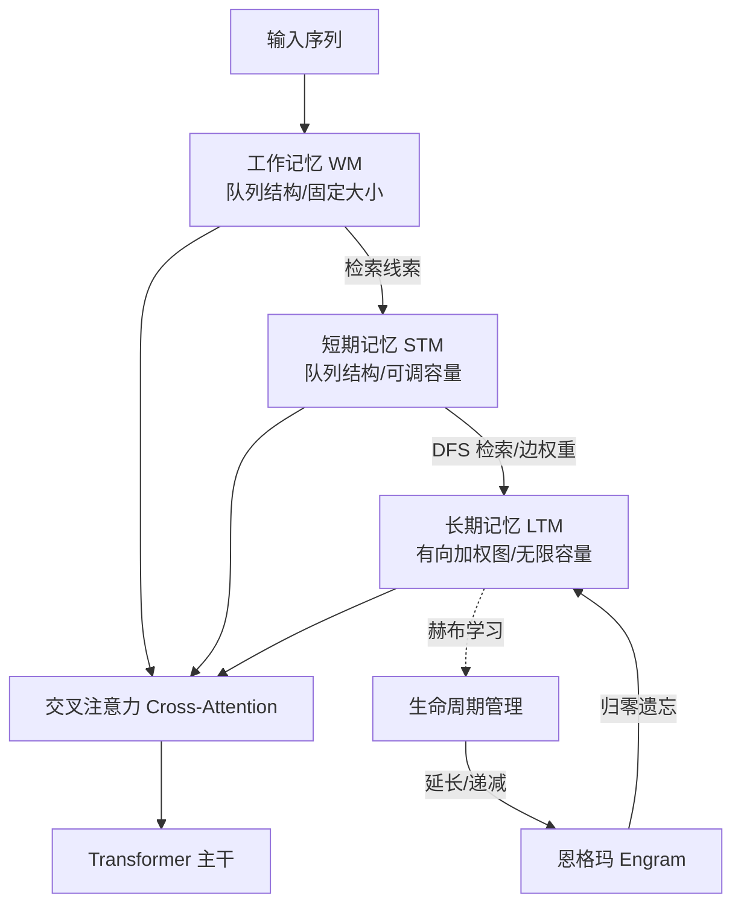
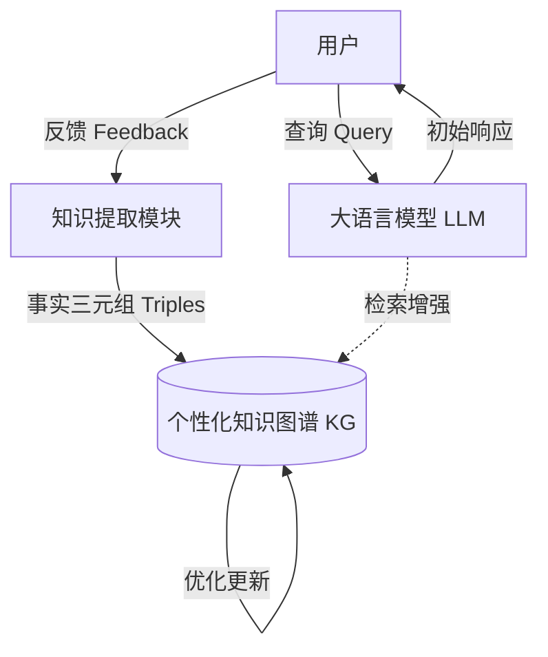
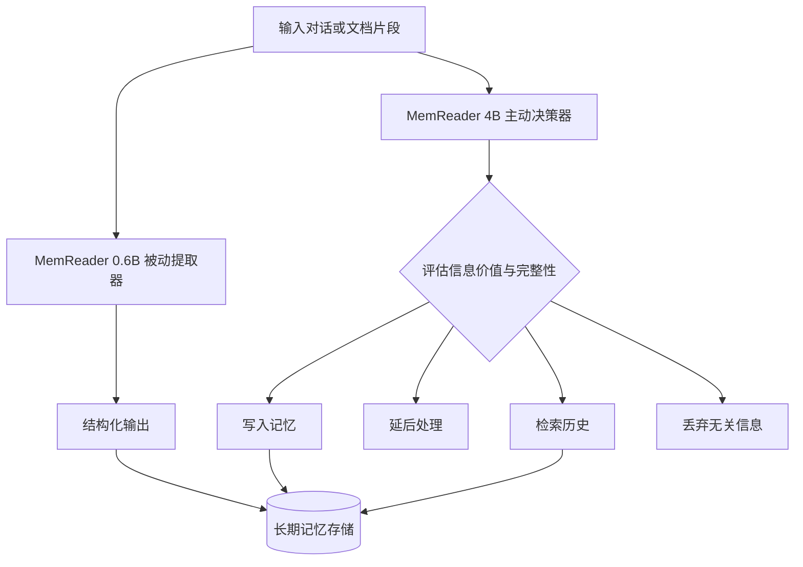
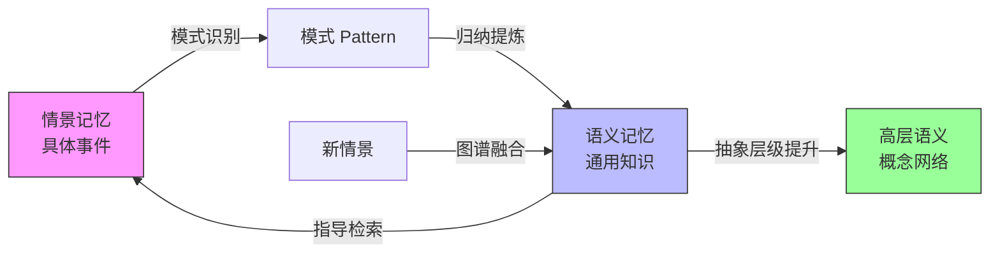

# 第7章 情景记忆与语义记忆

> **本章摘要**：本章深入探讨 Agent Memory 中两大核心功能维度——情景记忆（Episodic）与语义记忆（Semantic）。我们首先从认知心理学理论出发，界定两类记忆的定义、特征与存储模式，然后结合 MemoryBank、RecurrentGPT、Memoria、Lyfe Agents、Theanine 等论文案例，展示情景记忆在 Agent 系统中的工程实现。随后，我们转向语义记忆，分析知识图谱与向量空间两种表示范式，并通过 KGT、Graph RAG、HippoRAG、AriGraph 等工作揭示语义记忆的结构化优势。最后，本章探讨情景与语义之间的转换机制——从具体事件到通用知识的抽象化路径，以及这一过程的不可逆性。全章使用第2章建立的三维正交分类体系进行统一分析。

---

## 7.1 情景记忆理论

### 7.1.1 情景记忆的定义与特征

情景记忆（Episodic Memory）是认知心理学中最基础的概念之一。Endel Tulving（1972）首次将其与语义记忆明确区分，定义为"对个人亲身经历的事件的记忆"。在 Agent Memory 的语境下，我们将情景记忆定义为：

> **情景记忆**是 Agent 对与用户或环境交互过程中产生的具体事件的持久化编码，包含时间戳、参与者、对话内容、行动序列等上下文信息。

用第2章的三维坐标来表述，情景记忆占据 **External（或 Token-level）载体 + Episodic 功能 + Formation/Retrieval 动态** 的坐标空间。

情景记忆具有以下四个核心特征：

**1. 时间戳绑定（Temporal Anchoring）**

每条情景记忆天然携带时间标记——它记录了"何时发生了什么"。这与语义记忆形成鲜明对比：语义记忆回答"猫是什么"，情景记忆回答"用户小明在 2024 年 3 月 15 日告诉我他养了一只叫咪咪的猫"。时间是情景记忆的第一维度，没有时间戳的记忆就失去了"情景"的本质。

**2. 上下文绑定（Contextual Embedding）**

情景记忆不是孤立的事实，而是嵌入在特定的交互上下文中。它包含了事件的参与者（谁）、地点（在哪里）、方式（如何做）和情感基调（氛围如何）。这种上下文丰富性使情景记忆在检索时能够提供高度个性化的响应——Agent 不仅知道用户喜欢猫，还记得用户描述猫时的语气和表情。

**3. 一次性写入（Write-Once Immutability）**

情景记忆本质上是不可变的——发生过的事件无法被"修改"，只能被新的记忆覆盖或关联。这与语义记忆的可编辑性形成对比：当用户从"我喜欢猫"变为"我对猫毛过敏"时，语义记忆中的用户偏好可以被更新，但情景记忆中"用户曾在某日表达对猫的喜爱"这一事件记录应当保留，因为它真实地发生过。

**4. 叙事性组织（Narrative Organization）**

情景记忆天然地以叙事方式组织——事件之间存在时间顺序和因果联系。这与人类回忆往事的方式一致：我们不会以随机顺序回忆一天中的事件，而是按照时间线讲述一个故事。

| 特征 | 情景记忆 | 语义记忆 |
|------|---------|---------|
| 时间绑定 | 强（精确时间戳） | 弱（去时间化） |
| 上下文 | 丰富（参与者、地点、情感） | 精简（概念与关系） |
| 可编辑性 | 低（一次性写入） | 高（可更新、可推理） |
| 组织方式 | 叙事（时间线、事件链） | 网络（知识图谱、向量空间） |
| 遗忘模式 | 自然衰减（细节先丢失） | 结构性淘汰（过时概念删除） |

### 7.1.2 情景记忆的存储与检索模式

情景记忆在工程实践中通常采用以下存储模式：

**扁平时间线（Flat Timeline）**

最简单的组织方式——按时间戳顺序存储事件记录。每条记忆包含：时间戳、事件描述、参与者、上下文摘要。检索时采用时间窗口过滤（"查找最近7天的记忆"）或结合语义相似度检索（"查找与'旅行'相关的记忆"）。

MemoryBank（2305.10250）采用的就是这种模式。它设计了三层存储结构：原始对话（Raw Dialogue）、每日总结（Daily Summary）和全局总结（Global Summary）。原始对话按时间戳存储，保留了最完整的情景信息；每日总结是对当天交互的浓缩；全局总结则是跨天的趋势性描述。检索时，系统使用 FAISS 向量索引对记忆进行语义匹配，同时结合艾宾浩斯遗忘曲线 $R = e^{-t/S}$ 进行时间衰减加权——越近的记忆权重越高，被频繁检索的记忆强度增强。

**层次聚合树（Hierarchical Aggregate Tree）**

更复杂的组织方式——将情景记忆组织为树状结构，根节点是全局摘要，叶子节点是原始事件，中间层是不同粒度的摘要。Aadharsh 等（2406.06124）提出的 HAT（Hierarchical Aggregate Tree）正是这种架构：叶子节点存储原始对话片段，父节点通过递归摘要函数聚合子节点内容，根节点是全局摘要。检索时，LLM 作为记忆代理在树中执行导航决策（上/下/左/右或终止），收集路径上的节点内容作为检索结果。

HAT 在 Multi-session-chat 数据集上的 BLEU-1 得分为 0.721，显著高于 BFS（0.652）和全量上下文（0.612），证明了层次化结构在情景记忆检索中的优势。

**事件图（Event Graph）**

最具表达力的组织方式——将事件建模为图节点，事件间的因果、时间、参与关系建模为边。这种方式使 Agent 不仅能回忆"发生了什么"，还能理解"为什么发生"和"之后又发生了什么"。

### 7.1.3 论文案例分析

**MemoryBank（2305.10250）：拟人化的情景记忆**

MemoryBank 是最早将认知心理学理论系统引入 Agent 情景记忆设计的工作之一。其核心创新在于三层记忆结构与遗忘曲线的结合：

- **存储**：原始对话按时间戳写入向量数据库（FAISS），LLM 同时生成每日总结和全局总结，形成"原始-每日-全局"三层情景存储。
- **更新**：记忆强度 $S$ 随时间指数衰减（$R = e^{-t/S}$），被召回时强度重置并增强 $S_{new} = S_{old} + \Delta S$，模拟人类的"复习"机制。
- **检索**：双塔架构——查询与记忆同时编码为向量，FAISS 执行近似最近邻检索，结合遗忘曲线权重排序。

在 15 个虚拟用户、10 天对话的评估中，MemoryBank 的中文记忆检索准确率超过 0.84，显著优于无记忆的基线模型。消融实验证明，遗忘机制和分层总结都不可或缺：移除遗忘会导致记忆冗余和检索噪声增加；移除分层总结会导致上下文过长、模型注意力分散。

**本体论定位**：External 载体 + Episodic/Factual 功能 + Formation/Retrieval/Evolution/Forgetting 动态。MemoryBank 覆盖了情景记忆的完整生命周期。

**RecurrentGPT（2305.13304）：循环式情景记忆**

RecurrentGPT 提出了一个有趣的视角——将 RNN 的循环计算机制通过 Prompt 工程迁移到 LLM 长文本生成中。其记忆系统包含两个层次：

- **短期记忆**：最近时间步的关键信息摘要（10-20 句），放入 Prompt 中由 LLM 每步更新。这对应于情景记忆中的"工作记忆"——当前活跃的交互上下文。
- **长期记忆**：基于 VectorDB 存储所有历史内容，通过语义检索召回相关段落。这对应于情景记忆的"情景存储"——持久化的事件记录。

RecurrentGPT 的架构模拟了认知心理学中的"双存储模型"——短期记忆处理当前任务，长期记忆存储历史经验。每步生成时，系统同时从短期记忆（最近上下文）和长期记忆（相关历史）中提取信息，确保生成的连贯性。

在 6 种小说体裁的评估中，RecurrentGPT 在有趣性和连贯性上显著优于基线：科幻类有趣性胜率达 94.7%，连贯性胜率在 60%-90% 以上。消融实验证明，移除短期记忆或长期记忆都会导致连贯性显著下降，验证了双存储机制的必要性。

**本体论定位**：External 载体 + Episodic 功能 + Formation/Retrieval 动态。RecurrentGPT 的情景记忆主要服务于长文本生成中的连贯性维持。

**Memoria（2310.03052）：三级记忆与恩格玛生命周期**

Memoria 从更底层的神经生物学视角出发，提出了三级记忆架构——工作记忆（WM）、短期记忆（STM）和长期记忆（LTM），以**恩格玛（Engram）**为记忆最小单位。

恩格玛是 Memoria 的核心创新——每个记忆单元包含内容、创建时间和生命周期值。生命周期受赫布学习（Hebbian Learning）原则驱动：被检索的恩格玛生命周期延长，未被检索的恩格玛生命周期递减至归零（遗忘）。这种机制使记忆系统能够在无限信息流中实现基于重要性的选择性保留。

在 Wikitext-103 上，Memoria 的 Perplexity 为 30.007，优于 Transformer-XL（31.459）。更重要的是，它在机器记忆中复现了人类心理学的首因效应、近因效应和时间邻近效应——这证明了其情景记忆机制在认知层面的合理性。

**本体论定位**：External 载体 + Episodic 功能 + Formation/Retrieval/Forgetting 动态。Memoria 的独特之处在于将"命运性遗忘"问题形式化，并通过恩格玛生命周期机制给出了系统性解决方案。

**Lyfe Agents（2310.02172）：低成本情景记忆**

Lyfe Agents 关注的是情景记忆的工程可行性问题。在 Generative Agents（Park et al., 2023）中，每个智能体的记忆流管理都需要频繁的 LLM 调用——评估记忆重要性、生成反思、检索相关记忆——导致计算成本极高，无法支持实时交互。

Lyfe Agents 的解决方案是"资源理性"（Resource-Rational）原则：仅在必要时使用高成本 LLM 过程，其余操作使用轻量级算法。其记忆系统采用"总结与遗忘"（Summarize-and-Forget）机制：

- 经验流中的事件先经过轻量级摘要模块，提取关键信息。
- 低优先级记忆被自动遗忘，仅保留高价值情景。
- LLM 仅用于复杂推理和对话生成，不用于常规记忆管理。

据论文声称，该方案将计算成本降低了 10-100 倍，同时保持了智能体的自主性与社交推理能力。

**本体论定位**：External 载体 + Episodic 功能 + Formation/Forgetting 动态。Lyfe Agents 的贡献在于证明了情景记忆系统可以在资源约束下高效运行。

**Theanine（2406.10996）：时间线增强检索**

Theanine 框架直击长周期对话中的核心痛点——传统向量检索的碎片化和近期偏差（Recency Bias）。它提出了三个阶段的情景记忆管理：

1. **记忆构建**：新记忆通过文本相似度找到潜在关联，LLM 判断因果关系（Cause、React 等），构建记忆图。为降低成本，仅链接每个连通分量中最近的关联记忆。
2. **时间线检索**：检索 Top-k 记忆后获取整个连通分量，按时间顺序解缠（Untangle）为线性时间线，再根据当前上下文进行精炼。
3. **响应生成**：结合精炼后的时间线，利用 CoT 推理生成回复。

Theanine 的创新在于"关系感知链接"（Relation-aware Linking）——不是简单地按文本相似度关联记忆，而是识别事件间的因果关系和时间顺序。这使得检索结果不再是碎片化的片段，而是连贯的事件叙事。

在 TeaFarm 反事实评估中，Theanine 的准确率达到 0.21（优于基线 0.18），在一致性指标上显著优于 COMEDY。消融实验证明，移除关系感知链接会导致性能显著下降，证明了因果关系优于单纯文本相似度。

**本体论定位**：External 载体 + Episodic 功能 + Formation/Retrieval/Association 动态。Theanine 的独特贡献在于将"关系感知链接"引入情景记忆的组织过程。

### 7.1.4 情景记忆的本体论定位

综合上述分析，情景记忆在本体论框架中的定位可总结为：

| 维度 | 坐标 | 说明 |
|------|------|------|
| **载体** | External | 持久化存储于向量数据库、图数据库或文件系统 |
| **功能** | Episodic | 记录交互事件与时间线索 |
| **动态** | Formation + Retrieval + Forgetting | 写入事件、按时间/语义检索、时间衰减淘汰 |

情景记忆在本体论类层级中的归属为：Memory -> ExternalMemory -> EpisodicMemory。它是 Agent 维持长期身份一致性和个性化交互的基础——没有情景记忆，Agent 就无法回答"我们上次聊了什么"。

---

## 7.2 语义记忆理论

### 7.2.1 语义记忆的定义与特征

语义记忆（Semantic Memory）存储的是去时间化的概念知识和它们之间的关系。Tulving（1972）将其定义为"对一般世界知识的记忆"——它不依赖于特定事件或经历，而是独立存在的概念网络。

在 Agent Memory 的语境下：

> **语义记忆**是 Agent 对概念、实体及其关联关系的结构化表示，支持跨事件的归纳、推理和知识迁移。

用第2章的三维坐标来表述，语义记忆占据 **External 载体 + Semantic 功能 + Association/Retrieval 动态** 的坐标空间。

语义记忆的核心特征：

**1. 去时间化（De-temporalization）**

语义记忆不记录"何时知道"，只记录"知道什么"。"猫是哺乳动物"这一知识不需要时间戳——它是普遍有效的。从情景记忆到语义记忆的转化，本质上是去除时间标记、提取通用模式的过程。

**2. 可累积性（Cumulativity）**

语义记忆是增量增长的——新知识可以与已有知识融合，形成更丰富的概念网络。每学习一个新概念，语义记忆不是简单地"追加"，而是将其嵌入到现有的概念层级中。

**3. 可推理性（Inferability）**

语义记忆的核心价值在于支持推理。如果 Agent 的语义记忆中包含"猫是哺乳动物"和"哺乳动物是温血动物"两条知识，它就可以推理出"猫是温血动物"——即使从未直接存储过这一事实。

| 特征 | 语义记忆 | 情景记忆 |
|------|---------|---------|
| 知识粒度 | 概念/关系 | 事件/叙事 |
| 时间依赖 | 无（去时间化） | 强（时间戳绑定） |
| 增长模式 | 累积融合 | 追加记录 |
| 推理能力 | 强（支持演绎/归纳） | 弱（仅支持类比） |
| 更新频率 | 中等（概念演化） | 高（每轮交互） |

### 7.2.2 语义记忆的表示：知识图谱 vs 向量空间

语义记忆的表示方式主要有两种范式：

**知识图谱（Knowledge Graph）**

知识图谱以实体（节点）和关系（边）的形式组织语义记忆。每个三元组 $(h, r, t)$ 表示一个事实——头实体 $h$ 通过关系 $r$ 与尾实体 $t$ 关联。

知识图谱的优势：
- **显式关系**：关系是显式存储的，支持精确的多跳推理。
- **可解释性**：每条知识都可追溯为具体的三元组，便于审计和编辑。
- **结构化查询**：支持 Cypher、SPARQL 等查询语言，可以表达复杂的查询意图。

知识图谱的局限：
- **构建成本高**：需要 LLM 或人工从文本中提取实体和关系，准确率难以保证。
- **刚性结构**：难以表达模糊的、概率性的关系。
- **扩展性挑战**：大规模图谱的存储和检索需要专门的图数据库。

**向量空间（Vector Space）**

向量空间将语义记忆编码为高维向量——每个概念对应嵌入空间中的一个点，语义相似度通过向量距离度量。

向量空间的优势：
- **隐式关系**：不需要显式定义关系，相似度自动反映语义关联。
- **构建成本低**：直接对文本进行嵌入编码即可。
- **高效检索**：FAISS 等 ANN 索引支持十亿级向量的毫秒级检索。

向量空间的局限：
- **推理能力弱**：无法直接执行多跳推理（"A 是 B 的朋友，B 是 C 的同事 → A 和 C 可能相识"）。
- **黑盒性**：向量空间中的关系不可解释，难以审计和编辑。
- **组合性差**：难以表达复杂的逻辑关系（"A 是 B 的父亲且 B 是 C 的母亲 → A 是 C 的外祖父"）。

两种范式并非互斥——越来越多的系统（如 HippoRAG、AriGraph）将两者结合：用知识图谱存储显式关系，用向量空间支持语义检索。

### 7.2.3 论文案例分析

**Knowledge Graph Tuning（2405.19686）：免训练的语义个性化**

KGT 提出了一个颠覆性的思路：**不修改 LLM 参数，仅优化外部知识图谱即可实现模型个性化**。

传统微调（Fine-tuning）需要通过反向传播更新模型权重，计算和显存成本高昂，且参数修改不可解释。KGT 反其道而行之：将用户特有的事实知识（如"我的狗只吃蔬菜"）提取为三元组存入外部知识图谱，推理时 LLM 检索增强。当用户反馈纠正了错误时，系统更新图谱而非模型参数。

该方法在 GPT-2、Llama2/3 上验证有效，显著提升了个性化性能，同时降低了延迟和显存消耗。核心价值在于提供了一种高效、可解释的在线学习路径——知识图谱的调整对人类可追溯、可理解。

**本体论定位**：External 载体 + Semantic 功能 + Formation/Evolution 动态。KGT 证明了语义记忆可以作为参数级知识的替代方案，实现实时个性化。

**Graph RAG（2404.16130）：从局部到全局的语义理解**

Microsoft Research 的 Graph RAG 解决了一个根本性问题：传统 Naive RAG 擅长检索局部片段（"文档中提到 X 的地方"），但无法回答全局性问题（"这份文档的主要主题是什么"）。

Graph RAG 的核心创新是**自生成图索引**（Self-Generated Graph Index）：

1. **索引构建**：将文档分块，LLM 提取实体、关系和声明，构建同质无向加权图。
2. **社区检测**：使用 Leiden 算法对图进行层次化社区检测（C0-C3 四级）。
3. **社区摘要**：为每个社区生成报告式摘要，形成层次化的语义概览。
4. **查询回答**：采用 Map-Reduce 策略——并行生成中间答案，按帮助度排序，迭代聚合为最终答案。

在全局感知任务上，Graph RAG 的全面性胜率比 Naive RAG 高 72%-83%，多样性胜率提高 62%-82%。根节点社区摘要（C0）相比全文摘要减少 97% 以上的上下文 Token 消耗。

**本体论定位**：External 载体 + Semantic 功能 + Association/Retrieval 动态。Graph RAG 的独特贡献在于利用图的模块化结构进行数据分区和摘要生成，而不仅仅是检索。

**HippoRAG（2405.14831）：海马体启发的语义检索**

HippoRAG 受神经生物学的海马体索引理论启发，模拟人脑中新皮层（存储）与海马体（索引）的分工：

- **离线索引阶段**（新皮层模拟）：LLM 从文档中提取实体与关系，构建知识图谱。
- **在线检索阶段**（海马体模拟）：使用 Personalized PageRank（PPR）在图谱中检索相关上下文。

PPR 算法的关键优势在于：将查询映射为图谱上的起始节点，通过随机游走计算所有节点的相关性得分。这使单次检索即可获得多跳推理所需的全部上下文，无需迭代式检索。

在多跳问答任务上，HippoRAG 优于最先进方法达 20%，且效率提升 10-20 倍（速度提升 6-13 倍）。

**本体论定位**：External 载体 + Semantic/Factual 功能 + Association/Retrieval 动态。HippoRAG 证明了图谱结构的语义记忆可以实现高效的跨段落知识整合。

**AriGraph（2407.04363）：情景与语义的双图谱记忆**

AriGraph 的独特贡献在于明确区分了语义记忆和情景记忆，并将两者统一于知识图谱：

- **语义记忆层**：存储从环境中提取的通用知识（实体属性和关系）。
- **情景记忆层**：存储具体的交互事件和轨迹（谁在何时做了什么）。

Ariadne 智能体通过 LLM 从观察中提取三元组，实时更新图谱。在决策时，系统查询图谱获取相关状态信息，支持基于图的路径规划。

消融实验证明：仅使用语义记忆会导致推理能力减弱，仅使用情景记忆会导致泛化能力差——两者的结合是复杂决策的最优方案。

**本体论定位**：External 载体 + Semantic + Episodic 功能 + Formation/Retrieval/Association 动态。AriGraph 展示了语义记忆和情景记忆如何在同一图谱架构中共存并互补。

### 7.2.4 语义记忆的本体论定位

| 维度 | 坐标 | 说明 |
|------|------|------|
| **载体** | External | 持久化存储于知识图谱或向量数据库 |
| **功能** | Semantic | 组织概念关联与知识网络 |
| **动态** | Association + Retrieval | 建立跨记忆关联、图遍历检索 |

语义记忆在本体论类层级中的归属为：Memory -> ExternalMemory -> SemanticMemory。它是 Agent 进行知识推理和跨域迁移的基础——没有语义记忆，Agent 就无法回答"猫和狗有什么共同点"。

### 7.2.5 最新进展：主动提取范式

> **注**：本节基于 2026 年最新研究成果。

**MemReader（2604.07877）** — 从被动转录到主动决策的记忆提取

**背景**：长期记忆系统中的"记忆污染"与"低价值写入"问题。现有系统（如 Mem0、Zep）多为一次性被动转录——将对话内容直接提取并写入记忆，难以处理噪声对话、缺失引用和跨轮依赖，导致记忆质量下降。

**方案**：MemReader（2604.07877）提出了从"被动转录"到"主动提取"的范式转变，设计了双模型协同架构：

1. **被动提取器（MemReader-0.6B）**：蒸馏后的轻量模型，负责生成准确且模式一致的结构化输出，计算成本低。
2. **主动决策器（MemReader-4B）**：经过群相对策略优化（GRPO），在 ReAct 范式下评估信息价值，决定写入记忆、延后处理、检索历史还是丢弃无关信息。

**关键结果**：
- 在知识更新、时间推理和幻觉减少任务上达到 SOTA
- 0.6B 模型提供低成本结构化输出，4B 模型按需调用，平衡成本与效果
- 已集成至 MemOS 系统，提供公共 API 访问

**工程启示**：双模型架构在实际服务中需做好路由策略——不是所有请求都经过 4B 模型。应在高不确定性场景（信息模糊、跨轮依赖、引用缺失）时触发主动决策，常规场景使用被动提取。触发条件的设计是平衡延迟与质量的关键。

**本体论定位**：MemReader 属于 **External 载体 + Episodic/Semantic 功能 + Formation/Evolution 动态**。其被动提取器负责将非结构化对话转化为结构化 Episodic/Semantic 记忆（Formation），主动决策器则通过价值评估实现记忆的增量更新与噪声过滤（Evolution）。

---

## 7.3 情景与语义的转换

### 7.3.1 从情景到语义的抽象化

人类记忆系统的一个核心能力是将具体的情景记忆转化为抽象的语义记忆。你不需要记得每次看到猫的具体场景，但你确实知道"猫是哺乳动物"——这一知识是从无数次具体的"看到猫"的经历中抽象而来的。

在 Agent 系统中，这一过程称为**记忆巩固**（Memory Consolidation）或**抽象化**（Abstraction）。其基本机制是：

1. **模式识别**：从多条情景记忆中识别重复出现的模式。
   - 情景 1："用户 A 在 3 月 1 日提到他喜欢猫"
   - 情景 2："用户 A 在 3 月 10 日给猫买了食物"
   - 情景 3："用户 A 在 3 月 20 日分享了猫的照片"
2. **归纳提炼**：将模式提炼为通用知识。
   - 语义知识："用户 A 养了一只猫并且喜欢它"
3. **写入语义存储**：将提炼的知识写入语义记忆，同时保留原始情景记录。

Aadharsh 等（2406.06124）的层次聚合树（HAT）本质上实现了这一抽象化过程：叶子节点存储原始情景，父节点通过递归摘要聚合子节点内容——每一层都是一次抽象化，越靠近根节点，知识越通用、越去时间化。

Rezazadeh 等（2410.14052）的 MemTree 进一步深化了这一思路。MemTree 使用在线自顶向下（OTD）聚类算法，支持记忆的实时增量更新。新信息进入时，系统根据语义相似度决定插入位置，并更新路径上的父节点摘要。深度自适应阈值机制确保深层聚类紧密、浅层聚类宽泛——这与人类记忆中"具体事件"到"通用概念"的层次化结构高度一致。

在 MSC-E 长对话评估中，MemTree 的准确率达到 82.1%，显著优于 MemoryStream（78.5%），并且支持实时插入（平均 10 秒/次），无需像 RAPTOR 那样耗时 1 小时以上全量重构。

### 7.3.2 转换机制的工程实现

情景记忆到语义记忆的转换在工程上可以通过以下机制实现：

**层次化摘要（Hierarchical Summarization）**

MemoryBank 的三层结构（原始对话 → 每日总结 → 全局总结）就是一种层次化摘要。原始对话保留完整情景，每日总结提取当天的关键主题，全局总结则提炼跨天的用户画像和趋势。每一层的生成都是一次抽象化。

**社区聚合（Community Aggregation）**

Graph RAG 的层次化社区摘要（C0-C3）提供了另一种路径：叶子级的实体和关系通过社区检测被聚合为高层级的语义主题。C3 层保留了最多的细节，C0 层则提供了全局概览。

**图谱融合（Graph Fusion）**

AriGraph 的图谱融合机制将新情景增量整合到现有语义图谱中：提取新事件中的实体和关系，如果实体已存在则更新属性，如果是新实体则创建节点并建立关联。这一过程使情景记忆逐步融入语义记忆。

### 7.3.3 转换的不可逆性

情景记忆向语义记忆的转换是**不可逆**的。一旦"用户 A 在 3 月 1 日提到他喜欢猫"这一情景被抽象为"用户 A 养猫"这一语义知识，原始情景中的细节（用户当时的语气、上下文、情感色彩）就永久丢失了。

这体现了**抽象化不可逆**的原则——信息一旦从一种形态转换为另一种形态（从具体情景到抽象语义），原始形态的细节无法完全恢复。这与遗忘不可逆公理（公理 5）不同：公理 5 关注信息被删除后的不可恢复性，而此处关注的是信息被转换后原始细节的丢失。

不可逆性的工程含义：
- **保留原始情景**：在抽象化的同时，必须保留原始情景记忆。语义记忆是情景记忆的"快照"，不应替代情景记忆。
- **控制抽象粒度**：过度抽象会丢失有价值的细节，抽象不足会导致语义记忆臃肿。需要在"概括"与"具体"之间找到平衡。
- **双向索引**：语义记忆中的每个节点应当可以反向链接到生成它的情景记忆，使 Agent 在需要时可以"追溯"到原始事件。

MemTree 的"折叠树检索"机制提供了一个优雅的解决方案：检索时将树的所有节点（从根到叶子）扁平化为集合进行匹配。这样，查询既可以匹配高层语义节点（抽象概念），也可以匹配叶子节点（具体事件），实现了情景与语义的统一检索。

### 7.3.4 论文案例分析

**Hierarchical Aggregation（2406.06124）**

HAT 的递归摘要聚合函数是情景-语义转换的直接实现：子节点的原始对话被聚合为父节点的摘要，父节点的摘要进一步被聚合为祖父节点的更高层摘要。LLM 作为记忆代理在树中执行条件化遍历，根据查询的语义需求决定检索的深度——需要细节时下探到叶子，需要概览时停留在高层。

在 Multi-session-chat 数据集上，HAT 的 BLEU-1 得分为 0.721（优于全量上下文的 0.612），记忆生成保真度的 BLEU-1 达 0.842、F1 达 0.824。这证明了层次化抽象在保留关键信息的同时有效压缩了上下文。

**Hierarchical Schemas（2410.14052）**

MemTree 通过在线自顶向下聚类实现了动态的情景-语义转换。与 HAT 的离线构建不同，MemTree 支持实时更新——新信息可以随时插入树结构，父节点内容随之聚合更新。深度自适应阈值机制确保树的结构既不过深（细节过度碎片化）也不过浅（语义过度压缩）。

在 QuALITY 长文档问答中，MemTree 的准确率为 59.8%，接近离线最优方法 RAPTOR（59.0%）和 GraphRAG（62.8%），但关键优势在于支持实时更新——而 RAPTOR 和 GraphRAG 都需要全量重构。

---

## 7.4 本章小结

- **情景记忆是 Agent 的"自传式记忆"**。它以时间戳和上下文为特征，记录具体的交互事件。MemoryBank 的遗忘曲线、RecurrentGPT 的长短期记忆、Memoria 的恩格玛生命周期、Lyfe Agents 的低成本总结、Theanine 的时间线检索，分别从不同角度展示了情景记忆的工程实现路径。
- **语义记忆是 Agent 的"知识库"**。它以概念和关系为核心，支持跨事件的归纳与推理。KGT 证明了免训练的语义个性化是可行的，Graph RAG 揭示了图谱结构在全局理解中的优势，HippoRAG 展示了海马体启发检索的高效性，AriGraph 实现了情景与语义的双图谱融合。
- **知识图谱与向量空间是语义记忆的两种主要表示范式**。知识图谱支持显式关系推理和可编辑性，向量空间支持高效检索和隐式关联。两者的混合使用（如 HippoRAG 的 KG + PPR）是当前趋势。
- **情景记忆向语义记忆的转换是一个抽象化过程**。通过层次化摘要、社区聚合和图谱融合等机制，具体的事件记录被提炼为通用的概念知识。HAT 的递归摘要和 MemTree 的在线聚类是这一过程的工程实现。
- **转换是不可逆的**。抽象化过程中丢失的细节无法恢复，因此在提取语义记忆的同时必须保留原始情景记录，并建立双向索引。
- **两类记忆在本体论中的坐标明确区分**：情景记忆为 External + Episodic + Formation/Retrieval，语义记忆为 External + Semantic + Association/Retrieval。理解这一区分有助于在系统设计中做出正确的架构选择。
- **情景与语义的协同是复杂 Agent 系统的核心**。如 AriGraph 的消融实验所示，仅依赖语义记忆会减弱推理能力，仅依赖情景记忆会降低泛化能力——两者的结合才是最优方案。

---

## 7.5 延伸阅读

### 情景记忆

1. **Zhong, W. et al. (2023).** "MemoryBank: Enhancing Large Language Models with Long-Term Memory." arXiv:2305.10250. —— 将艾宾浩斯遗忘曲线引入 LLM 记忆管理的奠基性工作。
2. **Zhou, W. et al. (2023).** "RecurrentGPT: Interactive Generation of (Arbitrarily) Long Text." arXiv:2305.13304. —— 通过 Prompt 工程模拟 RNN 循环机制，实现长短期记忆的协同。
3. **Park, S. & Bak, J. (2023).** "Memoria: Resolving Fateful Forgetting Problem through Human-Inspired Memory Architecture." arXiv:2310.03052. —— 引入恩格玛和赫布学习的三级记忆架构。
4. **Kai, Z. et al. (2023).** "Lyfe Agents: Generative agents for low-cost real-time social interactions." arXiv:2310.02172. —— 资源理性原则下的低成本情景记忆管理。
5. **Ong, K. T. et al. (2024).** "Towards Lifelong Dialogue Agents via Timeline-based Memory Management." arXiv:2406.10996. —— 时间线增强检索与反事实评估的创新方法。

### 语义记忆

6. **Sun, J. et al. (2024).** "Knowledge Graph Tuning: Real-time Large Language Model Personalization based on Human Feedback." arXiv:2405.19686. —— 免训练、可解释的语义个性化方案。
7. **Edge, D. et al. (2024).** "From Local to Global: A Graph RAG Approach to Query-Focused Summarization." arXiv:2404.16130. —— 利用图的模块化结构实现全局语义理解。
8. **Gutiérrez, B. J. et al. (2024).** "HippoRAG: Neurobiologically Inspired Long-Term Memory for Large Language Models." NeurIPS 2024. arXiv:2405.14831. —— 海马体启发的单次多跳检索框架。
9. **Anokhin, P. et al. (2024).** "AriGraph: Learning Knowledge Graph World Models with Episodic Memory for LLM Agents." arXiv:2407.04363. —— 情景与语义双图谱融合的智能体记忆。

### 情景-语义转换

10. **Aadharsh, A. A. et al. (2024).** "Enhancing Long-Term Memory using Hierarchical Aggregate Tree for Retrieval Augmented Generation." arXiv:2406.06124. —— 层次聚合树与 LLM 代理遍历。
11. **Rezazadeh, A. et al. (2024).** "From Isolated Conversations to Hierarchical Schemas: Dynamic Tree Memory Representation for LLMs." arXiv:2410.14052. —— 在线增量更新的动态树状记忆。

### 理论背景

12. **Tulving, E. (1972).** "Episodic and semantic memory." —— 情景记忆与语义记忆的经典区分。
13. **Baddeley, A. (2000).** "The episodic buffer: a new component of working memory?" Trends in Cognitive Sciences. —— 工作记忆的多组件模型。

---

## 7.6 框架深度剖析：情景与语义记忆的提取和分类

### 7.6.1 Mem0 — LLM 编排的 ADD/UPDATE/DELETE 生命周期

**问题**：如何从非结构化对话中自动提取结构化记忆，并与已有记忆去重、合并、更新？

**方案**：Mem0 使用 LLM-as-Orchestrator 四阶段管道：(1) LLM 提取事实；(2) 向量搜索已有记忆；(3) LLM 决定 ADD/UPDATE/DELETE；(4) 执行操作 + 嵌入更新。三级作用域（user_id → agent_id → run_id）实现记忆隔离。

**代码路径**：
- `mem0/memory/main.py` — Memory 类 (L257-1400)
- `mem0/memory/graph_memory.py` — Neo4j 图记忆 (L29-745)
- `mem0/configs/prompts.py` — 用户/Agent 记忆提取提示 (L61-173)

**设计模式**：
- Provider 插件模式：LLM/Embedding/VectorStore/GraphStore/Reranker 全部可插拔
- Graph + Vector 混合：向量相似度 + 图关系提取 + BM25 重排序
- 软删除：图边标记 `valid=false` + `invalidated_at`，支持时序推理
- mentions 计数器跟踪频率权重

**与本章理论映射**：
- Mem0 的 ADD/UPDATE/DELETE 对应本体论的 Formation/Update/Forgetting 操作
- 三级作用域对应 `MemoryCarrier` 的层级组织（user → agent → run）
- 软删除实现了情景记忆的"时间戳"特性——记忆不消失，而是标记有效期

### 7.6.2 LangMem — Hot Path + Background 双模式提取

**问题**：LLM 提取延迟高（1-3s），如何既保证实时性又不丢失后台巩固？

**方案**：LangMem 实现双模式：(1) Hot Path — Agent 通过工具调用在对话中主动管理记忆；(2) Background — MemoryManager + ReflectionExecutor 在后台自动提取和巩固。

**代码路径**：
- `src/langmem/knowledge/extraction.py` — MemoryManager (L217-693)
- `src/langmem/knowledge/tools.py` — create_manage_memory_tool (L25-356)
- `src/langmem/reflection.py` — ReflectionExecutor (L110-141)

**设计模式**：
- trustcall 进行 schema 驱动的记忆提取，保证输出格式一致性
- ReflectionExecutor 后台线程优先级队列，每线程任务去重，支持 `after_seconds` 防抖
- 命名空间模板化实现运行时用户/租户隔离

### 7.6.3 Deer Flow — 结构化 LLM 提取带置信度

**问题**：如何区分用户明确陈述的事实和 Agent 推断的事实？

**方案**：Deer Flow 使用 LLM 提取带置信度评分的结构化事实：明确陈述 0.9-1.0，强烈暗示 0.7-0.8，推断 0.5-0.6。记忆按时间扇区组织（recent months → earlier context → long-term background）。

**代码路径**：
- `packages/harness/deerflow/agents/memory/updater.py` — LLM 提取 (L255-473)
- `packages/harness/deerflow/agents/memory/storage.py` — 文件存储 (L42-206)

## 7.7 工程决策卡片

| 维度 | 选项A: LLM提取 | 选项B: 规则分类 | 选项C: Agent自管理 | 推荐场景 |
|------|--------------|---------------|------------------|---------|
| 延迟 | 高(1-3s) | 极低(<100ms) | 中 | 实时选B/C |
| 质量 | 高（语义理解） | 中（模式匹配） | 中-高 | 质量敏感选A |
| LLM成本 | 每次提取调用LLM | 无需LLM | 按需调用 | 成本敏感选B |
| 适应性 | 高（泛化能力强） | 低（需维护规则） | 中 | 多场景选A |

**LLM 提取最佳实践**（Mem0 + Redis AMS 经验）：
1. 上下文锚定：提取时消解代词、时间引用（"我喜欢它" → "用户喜欢 Python 列表推导式"）
2. 原子性：每条记忆只包含一个概念（~300-400 词）
3. Schema 驱动：使用 Pydantic/JSON Schema 约束输出格式
4. 对比已有记忆：提取前先搜索，避免重复

## 7.8 反模式与陷阱

| 反模式 | 问题 | 正确做法 | 来源 |
|--------|------|---------|------|
| 不消解代词引用 | "他/它/那里" 在检索时无法理解 | 上下文锚定提取——具体化所有代词 | Mem0 经验 |
| 无三级去重 | 大量重复记忆，检索精度下降 | ID → Hash → 语义三级去重 | Redis AMS 设计 |
| 同步 LLM 提取阻塞响应 | 用户等待 1-3s 才能看到回复 | 后台防抖队列，不阻塞主循环 | LangMem + Deer Flow |
| 纯向量存储无关系 | 无法推理"用户 A 是用户 B 的同事" | 引入图谱存储关系 | Mem0 Graph+Vector 混合 |
