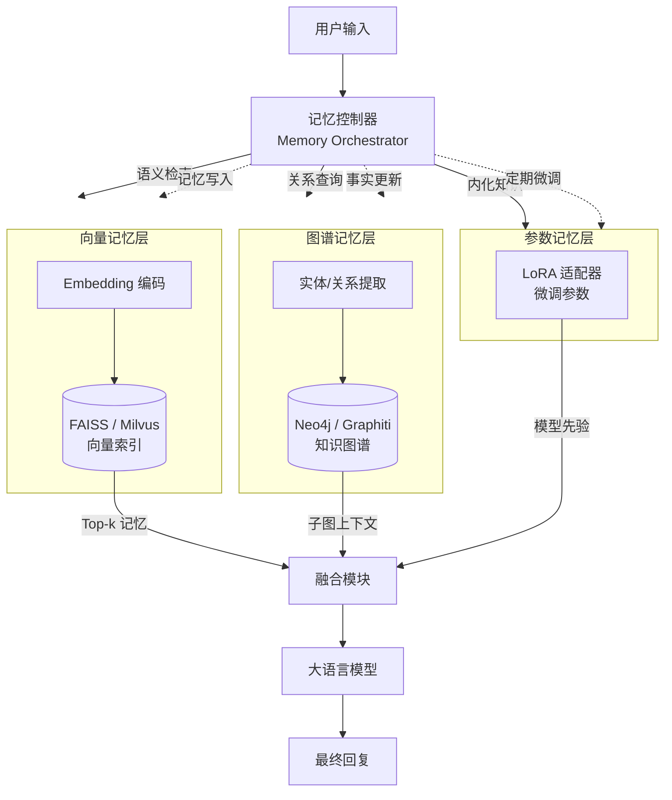
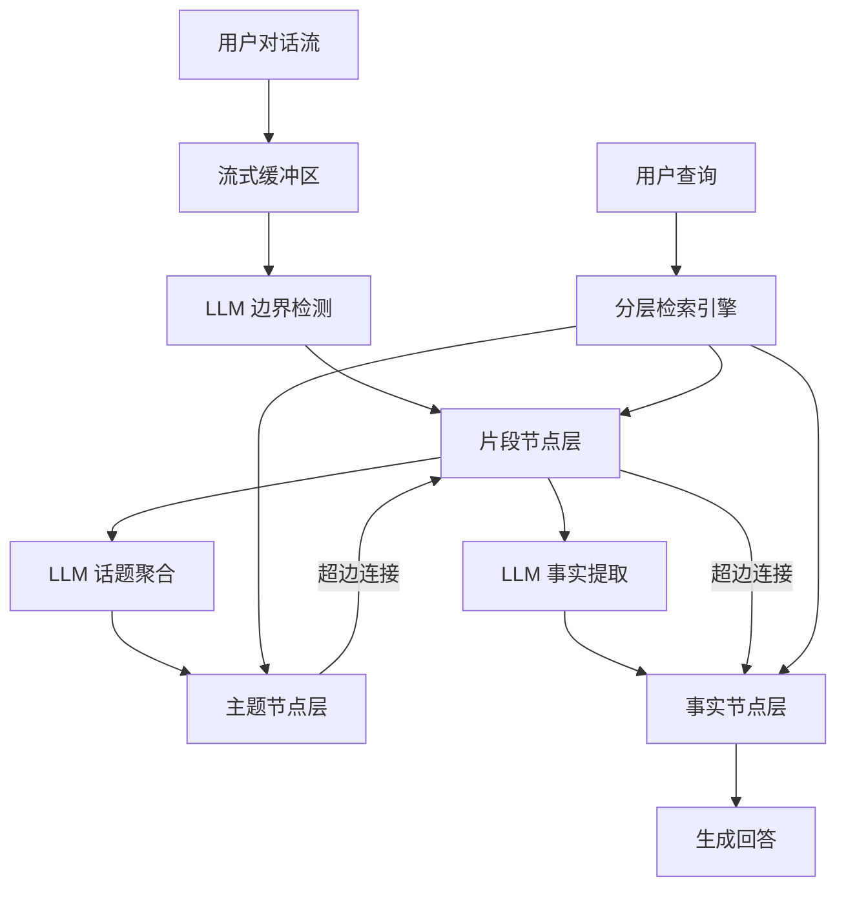
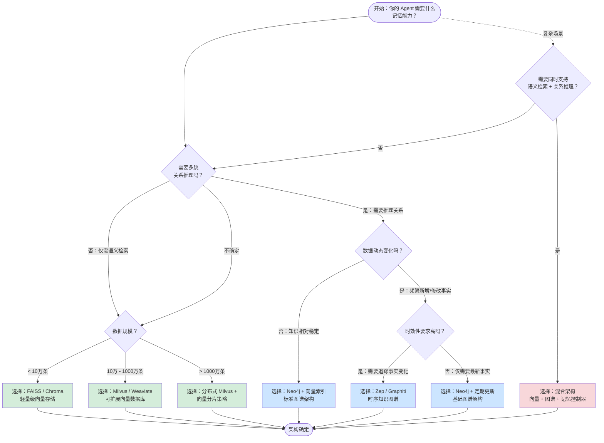
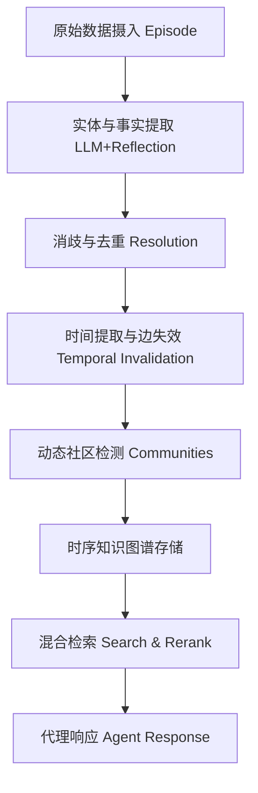

# 第8章 记忆存储架构选型（实践章）

> **本章摘要**：本章从理论走向实践，为 Agent Memory 系统的存储架构选型提供系统化的决策框架。我们首先对比向量数据库、知识图谱和混合架构三种存储范式，给出架构对比决策矩阵。随后，通过决策树流程图引导读者根据自身场景做出架构选择。在实现方案部分，我们提供基于向量库的 RAG 记忆系统和基于知识图谱的结构化记忆的代码骨架，并探讨跨模态记忆的架构设计——涵盖 Zep 的时序知识图谱、Video-RAG 的视觉对齐检索和 Time-VLM 的多模态融合。本章是全书的实践核心，读者可以直接基于本章提供的代码骨架搭建自己的记忆系统。

---

## 8.1 三种存储范式对比

### 8.1.1 向量数据库范式

向量数据库是当前 Agent Memory 领域最主流的存储载体。它属于第2章本体论中的 **External 载体 + Factual/Episodic 功能 + Retrieval 动态** 坐标。

**核心原理**：将文本通过嵌入模型（Embedding Model）编码为高维向量（通常 768-4096 维），存储于向量索引中。检索时，将查询编码为向量，通过近似最近邻（ANN）算法找到语义最相似的向量。

**主流工具对比**：

| 工具 | 类型 | 最大规模 | 索引算法 | 适用场景 | 运维复杂度 |
|------|------|---------|---------|---------|-----------|
| **FAISS** | 库（In-Memory） | 十亿级 | IVF, PQ, HNSW | 原型开发、中小规模 | 低（纯 Python/C++ 库） |
| **Milvus** | 分布式数据库 | 十亿级 | HNSW, IVF_FLAT, DiskANN | 大规模生产环境 | 中（需部署集群） |
| **Chroma** | 嵌入式数据库 | 百万级 | HNSW | 轻量级应用、原型 | 极低（pip install 即可） |
| **Pinecone** | 托管云服务 | 十亿级 | 专有索引 | 快速上线、免运维 | 无（全托管） |
| **Weaviate** | 混合数据库 | 亿级 | HNSW + BM25 | 需要混合检索 | 中 |

**适用场景**：
- 语义相似度检索（"查找与当前查询最相关的记忆"）
- 情景记忆的存储与召回（对话历史、事件记录）
- 快速原型验证和中小规模部署

**局限性**：
- **缺乏显式关系**：向量空间只能度量"相似"，不能表达"A 是 B 的朋友"这样的结构化关系。
- **多跳推理困难**：无法直接执行"找到用户的朋友的朋友"这样的多跳查询。
- **更新不精确**：向量嵌入是整体编码，修改记忆中的部分内容需要重新嵌入整条记录。
- **语义漂移**：嵌入模型的质量直接影响检索效果，不同语言、不同领域的嵌入模型表现差异显著。

```python
# FAISS 基础用法骨架
import faiss
import numpy as np
from sentence_transformers import SentenceTransformer

class VectorMemory:
    def __init__(self, dim: int = 768):
        self.model = SentenceTransformer('all-MiniLM-L6-v2')
        # IVF 索引：先聚类再搜索，适合大规模
        self.index = faiss.IndexIVFFlat(
            faiss.IndexFlatL2(dim),
            dim, nlist=100,
            faiss.METRIC_L2
        )
        self.memories = []  # 存储原始文本
        self.metadata = []  # 存储元数据（时间戳、重要性等）
        self.is_trained = False

    def add(self, text: str, meta: dict = None):
        """写入新记忆（Formation 操作）"""
        embedding = self.model.encode([text])
        if not self.is_trained:
            self.index.train(np.array([e for e in self._all_embeddings()]))
            self.is_trained = True
        self.index.add(embedding)
        self.memories.append(text)
        self.metadata.append(meta or {})

    def retrieve(self, query: str, k: int = 5) -> list:
        """语义检索（Retrieval 操作）"""
        q_embed = self.model.encode([query])
        distances, indices = self.index.search(q_embed, k)
        results = []
        for dist, idx in zip(distances[0], indices[0]):
            if idx < len(self.memories):
                results.append({
                    'text': self.memories[idx],
                    'distance': float(dist),
                    'meta': self.metadata[idx]
                })
        return results
```

### 8.1.2 知识图谱范式

知识图谱属于第2章本体论中的 **External 载体 + Semantic 功能 + Association/Retrieval 动态** 坐标。

**核心原理**：将知识表示为实体（节点）和关系（边）的集合，存储于图数据库或内存图结构中。查询通过图遍历（BFS、DFS、Cypher 查询）或图算法（PageRank、最短路径）执行。

**主流工具对比**：

| 工具 | 类型 | 查询语言 | 适用场景 | 运维复杂度 |
|------|------|---------|---------|-----------|
| **Neo4j** | 图数据库 | Cypher | 生产环境、复杂查询 | 中 |
| **NetworkX** | Python 图库 | Python API | 原型开发、小规模 | 极低 |
| **Graphiti（Zep）** | 时序图引擎 | Cypher + 混合搜索 | 动态 Agent 记忆 | 中 |
| **NebulaGraph** | 分布式图数据库 | nGQL | 超大规模 | 高 |

**适用场景**：
- 需要显式关系推理的场景（"用户的朋友住在哪里"）
- 语义记忆的存储与查询（概念层级、属性关联）
- 动态演化的知识（Zep 的双时间线模型支持事实的时效性管理）

**局限性**：
- **构建成本高**：需要 LLM 或人工从文本中提取实体和关系，存在误差累积风险。
- **查询复杂性**：图查询语言的学习曲线较陡，复杂查询的编写和调试成本高。
- **模糊关系难表达**：难以表达"可能与"、"某种程度上"等模糊关系。
- **大规模性能**：节点和边数量超过百万级时，图遍历的性能可能成为瓶颈。

```python
# NetworkX 基础知识图谱骨架
import networkx as nx
from typing import List, Tuple

class GraphMemory:
    def __init__(self):
        self.graph = nx.MultiDiGraph()  # 支持多重有向边

    def add_fact(self, head: str, relation: str, tail: str,
                 meta: dict = None):
        """写入事实三元组（Formation 操作）"""
        self.graph.add_node(head, type='entity')
        self.graph.add_node(tail, type='entity')
        self.graph.add_edge(head, tail, relation=relation,
                           meta=meta or {})

    def query_neighbors(self, entity: str,
                        relation: str = None) -> List[Tuple]:
        """查询实体的邻居（Retrieval 操作）"""
        if relation:
            return [(u, v, d) for u, v, d in
                    self.graph.edges(entity, data=True)
                    if d.get('relation') == relation]
        return list(self.graph.edges(entity, data=True))

    def find_path(self, source: str, target: str,
                  max_depth: int = 3) -> List[List[str]]:
        """多跳路径查找（Association 操作）"""
        paths = []
        for path in nx.all_simple_paths(
            self.graph, source, target, cutoff=max_depth
        ):
            paths.append(path)
        return paths

    def pagerank(self, query_nodes: List[str],
                 alpha: float = 0.85) -> dict:
        """个性化 PageRank 排序（HippoRAG 式检索）"""
        # 将查询节点设为个人化向量
        personalization = {n: 0 for n in self.graph.nodes()}
        for n in query_nodes:
            if n in personalization:
                personalization[n] = 1.0
        total = sum(personalization.values())
        if total > 0:
            personalization = {k: v/total
                              for k, v in personalization.items()}
        return nx.pagerank(self.graph, alpha=alpha,
                          personalization=personalization)
```

### 8.1.3 混合架构范式

混合架构属于第2章本体论中的 **多载体组合 + 全功能覆盖** 坐标，对应本体论中描述的"混合多层架构"范式。

**核心原理**：同时使用向量数据库、知识图谱和参数记忆（微调/LoRA），通过中央记忆控制器（Memory Orchestrator）协调各组件间的 Formation、Retrieval、Consolidation 和 Forgetting 流程。

**典型架构**：



**适用场景**：
- 大规模、长生命周期的 Agent 系统（如 AI 伴侣、企业级智能助手）
- 需要同时支持语义检索和关系推理的复杂场景
- 有足够工程资源维护多层架构的团队

**复杂度与收益分析**：

| 维度 | 向量架构 | 图架构 | 混合架构 |
|------|---------|--------|---------|
| 工程复杂度 | 低 | 中 | 高 |
| 检索延迟 | 低（毫秒级） | 中（图遍历耗时） | 中-高（多组件串行/并行） |
| 推理能力 | 弱 | 强 | 最强 |
| 可解释性 | 低 | 高 | 中 |
| 维护成本 | 低 | 中 | 高 |
| 适用规模 | 中小 | 中-大 | 大-超大 |

**混合架构的关键设计决策**：
1. **路由策略**：什么样的查询走向量检索？什么样的查询走图谱查询？基于意图分类还是基于查询内容？
2. **融合策略**：多个来源的检索结果如何融合？加权求和？排序融合（RRF）？LLM 判断？
3. **一致性维护**：向量记忆和图谱记忆如何保持同步？当图谱更新时，向量索引是否需要重新嵌入？
4. **遗忘策略**：各层的遗忘机制是否一致？向量层的 TTL 淘汰与图层的节点删除如何协调？

### 8.1.4 最新进展：超图记忆架构

> **注**：本节基于 2026 年最新研究成果。

##### HyperMem — 三层超图结构的长对话记忆

**背景**：长程对话中的记忆碎片化与高阶关联缺失问题。传统 RAG 及图方法依赖成对关系（二元边），无法捕捉三个或更多元素间的高阶关联，导致检索碎片化。

**方案**：HyperMem（2604.08256）提出三层超图分层记忆结构：

1. **主题层（Topic）**：对话的高层主题聚合，LLM 语义相似度检索与分类决策，避免主题爆炸。
2. **片段层（Episode）**：时间连续的对话单元，基于缓冲区的 LLM 语义完整性判断边界检测。
3. **事实层（Fact）**：原子语义断言，LLM 识别原子断言与潜在查询模式。

超边（Hyperedge）连接同一主题下的片段及同一片段下的事实，突破了传统图边仅连接两个节点的限制。检索时从主题层开始，逐层下钻至事实层（由粗到细策略）。



**关键结果**：
- LoCoMo 基准准确率达 92.73%，超越最强基线（MIRIX 85.38%）6.24%
- Token 消耗仅为 GraphRAG 的 1/25 ~ 1/35
- 消融实验：移除片段上下文下降 3.76%（片段层对时间推理最关键），移除主题检索仅降 0.72%（主要起索引引导作用）

**工程启示**：超图结构在处理非成对依赖关系上具有天然优势，可迁移至其他长文本任务。流式构建的延迟是最大瓶颈——可考虑异步处理或边缘计算部署。当前仅支持单用户场景，缺乏多代理隔离机制，需增加访问控制模块。

### 8.1.5 架构对比决策矩阵

以下决策矩阵帮助你快速评估三种范式的适配度：

| 评估维度 | 向量数据库 | 知识图谱 | 混合架构 |
|---------|-----------|---------|---------|
| 数据规模 < 10 万条 | 非常适合 | 适合 | 过度设计 |
| 数据规模 10 万 - 1000 万条 | 适合 | 非常适合 | 适合 |
| 数据规模 > 1000 万条 | 非常适合（分布式） | 需分布式图数据库 | 需完整基础设施 |
| 需要语义相似度检索 | 核心优势 | 需辅助向量索引 | 支持 |
| 需要多跳关系推理 | 不支持 | 核心优势 | 支持 |
| 需要实时更新 | 支持（增量嵌入） | 支持（增量边/节点） | 支持（各层独立更新） |
| 需要可解释性 | 低 | 高 | 中 |
| 团队规模 | 1-2 人 | 2-3 人 | 3-5 人 |
| 部署时间 | 天级 | 周级 | 月级 |
| 典型延迟 | 10-50ms | 50-500ms | 100-1000ms |

---

## 8.2 架构决策树

### 8.2.1 决策维度

架构选型不是"哪个最好"的问题，而是"哪个最适合你的场景"的问题。以下四个决策维度将引导你找到最优解：

**维度一：你的 Agent 需要回答什么问题？**

这决定了检索方式的本质需求：
- **"用户上次说了什么？"** → 语义相似度检索 → 向量数据库
- **"用户的朋友是谁？朋友的朋友住在哪里？"** → 多跳关系推理 → 知识图谱
- **"用户的偏好是什么？上次聊了什么？他们之间有什么关系？"** → 多维度查询 → 混合架构

**维度二：数据规模与增长速率？**

这决定了存储选型：
- **< 1 万条记忆，增长缓慢** → FAISS/Chroma（嵌入式，零运维）
- **1 万 - 100 万条，稳定增长** → Milvus/Weaviate（可扩展）
- **> 100 万条，高速增长** → 分布式 Milvus + Neo4j 集群

**维度三：延迟与一致性要求？**

这决定了索引策略：
- **低延迟优先（< 100ms）** → 向量索引优先，图谱仅用于离线分析
- **强一致性优先** → 图谱为主，向量索引作为辅助
- **平衡型** → 混合架构，查询路由根据意图动态选择

**维度四：团队工程能力？**

这决定了架构复杂度上限：
- **个人开发者 / 小团队** → 向量数据库（最低门槛）
- **中型团队（有后端经验）** → 知识图谱 + 向量索引
- **大型团队（有数据平台经验）** → 混合多层架构

### 8.2.2 决策树流程图



### 8.2.3 决策路径示例

**路径 A：AI 伴侣应用**

- 需要多跳推理？ → 否（主要需要语义检索和情景回忆）
- 数据规模？ → 每用户数百条对话，总用户量大 → 选择 Milvus（分布式向量数据库）
- 延迟要求？ → 中等（100-200ms 可接受）
- **最终选型**：Milvus + 时间衰减加权（借鉴 MemoryBank 的遗忘曲线）

**路径 B：企业知识助手**

- 需要多跳推理？ → 是（"产品的适用场景是什么？与竞品相比如何？"）
- 数据动态变化？ → 是（产品信息频繁更新）
- 时效性要求高？ → 是（需要追踪产品版本变更历史）
- **最终选型**：Zep / Graphiti（时序知识图谱），支持事实的 `valid_at` / `invalid_at` 时间线管理

**路径 C：研究型 Agent**

- 需要多跳推理？ → 是
- 需要语义检索？ → 也是
- 需要同时支持？ → 是
- **最终选型**：混合架构（向量 + 图谱 + 记忆控制器），如 HippoRAG 的 KG + PPR 模式 + FAISS 向量检索

---

## 8.3 实现方案对比

### 8.3.1 基于向量库的 RAG 记忆系统

这是最简单的记忆系统实现方案，适合快速原型和中小规模应用。

**架构概览**：

```
用户输入 → 嵌入编码 → FAISS 检索 → Top-k 记忆 → Prompt 组装 → LLM 生成 → 回复
                                    ↓
                              记忆写入（Formation）
```

**完整代码骨架**：

```python
"""
基于向量库的 RAG 记忆系统
架构：External 载体 + Factual/Episodic 功能 + Formation/Retrieval 动态
"""
import faiss
import numpy as np
import json
import time
from dataclasses import dataclass, field
from typing import List, Dict, Optional
from sentence_transformers import SentenceTransformer

@dataclass
class MemoryItem:
    """记忆条目"""
    id: str
    text: str
    embedding: Optional[np.ndarray] = None
    timestamp: float = field(default_factory=time.time)
    importance: float = 1.0
    access_count: int = 0
    metadata: Dict = field(default_factory=dict)

class RAGMemorySystem:
    """基于向量库的 RAG 记忆系统"""

    def __init__(self, dim: int = 384, index_type: str = "flat"):
        self.model = SentenceTransformer('all-MiniLM-L6-v2')
        self.memories: Dict[str, MemoryItem] = {}
        self.dim = dim
        self.memory_counter = 0

        # 初始化 FAISS 索引
        if index_type == "flat":
            self.index = faiss.IndexFlatIP(dim)  # 内积（余弦相似度）
        elif index_type == "ivf":
            quantizer = faiss.IndexFlatIP(dim)
            self.index = faiss.IndexIVFFlat(
                quantizer, dim, nlist=100,
                faiss.METRIC_INNER_PRODUCT
            )
            self.index_trained = False

        # 记忆 ID 到 FAISS 索引位置的映射
        self.id_to_index: Dict[str, int] = {}

    # ==================== Formation 操作 ====================

    def write(self, text: str, importance: float = 1.0,
              metadata: Dict = None) -> str:
        """写入新记忆（Formation）"""
        self.memory_counter += 1
        mem_id = f"mem_{self.memory_counter}"

        # 编码为向量
        embedding = self.model.encode([text])[0]
        # 归一化以使用内积计算余弦相似度
        embedding = embedding / np.linalg.norm(embedding)

        mem = MemoryItem(
            id=mem_id, text=text,
            embedding=embedding, importance=importance,
            metadata=metadata or {}
        )
        self.memories[mem_id] = mem

        # 添加到 FAISS 索引
        idx = len(self.id_to_index)
        self.id_to_index[mem_id] = idx
        self.index.add(embedding.reshape(1, -1))

        if hasattr(self, 'index_trained') and not self.index_trained:
            # IVF 索引需要训练
            if self.index.ntotal >= 100:
                self.index.train(
                    np.array([m.embedding for m in self.memories.values()])
                )
                self.index_trained = True

        return mem_id

    def batch_write(self, texts: List[str],
                    importances: List[float] = None) -> List[str]:
        """批量写入（适合初始化）"""
        ids = []
        embeddings = []
        for i, text in enumerate(texts):
            self.memory_counter += 1
            mem_id = f"mem_{self.memory_counter}"
            emb = self.model.encode([text])[0]
            emb = emb / np.linalg.norm(emb)
            imp = importances[i] if importances else 1.0
            mem = MemoryItem(id=mem_id, text=text,
                            embedding=emb, importance=imp)
            self.memories[mem_id] = mem
            ids.append(mem_id)
            embeddings.append(emb)

        idx_start = len(self.id_to_index)
        for i, mem_id in enumerate(ids):
            self.id_to_index[mem_id] = idx_start + i

        # IVF 索引需要先训练再加向量
        if hasattr(self, 'index_trained') and not self.index_trained:
            if self.index.ntotal >= 100 or len(embeddings) >= 100:
                self.index.train(np.array(embeddings))
                self.index_trained = True

        self.index.add(np.array(embeddings))
        return ids

    # ==================== Retrieval 操作 ====================

    def retrieve(self, query: str, k: int = 5,
                 min_importance: float = 0.0,
                 recency_weight: float = 0.3) -> List[Dict]:
        """检索记忆（Retrieval）

        结合语义相似度和时间衰减的混合排序：
        final_score = (1 - recency_weight) * similarity
                    + recency_weight * recency_score
        """
        q_emb = self.model.encode([query])[0]
        q_emb = q_emb / np.linalg.norm(q_emb)

        distances, indices = self.index.search(
            q_emb.reshape(1, -1), k * 2  # 多检索一些以便重排序
        )

        results = []
        for dist, idx in zip(distances[0], indices[0]):
            if idx >= len(self.memories):
                continue
            # 通过索引位置反向查找记忆 ID
            mem_id = None
            for mid, iidx in self.id_to_index.items():
                if iidx == idx:
                    mem_id = mid
                    break
            if mem_id is None:
                continue

            mem = self.memories[mem_id]
            if mem.importance < min_importance:
                continue

            # 时间衰减：越近的记忆得分越高
            age_hours = (time.time() - mem.timestamp) / 3600
            recency_score = np.exp(-age_hours / 168)  # 1 周半衰期

            # 混合排序
            final_score = ((1 - recency_weight) * float(dist)
                          + recency_weight * recency_score)

            mem.access_count += 1
            results.append({
                'id': mem_id,
                'text': mem.text,
                'score': final_score,
                'similarity': float(dist),
                'recency': recency_score,
                'importance': mem.importance,
                'metadata': mem.metadata
            })

        results.sort(key=lambda x: x['score'], reverse=True)
        return results[:k]

    # ==================== Evolution 操作 ====================

    def update_importance(self, mem_id: str, delta: float):
        """更新记忆重要性（Evolution，对应 MemoryBank 的强化机制）"""
        if mem_id in self.memories:
            self.memories[mem_id].importance += delta
            self.memories[mem_id].access_count += 1

    def update_text(self, mem_id: str, new_text: str):
        """更新记忆内容（需重新嵌入）"""
        if mem_id not in self.memories:
            return
        old = self.memories[mem_id]
        old.importance = 0  # 标记为待删除

        # 写入新记忆
        new_id = self.write(new_text,
                          importance=old.importance + 0.1,
                          metadata={**old.metadata,
                                   'updated_from': mem_id})
        return new_id

    # ==================== Forgetting 操作 ====================

    def forget(self, threshold: float = 0.1):
        """遗忘低重要性记忆（Forgetting）"""
        to_remove = []
        for mem_id, mem in self.memories.items():
            age_hours = (time.time() - mem.timestamp) / 3600
            # 结合时间衰减的重要性评分
            effective_importance = (mem.importance
                                   * np.exp(-age_hours / 720))  # 30 天半衰期
            if effective_importance < threshold:
                to_remove.append(mem_id)

        for mem_id in to_remove:
            # FAISS 不支持直接删除，需要重建索引
            del self.memories[mem_id]
            del self.id_to_index[mem_id]

        # 重建索引
        self._rebuild_index()
        return len(to_remove)

    def _rebuild_index(self):
        """重建 FAISS 索引（删除后）"""
        embeddings = []
        self.id_to_index = {}
        for i, (mem_id, mem) in enumerate(self.memories.items()):
            embeddings.append(mem.embedding)
            self.id_to_index[mem_id] = i

        if embeddings:
            self.index = faiss.IndexFlatIP(self.dim)
            self.index.add(np.array(embeddings))

    # ==================== 工具方法 ====================

    def build_context(self, query: str, k: int = 5,
                      max_tokens: int = 2000) -> str:
        """构建 LLM 上下文（记忆注入）"""
        memories = self.retrieve(query, k=k)
        context_parts = []
        total_tokens = 0
        for m in memories:
            part = f"[{m['id']}] (相关度: {m['score']:.3f}) {m['text']}"
            estimated_tokens = len(part) // 4
            if total_tokens + estimated_tokens > max_tokens:
                break
            context_parts.append(part)
            total_tokens += estimated_tokens

        return "\n".join(context_parts)

    def get_stats(self) -> Dict:
        """获取记忆系统统计信息"""
        total = len(self.memories)
        total_indexed = self.index.ntotal
        return {
            'total_memories': total,
            'indexed_memories': total_indexed,
            'total_accesses': sum(m.access_count for m
                                 in self.memories.values()),
            'avg_importance': (sum(m.importance for m
                                  in self.memories.values())
                             / total if total > 0 else 0)
        }
```

### 8.3.2 基于知识图谱的结构化记忆

适用于需要关系推理和语义记忆的场景。

**架构概览**：

```
用户输入 → 实体/关系提取 → 图谱查询/遍历 → 子图上下文 → Prompt 组装 → LLM 生成 → 回复
                                    ↓
                              事实写入（Formation）
```

**完整代码骨架**：

```python
"""
基于知识图谱的结构化记忆系统
架构：External 载体 + Semantic 功能 + Association/Retrieval 动态
"""
import networkx as nx
import json
import time
from dataclasses import dataclass, field
from typing import List, Dict, Optional, Tuple, Set
from collections import defaultdict

@dataclass
class Fact:
    """事实三元组"""
    head: str       # 头实体
    relation: str   # 关系
    tail: str       # 尾实体
    timestamp: float = field(default_factory=time.time)
    confidence: float = 1.0
    source: str = ""  # 来源（用户输入、系统推断等）
    valid_from: Optional[str] = None  # 有效起始时间（Zep 风格）
    valid_to: Optional[str] = None    # 有效截止时间

class GraphMemorySystem:
    """基于知识图谱的结构化记忆系统"""

    def __init__(self):
        self.graph = nx.MultiDiGraph()
        self.facts: List[Fact] = []
        self.entity_types: Dict[str, str] = {}  # 实体 -> 类型

    # ==================== Formation 操作 ====================

    def add_fact(self, head: str, relation: str, tail: str,
                 confidence: float = 1.0, source: str = "",
                 valid_from: str = None, valid_to: str = None):
        """添加事实三元组（Formation）"""
        fact = Fact(
            head=head, relation=relation, tail=tail,
            confidence=confidence, source=source,
            valid_from=valid_from, valid_to=valid_to
        )
        self.facts.append(fact)

        # 添加节点（如果不存在）
        if head not in self.graph:
            self.graph.add_node(head, created_at=time.time())
        if tail not in self.graph:
            self.graph.add_node(tail, created_at=time.time())

        # 添加边
        self.graph.add_edge(
            head, tail, relation=relation,
            confidence=confidence,
            created_at=time.time(),
            valid_from=valid_from,
            valid_to=valid_to
        )

    def add_facts_from_text(self, facts: List[Tuple[str, str, str]],
                            source: str = ""):
        """批量添加事实（通常由 LLM 提取）"""
        for head, relation, tail in facts:
            self.add_fact(head, relation, tail, source=source)

    # ==================== Temporal 操作（Zep 风格） ====================

    def invalidate_fact(self, head: str, relation: str, tail: str,
                        invalid_at: str):
        """使事实失效（Zep 的时间线失效机制）"""
        for u, v, key, data in self.graph.edges(head, keys=True,
                                                 data=True):
            if (data.get('relation') == relation
                and v == tail
                and data.get('valid_to') is None):
                data['valid_to'] = invalid_at

    def get_active_facts(self, entity: str,
                         at_time: str = None) -> List[Fact]:
        """获取某实体在指定时间点的活跃事实"""
        active = []
        for fact in self.facts:
            if fact.head != entity:
                continue
            if at_time and fact.valid_from and at_time < fact.valid_from:
                continue
            if at_time and fact.valid_to and at_time > fact.valid_to:
                continue
            active.append(fact)
        return active

    # ==================== Retrieval 操作 ====================

    def query_entity(self, entity: str,
                     relation: str = None) -> List[Dict]:
        """查询实体的关系（Retrieval）"""
        results = []
        if entity not in self.graph:
            return results

        for neighbor, data in self.graph[entity].items():
            # MultiDiGraph 的 data 是 dict of dicts
            for key, edge_data in data.items():
                rel = edge_data.get('relation', '')
                if relation and rel != relation:
                    continue
                results.append({
                    'head': entity,
                    'relation': rel,
                    'tail': neighbor,
                    'confidence': edge_data.get('confidence', 1.0)
                })

        # 反向查询（entity 作为 tail）
        for pred, _, data in self.graph.in_edges(entity, data=True):
            rel = data.get('relation', '')
            if relation and rel != relation:
                continue
            results.append({
                'head': pred,
                'relation': rel,
                'tail': entity,
                'confidence': data.get('confidence', 1.0)
            })

        return results

    def multi_hop_query(self, source: str, target: str,
                        max_depth: int = 3) -> List[Dict]:
        """多跳查询（Association）"""
        paths = []
        for path in nx.all_simple_paths(
            self.graph, source, target, cutoff=max_depth
        ):
            # 提取路径上的关系
            relations = []
            for i in range(len(path) - 1):
                u, v = path[i], path[i + 1]
                # 取第一条边的关系
                edge_data = list(self.graph[u][v].values())[0]
                relations.append(edge_data.get('relation', '?'))
            paths.append({
                'path': path,
                'relations': relations,
                'length': len(path) - 1
            })
        return paths

    def subgraph_around(self, entity: str,
                        max_depth: int = 2) -> nx.Graph:
        """获取实体周围的子图（用于构建 LLM 上下文）"""
        if entity not in self.graph:
            return nx.Graph()

        # BFS 获取邻居
        nodes = set()
        for node in nx.bfs_tree(self.graph, entity,
                                depth_limit=max_depth).nodes():
            nodes.add(node)

        return self.graph.subgraph(nodes)

    # ==================== HippoRAG 风格 PPR 检索 ====================

    def ppr_retrieve(self, query_entities: List[str],
                     alpha: float = 0.85,
                     top_k: int = 10) -> Dict[str, float]:
        """个性化 PageRank 检索（模拟 HippoRAG）"""
        if not query_entities:
            return {}

        # 构建个人化向量
        personalization = defaultdict(float)
        for entity in query_entities:
            if entity in self.graph:
                personalization[entity] = 1.0

        if not personalization:
            return {}

        total = sum(personalization.values())
        personalization = {k: v/total for k, v
                          in personalization.items()}

        scores = nx.pagerank(self.graph, alpha=alpha,
                            personalization=personalization)

        # 返回 top-k
        sorted_scores = sorted(scores.items(),
                              key=lambda x: x[1], reverse=True)
        return dict(sorted_scores[:top_k])

    # ==================== 上下文构建 ====================

    def build_context(self, query_entities: List[str],
                      max_depth: int = 2,
                      use_ppr: bool = False) -> str:
        """构建图谱上下文（注入 LLM Prompt）"""
        if use_ppr:
            # PPR 排序 + 事实提取
            scores = self.ppr_retrieve(query_entities)
            context_parts = []
            for entity, score in scores.items():
                facts = self.query_entity(entity)
                for f in facts:
                    context_parts.append(
                        f"({f['head']}) -[{f['relation']}]-> "
                        f"({f['tail']}) [得分: {score:.4f}]"
                    )
            return "\n".join(context_parts)
        else:
            # 子图提取
            all_facts = []
            for entity in query_entities:
                subgraph = self.subgraph_around(entity, max_depth)
                for u, v, data in subgraph.edges(data=True):
                    all_facts.append(
                        f"({u}) -[{data.get('relation', '?')}]-> ({v})"
                    )
            return "\n".join(set(all_facts))  # 去重

    # ==================== 统计信息 ====================

    def get_stats(self) -> Dict:
        return {
            'entities': self.graph.number_of_nodes(),
            'relations': self.graph.number_of_edges(),
            'facts': len(self.facts),
            'connected_components': nx.number_weakly_connected_components(
                self.graph
            )
        }
```

### 8.3.3 跨模态记忆：Video-RAG 与 Time-VLM

随着多模态 Agent 的发展，记忆系统需要处理的不再仅仅是文本，还包括图像、视频、时间序列等多种模态。以下是两个前沿案例。

**Video-RAG（2411.13093）：视觉对齐的检索增强**

Video-RAG 将 RAG 范式迁移至长视频理解领域。其核心思路是：不直接让 LVLM 处理整个视频（上下文窗口限制），而是通过外部工具链构建视觉对齐的辅助文本库，检索相关信息后注入上下文。

架构分为三阶段：

1. **查询解耦**：LVLM 将用户查询分解为具体的检索请求（需要 OCR？需要 ASR？需要物体检测？）。
2. **辅助文本生成与检索**：并行构建三个辅助文本数据库——OCR 文本（EasyOCR 提取）、ASR 文本（Whisper 转录）、DET 文本（APE 物体检测 + 场景图）。使用 Contriever 编码和 FAISS 检索。
3. **整合生成**：将检索到的辅助文本（约 2.0K tokens）与原视频帧、查询拼接，输入 LVLM 生成答案。

在 Video-MME 基准上，Video-RAG + 72B 模型得分 75.7%，超越 Gemini-1.5-Pro（75.0%）。消融实验证明，物体检测（DET）贡献最大（+10.1%），其次是 ASR（+0.9%）和 OCR（+1.4%）。

对记忆工程的启示：Video-RAG 的架构可以泛化为"多模态 RAG 记忆"——将不同模态的记忆（视觉、听觉、文本）分别编码和索引，按需检索并融合。

**Time-VLM（2502.04395）：多模态时间序列记忆**

Time-VLM 探索了将通用视觉-语言模型（VLM）应用于时间序列预测的多模态框架。其架构包含三个并行学习器：

- **检索增强学习器（RAL）**：提取时序局部与全局记忆特征。
- **视觉增强学习器（VAL）**：将时序转换为 64x64 图像，通过冻结的预训练 VLM 提取视觉嵌入。
- **文本增强学习器（TAL）**：生成包含统计特征、趋势、周期性的结构化文本，通过 VLM 提取文本嵌入。

最后通过跨模态多头注意力（CM-MHA）将多模态特征对齐并融合。消融实验表明，RAL 是性能基石（移除后 MSE 上升 35.6%），VAL 有效保留细粒度模式（+9.0%），TAL 贡献相对有限（+2.1%）。

对记忆工程的启示：Time-VLM 证明了同一数据源（时间序列）可以通过不同模态表示（视觉、文本）来丰富记忆的语义层次。在 Agent 记忆中，同样可以将一条情景记忆同时编码为文本描述、事件图像、统计特征等多种形式，通过跨模态融合提升检索和推理的鲁棒性。

**Zep（2501.13956）：时序知识图谱的工程实践**

Zep 将理论推向了生产级别。其核心引擎 Graphiti 采用双时间线模型（Bi-temporal Model），区分事件有效时间（valid_at）和系统交易时间（invalid_at）。当新事实与旧事实矛盾时，自动将旧边的 `invalid_at` 设置为新边的 `valid_at`，确保知识库时效性。



在 LongMemEval 基准上（平均 115k tokens/对话），Zep 将检索上下文从 115k tokens 压缩至 1.6k tokens（压缩率 98.6%），准确率提升 15.2%-18.5%，延迟降低约 90%。

Zep 的混合检索策略尤为值得借鉴：
- **余弦搜索**：基于向量相似度的语义检索。
- **BM25 全文搜索**：基于关键词的精确匹配。
- **BFS 图遍历**：基于关系结构的关联检索。
- **RRF/Cross-encoder 重排序**：融合多源结果。

**本体论定位**：Zep 占据 External 载体 + Semantic/Episodic 功能 + Formation/Retrieval/Evolution/Association 动态——它是目前最接近"全功能记忆系统"的开源实现。

### 8.3.4 实现方案对比总结

| 维度 | 向量 RAG 记忆 | 图谱结构化记忆 | 混合/跨模态记忆 |
|------|-------------|---------------|---------------|
| 代码量 | ~100 行 | ~150 行 | ~500+ 行 |
| 开发周期 | 1-2 天 | 3-5 天 | 2-4 周 |
| 依赖组件 | FAISS + Embedding 模型 | NetworkX / Neo4j | 多引擎 + 记忆控制器 |
| 检索延迟 | 10-50ms | 50-500ms | 100-1000ms |
| 推理能力 | 仅语义相似度 | 多跳关系推理 | 多跳 + 跨模态融合 |
| 典型场景 | 对话记忆、情景检索 | 用户画像、知识推理 | 企业级 Agent、多模态应用 |
| 代表系统 | MemoryBank | KGT, HippoRAG | Zep, Video-RAG |

---

---

## 8.6 案例链：为研究助手增加长期存储

> **提示**：本节是迷你案例链的第 2 阶段（V2）。如果你跟随 ch06 的案例链，你已经有一个带 `MemoryManager` 工作记忆的 `MemoryChain` 基类。本章将为其增加长期存储层。

### 8.6.1 VectorStore + GraphStore 实现

```python
import json
import os
import time
from dataclasses import dataclass, field
from typing import Optional

@dataclass
class MemoryEntry:
    """记忆条目——长期存储的最小单元"""
    id: str
    content: str
    memory_type: str  # "episodic" | "semantic" | "procedural"
    metadata: dict = field(default_factory=dict)
    created_at: float = field(default_factory=time.time)
    confidence: float = 0.5

class NoopVectorStore:
    """案例链 noop 实现——后续章节可替换为 FAISS/Chroma"""
    def store(self, entry: MemoryEntry): pass
    def search(self, query: str, limit: int = 5) -> list: return []

class SimpleVectorStore:
    """基于 TF-IDF 的轻量向量存储（无需外部依赖）"""
    def __init__(self, index_path: Optional[str] = None):
        self.entries: list[MemoryEntry] = []
        self.index_path = index_path
        if index_path and os.path.exists(index_path):
            self._load(index_path)

    def store(self, entry: MemoryEntry):
        self.entries.append(entry)
        if self.index_path:
            self._save()

    def search(self, query: str, limit: int = 5) -> list[MemoryEntry]:
        """简化的 TF-IDF 风格搜索"""
        query_words = set(query.lower().split())
        scored = []
        for entry in self.entries:
            words = set(entry.content.lower().split())
            union = query_words | words
            if not union:
                continue
            overlap = len(query_words & words) / len(union)
            scored.append((overlap, entry))
        scored.sort(reverse=True, key=lambda x: x[0])
        return [e for _, e in scored[:limit]]

    def _save(self):
        os.makedirs(os.path.dirname(self.index_path) or ".", exist_ok=True)
        data = [
            {**e.__dict__} for e in self.entries
        ]
        with open(self.index_path, "w") as f:
            json.dump(data, f, ensure_ascii=False, indent=2)

    def _load(self, path: str):
        with open(path) as f:
            data = json.load(f)
        self.entries = [
            MemoryEntry(**item) for item in data
        ]

class ConceptGraph:
    """轻量知识图谱——概念关系存储（基于 NetworkX）"""
    def __init__(self):
        try:
            import networkx as nx
            self.graph = nx.Graph()
            self._available = True
        except ImportError:
            self._available = False

    def add_concept(self, name: str, definition: str):
        if self._available:
            self.graph.add_node(name, definition=definition)

    def add_relation(self, concept_a: str, relation: str, concept_b: str):
        if self._available:
            self.graph.add_edge(concept_a, concept_b, relation=relation)

    def get_related(self, concept: str, depth: int = 2) -> dict:
        if not self._available:
            return {}
        try:
            import networkx as nx
            ego = nx.ego_graph(self.graph, concept, radius=depth)
            return dict(ego.nodes(data=True))
        except Exception:
            return {}

# ===== 案例链配置扩展 =====
@dataclass
class MemoryConfig:
    """案例链配置——每章实现对应的模块"""
    max_context_tokens: int = 8000
    max_injection_tokens: int = 2000
    # ch06 模块
    enable_working_memory: bool = True
    # ch08 模块（本章开启）
    enable_long_term_storage: bool = True
    storage_path: str = ".memory_chain"
    # 后续模块
    enable_retrieval: bool = False
    enable_reflection: bool = False

# ===== 案例链接口（继承 ch06 的基类） =====
# 注意：以下代码是 ch06 基类的扩展，需要与 ch06 的 MemoryChain 配合使用
# 在 ch06 中定义的 MemoryChain 基类在这里被继承扩展

def build_memory_chain_for_ch08(config: Optional[MemoryConfig] = None):
    """ch08 专用构建器——演示如何初始化存储层"""
    config = config or MemoryConfig()

    # 创建存储目录
    if config.enable_long_term_storage:
        os.makedirs(config.storage_path, exist_ok=True)
        vector_store = SimpleVectorStore(
            index_path=os.path.join(config.storage_path, "vector_index.json")
        )
        concept_graph = ConceptGraph()
    else:
        vector_store = NoopVectorStore()
        concept_graph = ConceptGraph()

    return {
        "vector_store": vector_store,
        "concept_graph": concept_graph,
        "config": config,
    }
```

**独立运行保证**：当 `enable_long_term_storage=True` 时，`build_memory_chain_for_ch08` 返回包含 `SimpleVectorStore` 和 `ConceptGraph` 的存储层。当 `enable_working_memory=True`（来自 ch06 的 `MemoryChain`）时，完整的记忆管理链路可用。

### 8.7 框架深度剖析：存储架构选型

#### 8.7.1 Memoria — Git-for-Data + Trust Tier 系统

**问题**：记忆变更后如何追溯？如何区分"用户明确说的"和"LLM 推断的"？

**方案**：Memoria 使用 MatrixOne 原生 COW（Copy-on-Write）引擎实现零拷贝快照/分支/合并，类比 Git for Data。同时实现 Trust Tier 系统：T1 Verified（用户明确，初始置信度 0.95，半衰期 365 天）→ T4 Unverified（推测，初始 0.40，半衰期 30 天）。

**代码路径**：
- `memoria/crates/memoria-core/src/types.rs` — Memory 结构 + TrustTier (L64-156)
- `memoria/crates/memoria-git/src/service.rs` — Git-for-Data 服务 (L50-306)
- `memoria/crates/memoria-service/src/governance.rs` — 治理策略 (L540-1470)

**置信度衰减公式**：`C(t) = C0 * exp(-age_days / half_life_days)`

**设计模式**：
- COW 引擎让记忆分支和实验零拷贝——你可以 fork 记忆库做实验，不污染主分支
- Trust Tier 将"谁说的"和"说了什么"绑定——同一事实因来源不同置信度差异巨大
- 衰减公式模拟人类遗忘曲线——不同类型记忆以不同速率衰退

**与本章理论映射**：
- Git-for-Data 对应本体论的 `Evolution` 操作——每次变更都是可追溯的记忆演化
- Trust Tier 对应 `Confidence` 属性——记忆不仅有内容，还有可信度评估
- 置信度衰减对应 `Forgetting` 操作——时间驱动的保守遗忘

#### 8.7.2 Zep — 时序知识图谱

**问题**：如何理解"用户以前住 NYC，现在住 SF"这类状态演变？

**方案**：Zep 使用 Graphiti 构建时序知识图谱——事实有 `valid_at` / `invalid_at` 双时间线。当新事实与旧事实矛盾时，自动设置旧边的 `invalid_at` 为新边的 `valid_at`。

**代码路径**：
- `graphiti/graphiti/models/episodes.py` — Episode 数据模型
- `graphiti/graphiti/services/fact_extraction.py` — LLM 事实提取 + Reflection 验证
- `graphiti/graphiti/services/temporal_invalidation.py` — 时间线失效处理 (L180-380)
- `graphiti/graphiti/services/search.py` — 混合检索：cosine + BM25 + BFS + Cross-encoder Rerank

**双时间线模型**：
```
Fact: User lives in NYC
  valid_at: 2024-01-15 (事件发生时间)
  invalid_at: 2024-06-20 (系统记录变更时间)

Fact: User lives in SF
  valid_at: 2024-06-20
  invalid_at: None (当前有效)
```

**设计模式**：
- 双时间线让"历史真相"可查询——你可以问"2024年3月用户住哪里？"
- Episode → Fact 提取 + Reflection 验证——避免单次 LLM 调用的误差
- 社区检测（Community Detection）让大规模图谱可管理——自动聚类相关实体

**与本章理论映射**：
- 时序失效对应本体论的 `Evolution` 操作——事实随时间变化
- Episode 吸收对应 `Formation`——原始数据摄入为情景记忆
- 混合检索（向量+关键词+图遍历）对应多模态 `Retrieval`

#### 8.7.3 框架对比与本体论映射

| 框架 | Formation | Retrieval | Evolution | Forgetting | 独特优势 |
|------|-----------|-----------|-----------|------------|---------|
| **FAISS/Chroma** | 嵌入 + 索引 | ANN 语义检索 | 重建索引 | 无（需手动） | 简单、快速、低运维 |
| **Neo4j** | 节点/边写入 | Cypher 查询 | 增量更新 | 节点删除 | 灵活查询、可解释 |
| **Memoria** | Episode 摄入 + Trust 标记 | 向量 + Trust 过滤 | Git-for-Data | 置信度衰减 | 版本控制、可信度溯源 |
| **Zep/Graphiti** | Episode → Fact 提取 | 混合四引擎 | 时间线失效 | 自动失效 | 时序推理、动态知识 |
| **混合架构** | 多层写入 | 路由 + 融合 | 各层独立 | 各层独立 | 最强表达能力 |

### 8.8 工程决策卡

```yaml
decision: 存储架构选型
context: >
  需要为 Agent Memory 系统选择长期存储方案。
  数据规模预计从数百条增长到数十万条。
  检索延迟要求 < 200ms。
  团队初始 1-2 人，可能扩展。

alternatives:
  - name: 纯向量方案 (FAISS/Chroma)
    pros:
      - 开发周期 1-2 天
      - 零运维成本
      - 语义检索效果好
    cons:
      - 无法做多跳关系推理
      - 更新不精确（需重新嵌入）
      - 可扩展性有限（单机内存）
    fit_score: 7/10

  - name: 知识图谱方案 (Neo4j/NetworkX)
    pros:
      - 支持多跳关系推理
      - 可解释性强
      - 支持事实级精确更新
    cons:
      - 开发周期 3-5 天
      - 需要实体提取管线（误差风险）
      - 大规模需分布式部署
    fit_score: 6/10

  - name: 轻量混合 (向量 + 简易图谱)
    pros:
      - 兼顾语义检索和关系推理
      - 可用轻量组件（FAISS + NetworkX）起步
      - 后续可升级为生产组件（Milvus + Neo4j）
    cons:
      - 需要记忆控制器（额外复杂度）
      - 一致性维护成本
      - 调试难度增加
    fit_score: 8/10

  - name: 全功能方案 (Zep/Memoria)
    pros:
      - 时序支持（事实演变可追溯）
      - 信任层级（区分用户/LLM 来源）
      - 混合检索开箱即用
    cons:
      - 学习曲线陡
      - 依赖外部服务
      - 过度设计风险
    fit_score: 5/10

decision: >
  选择方案 C（轻量混合：向量 + 简易图谱）。
  理由：当前团队小，但预期数据规模会增长。
  轻量方案可快速验证，同时预留升级路径。
  具体选型：FAISS（向量）+ NetworkX（图谱）+ 简易 Memory Orchestrator。

consequences:
  positive:
    - 2 周内可上线原型
    - 支持语义检索 + 基础关系推理
    - 升级路径清晰（FAISS → Milvus, NetworkX → Neo4j）
  negative:
    - 需要自行实现一致性维护
    - 无内置时序支持（需自建 valid_at 字段）
    - 遗忘策略需手动实现
  risks:
    - 数据超过百万条时，NetworkX 内存不足
    - FAISS 索引重建成本高（需重新嵌入）

revisit_trigger: >
  当以下任一条件满足时重新评估：
  - 记忆条目 > 50 万条
  - 需要追踪事实历史变更
  - 团队扩展到 3 人以上
  - 检索延迟 > 500ms
```

### 8.9 反模式：存储架构的常见陷阱

#### 8.9.1 过早复杂化 Premature Complexity

> **陷阱**：一开始就选择 Zep / 混合架构 / 分布式数据库。

**症状**：
- 团队只有 1 人，却部署了 Milvus + Neo4j 集群
- 记忆条目不到 100 条，却设计了三层存储架构
- 花费 80% 时间在基础设施搭建，20% 在业务逻辑

**后果**：
- 开发周期从周级拉长到月级
- 调试困难（多层架构问题难以定位）
- 团队士气下降（看不到业务价值）

**正确做法**：
1. 从最简单的方案开始（内存 dict / JSON 文件）
2. 验证核心业务逻辑
3. 当性能或功能受限时，逐步升级存储

```python
# 反模式：过早复杂的架构
class OverEngineeredMemory:
    def __init__(self):
        self.vector_db = MilvusClient(...)      # 分布式部署
        self.graph_db = Neo4j(...)               # 需要运维
        self.community_detector = ...             # 还没数据就用
        self.reranker = CrossEncoder(...)         # 100 条记忆不需要

# 正确做法：从简单开始，按需升级
class StartSimpleMemory:
    def __init__(self):
        self.store = {}  # 第一步：内存 dict
    # 当数据超过 1 万条时 → 升级到 FAISS
    # 当需要关系推理时 → 添加 NetworkX
    # 当需要分布式时 → 升级到 Milvus + Neo4j
```

#### 8.9.2 Top-K 盲目检索 Blind Top-K Retrieval

> **陷阱**：所有检索都用固定的 top_k=5，不考虑查询类型或记忆分布。

**症状**：
- 无论问什么，都返回恰好 5 条记忆
- 无关记忆被注入 prompt（浪费 tokens）
- 相关但排名靠后的记忆被截断

**正确做法**：
- 使用得分阈值（如 cosine > 0.7）而非固定 K
- 根据查询类型动态调整 K（事实性问题 K=3，开放性 K=10）
- 实现 Reciprocal Rank Fusion 等排序融合技术

#### 8.9.3 无遗忘机制 No Forgetting

> **陷阱**：只写不删，记忆无限增长。

**症状**：
- 存储占用持续增长，从不减少
- 检索速度随数据增长而变慢
- prompt 被低质量记忆淹没

**后果**：
- 检索延迟从 10ms 增长到 500ms+
- LLM 上下文窗口被低重要性记忆占满
- 存储成本指数增长

**正确做法**：实现三阶段遗忘管道：
1. **定期清理**：基于 TTL 删除过期记忆
2. **重要性衰减**：未被访问的记忆逐渐降低优先级
3. **压缩归档**：将低频记忆移至冷存储

#### 8.9.4 混合架构一致性缺失 Hybrid Consistency Gap

> **陷阱**：向量层和图谱层独立写入，数据不一致。

**症状**：
- 图谱更新了，向量索引未重新嵌入
- 查询走向量拿到旧数据，走图谱拿到新数据
- 无法判断哪个是"真相"

**正确做法**：
- 实现统一的 Memory Orchestrator 协调写入
- 定义单一事实来源（Single Source of Truth）
- 使用事件驱动架构（Event Sourcing）保证最终一致性

#### 8.9.5 文件存储当生产 File-as-Production-DB

> **陷阱**：把 JSON/CSV 文件当作生产数据库。

**症状**：
- 并发写入导致数据损坏（race condition）
- 文件超过 1GB 后，加载/保存需要分钟级
- 没有事务支持，部分写入导致数据丢失

**正确做法**：
- 原型阶段可以用文件存储（如案例链的 `SimpleVectorStore`）
- 生产环境必须迁移到真正的数据库
- 如果暂时需要文件存储，至少实现：
  - 写时锁（File Lock）
  - 原子写入（写临时文件 + rename）
  - 定期备份

#### 8.9.6 概念图谱过度建模 Concept Graph Over-Modeling

> **陷阱**：为每个概念创建图谱节点，导致图谱膨胀。

**症状**：
- 一次对话生成数百个节点和边
- 图谱充满低价值信息（"the", "is", "a" 等通用概念）
- 检索时返回大量无关关联

**正确做法**：
- 设置节点创建阈值（仅当概念重要性 > 0.7 时才创建节点）
- 实现概念合并（同义词、近义词合并）
- 定期修剪低置信度边

#### 8.9.7 架构选型的经验法则

**何时该简单**：
- 记忆条目 < 1 万条
- 团队 < 3 人
- 还不确定需要什么能力
- 还在验证核心业务逻辑

**何时可以复杂化**：
- 简单方案已验证瓶颈（性能/功能）
- 数据规模超过组件设计容量
- 明确需要新增能力（如关系推理）
- 有足够工程资源维护

**升级路径模板**：
```
Phase 1: 内存 dict (验证业务逻辑)
  ↓ 数据 > 1 万条
Phase 2: FAISS / Chroma (向量检索)
  ↓ 需要关系推理
Phase 3: FAISS + NetworkX (轻量混合)
  ↓ 数据 > 百万条 / 需要时序
Phase 4: Milvus + Neo4j / Zep (生产级)
```

## 8.4 本章小结

- **没有"最好的"架构，只有"最适合的"架构。** 向量数据库适合语义检索，知识图谱适合关系推理，混合架构适合复杂场景。选型应基于具体问题、数据规模、延迟要求和团队能力四个维度。
- **决策树是架构选型的实用工具。** 通过"是否需要多跳推理 → 数据规模 → 时效性要求 → 是否混合"的决策路径，可以快速定位适合的架构范式。
- **向量 RAG 记忆系统是最易上手的方案。** 本章提供了完整的代码骨架，涵盖 Formation（写入）、Retrieval（检索）、Evolution（更新）和 Forgetting（遗忘）四个生命周期操作，可直接用于原型开发。
- **图谱结构化记忆是关系推理的最优解。** 本章提供了基于 NetworkX 的实现，支持实体查询、多跳路径查找、子图提取和 PPR 检索。Zep 的时序失效机制和 HippoRAG 的 PPR 检索都是值得借鉴的设计模式。
- **跨模态记忆是前沿方向。** Video-RAG 证明了多模态辅助文本检索的有效性，Time-VLM 展示了同一数据源的多模态表示价值，Zep 则提供了生产级别的时序知识图谱实现。
- **混合架构的复杂度与收益需要仔细权衡。** 多层架构提供了最强的表达能力，但也带来了最高的工程成本和运维复杂度。只有在单架构无法满足需求时，才应考虑混合方案。
- **架构选型是迭代的，不是一次性的。** 随着数据规模增长和业务需求演化，系统可能从简单的向量架构逐步演进为混合架构。设计中应预留扩展点（如统一检索接口、可替换的存储后端）。

---

## 8.5 延伸阅读

### 向量数据库与 RAG

1. **Johnson, J. et al. (2019).** "Billion-scale similarity search with GPUs." IEEE Transactions on Big Data. —— FAISS 的原始论文，十亿级向量检索的工业标准。
2. **Zhong, W. et al. (2023).** "MemoryBank: Enhancing Large Language Models with Long-Term Memory." arXiv:2305.10250. —— 向量记忆 + 遗忘曲线的经典实现。

### 知识图谱与图谱 RAG

3. **Sun, J. et al. (2024).** "Knowledge Graph Tuning: Real-time Large Language Model Personalization based on Human Feedback." arXiv:2405.19686. —— 免训练、可解释的图谱个性化方案。
4. **Edge, D. et al. (2024).** "From Local to Global: A Graph RAG Approach to Query-Focused Summarization." arXiv:2404.16130. —— Microsoft 的全局图 RAG 框架，开源实现见 aka.ms/graphrag。
5. **Gutiérrez, B. J. et al. (2024).** "HippoRAG: Neurobiologically Inspired Long-Term Memory for Large Language Models." NeurIPS 2024. arXiv:2405.14831. —— 海马体启发的 PPR 检索框架，开源代码见 github.com/OSU-NLP-Group/HippoRAG。
6. **Anokhin, P. et al. (2024).** "AriGraph: Learning Knowledge Graph World Models with Episodic Memory for LLM Agents." arXiv:2407.04363. —— 情景与语义双图谱融合。

### 时序知识图谱

7. **Rasmussen, P. et al. (2025).** "Zep: A Temporal Knowledge Graph Architecture for Agent Memory." arXiv:2501.13956. —— 双时间线模型的工程实践，Graphiti 引擎。

### 跨模态记忆

8. **Luo, Y. et al. (2024).** "Video-RAG: Visually-aligned Retrieval-Augmented Long Video Comprehension." arXiv:2411.13093. —— 多模态 RAG 在长视频理解中的应用。
9. **Zhong, S. et al. (2025).** "Time-VLM: Exploring Multimodal Vision-Language Models for Augmented Time Series Forecasting." arXiv:2502.04395. —— 时序-视觉-文本三模态自增强框架。

### 架构选型与设计模式

10. **Aadharsh, A. A. et al. (2024).** "Enhancing Long-Term Memory using Hierarchical Aggregate Tree for Retrieval Augmented Generation." arXiv:2406.06124. —— 层次聚合树的记忆组织方案。
11. **Rezazadeh, A. et al. (2024).** "From Isolated Conversations to Hierarchical Schemas: Dynamic Tree Memory Representation for LLMs." arXiv:2410.14052. —— 在线增量更新的动态树状记忆。
12. **Ong, K. T. et al. (2024).** "Towards Lifelong Dialogue Agents via Timeline-based Memory Management." arXiv:2406.10996. —— 时间线增强记忆管理的 Theanine 框架。
13. **(2026).** "GAAMA: Graph Augmented Associative Memory." arXiv:2603.27910. —— 图增强联想记忆，超图方法的补充研究。

### 工具与开源项目

- **FAISS**：https://github.com/facebookresearch/faiss —— Facebook AI 的向量相似度检索库。
- **Neo4j**：https://neo4j.com —— 领先的图数据库平台。
- **Graphiti（Zep）**：https://github.com/getzep/graphiti —— 动态时序知识图谱引擎。
- **Graph RAG**：https://github.com/microsoft/graphrag —— Microsoft 的图 RAG 开源实现。
- **HippoRAG**：https://github.com/OSU-NLP-Group/HippoRAG —— 海马体启发的长期记忆框架。
- **Chroma**：https://www.trychroma.com —— 嵌入式向量数据库，适合快速原型。
- **Milvus**：https://milvus.io —— 分布式向量数据库，适合大规模生产环境。
