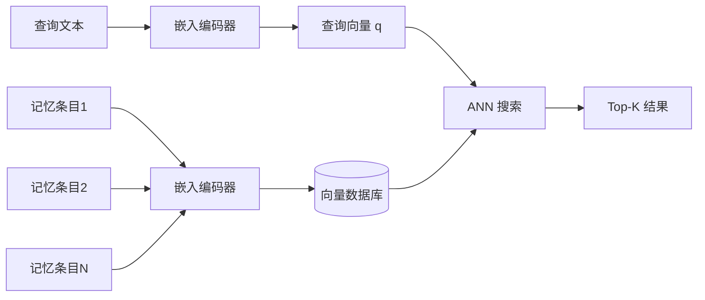
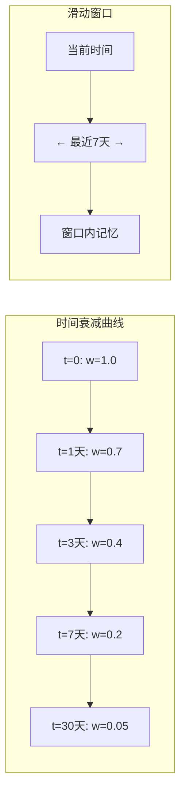
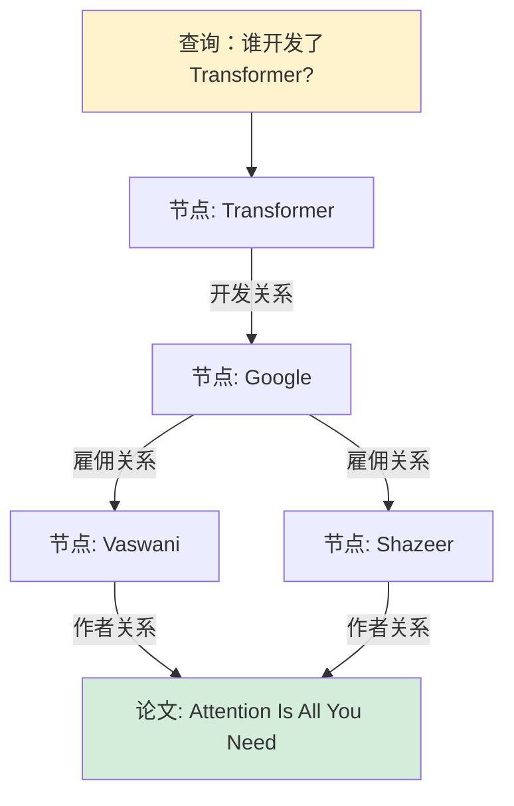
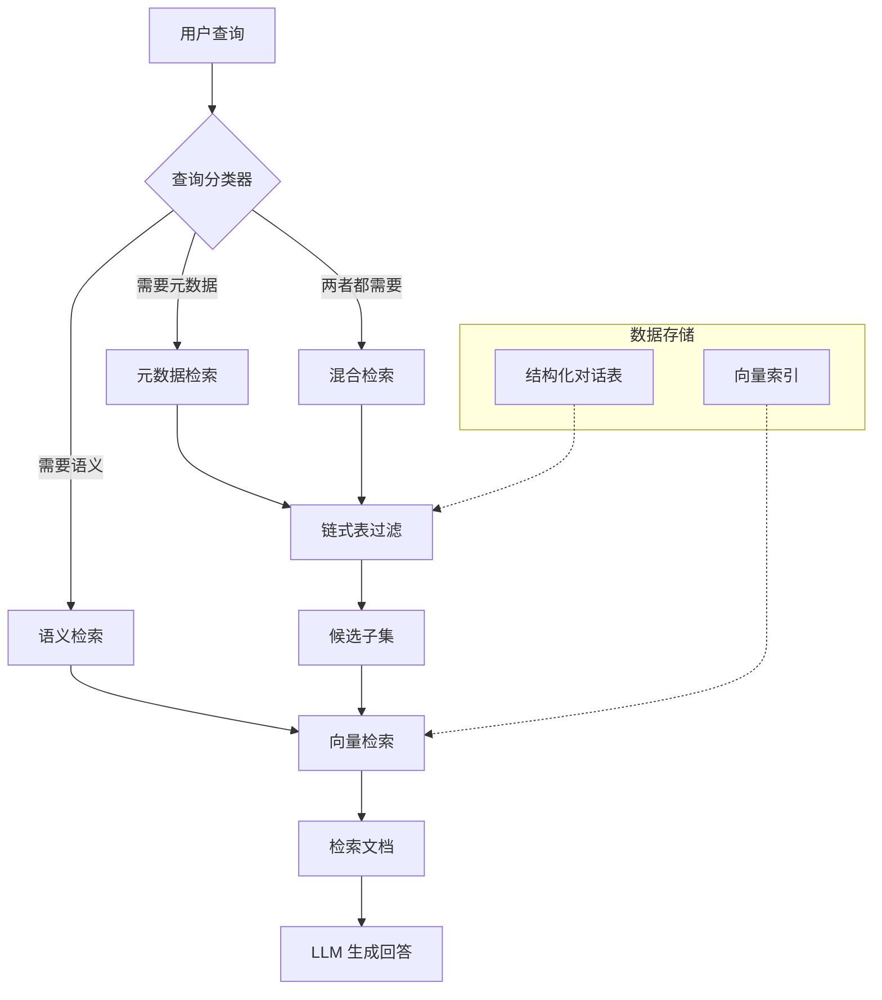
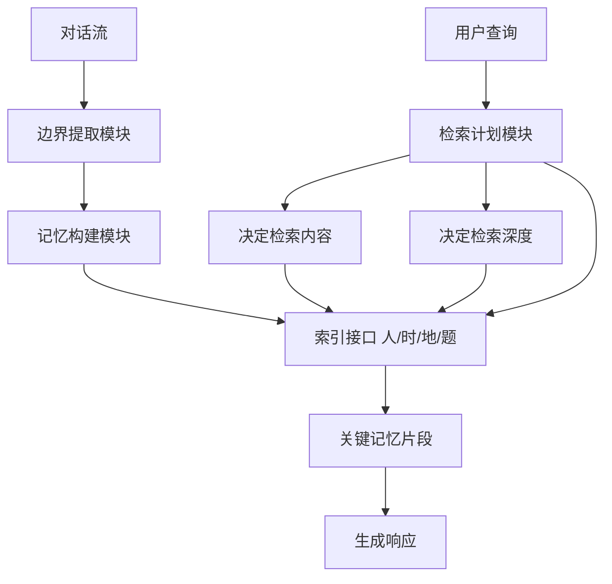
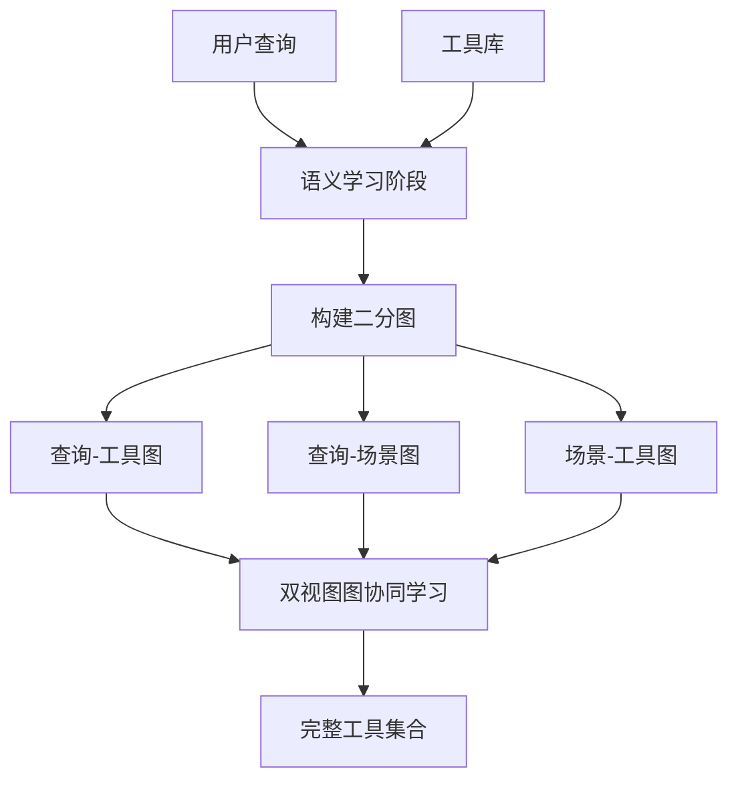

# 第9章 检索增强与多跳推理

> **本章摘要**：本章深入探讨 Agent Memory 系统中最核心的操作——检索（Retrieval）。我们首先系统性地分析检索策略全景，从单一的相似度检索到时序检索、图遍历检索，再到混合策略，建立检索策略的选择框架。随后讨论检索与生成之间的协同机制，包括 RAG 范式的局限性、重排序与过滤、上下文组装策略和检索失败的降级行为。最后，我们深入多跳推理的机制，分析如何通过记忆链和图结构实现复杂问答，并结合 COLT（2405.16089）和 Context-Time Memory（2406.00057）两篇论文，展示检索完整性与时间敏感记忆的最新进展。本章为第10章构建完整的记忆增强对话系统奠定检索基础。

---

## 9.1 检索策略全景

检索（Retrieval）是 Agent Memory 动态维度中最密集的研究领域——本体论 v1.1 中 445 个动态操作概念里，Retrieval 子类独占 79 个概念（18%）。这种密集度并非偶然：检索质量直接决定了 Agent 能否在正确的时间、从正确的存储中、召回正确的信息。本节建立完整的检索策略分类体系，帮助工程师在不同场景下做出最优选择。

### 9.1.1 相似度检索（Dense Retrieval）

**原理**：将查询和记忆条目分别编码为稠密向量（Dense Vector），在向量空间中通过余弦相似度或内积进行最近邻搜索。这是当前最主流的检索策略，背后的直觉是"语义相似的查询和记忆在向量空间中应该靠近"。

典型技术栈包括：嵌入模型（如 OpenAI text-embedding-3-small、bge-large-zh）将文本映射为 768-1536 维向量，向量索引（如 FAISS 的 IVF/PQ 索引、HNSW 图索引）支持高效的近似最近邻（ANN）搜索，返回 Top-K 最相似的记忆条目。



**优势**：
- **语义泛化能力强**：即使查询和记忆使用不同的词汇表述，只要语义相近即可匹配。例如查询"用户不喜欢什么食物"能匹配到记忆"小明对海鲜过敏"。
- **工程成熟度高**：向量数据库生态完善（FAISS、ChromaDB、Milvus、Pinecone），开箱即用。
- **可扩展性好**：ANN 算法支持百万甚至十亿级向量的毫秒级检索。

**局限**：
- **元数据盲区**：向量相似度无法处理结构化查询。"上周三的对话"、"第二次会话中提到的内容"这类涉及时间、会话编号的元数据查询，在纯向量空间中无法被精确回答。
- **细粒度区分力弱**：对于高度相似的记忆条目（如同一用户多次表达"我喜欢咖啡"），向量检索难以区分哪条最新、哪条最相关。
- **嵌入模型瓶颈**：检索上限受嵌入模型质量制约。小模型（<500M 参数）在复杂语义匹配上的表现显著弱于大模型，但大模型的推理成本又不可接受。
- **"中间迷失"放大效应**：检索返回的多条记忆中，LLM 对中间位置信息的注意力权重衰减，可能导致关键信息被忽略。

### 9.1.2 时序检索（Temporal Retrieval）

**原理**：利用时间元数据进行检索，核心策略包括时间衰减（最近优先）和滑动窗口（固定时间范围）。

**时间衰减模型**：为每条记忆分配一个随时间递减的权重 $w(t) = w_0 \cdot e^{-\lambda t}$，其中 $\lambda$ 是衰减速率。这种模型源自艾宾浩斯遗忘曲线，也是 MemoryBank（2305.10250）的核心机制。被频繁检索的记忆可以通过强度增强机制重置衰减值，模拟人类的"复习"效应。

**滑动窗口策略**：仅检索最近 $N$ 条或最近 $T$ 时间范围内的记忆。这是最简单、最直接的时序检索——在客服场景中，用户当前的投诉通常与最近 24 小时的交互最相关；在编程助手场景中，当前会话的上下文通常比一周前的代码讨论更有价值。



**优势**：
- **实现简单**：只需在记忆条目中增加时间戳字段，检索时增加时间过滤条件。
- **符合直觉**：大多数场景下，最近的记忆确实更重要。
- **计算开销低**：时间过滤是确定性操作，远比向量检索便宜。

**局限**：
- **重要旧记忆被淘汰**：用户的长期偏好（如"我对花生过敏"）可能数月不变，但随时间衰减而被降权甚至遗忘。
- **会话割裂问题**：如何定义"一次会话"？两次交互间隔 20 分钟算同一次会话还是两次？硬编码阈值无法适配所有场景。
- **纯时序无法处理复杂查询**："用户上次提到预算时说的金额"需要结合时序和语义双重条件。

2406.00057（Context and Time）论文专门针对这一问题进行了系统研究。该论文发现，纯向量检索在处理"昨天早上"、"第几次会话"等元数据查询时召回率极低，而引入结构化时间过滤后，性能显著提升。论文提出了 TemporalMemoryDataset 基准，包含约 2 万道问题变体，覆盖了时间敏感性查询和模糊查询两大类别。

### 9.1.3 图遍历检索（Graph Traversal Retrieval）

**原理**：将记忆建模为图结构——节点表示实体或概念，边表示关系。检索不再是简单的相似度匹配，而是沿着图边进行路径搜索，实现多跳推理。

HippoRAG（2405.14831）是图遍历检索的代表性工作。其核心流程为：
1. **图谱构建**：LLM 从文档中提取实体和关系，构建知识图谱。
2. **索引构建**：使用 Personalized PageRank（PPR）算法预计算图谱上的节点相关性。
3. **检索执行**：将查询映射为图谱上的起始节点，通过 PPR 随机游走计算所有节点的相关性得分。

这种方法的革命性在于：**单次检索即可完成多跳推理**，无需传统的迭代式"检索-生成-再检索"循环。据原文报告，PPR 检索比迭代检索方法快 6-13 倍。



**优势**：
- **显式关系推理**：支持"如果 A 是 B 的朋友，B 是 C 的同事，则 A 和 C 可能相识"这类链式推理。
- **可解释性强**：检索路径本身就是推理过程的可视化。
- **多跳效率高**：单次 PPR 检索替代多次迭代检索。

**局限**：
- **图谱构建成本高**：需要 LLM 进行实体识别和关系抽取，预处理开销大。
- **图谱维护复杂**：新增记忆需要动态更新图结构，涉及节点合并、边权重调整等操作。
- **稀疏图效果受限**：在记忆量较少或关系稀疏的场景中，图遍历的覆盖范围有限。

### 9.1.4 混合检索策略

**原理**：没有任何单一检索策略能在所有场景下表现最优。混合检索将多种策略组合，通过路由或融合机制实现优势互补。

2406.00057 论文提出的混合检索架构是这一方向的典型案例：



混合检索的常见模式包括：

| 模式 | 组合方式 | 适用场景 |
|------|---------|---------|
| **路由型混合** | 分类器决定使用哪种策略 | 查询类型明确的场景 |
| **级联型混合** | 先粗筛（元数据过滤）再精筛（语义检索） | 大规模记忆库，需缩小搜索空间 |
| **融合型混合** | 多种策略独立检索后合并结果 | 查询类型不确定或复合查询 |
| **递归型混合** | 检索结果作为下一轮检索的输入 | 多跳推理、渐进式信息搜集 |

### 9.1.6 最新进展：查询自适应检索

> **注**：本节基于 2026 年最新研究成果（ACM WWW '26, CCF-A 类会议）。

#### HingeMem — 事件分割理论驱动的边界引导记忆

**背景**：长对话系统中记忆冗余、检索不相关或信息不足，导致上下文理解偏差。传统固定 Top-k 检索缺乏对查询类别的适应性，计算开销大。

**方案**：HingeMem（2604.06845）基于事件分割理论（Event Segmentation Theory），提出两个核心机制：

1. **边界引导记忆构建**：监测对话中**人物、时间、地点、话题**四要素的变化，任一要素变化时触发记忆边界绘制并写入片段。超边索引以"人/时/地/题"为维度，提供可解释的接口。
2. **查询自适应检索**：联合决策"检索什么内容"和"检索多少内容"，动态决定检索深度，避免过度检索导致上下文溢出。



**关键结果**：
- LOCOMO 数据集上相比强基线实现约 20% 的相对性能提升
- 问答 Token 成本相比 HippoRAG2 降低 68%
- 跨模型规模有效（Qwen3-0.6B 至生产级模型均适用）
- 无需指定查询类别即可适应多样信息需求

**工程启示**：68% 的 Token 成本降低在生产环境极具吸引力。边界检测的敏感度需要调优——过于敏感导致片段碎片化，过于迟钝则丢失语义边界。在噪声对话中的鲁棒性需进一步验证。迁移至角色扮演或心理咨询场景时，可探索情感作为第五边界触发要素。

### 9.1.5 检索策略的选择指南

选择检索策略时，应从以下维度评估：

| 决策维度 | 关键问题 | 推荐策略 |
|---------|---------|---------|
| **查询类型** | 是否需要时间/会话等元数据？ | 需要：混合检索；不需要：相似度检索 |
| **记忆规模** | 记忆条目数量级？ | 千级：相似度检索；万级以上：混合或图检索 |
| **推理复杂度** | 是否需要跨记忆关联推理？ | 需要：图遍历；不需要：相似度或时序 |
| **延迟要求** | 可接受的检索延迟？ | 低延迟：时序/相似度；可容忍：图/混合 |
| **可解释性** | 是否需要追溯检索路径？ | 需要：图遍历；不需要：向量检索 |
| **维护成本** | 团队能否维护复杂结构？ | 有限：相似度；充裕：图/混合 |

---

## 9.2 检索与生成的协同

检索到的信息需要有效地注入 LLM 的生成上下文，这个过程并非简单的"拼接"——检索结果的质量、数量和呈现方式直接影响最终生成质量。

### 9.2.1 RAG 范式在记忆场景中的局限

传统 RAG（Retrieval-Augmented Generation）范式在知识问答场景表现优异，但将其直接迁移到 Agent 记忆场景时，暴露出以下结构性局限：

**1. 片段丢失与上下文断裂。** 传统 RAG 检索的是独立文档片段，而 Agent 记忆中的信息往往是跨片段关联的。例如用户在不同时间提到"我开始健身"和"我不吃碳水化合物"，两条记忆单独看都不完整，结合起来才能推断"用户可能在控制饮食减脂"。

**2. 时序信息丢失。** RAG 的 Top-K 检索按相似度排序，时间线索在排序过程中被丢弃。"用户说喜欢咖啡"和"用户说不喜欢咖啡"可能同时出现在 Top-K 中，但系统无法判断哪条更新、哪条已被修正。

**3. 记忆更新不同步。** RAG 假设文档库是相对静态的，而 Agent 记忆是持续演化的。用户的偏好会变化、事实会更新、矛盾需要消解——传统的 RAG 索引更新机制（通常是批量的、离线的）无法支持这种实时性。

**4. 冗余信息干扰。** 检索返回的多条记忆可能存在高度重叠，挤占有限的上下文窗口。研究表明，LLM 对上下文中重复信息的处理效率降低，且可能因注意力分散而忽略关键差异。

### 9.2.2 检索结果的重排序与过滤

检索返回的原始结果需要经过重排序（Reranking）和过滤（Filtering）才能进入生成阶段。

**重排序策略**：
- **交叉编码器重排序**：使用交叉编码器（Cross-Encoder）对查询-记忆对进行精细化相关性打分。虽然比双编码器（Bi-Encoder）计算成本高，但精度显著提升。
- **时间加权重排序**：在相似度得分基础上叠加时间衰减因子 $S = \alpha \cdot sim(q, m) + (1-\alpha) \cdot decay(t)$，平衡语义相关性和时效性。
- **多样性重排序**：使用最大边际相关性（MMR）算法，在相关性和多样性之间取得平衡，避免 Top-K 结果高度同质化。

**过滤策略**：
- **阈值过滤**：剔除相似度低于阈值的记忆条目，防止噪声注入上下文。
- **冲突检测与消解**：当检索到矛盾记忆时（如"喜欢猫" vs."对猫毛过敏"），使用时间戳、置信度和一致性优先级（公理17：一致性优先）进行仲裁。
- **冗余去重**：对语义高度重叠的记忆进行聚类，保留最具代表性的条目。

### 9.2.3 上下文组装策略

将过滤后的记忆注入 LLM 上下文时，组装策略直接影响生成质量：

| 策略 | 方法 | 适用场景 |
|------|------|---------|
| **直接拼接** | 将记忆条目按相关性排序后直接拼接到 Prompt | 记忆量少、条目短的场景 |
| **摘要压缩** | 先对检索结果进行摘要，再注入上下文 | 记忆量大、需压缩 Token 数的场景 |
| **结构化注入** | 按类别（事实/情景/偏好）分组注入，添加类别标记 | 多类型记忆混合的场景 |
| **动态注入** | 根据生成过程中的需要，按需加载额外记忆 | MemGPT 式的自主分页管理 |

**上下文组装的关键原则**：
- **信息密度优先**：优先注入信息密度高的记忆（如结构化摘要），而非原始长文本。
- **位置效应利用**：将最关键的记忆放在上下文的开头和结尾（利用 LLM 的"首尾效应"，避免"中间迷失"）。
- **显式标记**：为每条记忆添加来源标记（如"[记忆-2024-03-15]"），便于 LLM 区分和引用。

### 9.2.4 检索失败时的降级行为

检索系统不可能永远返回高质量结果。设计合理的降级（Fallback）机制至关重要：

| 降级场景 | 降级策略 | 实现方式 |
|---------|---------|---------|
| **零结果** | 扩大检索范围或降低阈值 | 增加 Top-K、放宽相似度阈值、回退到全文搜索 |
| **低置信度** | 显式告知用户不确定性 | 在回复中添加"根据有限的信息..."前缀 |
| **矛盾结果** | 返回最新或最高置信度的记忆，并标注冲突 | 使用时间戳排序 + 冲突提示 |
| **超时** | 使用缓存结果或最近的记忆子集 | 设置检索超时阈值，超时后使用最近 N 条记忆 |
| **索引损坏** | 回退到无检索模式 | 完全依赖模型参数化知识和当前对话上下文 |

降级行为的设计原则是**优雅降级（Graceful Degradation）**：即使在最差情况下，系统仍能提供可用的回复，而非完全失效或产生误导性回答。

---

## 9.3 多跳推理

多跳推理（Multi-hop Reasoning）是 Agent Memory 系统最强大的能力之一——通过串联多条记忆，回答任何单条记忆都无法独立回答的复杂问题。

### 9.3.1 记忆链与复杂问答

记忆链（Memory Chain）是指通过逻辑关联串联的多条记忆构成的推理路径。考虑以下场景：

```
用户查询：我之前说想去的那个城市，天气怎么样？

记忆链：
Hop 1: "用户提到想去日本旅游"（情景记忆，2024-01-15）
Hop 2: "用户说想在樱花季去"（情景记忆，2024-01-15）
Hop 3: "樱花季通常在3月底到4月中旬"（语义记忆，外部知识）
→ 推理：用户想去日本，时间约3-4月，查询日本春季天气
```

单条记忆无法回答"那个城市"指的是哪里，也无法确定"那时"是什么季节。只有通过记忆链将分散的信息串联，才能完成完整的推理。

记忆链的构建方式有两种：

**显式链**：通过知识图谱中的路径直接链接。HippoRAG 的 PPR 检索本质上就是自动发现记忆链——从查询节点出发，沿着图边遍历，找到与查询相关的多跳路径。

**隐式链**：通过 LLM 的推理能力在检索结果中发现隐含关联。系统将多条检索到的记忆同时注入上下文，由 LLM 自行识别和串联。这种方式不需要预构建图结构，但依赖 LLM 的推理能力和充足的上下文窗口。

### 9.3.2 图结构上的多跳推理路径

在图结构记忆中，多跳推理路径具有以下特征：

**路径发现**：使用图算法（如 BFS、DFS、PPR）发现从查询节点到目标节点的路径。PPR 特别适合记忆检索场景——它通过带偏好（bias）的随机游走，使检索结果偏向与查询语义相关的节点，同时保留图结构带来的多跳能力。

**路径评分**：每条路径的相关性由路径上边的权重和节点的相关性共同决定。例如：
- 直接路径（1 跳）权重最高，但信息量可能不足。
- 间接路径（2-3 跳）权重递减，但可能包含关键推理信息。
- 过长路径（>4 跳）通常噪声过大，应设置最大跳数阈值。

**路径解释**：图遍历检索的优势在于可解释性。检索结果不仅返回答案，还返回推理路径："根据您在 3 月 15 日提到想去日本（记忆#42），以及 3 月 20 日说想看樱花（记忆#57），我推断您指的是日本东京。"

### 9.3.3 检索质量评估

评估多跳检索系统的质量，需要多维指标：

| 指标 | 定义 | 计算方法 | 目标值 |
|------|------|---------|--------|
| **召回率（Recall）** | 相关记忆中被检索到的比例 | TP / (TP + FN) | 越高越好 |
| **精确度（Precision）** | 检索结果中相关的比例 | TP / (TP + FP) | 越高越好 |
| **F2 分数** | 偏向召回的调和平均 | 5·P·R / (4·P + R) | 记忆场景建议 >0.7 |
| **冗余度** | 检索结果中重复信息的比例 | 1 - (唯一信息量 / 总信息量) | 越低越好 |
| **跳数效率** | 完成推理所需的最小跳数与实际跳数之比 | 最小跳数 / 实际跳数 | 越接近 1 越好 |
| **延迟** | 从查询到检索完成的时间 | 端到端测量 | 取决于场景 |

**F2 分数**在记忆场景中特别重要——它偏向召回而非精确度，因为遗漏关键记忆（FN）的代价远大于引入少量噪声（FP）。2406.00057 论文选用 F2 作为核心评估指标，正是基于这一考量。

### 9.3.4 论文案例分析

#### 案例一：COLT —— 完整性导向的工具检索（2405.16089）

**论文**：Qu, C. et al. "Towards Completeness-Oriented Tool Retrieval for Large Language Models." CIKM '24.

**核心问题**：现有工具检索方法主要关注查询与工具描述之间的语义匹配，导致检索出冗余、相似的工具，无法提供解决问题所需的完整工具集。

**解决方案**：COLT（COllaborative Learning-based Tool Retrieval）框架引入工具间的**协同信息**，不仅考虑"这个工具与查询是否相关"，还考虑"这些工具组合在一起是否能完整解决问题"。

**双视图图协同学习架构**：



**关键创新**：
1. **完整性而非相关性**：检索目标从"找到最相关的工具"转向"找到能完整解决问题的工具集合"。这减少了功能重叠的工具冗余，确保检索集合覆盖问题的各个方面。
2. **双视图图协同学习**：构建查询-工具、查询-场景、场景-工具三个二分图，通过图神经网络捕捉节点间的协同关系。
3. **小模型超越大模型**：实验表明，11M 参数的 BERT-mini 配合 COLT 框架，性能超越 340M 参数的 BERT-large，参数量减少约 30 倍。这证明了**检索质量的关键不在于模型规模，而在于是否捕捉到了正确的结构信息**。

**工程启示**：在 Agent 工具检索场景中，单纯的语义匹配远远不够。工具之间存在互补关系（如"搜索"和"总结"配合使用）和替代关系（如两种不同的翻译 API），检索系统需要建模这些关系，才能返回完整且不冗余的工具集合。

#### 案例二：Context and Time —— 上下文与时间敏感的长期记忆（2406.00057）

**论文**：Alonso, N. et al. "Toward Conversational Agents with Context and Time Sensitive Long-term Memory." arXiv:2406.00057.

**核心问题**：对话式 RAG 系统缺乏对时间流逝和会话结构的敏感度，难以处理"昨天早上说了什么"、"他指的是谁"这类涉及时间和上下文的查询。

**解决方案**：混合检索架构，融合链式表（Chain-of-Tables）元数据过滤和向量语义检索。

**关键技术**：

1. **链式表检索**：将对话日志存储为结构化表格（包含时间戳、会话 ID、嵌入向量等列），使用 `f_value`（精确值过滤）和 `f_between`（范围过滤）函数进行链式过滤，先缩小候选空间再进行语义检索。
2. **查询重写**：利用 LLM 消除指代歧义。当用户说"他的建议是什么"时，系统将查询重写为"张三在第二次会话中的建议是什么"，再进行检索。
3. **上下文注入**：在检索 Prompt 中注入前 2-4 句对话上下文，帮助系统理解代词和指示词的指代对象。

**实验发现**：
- 纯向量检索在元数据查询上表现极差，混合检索在 F2 分数上显著优于基线。
- 上下文注入对模糊查询至关重要——不注入上下文时，代词消解几乎完全失效。
- 会话割裂阈值（原文使用 20 分钟）需要根据具体业务场景调整，不应硬编码。

**工程启示**：在实际的对话记忆系统中，结构化元数据（时间、会话、参与者）和语义嵌入同等重要。单纯的向量检索只覆盖了检索空间的一半——另一半由结构化数据填补。将两者结合，才能真正实现"有时间和上下文意识"的长期记忆。

---

## 9.4 本章小结

- **检索策略是一个谱系而非单选**。相似度检索擅长语义泛化但无法处理元数据，时序检索简单高效但会丢失重要旧记忆，图遍历检索支持多跳推理但维护成本高，混合检索取长补短但增加了系统复杂度。没有最优策略，只有最适合场景的策略。
- **RAG 范式在记忆场景中存在结构性局限**。片段丢失、时序信息丢失、更新不同步和冗余干扰是四大核心问题，需要通过重排序、冲突消解和智能组装来弥补。
- **上下文组装策略直接影响生成质量**。信息密度、位置效应和显式标记是三个关键原则。最关键的记忆应放在上下文的开头和结尾，避免"中间迷失"。
- **检索失败时的优雅降级是系统可靠性的保障**。从零结果扩展、低置信度提示到无检索模式回退，降级策略确保系统在任何情况下都能提供可用回复。
- **多跳推理是 Agent Memory 的核心竞争力**。通过记忆链和图遍历，Agent 能够回答任何单条记忆都无法独立回答的复杂问题。PPR 等单次多跳检索算法比迭代检索效率高出 6-13 倍。
- **检索完整性比相关性更重要**。COLT（2405.16089）证明了工具间的协同信息对检索质量的决定性影响——小模型配合正确的结构信息，可以超越大模型的纯语义匹配。
- **时间与上下文意识是长期记忆的必备能力**。2406.00057 论文表明，混合元数据过滤和语义检索的架构，在处理时间敏感查询和模糊查询上显著优于单一策略。

---

## 9.5 延伸阅读

### 检索增强与多跳推理核心论文

1. **Qu, C. et al.** (2024). "Towards Completeness-Oriented Tool Retrieval for Large Language Models." CIKM '24. (2405.16089) —— 提出 COLT 框架，通过双视图图协同学习实现完整性导向的工具检索。
2. **Alonso, N. et al.** (2024). "Toward Conversational Agents with Context and Time Sensitive Long-term Memory." arXiv:2406.00057. —— 提出混合检索架构，结合链式表元数据过滤与向量语义检索。
3. **Gutierrez, B. J. et al.** (2024). "HippoRAG: Neurobiologically Inspired Long-Term Memory for Large Language Models." NeurIPS 2024. (2405.14831) —— 知识图谱 + Personalized PageRank 实现单次多跳检索。

### RAG 与检索优化

4. **Lewis, P. et al.** (2020). "Retrieval-Augmented Generation for Knowledge-Intensive NLP Tasks." NeurIPS 2020. —— RAG 范式的奠基论文。
5. **Gao, Y. et al.** (2023). "Retrieval-Augmented Generation for Large Language Models: A Survey." —— RAG 技术的系统性综述，涵盖检索、生成和增强策略。
6. **Yan, S. et al.** (2024). "Contextual Retrieval: Improving RAG with Context-Aware Chunk Embedding." —— 上下文感知的检索分块策略。

### 检索评估与基准

7. **TemporalMemoryDataset**：https://github.com/Zyphra/TemporalMemoryDataset —— 时间与上下文敏感查询的基准数据集。
8. **ToolLens**：COLT 论文（2405.16089）引入的工具检索基准数据集。

### 2026 最新进展

9. **(2026).** "HingeMem: Boundary Guided Long-Term Memory with Query Adaptive Retrieval." ACM WWW '26. arXiv:2604.06845. —— 事件分割理论驱动的边界引导记忆，Token 成本降低 68%。
10. **(2026).** "Joint Optimization of Reasoning and Dual-Memory." arXiv:2604.07269. —— 推理与双记忆联合优化。
11. **(2026).** "Task-Adaptive Retrieval over Multi-Modal." arXiv:2604.07863. —— 多模态任务自适应检索。
12. **(2026).** "Memory Intelligence Agent." arXiv:2604.04503. —— 多模态检索智能体。

*检索是 Agent Memory 系统中最密集的研究领域，也是工程实践中最常遇到的瓶颈。下一章将把本章的检索理论付诸实践，构建一个完整的记忆增强对话系统。*

---

## 9.6 框架深度剖析：检索策略设计

### 9.6.1 Forgetful — 四阶段混合搜索管道

**问题**：单一检索策略无法兼顾召回率和精确率。

**方案**：四阶段管道——(1) Dense Search（向量余弦距离）；(2) Sparse Search（关键词匹配）；(3) RRF 融合 `score = 1/(k+rank_dense) + 1/(k+rank_sparse)`，k=60；(4) Cross-Encoder 重排序（FastEmbed TextCrossEncoder）。

**代码路径**：
- `app/repositories/sqlite/memory_repository.py` — 搜索+自动链接+图遍历 (L1-1569)
- `app/services/memory_service.py` — 业务逻辑+Token 预算 (L1-707)

**Token 预算管理**：按重要性排序，截断到配置上限（默认 8K tokens）。确保注入上下文的记忆量不超过 LLM 窗口容量。

### 9.6.2 Memoria — Spreading Activation 检索

**问题**：当记忆超过 500 条时，向量搜索返回的结果可能缺少关联上下文。

**方案**：锚点选择（Top-N by vector similarity）→ Spreading Activation（3-5 轮传播）→ 按激活分数排序 → 与向量搜索结果融合。权重：语义 0.35 + 激活 0.35 + 置信度 0.20 + 重要性 0.10。

**代码路径**：
- `memoria/crates/memoria-storage/src/graph/retriever.rs` — 激活检索器 (L72-200+)
- `memoria/crates/memoria-service/src/service.rs` — 检索管道 (L1283-1546)

### 9.6.3 OpenMemory — Waypoint 关联图 + BFS 扩展

**问题**：当初始搜索最高置信度 < 0.6 时，如何扩展搜索范围？

**方案**：Waypoint 关联图基于语义相似度链接记忆，低置信度时触发 BFS 扩展（深度 2-3 跳，每跳最多保留 5 个邻居）。扩展结果按 `edge_weight * neighbor_salience` 排序。

## 9.7 工程决策卡片

| 规模 | 推荐策略 | 延迟 (P50) | 精确率 | 代表项目 |
|------|---------|-----------|--------|---------|
| < 100 条 | 纯向量搜索 | < 50ms | 中 | Agent Memory OS |
| 100-1K 条 | Dense + Sparse + RRF | < 200ms | 高 | Forgetful |
| 1K-10K 条 | 混合搜索 + 图谱激活 | < 500ms | 高 | Memoria |
| > 10K 条 | 专用向量数据库 + 服务端聚合 | < 1s | 高 | Redis AMS |

**RRF 参数**：k=60（经验值，平衡 dense 和 sparse 的权重）
**图谱激活参数**：语义权重 0.35，激活权重 0.35，置信度权重 0.20，重要性权重 0.10
**BFS 扩展阈值**：初始最高置信度 < 0.6 触发，深度 2-3 跳，每跳最多 5 个邻居

## 9.8 反模式与陷阱

| 反模式 | 问题 | 正确做法 | 来源 |
|--------|------|---------|------|
| 纯向量搜索 > 100 条记忆 | 精度下降，相似但不相关的结果增多 | 引入 Sparse + RRF 混合 | Forgetful 经验 |
| 无 Token 预算 | 检索结果超过上下文容量，截断丢失关键信息 | 按重要性排序截断到预算上限 | Forgetful Token 预算 |
| 低置信度不扩展 | 初始搜索无结果即放弃，忽略关联记忆 | BFS 扩展 2-3 跳 | OpenMemory Waypoint |
| 检索结果不重排序 | RRF 融合后直接使用，未考虑查询特定需求 | Cross-Encoder 重排序 Top-K | Forgetful 四阶段管道 |
