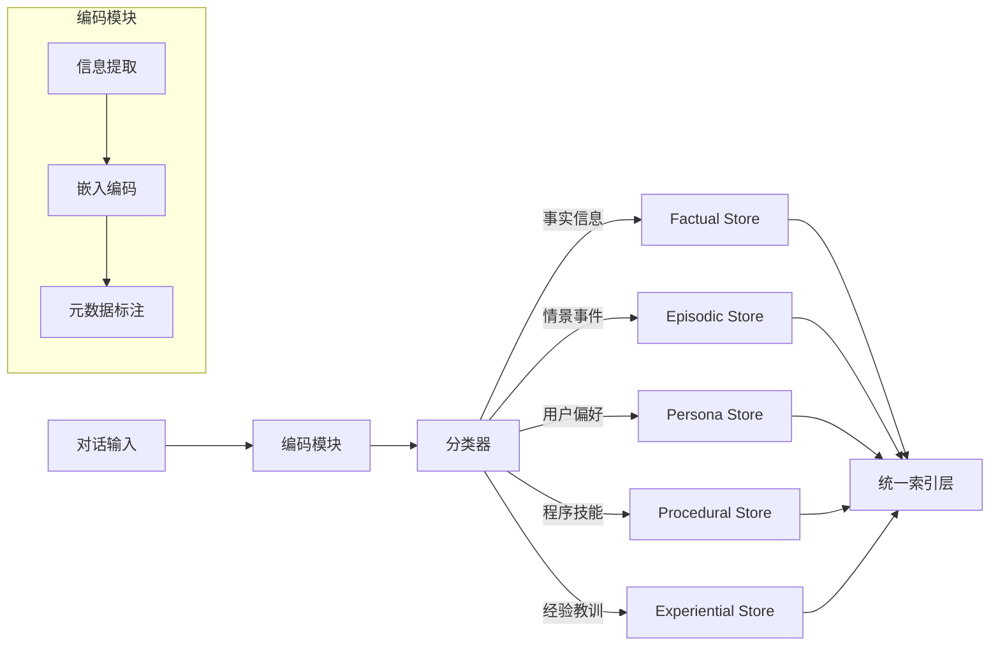
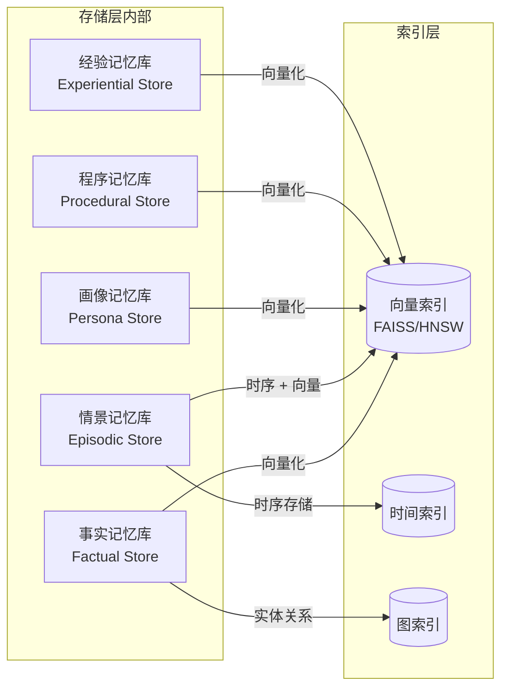
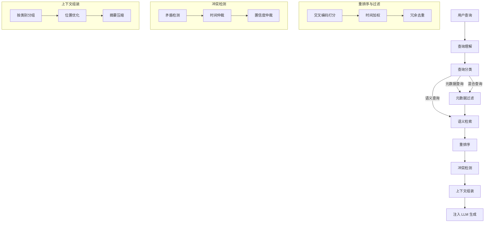
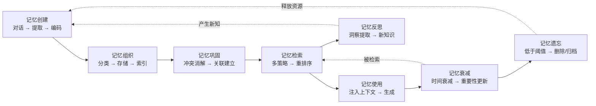
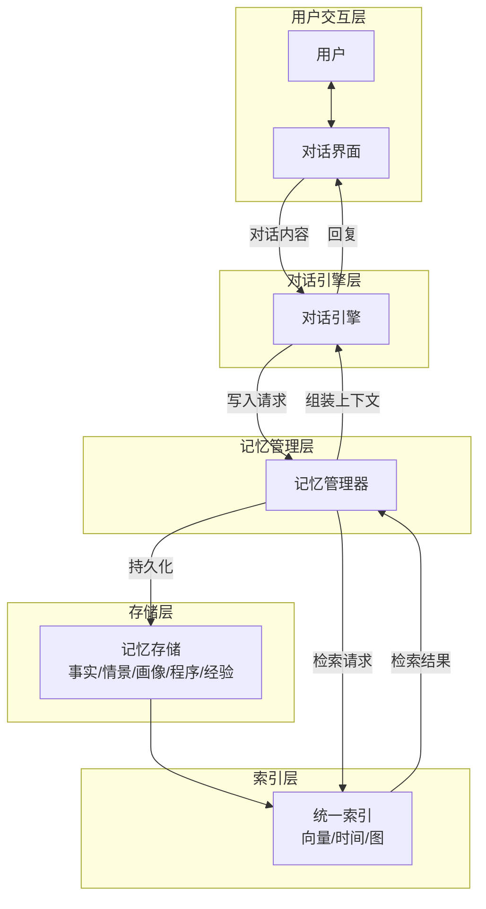
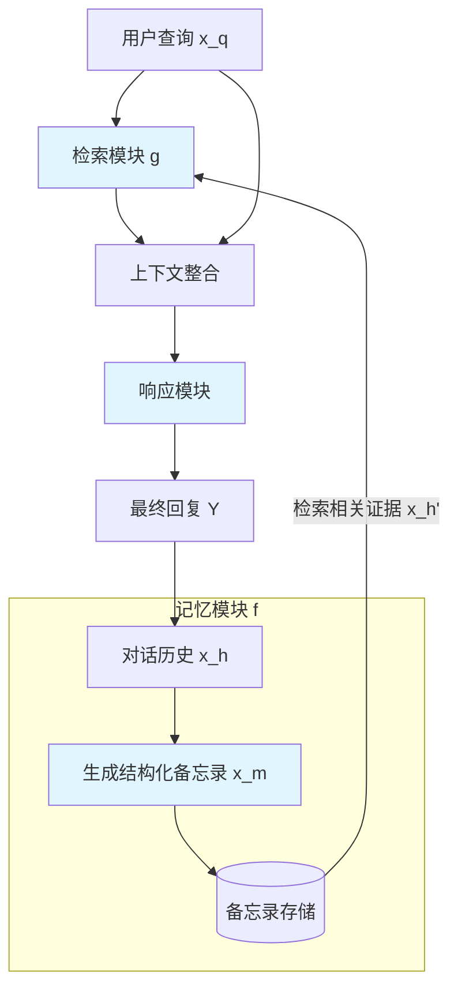
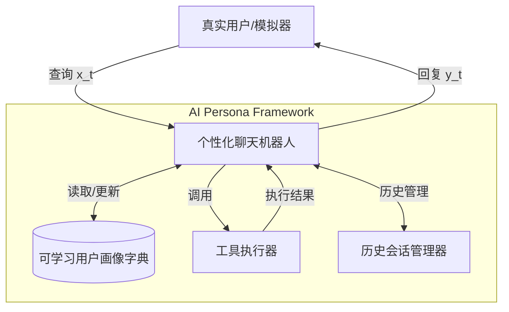
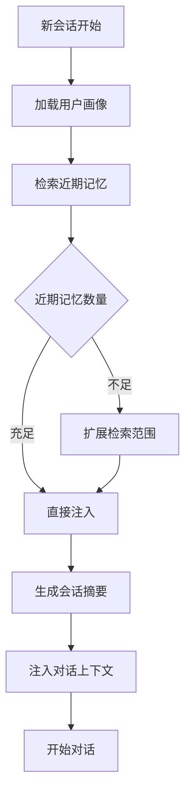
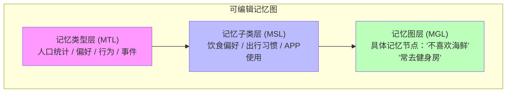
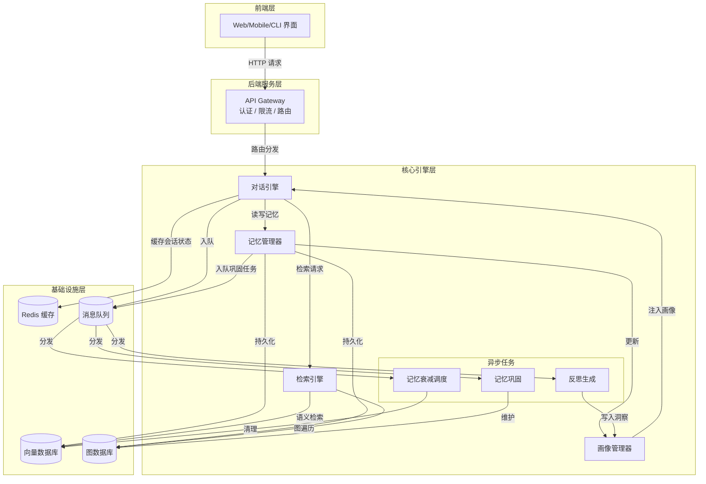

# 第10章 构建记忆增强对话系统（实践章）

> **本章摘要**：本章是全书的实践章节，将前九章的理论转化为可执行的工程方案。我们首先设计一个完整的记忆增强对话系统架构，涵盖记忆写入管道、记忆检索管道和记忆生命周期管理。随后，通过 MemoChat（2308.08239）、ChatHaruhi（2308.09597）和 AI PERSONA（2412.13103）三篇论文的案例，深入探讨角色一致性维护的实现策略。在长期对话记忆管理部分，我们结合 Crafting Personalized Agents（2409.19401）的可编辑记忆图方案，讨论跨会话记忆继承和个人化记忆构建。最后，我们提供完整的系统集成方案和 Python 代码骨架，帮助读者从零开始构建生产级的记忆增强对话系统。

---

## 10.0 系统架构设计

构建一个生产级的记忆增强对话系统（Memory-Augmented Dialogue System），需要回答三个核心工程问题：**记忆如何写入**、**记忆如何检索**、**记忆如何演化**。本节给出完整的系统架构设计。

### 10.0.1 记忆写入管道

记忆写入管道负责将对话内容转化为结构化的记忆条目，并存入相应的存储层。其核心流程如下：



> **架构定位**：此图对应完整架构图（10.0.4）中"记忆管理层 → 写入管道"的内部展开。

**编码模块**包含三个子步骤：
1. **信息提取**：LLM 从对话中提取关键信息。例如从"我叫小明，住在上海，对花生过敏"中提取三条事实记忆。
2. **嵌入编码**：使用嵌入模型将文本记忆编码为向量，支持后续的语义检索。
3. **元数据标注**：为每条记忆附加时间戳、会话 ID、来源、置信度等元数据，支持时序检索和冲突消解。

**分类器**将提取的信息路由到不同的存储层。分类可以基于规则（如正则匹配识别时间/地点）、基于嵌入（语义分类）或基于 LLM（指令分类）。在生产系统中，建议采用 LLM 分类 + 规则兜底的混合方案。

**存储层**按功能维度分层，遵循本体论的功能分类体系：

| 存储层 | 功能定位 | 存储结构 | 检索策略 |
|--------|---------|---------|---------|
| Factual Store | 事实记忆 | 向量数据库 + 结构化索引 | 语义检索 + 精确匹配 |
| Episodic Store | 情景记忆 | 时序日志 + 向量索引 | 时序检索 + 语义检索 |
| Persona Store | 用户画像 | 可学习字典（JSON） | 精确读取 + 模糊匹配 |
| Procedural Store | 程序记忆 | 函数库 + 向量索引 | 语义检索 + 参数匹配 |
| Experiential Store | 经验记忆 | 向量数据库 + 标签索引 | 语义检索 + 场景匹配 |

存储层的内部结构及各库到索引层的映射关系如下：



### 10.0.2 记忆检索管道

记忆检索管道负责在对话过程中召回相关记忆，组装为生成上下文：



> **架构定位**：此图对应完整架构图（10.0.4）中"记忆管理层 → 检索管道"的内部展开。

检索管道的关键设计决策：
- **查询分类**是路由中枢——分类错误会导致检索策略错配。建议使用 LLM 少量样本提示进行分类，并保留分类置信度，置信度低时采用融合型混合检索。
- **重排序**是质量保障——粗检索（向量 ANN）返回大量候选，重排序（交叉编码器）精确筛选。两阶段检索在精度和效率之间取得平衡。索引层的内部结构如下：

  ```mermaid
  graph TD
      subgraph IndexLayer [索引层内部]
          VI[(FAISS/HNSW<br/>向量索引)] -->|语义检索| SR[语义检索引擎]
          TI[(时间索引)] -->|范围过滤| TF[时间过滤器]
          GI[(图索引)] -->|关联遍历| GT[图遍历引擎]
      end
      SR --> Reranker[重排序器]
      TF --> Reranker
      GT --> Reranker
  ```
- **上下文组装**是最后一公里——按类别分组（事实、情景、偏好分别标注）、位置优化（关键信息放首尾）、摘要压缩（长文本先压缩再注入）。

### 10.0.3 记忆生命周期

记忆从创建到遗忘经历完整的生命周期闭环：



> **架构定位**：此图对应完整架构图（10.0.4）中"记忆管理层 → 生命周期管理器"的内部展开。

**生命周期管理参数**：

| 参数 | 含义 | 推荐值 | 调整依据 |
|------|------|--------|---------|
| `decay_rate` | 时间衰减速率 | 0.05/天 | 根据记忆类型调整：偏好类慢、情景类快 |
| `importance_threshold` | 遗忘阈值 | 0.1 | 低于此值的记忆进入归档或删除流程 |
| `refresh_boost` | 检索后强度增强 | +0.3 | 被检索的记忆强度增加量 |
| `max_memory_count` | 单用户记忆上限 | 10,000 | 根据存储成本和检索延迟确定 |
| `consolidation_interval` | 巩固周期 | 24 小时 | 每日批量执行冲突消解和关联建立 |

### 10.0.4 完整架构图

以下是记忆增强对话系统的完整架构（模块级视图）。各模块的内部详细架构见 10.0.1-10.0.3 的子图：



---

## 10.1 角色一致性案例

角色一致性（Character Consistency）是记忆增强对话系统最具代表性的应用场景——无论是复活动漫角色、维持客服人设，还是构建个人 AI 助手，都需要系统在长期交互中保持角色特征的一致性。

### 10.1.1 论文案例分析

#### MemoChat：自我使用备忘录（2308.08239）

**论文**：Lu, J. et al. "MemoChat: Tuning LLMs to Use Memos for Consistent Long-Range Open-Domain Conversation." arXiv:2308.08239.

MemoChat 的核心洞察是：**与其让外部系统管理记忆，不如教会模型自己管理记忆**。通过指令微调，模型学会在对话过程中自主撰写、检索和使用结构化备忘录。

**三阶段闭环架构**：



**三类专用指令**：
1. **记忆撰写指令**：将对话历史总结为结构化备忘录，覆盖所有事实而非部分信息。
2. **记忆检索指令**：根据当前查询从备忘录中匹配相关证据。
3. **带记忆对话指令**：结合查询和检索到的证据生成回复，同时在训练中缓解提示复制（Prompt Copy）和灾难性遗忘问题。

**实验结果**：在有限上下文窗口（2K tokens）下，MemoChat 在一致性评估上优于强基线模型（包括 ChatGPT+MPC 和 MemoryBank-ChatGPT）。训练成本可控——最大模型（33B）约需 6 小时（8x A100 40G）。

**工程启示**：MemoChat 证明了内生性记忆管理的可行性——模型不需要复杂的外部检索系统，只需学会正确使用备忘录。这种方案的系统复杂度低、部署成本小，非常适合资源受限但需要长程一致性的场景。但其多阶段生成（写备忘录 + 检索 + 回复）增加了推理延迟和 Token 消耗。

#### ChatHaruhi：角色扮演中的记忆检索（2308.09597）

**论文**：Li, C. et al. "ChatHaruhi: Reviving Anime Character in Reality via Large Language Model." arXiv:2308.09597.

ChatHaruhi 解决的是虚构角色的复现问题——如何让 LLM 扮演动漫、影视、小说中的角色，并保持性格、语言风格和行为逻辑的一致性。

**核心技术栈**：
1. **系统提示词优化**：定义角色身份和性格，并显式鼓励复用原著台词（因为 RLHF 模型倾向于避免重复内容，这与角色扮演需求相悖）。
2. **基于嵌入的记忆检索**：从 ChatHaruhi-54K 数据集中检索 Top-K 相关剧本片段，限制在 1500 tokens 内作为上下文。
3. **监督微调（SFT）**：基于 ChatGLM2-6B 进行微调，使模型内化角色特征。

**数据增强策略**：利用 ChatGPT/Claude 为剧本对话生成模拟问题，将"角色台词"转化为"对话数据"，大幅扩充训练集。

**工程启示**：角色记忆的结构化表示需要包含三个层次：**身份层**（角色是谁）、**性格层**（角色怎么说话和行事）、**剧情层**（角色经历了什么）。检索策略上，需要优先检索性格相关的记忆（确保一致性），再检索剧情相关的记忆（提供背景知识）。

#### AI PERSONA：终身个性化（2412.13103）

**论文**：Wang, T. et al. "AI PERSONA: Towards Life-long Personalization of LLMs." arXiv:2412.13103.

AI PERSONA 首次明确定义了 LLM 的"终身个性化"任务——模型如何在长期交互中持续适应用户的动态变化。

**核心架构**：将用户画像定义为**可学习字典**（Learnable Dictionary），包含人口统计、性格、模式、偏好等键值对。画像随交互动态更新：$v_{ui}^{(t)} = f_{\theta}(v_{ui}^{(t-1)}, (x_t, y_t))$。



**关键发现**：
- 画像更新频率 $k=3$（每 3 次对话更新一次）在性能和成本之间取得最优平衡。
- Persona Learning 模式仅需约 10 次更新即可接近 Golden Persona 效果（帮助度 8.29 vs. 8.34）。
- 框架对主流模型（GPT-4o、Gemini-1.5、Claude-3.5）均有效，无需重训练。

**工程启示**：可学习字典是一个极其实用的设计——它既不是静态 Prompt（缺乏适应性），也不是微调参数（更新成本高），而是介于两者之间的"软记忆"。在实际工程中，可以将用户画像存储为 JSON 字典，每次更新时由 LLM 对比新旧信息并生成更新操作。

### 10.1.2 角色记忆的结构化表示

综合三篇论文的最佳实践，角色记忆应包含以下结构化层次：

```python
class CharacterMemory:
    """角色记忆的结构化表示"""
    
    identity: dict = {
        "name": "角色名称",
        "role": "角色定位（职业、身份）",
        "background": "背景故事",
        "relationships": {"人物A": "关系描述"}
    }
    
    personality: dict = {
        "traits": ["性格特征列表"],
        "speech_style": {
            "tone": "语气（正式/随意/幽默）",
            "catchphrases": ["口头禅/惯用表达"],
            "vocabulary_level": "词汇水平"
        },
        "values": ["价值观/信念"],
        "taboos": ["禁忌话题/行为"]
    }
    
    preferences: dict = {
        "likes": ["喜好列表"],
        "dislikes": ["厌恶列表"],
        "habits": ["习惯列表"]
    }
    
    episodic: list = [
        {
            "event": "事件描述",
            "timestamp": "时间戳",
            "participants": ["参与者"],
            "outcome": "结果",
            "emotional_tone": "情感基调"
        }
    ]
    
    consistency_rules: list = [
        "角色不应知道未来事件",
        "角色应保持语言风格一致",
        # ...
    ]
```

### 10.1.3 一致性维护策略

| 策略 | 方法 | 适用阶段 |
|------|------|---------|
| **Prompt 层一致性** | 在系统提示词中注入角色画像 | 每次推理 |
| **检索层一致性** | 优先检索性格/身份相关记忆 | 检索阶段 |
| **生成层一致性** | 指令微调使模型内化角色特征 | 训练阶段 |
| **后验层一致性** | 生成后检查回复是否符合角色设定 | 生成后校验 |
| **更新层一致性** | 画像更新时检查与已有特征是否冲突 | 记忆更新 |

### 10.1.4 代码示例：角色记忆管理器

```python
import json
import time
from dataclasses import dataclass, field, asdict
from typing import Optional
from datetime import datetime


@dataclass
class MemoryEntry:
    """单条记忆条目"""
    content: str
    category: str          # identity / personality / preference / episodic
    timestamp: float = field(default_factory=time.time)
    importance: float = 1.0
    access_count: int = 0
    source: str = ""       # user_input / system_inferred / reflection
    metadata: dict = field(default_factory=dict)


class CharacterMemoryManager:
    """角色记忆管理器——综合 MemoChat、ChatHaruhi、AI PERSONA 的最佳实践"""
    
    def __init__(
        self,
        character_id: str,
        decay_rate: float = 0.05,    # 日衰减率
        refresh_boost: float = 0.3,   # 检索后强度增强
        importance_threshold: float = 0.1,
        persona_update_interval: int = 3,  # AI PERSONA: 每3次对话更新画像
    ):
        self.character_id = character_id
        self.decay_rate = decay_rate
        self.refresh_boost = refresh_boost
        self.importance_threshold = importance_threshold
        self.persona_update_interval = persona_update_interval
        
        # 存储层
        self.episodic_memories: list[MemoryEntry] = []   # 情景记忆
        self.factual_memories: list[MemoryEntry] = []    # 事实记忆
        self.persona_dict: dict = {}                     # AI PERSONA: 可学习画像字典
        
        # 计数器
        self.conversation_count = 0
        self.last_persona_update = 0
    
    def write_memory(self, content: str, category: str, source: str = "user_input") -> MemoryEntry:
        """写入新记忆——编码、分类、存储"""
        entry = MemoryEntry(
            content=content,
            category=category,
            source=source,
        )
        
        # 根据类别存入不同存储层
        if category == "episodic":
            self.episodic_memories.append(entry)
        else:
            self.factual_memories.append(entry)
        
        # 检查冲突（一致性优先公理）
        self._resolve_conflicts(entry)
        
        return entry
    
    def retrieve_memories(
        self,
        query: str,
        top_k: int = 5,
        categories: Optional[list[str]] = None,
        time_window: Optional[float] = None,
    ) -> list[MemoryEntry]:
        """检索相关记忆——多策略检索 + 重排序"""
        # 1. 粗筛选：按类别和时间窗口过滤
        candidates = self._filter_candidates(categories, time_window)
        
        # 2. 语义排序（模拟向量检索）
        scored = []
        for entry in candidates:
            semantic_score = self._semantic_similarity(query, entry.content)
            time_weight = self._time_weight(entry.timestamp)
            importance = entry.importance
            
            # 综合评分：语义 + 时间 + 重要性
            combined = 0.5 * semantic_score + 0.2 * time_weight + 0.3 * importance
            scored.append((combined, entry))
        
        # 3. 排序并取 Top-K
        scored.sort(key=lambda x: x[0], reverse=True)
        results = [entry for _, entry in scored[:top_k]]
        
        # 4. 更新访问计数（使用强化公理）
        for entry in results:
            entry.access_count += 1
            entry.importance = min(1.0, entry.importance + self.refresh_boost)
        
        return results
    
    def update_persona(self, conversation_summary: str):
        """AI PERSONA: 动态更新用户画像字典"""
        self.conversation_count += 1
        
        # 未达到更新间隔，跳过
        if self.conversation_count - self.last_persona_update < self.persona_update_interval:
            return
        
        # 由 LLM 生成画像更新指令
        # 实际工程中这里调用 LLM API
        update_prompt = f"""
        基于以下对话摘要，更新角色画像字典。
        当前画像: {json.dumps(self.persona_dict, ensure_ascii=False, indent=2)}
        对话摘要: {conversation_summary}
        
        请输出 JSON 格式的更新操作（add/update/delete）。
        """
        
        # 模拟 LLM 返回的更新
        updates = self._llm_generate_persona_updates(update_prompt)
        self._apply_persona_updates(updates)
        self.last_persona_update = self.conversation_count
    
    def decay_memories(self, days_elapsed: float = 1.0):
        """时间衰减——遗忘曲线模拟（参考 MemoryBank）"""
        decay_factor = self.decay_rate * days_elapsed
        
        for entry in self.episodic_memories + self.factual_memories:
            entry.importance *= (1.0 - decay_factor)
        
        # 淘汰低重要性记忆（遗忘不可逆公理）
        self.episodic_memories = [
            e for e in self.episodic_memories if e.importance > self.importance_threshold
        ]
        self.factual_memories = [
            e for e in self.factual_memories if e.importance > self.importance_threshold
        ]
    
    def assemble_context(
        self,
        query: str,
        max_tokens: int = 2000,
    ) -> str:
        """组装生成上下文——综合检索结果和角色画像"""
        # 1. 检索相关记忆
        memories = self.retrieve_memories(query, top_k=5)
        
        # 2. 构建上下文
        context_parts = []
        
        # 角色画像（放在最前面——利用首尾效应）
        if self.persona_dict:
            persona_text = f"角色设定:\n{json.dumps(self.persona_dict, ensure_ascii=False, indent=2)}"
            context_parts.append(persona_text)
        
        # 检索到的记忆
        if memories:
            memory_text = "相关记忆:\n"
            for i, entry in enumerate(memories, 1):
                memory_text += f"[{i}] [{entry.category}] {entry.content}\n"
            context_parts.append(memory_text)
        
        # 组合（画像在前，记忆在后，查询在最后）
        return "\n---\n".join(context_parts)
    
    # ---------- 私有辅助方法 ----------
    
    def _filter_candidates(
        self,
        categories: Optional[list[str]],
        time_window: Optional[float],
    ) -> list[MemoryEntry]:
        all_entries = self.episodic_memories + self.factual_memories
        if categories:
            all_entries = [e for e in all_entries if e.category in categories]
        if time_window:
            cutoff = time.time() - time_window
            all_entries = [e for e in all_entries if e.timestamp >= cutoff]
        return all_entries
    
    def _semantic_similarity(self, query: str, content: str) -> float:
        """模拟语义相似度计算（实际工程中应使用嵌入模型）"""
        # 简化为词汇重叠率
        q_words = set(query.lower().split())
        c_words = set(content.lower().split())
        if not q_words or not c_words:
            return 0.0
        overlap = len(q_words & c_words) / max(len(q_words), len(c_words))
        return overlap
    
    def _time_weight(self, timestamp: float) -> float:
        """时间权重——越近的记忆权重越高"""
        days_ago = (time.time() - timestamp) / 86400
        return max(0.0, 1.0 - 0.05 * days_ago)
    
    def _resolve_conflicts(self, new_entry: MemoryEntry):
        """冲突消解——一致性优先公理"""
        target_list = (
            self.factual_memories if new_entry.category != "episodic"
            else self.episodic_memories
        )
        
        for existing in target_list:
            # 简化冲突检测：实际应使用 LLM 判断语义冲突
            if self._semantic_similarity(new_entry.content, existing.content) > 0.8:
                # 新记忆覆盖旧记忆（假设新信息更准确）
                existing.importance *= 0.5  # 降低旧记忆重要性
                return
    
    def _llm_generate_persona_updates(self, prompt: str) -> dict:
        """调用 LLM 生成画像更新（实际工程中调用 API）"""
        # 模拟返回
        return {"updates": [], "adds": [], "deletes": []}
    
    def _apply_persona_updates(self, updates: dict):
        """应用画像更新"""
        persona_updates = updates.get("updates", {})
        if isinstance(persona_updates, dict):
            for key, value in persona_updates.items():
                self.persona_dict[key] = value
        elif isinstance(persona_updates, list):
            for key, value in persona_updates:
                self.persona_dict[key] = value
        adds = updates.get("adds", {})
        if isinstance(adds, dict):
            for key, value in adds.items():
                self.persona_dict[key] = value
        elif isinstance(adds, list):
            for key, value in adds:
                self.persona_dict[key] = value
        for key in updates.get("deletes", []):
            self.persona_dict.pop(key, None)


# ---------- 使用示例 ----------

if __name__ == "__main__":
    manager = CharacterMemoryManager(
        character_id="haruhi_suzumiya",
        persona_update_interval=3,
    )
    
    # 写入角色身份记忆
    manager.write_memory(
        "凉宫春日是北高一年级的学生，SOS团的团长",
        category="identity",
        source="system_knowledge",
    )
    
    # 写入性格记忆
    manager.write_memory(
        "性格活泼好动，讨厌普通的事物，喜欢外星人、未来人、异世界人",
        category="personality",
        source="system_knowledge",
    )
    
    # 写入情景记忆
    manager.write_memory(
        "用户询问凉宫关于SOS团的活动安排",
        category="episodic",
        source="user_input",
    )
    
    # 更新画像
    manager.update_persona("用户表现出对SOS团活动的浓厚兴趣，喜欢科幻话题")
    
    # 检索并组装上下文
    query = "你最喜欢什么样的活动？"
    context = manager.assemble_context(query, max_tokens=2000)
    
    print("=== 组装的上下文 ===")
    print(context)
```

---

## 10.2 长期对话记忆管理

长期对话（Long-term Dialogue）是记忆增强对话系统最核心的应用场景——用户期望 Agent 不仅记住"当下说了什么"，更记住"过去说过什么"，并在新的会话中保持连续性和一致性。

### 10.2.1 长期对话中的记忆一致性维护

长期对话一致性面临三重挑战：

**1. 事实漂移。** 用户的信息会随时间变化——搬家、换工作、兴趣转移。如果系统只追加不更新，记忆库中会积累大量过时甚至矛盾的信息。

**2. 上下文断裂。** 跨会话交互时，Agent 缺乏对上次对话的连续感知。用户说"上次那个问题"，Agent 需要能够定位到具体的历史会话和话题。

**3. 画像膨胀。** 随着交互轮次增加，用户画像会不断膨胀。如果不进行压缩和提炼，画像本身就会超出上下文窗口的限制。

一致性维护的核心策略：

| 策略 | 实现方式 | 效果 |
|------|---------|------|
| **主动冲突检测** | 写入新记忆时，检查与已有记忆的语义冲突 | 防止矛盾积累 |
| **时间仲裁** | 矛盾时优先保留更新的信息 | 反映用户的最新状态 |
| **定期画像压缩** | 定期（如每周）对画像进行摘要压缩 | 控制画像体积 |
| **会话锚点** | 为每次会话生成摘要锚点，支持跨会话引用 | 解决"上次那个问题"的定位 |
| **置信度衰减** | 长期未被引用的记忆降低置信度 | 间接淘汰过时信息 |

### 10.2.2 跨会话记忆继承

跨会话记忆继承解决的是"新会话开始时，Agent 应该携带哪些记忆"的问题。

**继承策略**：



**关键设计决策**：

- **画像始终加载**：用户画像是跨会话的基础，每次新会话开始时自动加载。
- **近期记忆优先**：最近 7 天内的记忆优先检索，因为用户当前的关注点通常与近期交互最相关。
- **会话摘要继承**：上次会话的摘要应作为新会话的"开场记忆"注入，提供连续性。
- **记忆量控制**：初始注入的记忆量应控制在 500-1000 tokens 以内，避免消耗过多上下文窗口。

### 10.2.3 个人化记忆 Crafting（2409.19401）

**论文**：Wang, Z. et al. "Crafting Personalized Agents through Retrieval-Augmented Generation on Editable Memory Graphs." arXiv:2409.19401.

该论文提出了 **EMG-RAG（Editable Memory Graph - RAG）** 框架，解决了传统 RAG 在个性化场景中的两个核心不足：**可编辑性**（难以删除/更新过期信息）和**可选择性**（检索缺乏语义关联性）。

**三层分层记忆图结构**：



**关键技术**：
1. **TransE 实体嵌入**：将图谱节点映射为低维向量，支持语义级别的节点相似度计算。
2. **强化学习检索代理**：使用 2 层神经网络作为检索代理，通过策略梯度（PG）优化，在图谱上动态选择最佳记忆路径。这替代了传统的静态向量检索。
3. **在线学习**：利用新交互记录持续微调代理策略，使检索能力随使用时间而提升。

**实验结果**：
- 在真实商业数据集上（3.5 亿记忆、2500 用户），EMG-RAG 的问答 ROUGE-1 得分达 93.46，优于次优方法（88.71）约 10%。
- 在连续 4 周的编辑场景下，性能稳定保持在 93%-97%，证明了动态记忆编辑的鲁棒性。
- 用户端独立构建 EMG，支持本地化部署，数据隔离确保隐私安全。

**工程启示**：EMG-RAG 的三层分层结构值得在生产系统中借鉴——类型层提供粗粒度分类，子类层提供中粒度组织，图层存储具体记忆。这种分层设计使检索既高效（先粗后细）又精准（最终在图层进行语义匹配）。同时，RL 优化的检索路径替代静态向量检索，在多跳个性化查询场景具有显著优势。

### 10.2.4 代码示例：对话记忆管道

```python
import json
import time
from dataclasses import dataclass, field
from typing import Optional
from datetime import datetime, timedelta


@dataclass
class SessionSummary:
    """会话摘要锚点——支持跨会话引用"""
    session_id: str
    date: str
    topics: list[str]
    key_facts: list[str]
    emotional_tone: str
    follow_up_needed: bool = False


@dataclass
class MemoryGraphNode:
    """EMG 风格的记忆图节点"""
    node_id: str
    content: str
    node_type: str       # MTL / MSL / MGL
    embedding: Optional[list[float]] = None
    parent_id: Optional[str] = None
    children: list[str] = field(default_factory=list)
    importance: float = 1.0
    created_at: float = field(default_factory=time.time)
    updated_at: float = field(default_factory=time.time)


class DialogueMemoryPipeline:
    """长期对话记忆管道——综合 EMG-RAG 和 AI PERSONA 的设计"""
    
    def __init__(
        self,
        user_id: str,
        embedding_fn=None,
        llm_fn=None,
    ):
        self.user_id = user_id
        self.embedding_fn = embedding_fn or self._default_embedding
        self.llm_fn = llm_fn or self._default_llm
        
        # 三层记忆图
        self.graph_nodes: dict[str, MemoryGraphNode] = {}
        
        # 用户画像（可学习字典）
        self.user_persona: dict = {}
        
        # 会话摘要
        self.session_summaries: list[SessionSummary] = []
        
        # 交互计数
        self.total_interactions = 0
    
    def process_dialogue_turn(
        self,
        user_input: str,
        agent_response: str,
        session_id: str,
    ) -> dict:
        """处理一轮对话：提取、存储、检索、组装"""
        self.total_interactions += 1
        
        # 1. 从对话中提取记忆
        new_memories = self._extract_memories(user_input, agent_response)
        
        # 2. 存储到记忆图
        stored_nodes = []
        for mem in new_memories:
            node = self._store_to_graph(mem)
            stored_nodes.append(node)
        
        # 3. 检索相关记忆
        retrieved = self._retrieve_for_query(user_input)
        
        # 4. 更新用户画像（AI PERSONA 风格，每 3 次交互更新）
        if self.total_interactions % 3 == 0:
            self._update_persona(user_input, agent_response)
        
        # 5. 组装上下文
        context = self._assemble_context(user_input, retrieved)
        
        return {
            "context": context,
            "retrieved_count": len(retrieved),
            "stored_count": len(stored_nodes),
            "persona_updated": self.total_interactions % 3 == 0,
        }
    
    def close_session(self, session_id: str, dialogue_history: list[dict]) -> SessionSummary:
        """关闭会话：生成摘要锚点"""
        # 由 LLM 生成会话摘要
        summary_prompt = f"""
        请为以下对话生成结构化的会话摘要。
        包含：主要话题、关键事实、情感基调、是否需要跟进。
        
        对话历史:
        {json.dumps(dialogue_history, ensure_ascii=False, indent=2)}
        """
        
        # 模拟 LLM 生成
        summary_data = self.llm_fn(summary_prompt)
        
        summary = SessionSummary(
            session_id=session_id,
            date=datetime.now().strftime("%Y-%m-%d"),
            topics=summary_data.get("topics", []),
            key_facts=summary_data.get("key_facts", []),
            emotional_tone=summary_data.get("emotional_tone", "neutral"),
            follow_up_needed=summary_data.get("follow_up_needed", False),
        )
        
        self.session_summaries.append(summary)
        
        # 将摘要存储为记忆图节点
        self._store_session_summary(summary)
        
        return summary
    
    def start_new_session(self) -> str:
        """开始新会话：加载继承记忆"""
        # 1. 加载用户画像
        persona_context = json.dumps(self.user_persona, ensure_ascii=False)
        
        # 2. 检索最近会话摘要
        recent_summaries = self._get_recent_summaries(days=7)
        summary_context = "\n".join(
            f"- {s.date}: {', '.join(s.topics)}" for s in recent_summaries
        )
        
        # 3. 组装继承上下文
        inheritance = f"用户画像:\n{persona_context}\n\n近期会话:\n{summary_context}"
        
        return inheritance
    
    # ---------- 私有方法 ----------
    
    def _extract_memories(self, user_input: str, agent_response: str) -> list[dict]:
        """从对话中提取记忆——LLM 信息提取"""
        prompt = f"""
        从以下对话中提取需要长期记忆的信息。
        以 JSON 格式返回，包含 content, category, type 字段。
        
        用户: {user_input}
        助手: {agent_response}
        """
        # 实际工程中调用 LLM
        return self.llm_fn(prompt).get("memories", [])
    
    def _store_to_graph(self, memory: dict) -> MemoryGraphNode:
        """将记忆存储到三层图结构中"""
        node_id = f"node_{len(self.graph_nodes)}"
        
        # 确定节点层级
        node_type = memory.get("type", "MGL")  # 默认图层
        
        node = MemoryGraphNode(
            node_id=node_id,
            content=memory["content"],
            node_type=node_type,
            embedding=self.embedding_fn(memory["content"]),
        )
        
        # 建立父子关系
        if "category" in memory:
            # 查找或创建 MTL 节点
            parent_id = self._find_or_create_parent(memory["category"], "MTL")
            node.parent_id = parent_id
            self.graph_nodes[parent_id].children.append(node_id)
        
        if "subcategory" in memory:
            # 查找或创建 MSL 节点
            sub_id = self._find_or_create_parent(
                f"{memory.get('category', '')}/{memory['subcategory']}", "MSL"
            )
            node.parent_id = sub_id
            self.graph_nodes[sub_id].children.append(node_id)
        
        self.graph_nodes[node_id] = node
        return node
    
    def _retrieve_for_query(self, query: str, top_k: int = 5) -> list[MemoryGraphNode]:
        """在记忆图上检索——模拟 RL 代理的路径选择"""
        query_embedding = self.embedding_fn(query)
        
        # 计算所有 GGL 节点的语义相似度
        scored_nodes = []
        for node in self.graph_nodes.values():
            if node.node_type == "MGL" and node.embedding:
                sim = self._cosine_similarity(query_embedding, node.embedding)
                # 综合评分：语义相似度 * 重要性
                score = sim * node.importance
                scored_nodes.append((score, node))
        
        scored_nodes.sort(key=lambda x: x[0], reverse=True)
        return [node for _, node in scored_nodes[:top_k]]
    
    def _update_persona(self, user_input: str, agent_response: str):
        """动态更新用户画像（AI PERSONA 风格）"""
        prompt = f"""
        基于最新交互，更新用户画像。
        当前画像: {json.dumps(self.user_persona, ensure_ascii=False)}
        用户输入: {user_input}
        
        返回更新后的完整画像 JSON。
        """
        new_persona = self.llm_fn(prompt)
        self.user_persona = new_persona
    
    def _assemble_context(self, query: str, retrieved: list[MemoryGraphNode]) -> str:
        """组装生成上下文"""
        parts = []
        
        # 用户画像
        if self.user_persona:
            parts.append(f"用户画像:\n{json.dumps(self.user_persona, ensure_ascii=False)}")
        
        # 检索到的记忆
        if retrieved:
            memory_text = "相关记忆:\n"
            for i, node in enumerate(retrieved, 1):
                memory_text += f"[{i}] {node.content}\n"
            parts.append(memory_text)
        
        return "\n---\n".join(parts)
    
    def _get_recent_summaries(self, days: int = 7) -> list[SessionSummary]:
        """获取近期会话摘要"""
        cutoff = datetime.now() - timedelta(days=days)
        cutoff_str = cutoff.strftime("%Y-%m-%d")
        return [s for s in self.session_summaries if s.date >= cutoff_str]
    
    def _store_session_summary(self, summary: SessionSummary):
        """将会话摘要存储为记忆图节点"""
        node = MemoryGraphNode(
            node_id=f"summary_{summary.session_id}",
            content=f"会话 {summary.session_id}: {', '.join(summary.topics)}",
            node_type="MGL",
            parent_id=self._find_or_create_parent("会话历史", "MTL"),
        )
        self.graph_nodes[node.node_id] = node
    
    def _find_or_create_parent(self, name: str, node_type: str) -> str:
        """查找或创建父节点"""
        for nid, node in self.graph_nodes.items():
            if node.node_type == node_type and name in node.content:
                return nid
        
        # 创建新节点
        parent_id = f"{node_type}_{name}"
        self.graph_nodes[parent_id] = MemoryGraphNode(
            node_id=parent_id,
            content=name,
            node_type=node_type,
        )
        return parent_id
    
    def _cosine_similarity(self, v1: list[float], v2: list[float]) -> float:
        """余弦相似度计算"""
        if not v1 or not v2:
            return 0.0
        dot = sum(a * b for a, b in zip(v1, v2))
        norm1 = sum(a * a for a in v1) ** 0.5
        norm2 = sum(b * b for b in v2) ** 0.5
        if norm1 == 0 or norm2 == 0:
            return 0.0
        return dot / (norm1 * norm2)
    
    def _default_embedding(self, text: str) -> list[float]:
        """默认嵌入（简化版）"""
        # 实际工程中应调用嵌入模型 API
        return [0.0] * 768
    
    def _default_llm(self, prompt: str) -> dict:
        """默认 LLM 调用（模拟）"""
        return {}
```

---

## 10.3 完整系统集成

本节将前述所有组件集成为一个完整的 Memory-Augmented Dialogue System。

### 10.3.1 系统实现概览



**分层架构说明**：

| 层级 | 职责 | 关键技术 |
|------|------|---------|
| **前端层** | 用户交互界面 | Web (React/Vue)、Mobile (Flutter/RN)、CLI |
| **后端服务层** | API 路由、认证、限流 | FastAPI/Express、JWT、Redis Rate Limiter |
| **核心引擎层** | 对话、记忆、检索、画像管理 | LLM API、向量检索、图遍历 |
| **基础设施层** | 持久化存储、缓存、异步任务 | FAISS/ChromaDB、Neo4j、Redis、Celery/RQ |

### 10.3.2 使用示例

```python
# 完整的 Memory-Augmented Dialogue System 使用流程

from memory_system import MemoryAugmentedDialogueSystem

# 1. 初始化系统
system = MemoryAugmentedDialogueSystem(
    user_id="user_001",
    character_id="ai_assistant",
    llm_model="gpt-4o",
    embedding_model="text-embedding-3-small",
    config={
        "persona_update_interval": 3,
        "decay_rate": 0.05,
        "max_context_tokens": 4000,
    },
)

# 2. 第一轮对话
response1 = system.chat(
    user_input="你好，我叫小明，我住在上海。我最近在学编程。",
    session_id="session_001",
)
# 系统自动提取并存储: "用户叫小明"、"住在上海"、"在学编程"

# 3. 后续对话（跨会话）
response2 = system.chat(
    user_input="上次我说我在学什么来着？",
    session_id="session_002",  # 新会话
)
# 系统通过跨会话记忆继承，检索到"在学编程"
# 预期回复: "你上次提到最近在学编程。有什么我可以帮忙的吗？"

# 4. 长期交互后
# 经过 30 轮对话，用户画像已自动更新 10 次
persona = system.get_persona()
print(persona)
# {
#     "name": "小明",
#     "location": "上海",
#     "interests": ["编程", "技术"],
#     "personality": "好奇、主动学习",
#     "communication_style": "直接、简洁"
# }

# 5. 手动管理记忆
system.forget_old_memories(days_threshold=90)  # 遗忘 90 天以上的记忆
system.consolidate_memories()                   # 执行记忆巩固
```

### 10.3.3 性能评估指标

| 指标类别 | 具体指标 | 测量方式 | 目标值 |
|---------|---------|---------|--------|
| **检索质量** | 召回率、精确度、F2 分数 | 标注测试集评估 | F2 > 0.75 |
| **对话质量** | 一致性评分、相关性、流畅度 | LLM-as-judge 或人工评估 | 一致性 > 80/100 |
| **系统性能** | 端到端延迟、Token 消耗、存储占用 | 监控日志 | P99 延迟 < 3s |
| **记忆健康** | 记忆总数、平均重要性、遗忘率 | 定期统计 | 遗忘率 < 5%/周 |
| **用户体验** | 用户满意度、重复提问率、会话长度 | 用户反馈与行为分析 | 满意度 > 4.0/5.0 |

### 10.3.4 扩展方向

- **多模态记忆**：支持图像、语音、视频等非文本记忆类型。需要多模态嵌入模型（如 CLIP、Whisper）和对应的存储策略。
- **多用户记忆共享**：在团队协作场景中，支持记忆的部分共享和权限控制。需要实现基于 Policy 类的访问控制。
- **记忆市场**：允许用户导出、导入、分享记忆配置文件，实现 Agent 记忆的跨平台迁移。
- **自监督记忆优化**：利用用户反馈（显式评分或隐式行为信号）持续优化检索策略和记忆管理参数，形成闭环学习系统。

---

---

## 10.6 案例链：为研究助手增加检索和对话注入

> **提示**：本节是迷你案例链的第 3 阶段（V3）。跟随 ch06→ch08，你已有一个包含工作记忆和长期存储层的 `MemoryChain`。本章将为其增加混合检索和上下文注入能力。

### 10.6.1 HybridRetriever + ContextInjector 实现

```python
from dataclasses import dataclass, field
from typing import Optional

@dataclass
class RetrievalResult:
    """检索结果——统一向量搜索和图谱关联的输出格式"""
    content: str
    score: float
    memory_type: str
    source: str  # "vector" | "graph" | "hybrid"

class HybridRetriever:
    """混合检索：向量搜索 + 图谱关联"""
    
    def __init__(self, vector_store, concept_graph):
        """
        Args:
            vector_store: SimpleVectorStore 实例（来自 ch08）
            concept_graph: ConceptGraph 实例（来自 ch08）
        """
        self.vector_store = vector_store
        self.graph = concept_graph
    
    def search(self, query: str, limit: int = 5) -> list[RetrievalResult]:
        """两阶段检索：向量召回 + 图谱扩展"""
        results = []
        
        # Stage 1: 向量搜索（语义相似度召回）
        vector_results = self.vector_store.search(query, limit=limit)
        for entry in vector_results:
            results.append(RetrievalResult(
                content=entry.content,
                score=0.8,  # 简化评分——实际可用向量余弦距离
                memory_type=entry.memory_type,
                source="vector"
            ))
        
        # Stage 2: 图谱关联（从最高分结果的关键词扩展）
        if results:
            top_content = results[0].content
            # 简化：取第一个词作为概念查询（实际应用应使用 NER 或关键词提取）
            concept = top_content.split()[0] if top_content else ""
            if concept:
                related = self.graph.get_related(concept, depth=2)
                for node, data in related.items():
                    if node != concept and node not in [r.content[:30] for r in results]:
                        results.append(RetrievalResult(
                            content=data.get("definition", node),
                            score=0.5,
                            memory_type="semantic",
                            source="graph"
                        ))
        
        # 按分数排序并截断
        results.sort(key=lambda r: r.score, reverse=True)
        return results[:limit]

class ContextInjector:
    """将检索结果注入 LLM 上下文"""
    
    def __init__(self, max_injection_tokens: int = 2000):
        self.max_tokens = max_injection_tokens
    
    def inject(self, context: str, results: list[RetrievalResult]) -> str:
        """将检索结果格式化为上下文块，受 Token 预算约束"""
        injected = context + "\n\n## 相关记忆\n"
        for r in results:
            mem_block = f"[{r.source}] {r.content}\n"
            if len(injected) + len(mem_block) > self.max_tokens:
                break
            injected += mem_block
        return injected

# ===== 案例链接口扩展 =====
# 注意：以下代码扩展了 ch08 的 MemoryConfig 和 MemoryChain
# 通过继承方式叠加新功能，不修改已有代码

@dataclass
class MemoryConfigV3:
    """V3 配置——增加检索和注入参数"""
    max_context_tokens: int = 8000
    max_injection_tokens: int = 2000
    enable_working_memory: bool = True
    enable_long_term_storage: bool = True
    storage_path: str = ".memory_chain"
    enable_retrieval: bool = True    # ch10 开启
    enable_reflection: bool = False

def build_memory_chain_for_ch10(config: Optional[MemoryConfigV3] = None):
    """ch10 专用构建器——包含检索层"""
    config = config or MemoryConfigV3()
    
    # 复用 ch08 的存储层构建
    import os
    os.makedirs(config.storage_path, exist_ok=True)
    
    # 导入 ch08 的存储组件（假设在同一包中）
    from ch08_storage import build_memory_chain_for_ch08
    
    storage = build_memory_chain_for_ch08(config)
    
    if config.enable_retrieval:
        retriever = HybridRetriever(
            vector_store=storage["vector_store"],
            concept_graph=storage["concept_graph"],
        )
        context_injector = ContextInjector(
            max_injection_tokens=config.max_injection_tokens
        )
        storage["retriever"] = retriever
        storage["context_injector"] = context_injector
    
    return storage
```

**独立运行保证**：当 `enable_retrieval=True` 且 `enable_long_term_storage=True` 时，检索层完全依赖 ch08 的存储组件工作。`HybridRetriever` 和 `ContextInjector` 都是纯函数，不依赖外部状态。

### 10.7 框架深度剖析：记忆增强对话模式

#### 10.7.1 Mem0 — Graph + Vector 混合注入

**问题**：如何在对话中同时利用向量相似度（语义召回）和图关系（关联推理）？

**方案**：Mem0 实现 Graph + Vector 双通道检索。向量通道返回 Top-K 相似记忆；图通道从锚点实体出发，通过 BFS 获取关联事实。两通道结果经 BM25 重排序后合并注入。三级作用域（user_id → agent_id → run_id）保证检索范围正确。

**代码路径**：
- `mem0/memory/main.py` — Memory 类，编排检索 (L257-1400)
- `mem0/memory/graph_memory.py` — Neo4j 图检索 (L29-745)

**设计模式**：
- 双通道并行检索：向量和图谱独立搜索，结果融合——单一通道无法覆盖的盲区被互补
- BM25 重排序：融合后的结果按 BM25 分数重排，而非简单按原始分数——避免向量分数和图分数不可比的问题
- 作用域过滤：检索时按 namespace 过滤——确保 Agent 只访问其权限范围内的记忆

**与本章理论映射**：
- Mem0 的双通道对应本体论的 `Retrieval` 操作——同一查询、多种路径
- 作用域过滤对应 `MemoryCarrier` 的层级组织——user/agent/run 三级隔离
- BM25 重排序对应 `Association`——融合不同来源的记忆并统一评分

#### 10.7.2 Supermemory — Static/Dynamic 档案分离

**问题**：每次对话都要搜索用户档案（姓名、职业、偏好），延迟影响用户体验。

**方案**：将档案分为 Static Profile（稳定事实，~50ms 检索）和 Dynamic Profile（动态上下文，随对话变化）。Static Profile 在对话开始时预加载，无需每次搜索。Dynamic Profile 按需检索。

**代码路径**：
- `packages/tools/src/shared/types.ts` — Profile 结构 (L70-106)
- `packages/tools/src/vercel/index.ts` — Vercel AI SDK 包装 (L98-214)

**设计模式**：
- 预加载模式：Static Profile 在会话初始化时一次性获取，后续对话直接使用——避免重复搜索
- Dynamic Profile 按需搜索：只有当查询与动态上下文相关时才触发检索
- Vercel AI SDK 中间件：记忆作为中间件层自动注入，应用层无感知

#### 10.7.3 Redis AMS — 短语感知混合搜索

**问题**：混合搜索中，引号包裹的短语（如 "列表推导式"）被 tokenizer 拆分，导致关键词搜索失效。

**方案**：自定义 RedisVL 查询类，识别并保留引号短语，将其作为 exact match 条件与向量搜索结果融合。实现短语感知混合搜索，解决关键词搜索中的语义碎片问题。

**代码路径**：
- `agent_memory_server/working_memory.py` — 工作记忆 CRUD + 短语感知搜索 (L266-819)

#### 10.7.4 理论映射总结

| 框架创新 | 对应本体论概念 | 对应章节 |
|---------|--------------|---------|
| Mem0 双通道并行检索 | Retrieval 操作的多路径实现 | ch09 |
| Supermemory 静态/动态分离 | MemoryCarrier 的读写频率分层 | ch04, ch05 |
| Redis AMS 短语感知 | MemoryStructure 的语义边界保护 | ch04 (Claw Code) |

### 10.8 工程决策卡片

| 注入策略 | 优点 | 缺点 | 适用场景 |
|---------|------|------|---------|
| 预加载档案 | ~50ms，不阻塞对话 | 档案变更不实时生效 | 用户画像注入 |
| 实时检索 | 始终返回最新相关结果 | 延迟 200-500ms | 事实/概念检索 |
| 中间件自动注入 | 对应用层透明 | 可能注入不相关记忆 | Vercel AI SDK 模式 |
| Agent 工具调用 | Agent 主动决定何时检索 | 依赖 Agent 推理质量 | MemGPT 自管理模式 |

**推荐**：Static Profile 预加载 + Dynamic 实时检索的组合策略

**参数推荐值**：
- 最大注入 Token 数：2,000（约占 128K 窗口的 1.5%）
- 检索 Top-K：5-10 条记忆
- 静态档案预加载：会话开始时一次性获取
- 动态检索触发：每轮对话或按需（Agent 工具调用）

### 10.9 反模式与陷阱

| 反模式 | 问题 | 正确做法 | 来源 |
|--------|------|---------|------|
| 每次对话都搜索档案 | 延迟累积，体验下降 | Static Profile 预加载，Dynamic 按需搜索 | Supermemory 设计 |
| 无 Token 预算的注入 | 检索结果超出上下文容量 | 按重要性排序，截断到预算上限 | Forgetful 经验 |
| 短语被 tokenizer 拆分 | 关键词搜索丢失精确匹配 | 短语感知混合搜索 | Redis AMS 经验 |
| 检索结果不标注来源 | 用户无法判断记忆可靠性 | 标注来源(vector/graph/manual)和置信度 | Deer Flow 置信度设计 |
| 双通道结果简单拼接 | 向量分数和图分数不可比 | BM25 重排序统一评分 | Mem0 混合模式 |
| 检索范围无作用域控制 | A 用户的记忆泄露给 B 用户 | 三级命名空间过滤 | Mem0/Claude Code |

## 10.4 本章小结

- **记忆增强对话系统的核心是三个管道**：写入管道（对话 → 提取 → 分类 → 存储）、检索管道（查询 → 分类 → 过滤 → 检索 → 重排序 → 组装）和生命周期管理（衰减 → 遗忘 → 巩固 → 反思）。三者协同工作，缺一不可。
- **角色一致性维护需要多层次策略**：从 Prompt 层的角色注入、检索层的性格优先、到生成层的指令微调、再到后验层的一致性校验。MemoChat 证明了内生性备忘录管理的可行性，ChatHaruhi 展示了 RAG + SFT 的角色复现路径，AI PERSONA 提供了可学习字典的终身个性化方案。
- **长期对话记忆管理的关键是跨会话继承和画像压缩**。会话摘要锚点解决上下文断裂问题，可学习字典平衡灵活性与稳定性，定期画像压缩防止上下文溢出。
- **EMG-RAG（2409.19401）的三层分层记忆图结构是工业级方案**。类型层粗分类、子类层中粒度组织、图层精准匹配，配合 RL 优化的检索路径，在 3.5 亿记忆、2500 用户的真实场景中取得 10% 的性能提升。
- **检索完整性比相关性更重要**。无论是 COLT 的工具协同检索，还是 EMG-RAG 的图谱路径选择，都证明了结构化的关联信息比单纯的语义匹配更有价值。
- **系统架构应遵循分层原则**：前端交互层、后端服务层、核心引擎层、基础设施层各司其职，异步任务处理记忆衰减和巩固等非实时操作。
- **性能评估需要多维指标**：检索质量（F2 分数）、对话质量（一致性评分）、系统性能（端到端延迟）、记忆健康（遗忘率）和用户体验（满意度）缺一不可。

---

## 10.5 延伸阅读

### 角色一致性与个性化

1. **Lu, J. et al.** (2023). "MemoChat: Tuning LLMs to Use Memos for Consistent Long-Range Open-Domain Conversation." arXiv:2308.08239. —— 指令微调驱动的自主备忘录管理，在有限窗口下实现长程一致性。
2. **Li, C. et al.** (2023). "ChatHaruhi: Reviving Anime Character in Reality via Large Language Model." arXiv:2308.09597. —— RAG + SFT 结合的角色扮演方案，开源数据集与工具链。
3. **Wang, T. et al.** (2024). "AI PERSONA: Towards Life-long Personalization of LLMs." arXiv:2412.13103. —— 可学习字典驱动的终身个性化，免微调方案。

### 个性化记忆图与检索

4. **Wang, Z. et al.** (2024). "Crafting Personalized Agents through Retrieval-Augmented Generation on Editable Memory Graphs." arXiv:2409.19401. —— 可编辑记忆图 + RL 检索优化，已落地于智能手机 AI 助手。
5. **Gutierrez, B. J. et al.** (2024). "HippoRAG: Neurobiologically Inspired Long-Term Memory for Large Language Models." NeurIPS 2024. (2405.14831) —— 知识图谱 + PPR 多跳检索。

### 对话系统与记忆工程

6. **Zhong, W. et al.** (2023). "MemoryBank: Enhancing Large Language Models with Long-Term Memory." arXiv:2305.10250. —— 艾宾浩斯遗忘曲线 + 分层记忆的长期记忆框架。
7. **Packer, C. et al.** (2023). "MemGPT: Towards LLMs as Operating Systems." arXiv:2310.08560. —— 虚拟上下文管理的操作系统架构。
8. **Alonso, N. et al.** (2024). "Toward Conversational Agents with Context and Time Sensitive Long-term Memory." arXiv:2406.00057. —— 时间与上下文敏感的混合检索。

### 开源工具与框架

- **LangChain Memory**：LangChain 框架中的记忆模块，支持多种记忆后端。
- **Letta（原 MemGPT）**：https://github.com/letta-ai/letta —— MemGPT 的开源实现。
- **ChatHaruhi**：https://github.com/LC1332/Chat-Haruhi-Suzumiya —— 角色扮演开源项目。
- **TemporalMemoryDataset**：https://github.com/Zyphra/TemporalMemoryDataset —— 时间与上下文敏感查询基准。

*至此，《智能体记忆工程》的记忆增强对话部分已展开完毕。从 LLM 无记忆的本质根源（第1章），到本体论框架（第2章），再到各层次的记忆载体、功能范式和生命周期操作（第3-8章），最终到检索增强（第9章）和完整的工程实践（第10章），我们建立了从理论到实践的核心知识体系。后续章节（第11-16章）将进一步展开程序性记忆、反思系统、跨会话学习、记忆治理、工程决策与综合案例等更深入的主题。*
