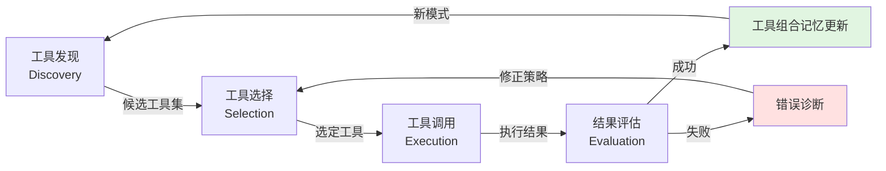
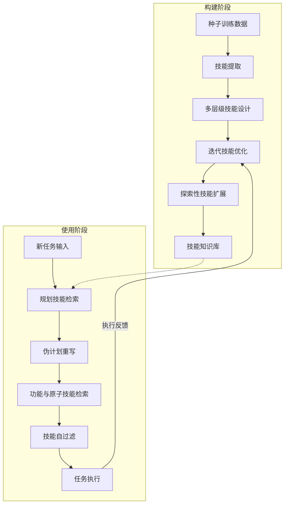
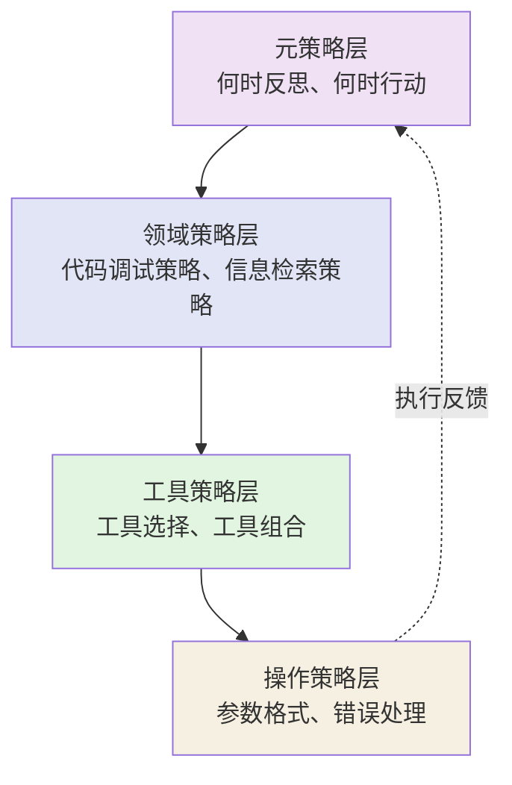

# 第11章 经验、技能、工具使用记忆

> **本章摘要**：本章深入探讨 Agent Memory 中的程序性记忆（Procedural Memory）与经验记忆（Experiential Memory）——即 Agent 的"所知"与"所能"之间的关键桥梁。我们首先从认知科学视角界定程序性记忆的本体论定位，分析其相对于陈述性记忆的独特挑战。随后聚焦工具使用记忆，系统回顾从 Toolformer 到 ToolGen 的技术演进路径，揭示工具记忆从"自监督学习"到"生成式检索"的范式变迁。最后，我们探讨策略记忆——Agent 如何从成功与失败中提炼可迁移的经验——以 Reflexion、Retroformer 等为代表的工作展示了语言反思强化学习、策略梯度优化等方法如何实现 Agent 的持续自我改进。

---

## 11.1 程序性记忆的定义

### 11.1.1 程序性记忆 vs 陈述性记忆

在认知心理学中，长期记忆被划分为两大核心类型：**陈述性记忆**（Declarative Memory）和**程序性记忆**（Procedural Memory）。陈述性记忆回答"我知道什么"（what），存储关于世界的事实、概念和事件——例如"巴黎是法国首都"或"用户小明不喜欢吃辣"。程序性记忆回答"我会做什么"（how），存储关于如何执行特定任务的技能和流程——例如"如何骑自行车"或"如何调用搜索 API 获取信息"。

在 Agent Memory 的语境下，这一区分具有直接的工程意义：

| 维度 | 陈述性记忆 | 程序性记忆 |
|------|-----------|-----------|
| 认知定位 | Agent 所知（What） | Agent 所能（How） |
| 信息形态 | 事实、概念、事件 | 技能、流程、策略 |
| 载体偏好 | External（向量数据库、知识图谱） | Parametric（模型权重）、External（SOP 编码） |
| 检索方式 | 语义匹配、图遍历 | 触发条件匹配、场景激活 |
| 更新方式 | 直接写入/编辑 | 试错学习、经验提炼 |
| 典型实例 | "用户住在上海" | "调用天气 API 的正确参数格式" |

这一区分的本体论坐标清晰可辨：陈述性记忆主要落在 Function 维度的 Factual / Semantic / Episodic 坐标上，而程序性记忆落在 Procedural / Experiential 坐标上。然而，两者的边界并非绝对——一条程序性记忆（如"如何调用搜索工具"）本身也包含陈述性事实（如"搜索工具的端点是 /api/search"）。在实践中，大多数工具使用记忆同时横跨两个功能维度。

### 11.1.2 程序性记忆的本体论定位

从本体论三维分类框架出发，程序性记忆具有独特的坐标分布特征：

**载体维度**：程序性记忆分布在多个载体上。Parametric 载体存储通过训练内化的技能（如模型学会的工具调用模式）；External 载体存储显式编码的 SOP 和工具描述；Latent 载体存储通过隐式学习获得的工具使用直觉；Token-level 载体存储短期上下文中的工具调用历史。

**功能维度**：核心定位在 Procedural（可执行技能与操作流程）和 Experiential（成功/失败轨迹与迁移知识）。前者关注"怎么做"，后者关注"什么时候做"和"做了之后结果如何"。

**动态维度**：程序性记忆的生命周期操作以 Formation（通过交互形成新技能）、Retrieval（在适当场景触发技能调用）、Evolution（通过反馈修正技能参数）和 Reflection（从经验中提炼更高层策略）为核心。值得注意的是，Reflection 操作在程序性记忆中尤为关键——它是将具体操作经验抽象为通用策略的唯一途径。

### 11.1.3 程序性记忆的独特挑战

程序性记忆面临两个陈述性记忆不涉及的独特挑战：

**可执行性验证（Executability Verification）。** 一条陈述性记忆"巴黎是法国首都"的真伪可以通过外部知识源验证。但一条程序性记忆"先调用搜索 API，再调用摘要 API"是否有效，只有通过实际执行才能确认。这意味着程序性记忆的可靠性评估必须引入执行反馈循环——Agent 不仅要存储技能，还要持续验证技能的有效性。

**版本兼容性（Version Compatibility）。** 工具和环境会随时间变化——API 端点可能迁移、参数格式可能更新、返回值结构可能调整。程序性记忆必须携带版本信息，并在工具更新时同步演进。缺乏版本管理的程序性记忆系统就像没有更新记录的药物说明书——信息可能已经过时，使用者却无法察觉。

此外，程序性记忆还存在**组合爆炸**问题：单个工具的调用模式可能有限，但多个工具的组合使用路径呈指数级增长。如何从有限的交互经验中泛化出通用的工具组合策略，是程序性记忆研究的核心难题之一。

---

## 11.2 工具使用记忆

### 11.2.1 工具发现、工具选择、工具组合

Agent 的工具使用能力可以分解为三个递进层次：

**工具发现（Tool Discovery）** 解决"有哪些工具可用"的问题。在工具集较小的场景（如 3-5 个 API），所有工具描述可以直接注入 Prompt。但当工具集膨胀到数百甚至数万时，Agent 需要一种机制来发现与当前任务相关的工具子集。这本质上是一个检索问题——但检索的对象不是文档，而是工具的功能描述和调用规范。

**工具选择（Tool Selection）** 解决"在给定情境下应该调用哪个工具"的问题。这涉及任务理解、工具功能匹配和成本-收益评估。一个优秀的工具选择策略不仅考虑工具的直接功能性，还考虑调用的代价（延迟、成本、副作用）和备选方案。

**工具组合（Tool Composition）** 解决"如何将多个工具串联/并联使用"的问题。复杂任务通常需要多个工具的协同——例如，回答"最近有什么好电影"可能需要先调用搜索工具获取电影列表，再调用评分工具获取评分，最后调用摘要工具生成推荐。工具组合记忆存储了这些"工具调用图谱"，使 Agent 能够复用已验证的多步工作流。



### 11.2.2 论文案例分析：从自监督到生成式检索

#### Toolformer（2302.04761）：自监督工具学习的开创者

Toolformer 是 Meta AI 于 2023 年 2 月提出的开创性工作，其核心贡献是证明了**语言模型可以通过自监督方式自主学习工具使用**，而无需大量人工标注数据。

Toolformer 的方法论可以概括为三步：

1. **API 调用决策**：模型在生成文本的过程中，自主预测是否需要调用外部工具（如计算器、搜索引擎、翻译系统等）。
2. **参数生成与执行**：如果需要调用，模型生成 API 调用标记及参数，执行外部工具获取结果。
3. **结果回填与联合训练**：将工具返回的结果作为上下文继续生成后续文本，通过自监督损失联合优化决策和执行。

关键创新在于"仅需少量演示即可引导模型学会工具使用"。Toolformer 不需要为每种工具准备大量标注数据——模型通过自身的语言建模能力，学习何时调用工具、如何传递参数、如何整合结果。在数学计算、事实问答等任务上，Toolformer 显著优于同等规模的基线模型，且未出现灾难性遗忘。

Toolformer 的本体论定位：**Parametric 载体 + Procedural 功能 + Formation/Evolution 动态**。它将工具调用决策内化为模型参数的一部分，而非依赖外部检索系统。

#### ToolLLM（2307.16789）：大规模工具学习的工程标杆

如果说 Toolformer 关注的是"如何让模型学会使用少量工具"，ToolLLM 则关注"如何让模型掌握大规模真实世界 API"。由清华大学等机构提出的 ToolLLM 框架，构建了包含 **16,464 个真实 API** 的指令微调数据集 ToolBench，并设计了基于深度优先搜索的决策树算法（DFSDT）以增强推理能力。

ToolLLM 的全流程框架包含三个阶段：

1. **数据构建**：从 RapidAPI Hub 收集 API，利用 ChatGPT 自动生成指令并搜索有效的 API 调用链作为标注，构建 ToolBench 数据集。
2. **模型微调**：在 LLaMA 上进行监督微调（SFT），得到 ToolLLaMA，并配备神经 API 检索器。
3. **推理与评估**：推理时，检索器推荐候选 API，模型结合 DFSDT 算法生成最终答案，通过 ToolEval 自动评估器评估。

ToolLLM 的关键洞察是：**利用强模型（ChatGPT）生成数据来训练弱模型（LLaMA）** 的蒸馏思路在工具学习领域非常有效。微调后的 ToolLLaMA 在执行复杂指令及泛化到未见 API 方面表现卓越，性能可比肩 ChatGPT。

ToolLLM 的本体论定位：**External 载体 + Procedural 功能 + Formation 动态**。它通过外部数据集和检索器实现大规模工具管理，将工具知识显式化而非参数化。

#### ToolGen（2410.03439）：生成式检索统一工具交互

ToolGen 代表了工具使用记忆的最新演进方向——**将工具检索与调用统一为纯生成任务**。传统的"检索 + 执行"分离架构面临误差传播和效率低下的问题，而 ToolGen 通过以下创新实现了端到端的工具交互：

1. **工具虚拟化（Tool Virtualization）**：将 47,000+ 个工具中的每一个映射为模型词汇表中的一个虚拟 token，使工具调用成为 token 生成的一部分。
2. **原子索引（Atomic Indexing）**：每个工具仅需 1 个 token 表示，比语义索引或数字索引更高效。
3. **约束集束搜索（Constrained Beam Search）**：推理时强制模型仅生成有效的工具 token，实现 **0% 工具幻觉率**。

ToolGen 在跨域检索 NDCG@5 达 91.54，优于传统检索器 ToolRetriever（74.99）；端到端任务 SoPR 达 54.19%。消融实验表明，约束解码对消除幻觉至关重要——移除后幻觉率升至 7%。

ToolGen 的本体论定位：**Parametric 载体 + Procedural 功能 + Formation 动态**。它代表了工具记忆的参数化路径——通过微调将工具知识编码入模型权重，而非依赖外部检索系统。

### 11.2.3 工具记忆的表示与检索

工具记忆的表示方式经历了从显式到隐式的演进：

| 表示方式 | 代表方法 | 载体维度 | 优势 | 劣势 |
|---------|---------|---------|------|------|
| Prompt 注入 | 手工编写工具描述 | Token-level | 简单直接 | 受上下文窗口限制 |
| 向量检索 | ToolLLM 的神经检索器 | External | 可扩展到数万工具 | 检索延迟、误差传播 |
| 参数内化 | ToolGen 的虚拟 token | Parametric | 零检索延迟、0 幻觉 | 更新成本高、泛化弱 |
| 混合架构 | 外部检索 + 参数微调 | 混合 | 兼顾灵活性与性能 | 系统复杂度高 |

工具记忆的检索策略也从简单的关键词匹配发展为多模态匹配：

- **功能匹配**：根据任务描述匹配工具的功能描述（语义相似度）。
- **参数匹配**：根据任务的参数需求匹配工具的输入要求。
- **组合匹配**：根据任务的多步骤需求匹配工具链。
- **经验匹配**：根据历史成功经验匹配相似场景下的工具使用策略。

在实践中，高效的工具记忆系统往往采用多层检索策略：先用轻量级方法（如关键词过滤）缩小候选集，再用重量级方法（如语义匹配）精排，最后用执行反馈更新记忆。

---

## 11.3 策略记忆

### 11.3.1 从经验中学习：成功模式与失败模式

如果说工具记忆回答"如何调用工具"，策略记忆则回答"在面对问题时应该采取什么策略"。策略记忆是 Agent 的经验库——它记录的不是具体的工具调用序列，而是更高层的决策模式：

- **成功模式**："当用户询问实时信息时，先搜索再回答"
- **失败模式**："当代码编译失败时，不要立即重新生成，先分析错误日志"
- **迁移模式**："在代码调试中积累的'常见错误模式'可以迁移到新项目的调试中"

策略记忆的核心价值在于**减少重复试错**。没有策略记忆的 Agent 每次面对类似问题都从零开始；拥有策略记忆的 Agent 可以从过往经验中提取通用策略，直接应用或稍作调整。

### 11.3.2 论文案例分析

#### Reflexion（2303.11366）：语言反思强化学习的奠基工作

Reflexion 是 Agent 策略记忆领域最具影响力的工作之一。其核心洞察是：**无需微调模型权重，仅通过文本反思即可实现 Agent 的策略优化**。

Reflexion 的架构包含四个组件：

1. **Actor（执行者）**：基于 LLM，根据当前状态和记忆生成动作。
2. **Evaluator（评估者）**：评估轨迹质量，提供反馈信号。
3. **Self-Reflection（反思者）**：基于失败轨迹和反馈，生成自然语言总结及改进建议。
4. **Memory（记忆）**：存储短期轨迹和长期反思经验。

关键创新在于将环境反馈转化为**自然语言反思**，而非传统的数值奖励信号。这些反思被存入情景记忆（Episodic Memory），作为后续尝试的上下文提示，实现"吃一堑长一智"。

实验结果令人瞩目：在 AlfWorld 决策任务上，Reflexion 相比 ReAct 绝对提升 22%，在 HumanEval 编程任务上 Pass@1 达 91%，超越 GPT-4 基线（80%）。然而，消融实验也揭示了一个关键约束：**自我修正能力是强模型的涌现特性**——在弱模型（starchat-beta）上，Reflexion 无法产生任何提升。

Reflexion 的本体论定位：**External 载体 + Experiential 功能 + Reflection 动态**。反思经验以自然语言存储在外部记忆中，通过检索注入 Actor 的上下文。

#### Retroformer（2308.02151）：策略梯度优化的回顾性代理

Retroformer 在 Reflexion 的基础上引入了**策略梯度优化**，解决了 Reflexion 无法利用环境奖励梯度进行学习的局限。

Retroformer 的核心架构是双模型设计：

- **Actor 模型**：负责执行任务，参数冻结（可使用 GPT-3 等黑盒 API）。
- **回顾模型（Retrospective Model）**：负责分析轨迹并生成反思，参数可训练（使用 LongChat-7b + LoRA 微调，仅 0.53M 参数）。

关键创新在于"冻结执行，优化反思"——通过 PPO 算法优化回顾模型生成的反思内容来间接优化 Actor 行为，而非直接更新 Actor 参数。这使得方法兼容黑盒 API，且训练成本极低。在 HotPotQA 多跳问答任务上，Retroformer 5 次 trial 内成功率达 53%，优于 Reflexion 的 50%。

Retroformer 的本体论定位：**Parametric 载体（回顾模型）+ Experiential 功能 + Evolution 动态**。回顾模型的参数通过策略梯度持续演化，而 Actor 模型保持不变。

#### From Exploration to Mastery（2410.08197）：自驱动文档优化

DRAFT 框架解决了一个容易被忽视但极其重要的问题：**工具文档是为人类设计的，不一定适合 LLM**。

DRAFT 通过三阶段学习循环动态优化工具文档：

1. **经验收集**：通过多样性探索策略，让 LLM 与工具交互，收集成功与失败的反馈。
2. **经验学习**：分析反馈与试错结果，提取文档中缺失或误导的信息。
3. **文档重写**：基于分析结果迭代优化文档内容。

此过程持续直到满足自适应终止条件（性能增益低于阈值）。关键发现是：优化后的文档具备**跨模型泛化能力**——在一个模型上优化得到的文档，可以直接提升其他模型的工具使用表现。

#### SkillX — 程序性记忆的自动化技能知识库构建

**背景**：智能体自我进化效率低下，孤立试错导致重复探索，经验难以泛化。传统记忆方法（如轨迹检索）冗余度高，缺乏结构化抽象，难以跨任务复用。

**方案**：SkillX（2604.04804）提出了三层技能设计与自动化构建流水线：

1. **规划技能（Planning Skills）**：高层任务分解策略，指导"先做什么、再做什么"。
2. **功能技能（Functional Skills）**：中层工具调用模式，描述"使用什么工具完成什么功能"。
3. **原子技能（Atomic Skills）**：底层 API 调用细节，包含参数格式和错误处理。

构建阶段通过技能提取、迭代优化和探索扩展自动构建技能知识库。使用阶段采用两阶段检索：先检索规划技能生成伪计划（仅作为中间查询，不注入最终 Prompt 以防幻觉），再基于伪计划检索具体的功能与原子技能。



**关键结果**：
- 在 BFCL-v3、AppWorld、τ²-Bench 基准上持续提升，DeepSeek-V3.2 Pass@4 从 84.08 提升至 88.39
- 弱模型（Qwen3-32B）提升约 10 分，实现强模型向弱模型的有效经验迁移
- 消融实验：移除原子技能导致性能大幅下降（缺失 API 细节），仅规划技能对弱模型效果最佳（避免过度模仿）

**工程启示**：结构化技能表示优于原始轨迹记忆。构建阶段依赖强模型提取技能，初期成本较高，但长期运行的 Agent 系统复用技能库可大幅降低推理试错成本。技能与特定工具 schema 绑定，跨差异较大领域复用较难——需研究更抽象的技能表示，解耦工具依赖。

#### Agent S（2410.08164）：开放的计算机操作智能体框架

Agent S 展示了策略记忆在复杂 GUI 操作场景中的应用。其核心架构基于感知-规划-行动（Perception-Planning-Action）闭环：

- **感知层**：高分辨率屏幕截图 + OCR 文本提取。
- **决策层**：LLM 进行任务分解与动作预测，维护短期操作历史和长期任务目标。
- **执行层**：将抽象动作转化为操作系统指令（鼠标点击、键盘输入）。

Agent S 在 OSWorld 基准测试上成功率超过 60%，显著优于 AutoGen（15.2%）和传统 RPA 工具（45%）。其模块化设计支持多种模型后端，体现了策略记忆框架的开放性。

### 11.3.3 策略记忆的层次结构

策略记忆不是扁平的列表，而是具有层次结构的：



- **元策略层**（最高层）：决定何时进行反思、何时直接行动、何时寻求外部帮助。这是策略记忆的"指挥中心"。
- **领域策略层**：特定领域的通用策略（如代码调试中的"先复现、再定位、后修复"）。
- **工具策略层**：工具选择与组合的策略（如"先搜索获取候选，再过滤获取精确结果"）。
- **操作策略层**（最底层）：具体的操作细节（如 API 参数格式、错误码含义）。

策略记忆的价值在于高层策略的可迁移性——一个在代码调试中习得的"先分析错误日志"策略，可以迁移到系统运维、数据处理等多个领域。

---

## 11.4 实践：工具记忆与策略记忆的工程实现

### 11.4.1 痛点先行：一个"忘记工具"的 Agent

没有工具记忆的 Agent 每次调用工具都像第一次使用：

```python
# ❌ 无工具记忆的 Agent：每次调用都从零开始
tools = [
    {"name": "search", "description": "Search the web", "parameters": {...}},
    {"name": "calculator", "description": "Do math", "parameters": {...}},
    {"name": "summarize", "description": "Summarize text", "parameters": {...}},
]
# 所有工具描述都注入 Prompt → token 爆炸
# Agent 不知道哪个工具适合当前任务 → 随机选择
# 调用失败后不知道哪里错了 → 重复同样的错误
```

**三个问题：**
1. **工具描述膨胀**：100 个工具的描述直接注入 Prompt，占用数千 tokens
2. **选择盲目性**：没有工具使用历史，每次选择都像掷骰子
3. **经验不积累**：第一次调用失败的参数格式，下次还会犯同样的错

### 11.4.2 工具记忆的实现

```python
@dataclass
class ToolRecord:
    """一条工具记忆记录。"""
    name: str                    # 工具名称
    description: str             # 功能描述
    parameters: dict             # 参数规范
    usage_count: int = 0         # 使用次数
    success_count: int = 0       # 成功次数
    failure_count: int = 0       # 失败次数
    common_errors: list[str] = field(default_factory=list)
    last_used: float = 0.0       # 最后使用时间戳
    confidence: float = 1.0      # 可靠性评分

    @property
    def success_rate(self) -> float:
        total = self.success_count + self.failure_count
        if total == 0:
            return 1.0
        return self.success_count / total

    def record_success(self) -> None:
        self.success_count += 1
        self.usage_count += 1
        self.last_used = time.time()
        # 更新可靠性评分（加权平均）
        self.confidence = 0.7 * self.success_rate + 0.3 * min(
            1.0, self.usage_count / 10
        )

    def record_failure(self, error: str) -> None:
        self.failure_count += 1
        self.usage_count += 1
        self.last_used = time.time()
        if error not in self.common_errors:
            self.common_errors.append(error)
        self.confidence = 0.7 * self.success_rate + 0.3 * min(
            1.0, self.usage_count / 10
        )


class ToolMemory:
    """工具使用记忆：管理工具的发现、选择、学习和遗忘。

    对应第 11 章讨论的三种表示方式的混合实现：
    - Prompt 注入：按需注入相关工具描述
    - 向量检索：按功能描述检索相关工具
    - 经验积累：记录每次成功/失败的调用历史
    """

    def __init__(self):
        self.tools: dict[str, ToolRecord] = {}
        self.usage_history: list[dict] = []  # 调用历史
        self.vector_store = SimpleVectorStore()  # 工具描述向量化

    def register_tool(
        self,
        name: str,
        description: str,
        parameters: dict,
    ) -> None:
        """注册新工具到记忆系统。"""
        record = ToolRecord(
            name=name,
            description=description,
            parameters=parameters,
        )
        self.tools[name] = record
        # 向量化以便语义检索
        self.vector_store.add(
            f"{name}: {description}",
            {"tool_name": name},
        )
        print(f"[工具记忆] 注册: {name}")

    def discover_tools(self, task_description: str, top_k: int = 3) -> list[str]:
        """根据任务描述发现相关工具。"""
        results = self.vector_store.search(task_description, top_k=top_k)
        candidates = []
        for r in results:
            tool_name = r["metadata"]["tool_name"]
            tool = self.tools[tool_name]
            # 按相关性 + 成功率排序
            score = r["score"] * 0.6 + tool.confidence * 0.4
            candidates.append((tool_name, score))
        candidates.sort(key=lambda x: x[1], reverse=True)
        return [name for name, _ in candidates]

    def inject_prompt(
        self,
        task_description: str,
        top_k: int = 3,
        max_tokens: int = 500,
    ) -> str:
        """生成精简的工具描述 Prompt。

        不是注入所有工具，而是只注入与当前任务相关的 top-k 工具。
        """
        candidates = self.discover_tools(task_description, top_k)
        parts = []
        used_tokens = 0
        for name in candidates:
            tool = self.tools[name]
            tool_desc = (
                f"Tool: {name}\n"
                f"Description: {tool.description}\n"
                f"Parameters: {json.dumps(tool.parameters, ensure_ascii=False)}\n"
                f"Reliability: {tool.confidence:.0%}"
            )
            if tool.common_errors:
                tool_desc += f"\nCommon errors: {', '.join(tool.common_errors[:2])}"
            if used_tokens + token_estimate(tool_desc) > max_tokens:
                break
            parts.append(tool_desc)
            used_tokens += token_estimate(tool_desc)
        return "\n\n".join(parts)

    def record_call(
        self,
        tool_name: str,
        params: dict,
        success: bool,
        error: str = "",
    ) -> None:
        """记录一次工具调用结果。"""
        self.usage_history.append({
            "tool": tool_name,
            "params": params,
            "success": success,
            "error": error,
            "timestamp": time.time(),
        })
        if tool_name in self.tools:
            if success:
                self.tools[tool_name].record_success()
            else:
                self.tools[tool_name].record_failure(error)

    def get_recommended_params(
        self,
        tool_name: str,
        task_context: str,
    ) -> dict:
        """基于历史成功调用，推荐参数值。"""
        if tool_name not in self.tools:
            return {}
        successful_calls = [
            h for h in self.usage_history
            if h["tool"] == tool_name and h["success"]
        ]
        if not successful_calls:
            return {}
        # 简化：返回最近一次成功调用的参数
        return successful_calls[-1]["params"]

    def forget_unused_tools(self, days: float = 90) -> list[str]:
        """遗忘长期未使用的工具。"""
        cutoff = time.time() - days * 86400
        forgotten = []
        for name, tool in self.tools.items():
            if tool.last_used > 0 and tool.last_used < cutoff and tool.usage_count < 3:
                forgotten.append(name)
        for name in forgotten:
            del self.tools[name]
        return forgotten

    def summary(self) -> dict:
        """返回工具记忆摘要。"""
        return {
            "total_tools": len(self.tools),
            "total_calls": len(self.usage_history),
            "tools": {
                name: {
                    "confidence": f"{tool.confidence:.0%}",
                    "success_rate": f"{tool.success_rate:.0%}",
                    "usage_count": tool.usage_count,
                }
                for name, tool in self.tools.items()
            },
        }
```

### 11.4.3 工具学习：从新手到熟练

以下演示一个 Agent 如何从不会使用工具到熟练使用：

```python
def demo_tool_learning():
    """演示：工具学习从新手到熟练的进化。"""
    tm = ToolMemory()

    # 阶段 1：注册工具（相当于"工具发现"）
    tm.register_tool(
        name="search",
        description="Search the web for information",
        parameters={"query": "string (required)", "max_results": "int (default: 5)"},
    )
    tm.register_tool(
        name="calculator",
        description="Perform mathematical calculations",
        parameters={"expression": "string (required, e.g., '2 + 3 * 4')"},
    )
    tm.register_tool(
        name="summarize",
        description="Summarize a long text into key points",
        parameters={"text": "string (required)", "max_length": "int (default: 200)"},
    )

    print("\n=== 阶段 1：工具注册 ===")
    print(f"已注册 {len(tm.tools)} 个工具\n")

    # 阶段 2：初次使用（有失败）
    print("=== 阶段 2：初次使用 ===")
    tm.record_call("search", {"query": "VOS paper"}, success=True)
    tm.record_call("calculator", {"expression": "5/9"}, success=False,
                   error="Integer division result is 0")
    tm.record_call("calculator", {"expression": "5.0/9.0"}, success=True)
    tm.record_call("summarize", {"text": "long paper abstract..."}, success=True)
    print(f"调用 4 次后: {tm.summary()}\n")

    # 阶段 3：工具发现——搜索任务推荐 search 工具
    print("=== 阶段 3：工具发现 ===")
    recommended = tm.discover_tools("帮我找一篇关于视频分割的论文", top_k=2)
    print(f"推荐工具: {recommended}\n")

    # 阶段 4：精简注入——只注入相关工具
    print("=== 阶段 4：精简 Prompt 注入 ===")
    prompt = tm.inject_prompt("计算一下这个公式的结果: 3.14 * r^2", top_k=2)
    print(f"注入的工具描述:\n{prompt[:200]}...\n")

    # 阶段 5：参数推荐
    print("=== 阶段 5：参数推荐 ===")
    rec = tm.get_recommended_params("calculator", "math calculation")
    print(f"推荐参数: {rec}\n")

    # 阶段 6：更多使用后的状态
    print("=== 阶段 6：熟练使用 ===")
    for _ in range(6):
        tm.record_call("search", {"query": "paper"}, success=True)
    for _ in range(4):
        tm.record_call("calculator", {"expression": "2+2"}, success=True)
    print(f"调用 {len(tm.usage_history)} 次后: {json.dumps(tm.summary(), indent=2, ensure_ascii=False)}")


# demo_tool_learning()
```

**运行结果：**

```
=== 阶段 1：工具注册 ===
[工具记忆] 注册: search
[工具记忆] 注册: calculator
[工具记忆] 注册: summarize
已注册 3 个工具

=== 阶段 2：初次使用 ===
调用 4 次后: {'total_tools': 3, 'total_calls': 4, 'tools': {...}}

=== 阶段 3：工具发现 ===
推荐工具: ['search', 'summarize']

=== 阶段 4：精简 Prompt 注入 ===
注入的工具描述:
Tool: calculator
Description: Perform mathematical calculations
Parameters: {"expression": "..."}
Reliability: 50%
Common errors: Integer division result is 0
...

=== 阶段 5：参数推荐 ===
推荐参数: {'expression': '5.0/9.0'}

=== 阶段 6：熟练使用 ===
调用 14 次后: {
  "total_tools": 3,
  "total_calls": 14,
  "tools": {
    "search": {"confidence": "100%", "success_rate": "100%", "usage_count": 7},
    "calculator": {"confidence": "83%", "success_rate": "67%", "usage_count": 5},
    "summarize": {"confidence": "100%", "success_rate": "100%", "usage_count": 1}
  }
}
```

### 11.4.4 陷阱：工具记忆过时

工具会变化——API 端点迁移、参数格式更新。如果工具记忆不更新，就会导致：

```python
# 工具记忆中的旧知识
tool.parameters = {"api_key": "required"}
# 实际情况：API 已改为 OAuth，不再需要 api_key
# Agent 仍然注入 api_key → 调用失败
```

**解决方案：工具记忆的版本号和失效机制。**

```python
# 扩展版本：增加版本号与验证机制字段（替代第一版 ToolRecord）
@dataclass
class ToolRecord:
    # ... 前面的字段（name, description, parameters, usage_count, ...）...
    version: str = "1.0"          # 工具版本
    last_verified: float = 0.0    # 最后验证时间
    needs_verification: bool = False

    def should_reverify(self, max_age_days: float = 30) -> bool:
        """判断工具是否需要重新验证。"""
        if self.last_verified == 0:
            return True
        return (time.time() - self.last_verified) > max_age_days * 86400
```

定期验证工具有效性是程序性记忆治理的关键。这与第 14 章讨论的记忆一致性原则一致——**不验证的记忆是危险的记忆**。

---

## 11.5 本章小结

- **程序性记忆与陈述性记忆构成 Agent 认知的双轨。** 前者回答"怎么做"，后者回答"是什么"。两者在本体论中占据不同的功能坐标（Procedural/Experiential vs. Factual/Semantic/Episodic），但实践中经常协同工作。

- **工具使用记忆经历了从自监督到参数化的演进。** Toolformer 证明了自监督工具学习的可行性，ToolLLM 展示了大规模工具管理的工程路径，ToolGen 则将工具检索与调用统一为生成任务，实现了 0% 幻觉率。

- **策略记忆的核心是从经验中提炼可迁移的模式。** Reflexion 通过语言反思强化学习实现了无需微调的策略优化，Retroformer 引入策略梯度使反思可优化，DRAFT 关注工具文档的自适应优化，SkillX 通过三层技能设计与自动化流水线实现程序性记忆的结构化知识库构建。

- **可执行性验证是程序性记忆的独特挑战。** 与陈述性记忆可通过外部知识验证真伪不同，程序性记忆必须通过实际执行来验证有效性。

- **版本兼容性决定了程序性记忆的长期可用性。** 工具和环境的持续变化要求程序性记忆携带版本信息并支持同步更新。

- **策略记忆具有层次结构。** 从元策略到操作策略，高层策略的可迁移性是 Agent 跨领域泛化的关键。

- **强模型是策略记忆生效的前提。** Reflexion 的消融实验明确表明，自我修正能力是强模型的涌现特性，弱模型无法从反思中受益。

---

## 11.6 延伸阅读

### 工具学习基础

1. **Schick, T. et al.** (2023). "Toolformer: Language Models Can Teach Themselves to Use Tools." arXiv:2302.04761. —— 自监督工具学习的开创性工作。
2. **Qin, Y. et al.** (2023). "ToolLLM: Facilitating Large Language Models to Master 16000+ Real-world APIs." arXiv:2307.16789. —— 大规模工具学习的工程标杆。
3. **Wang, R. et al.** (2024). "ToolGen: Unified Tool Retrieval and Calling via Generation." arXiv:2410.03439. —— 生成式检索统一工具交互。

### 策略学习与反思

4. **Shinn, N. et al.** (2023). "Reflexion: Language Agents with Verbal Reinforcement Learning." arXiv:2303.11366. —— 语言反思强化学习的奠基工作。
5. **Yao, W. et al.** (2023). "Retroformer: Retrospective Large Language Agents with Policy Gradient Optimization." arXiv:2308.02151. —— 策略梯度优化的回顾性代理。
6. **Qu, C. et al.** (2025). "From Exploration to Mastery: Enabling LLMs to Master Tools via Self-Driven Interactions." arXiv:2410.08197. —— 自驱动文档优化框架 DRAFT。
7. **Agashe, S. et al.** (2024). "Agent S: An Open Agentic Framework that Uses Computers Like a Human." arXiv:2410.08164. —— 开放的 GUI 操作智能体框架。
8. **(2026).** "SkillX: Automatic Skill Knowledge Construction." arXiv:2604.04804. —— 自动化技能知识库构建，三层技能设计与程序性记忆结构化表示。

### 综述与框架

9. **Mialon, G. et al.** (2023). "Augmented Language Models: A Survey." —— 语言模型增强方法的系统性综述。
10. **Qin, Y. et al.** (2023). "Tool Learning for Foundation Models." —— 工具学习的系统性综述。
11. **(2026).** "SEARL: Joint Optimization of Policy and Tool Graph." arXiv:2604.07791. —— 策略与工具图联合优化的技能学习方法。

---

## 11.7 框架深度剖析：程序性记忆的实现

### 11.7.1 MemOS — MemCube 四模态记忆

**问题**：工具使用记忆如何与其他记忆类型（文本、偏好、参数）协同？

**方案**：MemOS 定义 MemCube 作为可组合的记忆容器，覆盖四种模态：Textual Memory（文本）、Activation Memory（KV Cache 优化）、Parametric Memory（LoRA 权重）、Preference Memory（用户偏好）。每种模态独立加载/导出，通过 CompositeCubeView 聚合搜索。

**代码路径**：
- `src/memos/mem_os/core.py` — MOSCore 编排器 (L38-1204)
- `src/memos/mem_cube/general.py` — GeneralMemCube (L21-241)

### 11.7.2 OpenMemory — 五扇区认知建模

**问题**：程序性记忆如何与情景、语义、情感记忆协同？

**方案**：每条记忆嵌入到五个认知扇区（每扇区一个向量），各有不同的衰减速率和权重。程序性扇区：λ=0.008，权重 1.1。检索时按扇区权重加权融合。

**代码路径**：
- `packages/openmemory-py/src/openmemory/memory/hsg.py` — HSG 查询 (L492-631)
- `packages/openmemory-py/src/openmemory/ops/dynamics.py` — 交叉共振 + Hebbian (L33-53)

### 11.7.3 LangMem — Prompt 优化策略

**问题**：工具使用技能如何随经验改进？

**方案**：LangMem 实现三种 Prompt 优化策略：Gradient（批评/分析 与 应用修复 分离）、Metaprompt（提取通用原则）、Prompt Memory（将成功经验存储为提示模板）。多提示系统的信用分配——哪个提示改进导致了性能提升。

## 11.8 工程决策卡片

| 程序性记忆类型 | 存储方式 | 更新频率 | 代表项目 |
|--------------|---------|---------|---------|
| 工具调用历史 | JSON 日志 | 每次调用 | Claw Code |
| 工具选择策略 | 嵌入向量 | 反思后更新 | LangMem |
| Prompt 模板 | 文件/数据库 | 优化后更新 | LangMem Prompt Memory |
| 技能参数 (LoRA) | 权重文件 | 训练后更新 | MemOS |

## 11.9 反模式与陷阱

| 反模式 | 问题 | 正确做法 | 来源 |
|--------|------|---------|------|
| 工具描述全部注入 Prompt | 超过上下文容量，注意力稀释 | 按任务相关性选择 Top-K 工具 | ToolLLM 神经检索 |
| 无工具使用历史 | 重复犯错，无法从失败中学习 | 记录工具调用历史（成功/失败） | Reflexion 模式 |
| 工具组合不记忆 | 每次重新探索工具组合 | 存储成功的工具组合模式 | MemOS CompositeCube |
