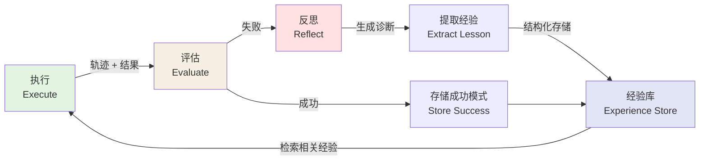
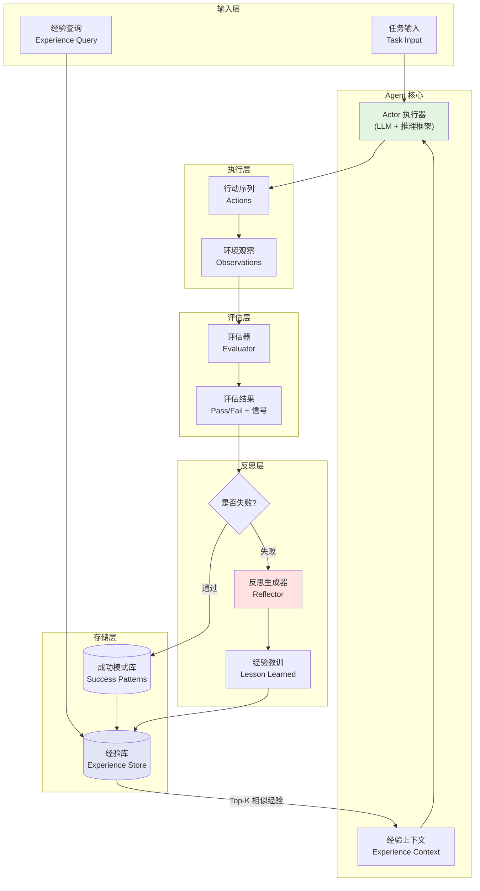
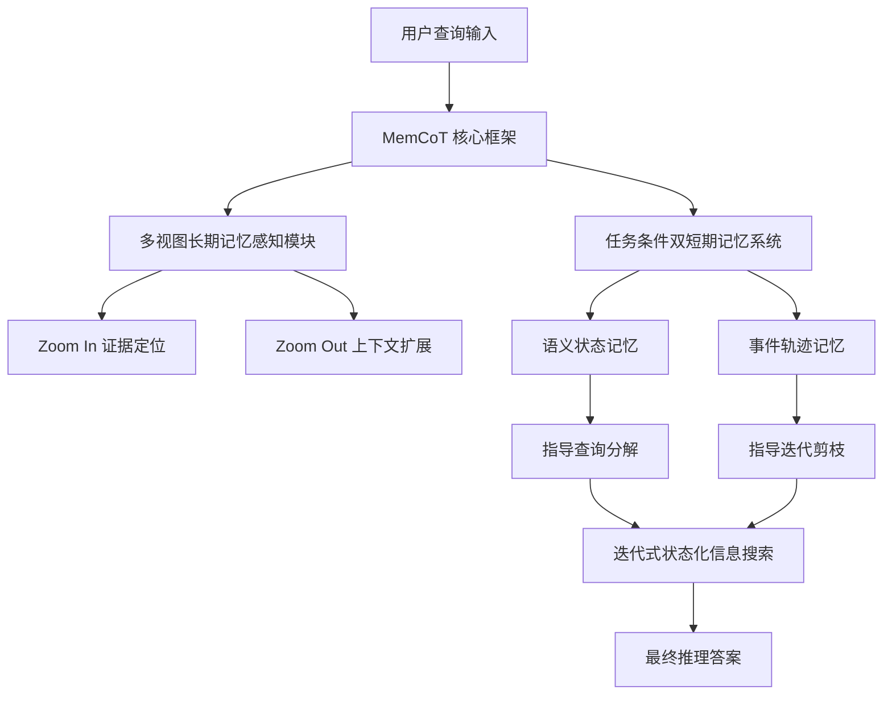
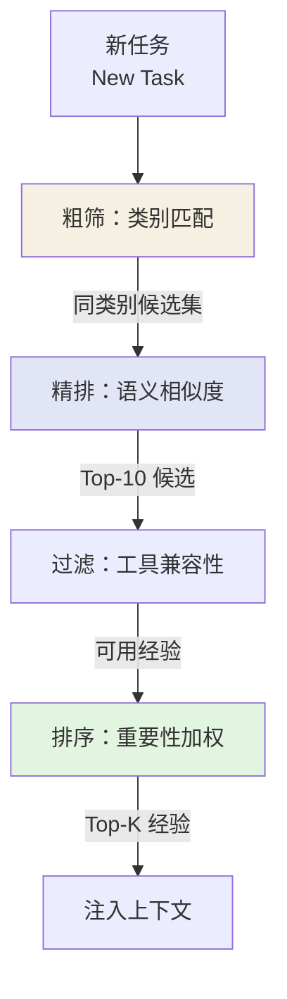
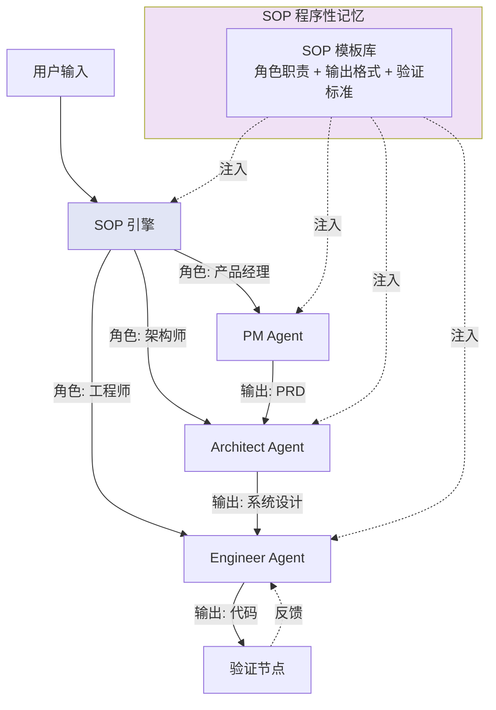
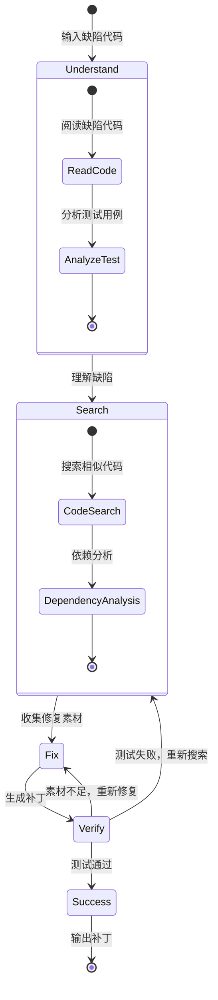

# 第12章 自我反思与经验积累系统（实践章）

> **本章摘要**：本章是全书的实践章节，聚焦 Agent 自我反思与经验积累系统的工程实现。我们首先设计完整的反思循环架构，将 Reflexion 的语言反思强化学习思想转化为可落地的系统组件。随后展开经验表示与检索的工程实现，展示如何结构化存储成功/失败案例并进行相似情境匹配。接着探讨工具使用记忆的模块化设计，实现工具调用历史的记录与策略优化。最后，我们分析多 Agent 协作中的程序性记忆——从 MetaGPT 的 SOP 编码到 FinCon 的层级化记忆管理，再到 RepairAgent 的自主修复策略——揭示多智能体系统中程序性记忆共享与复用的工程路径。

---

## 12.0 反思循环架构

### 12.0.1 行动 → 结果评估 → 反思 → 经验存储 → 下次改进

反思循环是 Agent 实现持续自我改进的核心机制。其基本流程如下：



一个完整的反思循环包含五个阶段：

1. **执行（Execute）**：Agent 基于当前知识和策略执行任务，产生完整的行动轨迹（trajectory）和最终结果。
2. **评估（Evaluate）**：系统对执行结果进行评估。评估信号可以来自多种来源：精确匹配（Exact Match）、启发式规则、外部验证器（如代码编译/测试通过）、或 LLM 自评。
3. **反思（Reflect）**：当执行失败或结果不理想时，反思模块分析失败轨迹，生成自然语言诊断和改进建议。这是 Reflexion 框架的核心创新——将数值奖励信号转化为可理解、可存储、可迁移的文本反思。
4. **经验存储（Store）**：将成功模式和失败诊断结构化为经验记录，存入经验库。每条经验记录包含情境描述、行动序列、结果评估、反思内容和适用条件。
5. **下次改进（Improve）**：在后续任务中，系统从经验库中检索与当前情境相似的经验记录，将其作为上下文提示注入 Agent 的推理过程，指导更优的行动选择。

### 12.0.2 基于 Verbal Reinforcement 的 Reflexion 实现

Reflexion 的核心理念是将强化学习的思想用自然语言实现——不是通过梯度下降更新模型参数，而是通过文本反思更新上下文提示。其工程实现的关键组件如下：

**Actor（执行者）**：基于 LLM 的核心推理模块，支持多种推理框架（ReAct、CoT 等）。Actor 接收任务输入和相关的经验记忆，生成行动序列。

**Evaluator（评估者）**：评估执行结果的模块。评估方式取决于任务类型：
- 编程任务：通过单元测试判断正确性。
- 问答任务：通过精确匹配或 F1 分数评估。
- 决策任务：通过环境反馈（是否达到目标状态）评估。

**Self-Reflection（反思者）**：基于失败轨迹和评估反馈生成反思的模块。反思提示词的设计至关重要：

```
任务：{task_description}
你的尝试：{trajectory}
执行结果：{evaluation_result}

请分析失败原因，并给出改进建议：
1. 你犯了什么错误？
2. 导致错误的根本原因是什么？
3. 下次遇到类似情况，你应该怎么做？
```

**Memory（记忆模块）**：存储短期轨迹和长期反思经验。短期记忆以滑动窗口方式保留最近 1-3 次尝试的轨迹；长期记忆以向量索引方式存储结构化反思经验，支持语义检索。

### 12.0.3 完整反思循环架构图



---

### 12.0.4 最新进展：测试时记忆扩展

> **注**：本节基于 2026 年最新研究成果（ACM MM '26 顶会论文）。

#### MemCoT — 记忆驱动的链式思考测试时缩放

**背景**：大模型在海量碎片化长上下文因果推理中存在严重幻觉和灾难性遗忘。现有记忆机制通常将检索视为静态单步被动匹配，导致语义稀释和上下文碎片化。

**方案**：MemCoT（2604.08216）提出了测试时记忆缩放框架（Test-Time Memory Scaling），将长上下文推理转化为迭代式状态化信息搜索过程：

1. **多视图长期记忆感知模块**：实现 Zoom In 证据定位（精细检索关键片段）和 Zoom Out 上下文扩展（扩大检索范围），动态调整记忆粒度。
2. **任务条件双短期记忆系统**：语义状态记忆记录历史搜索决策，事件轨迹记忆记录已探索的信息路径，指导迭代剪枝。



**关键结果**：
- LoCoMo 基准平均 F1 分数达 58.03%，单跳任务 64.8%
- 在多跳、时序、开放域等子任务上均表现优异
- 支持开源和闭源模型，具有良好的模型兼容性

**工程启示**：将记忆检索从被动匹配转变为主动迭代搜索是解决长上下文问题的关键思路。需关注迭代搜索带来的延迟优化——通过动态查询分解和剪枝优化搜索路径。Zoom In/Out 机制带来的额外 Token 消耗需在实际应用中权衡。

MemCoT 的迭代搜索与本章的反思循环存在内在一致性：两者都将"失败/不确定性"视为触发记忆检索的信号，而非单次执行终点。MemCoT 的 Zoom In/Out 机制可视为 12.0.1 节"评估-反思-改进"循环在长上下文检索维度的具体化。

## 12.1 经验表示与检索

### 12.1.1 成功/失败案例的结构化存储

经验不是自由文本——它是结构化的知识单元。一条完整的经验记录应包含以下字段：

```python
@dataclass
class ExperienceRecord:
    # 核心标识
    id: str                          # 唯一标识符
    timestamp: datetime              # 创建时间

    # 情境描述
    task_description: str            # 任务描述
    task_category: str               # 任务类别（如 "code_debug", "qa", "planning"）
    context_features: dict           # 情境特征（如 工具列表、输入格式、约束条件）

    # 行动序列
    trajectory: list[Action]         # 行动序列（工具调用、中间状态）
    total_steps: int                 # 总步数
    total_tokens: int                # Token 消耗

    # 结果评估
    outcome: Literal["success", "failure", "partial"]  # 结果
    evaluation_signal: dict          # 评估信号（如 测试通过率、F1分数）
    error_type: Optional[str]        # 失败类型（如 "tool_not_found", "parameter_error"）

    # 反思内容
    reflection: Optional[str]        # 自然语言反思
    key_lessons: list[str]           # 关键教训（结构化提取）
    improvement_suggestions: list[str]  # 改进建议

    # 元数据
    importance: float                # 重要性评分 (0-1)
    access_count: int                # 访问次数
    last_accessed: datetime          # 最后访问时间
    embedding: Optional[list[float]] # 语义嵌入向量

    # 关联
    related_experiences: list[str]   # 相关经验 ID
    derived_from: Optional[str]      # 衍生自哪个经验（如果适用）
```

这种结构化设计的优势在于：
- **可检索性**：通过 `embedding` 支持语义检索，通过 `task_category` 和 `error_type` 支持分类过滤。
- **可演化性**：通过 `access_count` 和 `last_accessed` 实现重要性衰减，通过 `related_experiences` 建立经验间的关联。
- **可诊断性**：通过 `error_type` 和 `key_lessons` 实现失败模式的统计分析。

### 12.1.2 相似情境匹配与策略复用

经验检索的核心挑战是**情境匹配**——如何判断当前任务与历史经验是否"相似"。我们采用多层匹配策略：



1. **类别匹配（Category Filter）**：首先通过 `task_category` 快速过滤，只考虑同类别的经验。这一步将检索空间从全局缩小到子集。
2. **语义相似度（Semantic Similarity）**：对候选经验进行向量相似度计算，使用 `task_description` 的嵌入向量与当前任务描述进行余弦相似度匹配。
3. **工具兼容性（Tool Compatibility）**：检查经验中使用的工具集是否在当前可用工具集中。如果经验依赖于已废弃的工具，应降权或排除。
4. **重要性加权（Importance Weighting）**：最终排序综合考虑语义相似度、重要性评分和时效性：

```python
def score_experience(exp: ExperienceRecord, query: str, available_tools: set) -> float:
    """综合评分函数"""
    # 语义相似度
    sim = cosine_similarity(query_embedding, exp.embedding)

    # 重要性（访问频率衰减）
    importance = exp.importance * log1p(exp.access_count)

    # 时效性衰减（指数衰减，半衰期 30 天）
    days_since = (datetime.now() - exp.timestamp).days
    recency = exp(-days_since * ln(2) / 30)

    # 工具兼容性惩罚
    used_tools = extract_tools(exp.trajectory)
    compat = 1.0 if used_tools.issubset(available_tools) else 0.3

    return sim * 0.4 + importance * 0.3 + recency * 0.2 + compat * 0.1
```

### 12.1.3 代码示例：ExperienceStore 类

```python
import faiss
import numpy as np
import math
from math import exp, log1p
from datetime import datetime
from dataclasses import dataclass, field, asdict
from typing import Optional
import json
import uuid

@dataclass
class ExperienceRecord:
    """结构化经验记录"""
    id: str = field(default_factory=lambda: str(uuid.uuid4()))
    timestamp: str = field(default_factory=lambda: datetime.now().isoformat())
    task_description: str = ""
    task_category: str = "general"
    trajectory: list[dict] = field(default_factory=list)
    outcome: str = "failure"
    evaluation_signal: dict = field(default_factory=dict)
    error_type: Optional[str] = None
    reflection: Optional[str] = None
    key_lessons: list[str] = field(default_factory=list)
    importance: float = 0.5
    access_count: int = 0
    last_accessed: str = ""
    embedding: Optional[list[float]] = None

    def to_dict(self) -> dict:
        return asdict(self)

    @classmethod
    def from_dict(cls, data: dict) -> "ExperienceRecord":
        return cls(**data)


class ExperienceStore:
    """经验存储与检索系统

    使用 FAISS 向量索引进行语义检索，辅以元数据过滤。
    支持经验的写入、检索、更新和遗忘。
    """

    def __init__(self, embedding_dim: int = 768, index_path: Optional[str] = None):
        self.records: dict[str, ExperienceRecord] = {}
        self.embedding_dim = embedding_dim
        # FAISS IndexFlatIP 用于内积检索（余弦相似度需归一化）
        self.index = faiss.IndexFlatIP(embedding_dim)
        self._id_to_idx: dict[str, int] = {}

        if index_path:
            self._load(index_path)

    def add(self, record: ExperienceRecord, embedding: np.ndarray) -> str:
        """添加经验记录

        Args:
            record: 经验记录对象
            embedding: 经验描述的嵌入向量 (需归一化)

        Returns:
            记录 ID
        """
        # 归一化嵌入向量
        embedding = embedding / np.linalg.norm(embedding)
        embedding = embedding.reshape(1, -1).astype(np.float32)

        # 存储记录
        record.embedding = embedding.flatten().tolist()
        self.records[record.id] = record
        self._id_to_idx[record.id] = self.index.ntotal
        self.index.add(embedding)

        return record.id

    def retrieve(
        self,
        query_embedding: np.ndarray,
        k: int = 5,
        category: Optional[str] = None,
        min_importance: float = 0.0,
        available_tools: Optional[set] = None,
    ) -> list[ExperienceRecord]:
        """检索相关经验

        Args:
            query_embedding: 查询嵌入向量 (需归一化)
            k: 返回数量
            category: 按类别过滤
            min_importance: 最小重要性阈值
            available_tools: 可用工具集合

        Returns:
            排序后的经验记录列表
        """
        query_embedding = query_embedding / np.linalg.norm(query_embedding)
        query_embedding = query_embedding.reshape(1, -1).astype(np.float32)

        # FAISS 检索 top-M (M > k，用于后续过滤)
        M = min(k * 5, self.index.ntotal)
        scores, indices = self.index.search(query_embedding, M)

        results = []
        for score, idx in zip(scores[0], indices[0]):
            if idx == -1:
                continue

            record_id = list(self._id_to_idx.keys())[
                list(self._id_to_idx.values()).index(idx)
            ]
            record = self.records[record_id]

            # 元数据过滤
            if category and record.task_category != category:
                continue
            if record.importance < min_importance:
                continue
            if available_tools:
                used_tools = self._extract_tools(record.trajectory)
                if not used_tools.issubset(available_tools):
                    score *= 0.3  # 工具不兼容时大幅降权

            record.access_count += 1
            record.last_accessed = datetime.now().isoformat()
            results.append((score, record))

        # 综合排序
        results.sort(key=lambda x: x[0], reverse=True)
        return [r for _, r in results[:k]]

    def update_importance(self, record_id: str, delta: float) -> None:
        """更新经验重要性评分"""
        if record_id in self.records:
            self.records[record_id].importance = min(
                1.0, self.records[record_id].importance + delta
            )

    def forget(
        self,
        max_age_days: int = 90,
        min_access_count: int = 3,
        min_importance: float = 0.1,
    ) -> list[str]:
        """遗忘低价值经验

        Args:
            max_age_days: 最大保留天数
            min_access_count: 最小访问次数
            min_importance: 最小重要性阈值

        Returns:
            被遗忘的经验 ID 列表
        """
        forgotten = []
        now = datetime.now()

        for record_id, record in list(self.records.items()):
            age_days = (now - datetime.fromisoformat(record.timestamp)).days
            if (
                age_days > max_age_days
                and record.access_count < min_access_count
                and record.importance < min_importance
            ):
                del self.records[record_id]
                forgotten.append(record_id)

        return forgotten

    def save(self, path: str) -> None:
        """持久化存储"""
        # 保存记录
        with open(f"{path}/records.json", "w") as f:
            json.dump(
                {rid: r.to_dict() for rid, r in self.records.items()}, f
            )
        # 保存 FAISS 索引
        faiss.write_index(self.index, f"{path}/index.faiss")

    def _load(self, path: str) -> None:
        """加载持久化数据"""
        with open(f"{path}/records.json") as f:
            data = json.load(f)
            for rid, rdata in data.items():
                record = ExperienceRecord.from_dict(rdata)
                self.records[rid] = record

        self.index = faiss.read_index(f"{path}/index.faiss")
        for i, rid in enumerate(self.records.keys()):
            self._id_to_idx[rid] = i

    @staticmethod
    def _extract_tools(trajectory: list[dict]) -> set[str]:
        """从轨迹中提取使用的工具名称"""
        tools = set()
        for step in trajectory:
            if "tool" in step:
                tools.add(step["tool"])
        return tools
```

---

## 12.2 工具使用的记忆化

### 12.2.1 工具调用历史的记录与优化

工具调用记忆的核心是记录"在什么情境下调用了什么工具、结果如何"。这不仅仅是日志——它是可供学习和复用的结构化经验。

```python
@dataclass
class ToolCallRecord:
    """单次工具调用记录"""
    id: str = field(default_factory=lambda: str(uuid.uuid4()))
    timestamp: str = field(default_factory=lambda: datetime.now().isoformat())
    tool_name: str = ""
    tool_version: str = "1.0"
    input_params: dict = field(default_factory=dict)
    output: Optional[dict] = None
    status: Literal["success", "error", "timeout"] = "success"
    error_message: Optional[str] = None
    latency_ms: float = 0.0
    context_summary: str = ""  # 调用上下文的简要描述

    # 统计
    success_rate: float = 1.0  # 该工具调用的历史成功率
    avg_latency_ms: float = 0.0


class ToolMemory:
    """工具使用记忆模块

    记录工具调用历史，统计工具表现，
    为工具选择和参数优化提供数据支持。
    """

    def __init__(self):
        self.call_history: list[ToolCallRecord] = []
        # tool_name -> list[ToolCallRecord]
        self.tool_stats: dict[str, list[ToolCallRecord]] = {}
        # (task_pattern, tool_name) -> success_rate
        self.task_tool_affinity: dict[tuple[str, str], float] = {}

    def record_call(self, record: ToolCallRecord) -> None:
        """记录一次工具调用"""
        self.call_history.append(record)

        if record.tool_name not in self.tool_stats:
            self.tool_stats[record.tool_name] = []
        self.tool_stats[record.tool_name].append(record)

        # 更新统计
        self._update_tool_stats(record.tool_name)

    def get_recommended_tools(self, task_description: str, top_k: int = 3) -> list[str]:
        """基于历史表现推荐工具

        根据 task_description 与历史调用上下文的相似度，
        推荐成功率最高的工具。
        """
        candidates = []
        for tool_name, records in self.tool_stats.items():
            # 计算该工具在类似任务中的成功率
            success_count = sum(1 for r in records if r.status == "success")
            total_count = len(records)
            if total_count == 0:
                continue

            # 考虑上下文相似度（简化实现）
            context_match = sum(
                self._context_similarity(task_description, r.context_summary)
                for r in records
            ) / total_count

            score = (success_count / total_count) * 0.7 + context_match * 0.3
            candidates.append((tool_name, score))

        candidates.sort(key=lambda x: x[1], reverse=True)
        return [name for name, _ in candidates[:top_k]]

    def get_optimal_params(self, tool_name: str) -> dict:
        """获取工具的最优参数配置

        基于历史成功调用的参数统计，推荐最常见的参数组合。
        """
        records = self.tool_stats.get(tool_name, [])
        success_records = [r for r in records if r.status == "success"]

        if not success_records:
            return {}

        # 统计每个参数的最常见值
        param_counts: dict[str, dict] = {}
        for record in success_records:
            for param, value in record.input_params.items():
                if param not in param_counts:
                    param_counts[param] = {}
                key = str(value)
                param_counts[param][key] = param_counts[param].get(key, 0) + 1

        return {
            param: max(counts, key=counts.get)
            for param, counts in param_counts.items()
        }

    def get_tool_reliability(self, tool_name: str) -> dict:
        """获取工具的可靠性统计"""
        records = self.tool_stats.get(tool_name, [])
        if not records:
            return {"success_rate": 0.0, "avg_latency": 0.0, "call_count": 0}

        success_count = sum(1 for r in records if r.status == "success")
        avg_latency = sum(r.latency_ms for r in records) / len(records)

        return {
            "success_rate": success_count / len(records),
            "avg_latency": avg_latency,
            "call_count": len(records),
            "error_types": self._aggregate_errors(records),
        }

    def _update_tool_stats(self, tool_name: str) -> None:
        """更新工具的统计信息"""
        records = self.tool_stats[tool_name]
        for record in records:
            success_count = sum(1 for r in records if r.status == "success")
            record.success_rate = success_count / len(records)
            record.avg_latency_ms = sum(r.latency_ms for r in records) / len(records)

    @staticmethod
    def _context_similarity(text1: str, text2: str) -> float:
        """简化的上下文相似度计算"""
        # 实际实现应使用嵌入向量余弦相似度
        words1 = set(text1.lower().split())
        words2 = set(text2.lower().split())
        if not words1 or not words2:
            return 0.0
        return len(words1 & words2) / len(words1 | words2)

    @staticmethod
    def _aggregate_errors(records: list[ToolCallRecord]) -> dict[str, int]:
        """聚合错误类型统计"""
        errors = {}
        for r in records:
            if r.error_message:
                errors[r.error_message] = errors.get(r.error_message, 0) + 1
        return errors
```

### 12.2.2 工具组合策略的积累

工具组合策略的积累是程序性记忆的核心场景。当一个 Agent 学会了"先搜索、再过滤、最后摘要"的三步工作流后，它应该将这一策略存储为可复用的模式：

```python
@dataclass
class ToolChainPattern:
    """工具组合模式"""
    id: str = field(default_factory=lambda: str(uuid.uuid4()))
    name: str = ""                          # 模式名称（如 "搜索-过滤-摘要"）
    description: str = ""                   # 模式描述
    trigger_condition: str = ""             # 触发条件描述
    tool_sequence: list[str] = field(default_factory=list)  # 工具调用顺序
    success_rate: float = 0.0              # 历史成功率
    usage_count: int = 0                   # 使用次数
    last_used: str = ""                    # 最后使用时间
    avg_latency_ms: float = 0.0           # 平均延迟

    def should_use(self, current_context: str) -> bool:
        """判断当前情境是否应该触发此模式"""
        # 基于 trigger_condition 与 current_context 的语义匹配
        return self._semantic_match(self.trigger_condition, current_context) > 0.7

    @staticmethod
    def _semantic_match(pattern: str, context: str) -> float:
        """语义匹配函数（简化实现）"""
        # 实际应使用嵌入模型
        words_p = set(pattern.lower().split())
        words_c = set(context.lower().split())
        if not words_p:
            return 0.0
        return len(words_p & words_c) / len(words_p)
```

工具组合模式的生命周期管理遵循与经验记录类似的规则：频繁使用的模式重要性递增，长期未使用的模式逐渐衰减，失败率过高的模式被标记为"待验证"。

---

## 12.3 多 Agent 协作中的程序性记忆

### 12.3.1 MetaGPT（2308.00352）：SOP 编码的程序性记忆

MetaGPT 的核心创新是将人类工作流程中的**标准操作程序（SOP, Standardized Operating Procedures）** 编码为 Prompt 序列，使多 Agent 协作具有明确的结构和可预期的输出。

在本体论框架下，SOP 本质上是一种**参数化的程序性记忆**——它将"如何协作完成任务"的知识编码为结构化的 Prompt 模板，注入到每个角色的 Agent 中。



MetaGPT 的 SOP 编码包含三个关键设计：

1. **角色职责定义**：每个 Agent 角色有明确的职责范围（如产品经理负责需求分析，架构师负责系统设计）。
2. **输出格式规范**：每个角色必须按照预定义的格式输出（如 PRD 模板、设计文档模板），确保下游 Agent 可以正确消费。
3. **中间结果验证**：SOP 定义了每个步骤的验证标准，确保输出质量。

在程序性记忆的视角下，SOP 模板库就是一个**共享的程序性记忆存储**——所有 Agent 角色从中检索自己需要的操作指南，确保协作过程的一致性。

### 12.3.2 FinCon（2407.06567）：层级化记忆管理

FinCon 将多 Agent 协作的程序性记忆推向了更精细的层级化管理。在金融决策场景中，FinCon 设计了**Manager-Analyst（经理-分析师）层级化架构**，配合三种记忆类型：

| 记忆类型 | 功能定位 | 本体论坐标 | 衰减策略 |
|---------|---------|-----------|---------|
| 工作记忆 | 当前交易日的市场数据和决策上下文 | Working | 当日有效，日终清空 |
| 程序记忆 | 投资策略、风控规则、历史决策模式 | Procedural | 时间衰减 + 效用加权 |
| 情景记忆 | 历史交易记录和结果 | Episodic | 长期保留，重要性过滤 |

FinCon 的关键创新是**概念性言语强化（Conceptual Verbal Reinforcement）**——利用风控组件生成的"概念化投资信念"作为言语强化信号更新 Manager Agent 的 Prompt，而非参数权重。这本质上是一种参数外化的程序性记忆更新机制。

在工程上，FinCon 的程序记忆衰减机制采用了艾宾浩斯遗忘曲线的变体——投资相关的策略记忆如果长期未被激活，其重要性评分会指数衰减，直到被新的强化事件触发。

### 12.3.3 RepairAgent（2403.17134）：自主修复中的程序性记忆

RepairAgent 展示了程序性记忆在自主决策场景中的应用。它首次将**自主 Agent 范式引入自动化程序修复（APR）**，通过有限状态机（FSM）引导 Agent 在不同修复阶段间切换。



RepairAgent 的程序性记忆体现在：

1. **FSM 状态转移规则**：定义了修复流程中的状态转移逻辑，本质上是"何时做什么"的程序性知识。
2. **动态提示词更新**：根据 FSM 状态和工具反馈实时构建上下文，体现了程序性记忆的动态激活特性。
3. **工具集选择策略**：Agent 自主决定调用哪些工具（代码检索、编译、测试执行），这些选择模式随经验积累而优化。

实验结果显示，RepairAgent 在 Defects4J 上自主修复了 164 个 Bug，其中 39 个为现有技术未修复的独特案例。平均每个 Bug 消耗 270,000 tokens——虽然成本较高，但证明了自主 Agent 范式的可行性。

### 12.3.4 多 Agent 程序性记忆的设计原则

基于上述三个案例，我们总结出多 Agent 协作中程序性记忆的设计原则：

1. **显式化 SOP**：将协作流程编码为显式的操作程序，而非隐式的对话约定。SOP 使新 Agent 的加入无需"重新学习"协作规则。
2. **层级化记忆**：不同层级的 Agent 需要不同粒度的记忆——高层 Agent 关注策略，底层 Agent 关注操作。
3. **记忆隔离与共享的平衡**：每个 Agent 维护私有记忆（个人经验），同时共享公共记忆（SOP、工具链模式）。过度共享导致噪声，过度隔离导致重复学习。
4. **验证机制**：程序性记忆中的 SOP 和工具链必须经过验证才能被采纳。未验证的记忆应标记为"实验性"，降低其权重。

---

## 12.4 案例链：为研究助手增加反思循环

> **提示**：本节是迷你案例链的第 4 阶段（V4）。跟随 ch06→ch08→ch10，你已有一个包含工作记忆、长期存储和混合检索的 `MemoryChain`。本章将为其增加 Reflexion 风格的反思循环。

### 12.4.1 ReflectionLoop + ExperienceStore 实现

```python
import json
import os
import time
from dataclasses import dataclass, field
from typing import Optional

@dataclass
class ExperienceEntry:
    """经验条目——记录一次查询的行动和结果"""
    query: str
    action: str
    result: str
    success: bool
    lesson: str
    timestamp: float = field(default_factory=time.time)

class ExperienceStore:
    """经验存储——成功/失败案例的结构化存储"""
    
    def __init__(self, store_path: str):
        self.store_path = store_path
        self.entries: list[ExperienceEntry] = []
        if os.path.exists(store_path):
            self._load()
    
    def add(self, entry: ExperienceEntry):
        """写入新经验"""
        self.entries.append(entry)
        self._save()
    
    def search_similar(self, query: str, limit: int = 3) -> list[ExperienceEntry]:
        """简化的关键词匹配——查找相似查询的历史经验"""
        query_words = set(query.lower().split())
        scored = []
        for entry in self.entries:
            words = set(entry.query.lower().split())
            union = query_words | words
            if not union:
                continue
            overlap = len(query_words & words) / len(union)
            scored.append((overlap, entry))
        scored.sort(reverse=True, key=lambda x: x[0])
        return [e for _, e in scored[:limit]]
    
    def _save(self):
        os.makedirs(os.path.dirname(self.store_path) or ".", exist_ok=True)
        data = [e.__dict__ for e in self.entries]
        with open(self.store_path, "w") as f:
            json.dump(data, f, ensure_ascii=False, indent=2)
    
    def _load(self):
        with open(self.store_path) as f:
            data = json.load(f)
        self.entries = [ExperienceEntry(**item) for item in data]

class ReflectionLoop:
    """Reflexion 风格反思循环：失败→分析→经验存储→下次改进"""
    
    def __init__(self, experience_store: ExperienceStore):
        self.store = experience_store
        self.reflection_prompt = """分析以下失败案例，提取可复用的教训：
查询: {query}
行动: {action}
结果: {result}
请总结一条具体的、可操作的教训。"""
    
    def analyze(self, query: str, response: str, success: bool) -> Optional[str]:
        """分析一次查询的结果，失败时提取教训"""
        if success:
            return None
        # 简化实现：直接存储失败经验（实际中应调用 LLM 分析）
        lesson = f"失败: {query} → {response[:100]}..."
        entry = ExperienceEntry(
            query=query, action="research", result=response,
            success=False, lesson=lesson
        )
        self.store.add(entry)
        return lesson
    
    def check_prior_lessons(self, query: str) -> list[str]:
        """检查是否有相关的历史教训"""
        similar = self.store.search_similar(query, limit=3)
        return [e.lesson for e in similar if not e.success]

# ===== 案例链接口扩展 =====

@dataclass
class MemoryConfigV4:
    """V4 配置——增加反思参数"""
    max_context_tokens: int = 8000
    max_injection_tokens: int = 2000
    enable_working_memory: bool = True
    enable_long_term_storage: bool = True
    storage_path: str = ".memory_chain"
    enable_retrieval: bool = True
    enable_reflection: bool = True    # ch12 开启
    experience_path: str = ".memory_chain/experiences.json"

def build_memory_chain_for_ch12(config: Optional[MemoryConfigV4] = None):
    """ch12 专用构建器——包含反思层"""
    config = config or MemoryConfigV4()
    
    # 复用 ch10 的检索层构建
    from ch10_retrieval import build_memory_chain_for_ch10
    storage = build_memory_chain_for_ch10(config)
    
    if config.enable_reflection:
        os.makedirs(config.storage_path, exist_ok=True)
        storage["reflection_loop"] = ReflectionLoop(
            experience_store=ExperienceStore(config.experience_path)
        )
    
    return storage

def run_with_reflection(storage, query: str) -> dict:
    """V4 运行流程：检索 → 反思检查 → 响应"""
    # 1. 检索相关记忆
    retrieved = []
    if storage.get("retriever"):
        retrieved = storage["retriever"].search(query, limit=5)
    
    # 2. 检查历史教训
    reflection_context = ""
    if storage.get("reflection_loop"):
        prior_lessons = storage["reflection_loop"].check_prior_lessons(query)
        if prior_lessons:
            reflection_context = "\n\n[历史教训] " + "; ".join(prior_lessons)
    
    # 3. 注入上下文
    base_context = f"查询: {query}"
    if storage.get("context_injector"):
        context = storage["context_injector"].inject(
            base_context, retrieved
        )
    else:
        context = base_context
    
    return {
        "content": f"[模拟响应] {query}" + reflection_context,
        "context_tokens": len(context),
        "memories_retrieved": len(retrieved),
        "reflection_applied": bool(reflection_context),
    }
```

**独立运行保证**：当 `enable_reflection=True` 时，反思层完全依赖 ExperienceStore 工作，不依赖外部 LLM（简化实现中直接存储失败经验）。`ReflectionLoop.check_prior_lessons()` 在每轮对话前被调用，自动注入历史教训。

---

## 12.5 框架深度剖析：反思系统

### 12.5.1 LangMem — ReflectionExecutor 后台巩固

**问题**：反思分析（批评/修复）需要 LLM 调用，不应阻塞主对话。

**方案**：ReflectionExecutor 实现后台线程优先级队列，每线程任务去重，支持 `after_seconds` 防抖（默认 30s）。对话结束后再触发反思，避免半对话上下文的错误分析。

**代码路径**：
- `src/langmem/reflection.py` — ReflectionExecutor (L110-141)
- `src/langmem/knowledge/extraction.py` — MemoryManager 与反思集成 (L217-693)

**设计模式**：
- 防抖队列：新对话消息重置计时器，30s 无活动才触发反思——避免分析到不完整的对话
- 优先级队列：反思任务按优先级排序，确保高优先级的先执行
- 每线程去重：同一对话的多个反思任务合并为一个——防止重复分析
- Gradient 策略：批评/分析与修复应用分离——先分析失败原因，再应用针对性修复

**与本章理论映射**：
- LangMem 的 ReflectionExecutor 直接实现了本章讨论的"后台反思"模式
- 防抖机制对应本体论的 `Reflection` 操作的触发条件——不是每次失败都反思，而是等待对话告一段落
- Gradient 策略对应 `Evolution` 操作——反思不仅产生经验，还直接修改记忆状态

### 12.5.2 Memoria — Governance 调度

**问题**：如何定期清理低置信度记忆、压缩冗余、重建索引？

**方案**：Memoria 的 Governance 系统作为定时调度器——每小时/天/周自动执行清理任务。治理策略可通过 Rhai 沙箱脚本扩展，不需要修改核心代码。批量编辑（64 条/2s）刷新保证性能。

**代码路径**：
- `memoria/crates/memoria-service/src/governance.rs` — 治理策略 + 定时调度 (L540-1470)

**设计模式**：
- Rhai 脚本沙箱：治理策略以脚本形式编写和更新——不需要重新编译核心代码
- 批量操作：64 条编辑或 2 秒超时触发一次刷新——平衡原子性和性能
- 编辑日志审计：每次治理操作记录操作类型、变更内容、原因、执行者——完整的审计链

### 12.5.3 Mem0 — 后台自动巩固

**问题**：如何持续更新记忆而不影响对话响应？

**方案**：Mem0 的后台巩固流程——定期搜索低置信度记忆，触发 LLM 重新评估，更新或过期不准确的记忆。三级去重（ID + Hash + 语义）在巩固过程中自动清理重复。

### 12.5.4 理论映射总结

| 框架创新 | 对应本体论概念 | 对应章节 |
|---------|--------------|---------|
| LangMem 防抖反思 | Reflection 操作的条件触发 | ch05, ch12 |
| Memoria Rhai 沙箱 | Evolution 操作的可编程化 | ch14 |
| Mem0 后台巩固 | Update + Forgetting 的自动化 | ch07 |

---

## 12.6 工程决策卡片

| 反思触发 | 延迟影响 | 分析质量 | 推荐场景 |
|---------|---------|---------|---------|
| 实时（每次失败后） | 高（阻塞 1-3s） | 高（完整上下文） | 调试助手 |
| 后台防抖（30s后） | 无（不阻塞） | 中（可能丢失上下文） | 对话 Agent |
| 定期（每小时/天） | 无 | 中-低（批量分析） | 大规模系统 |

**推荐**：后台防抖模式（LangMem ReflectionExecutor 模式）

**参数推荐值**：
- 防抖默认间隔：30 秒（LangMem / Deer Flow）
- 每线程去重：是（防止同一对话多次反思）
- 后台处理优先级：低于主循环
- 并发安全：SQLite WAL + 20-150ms 抖动重试（Hermes Agent）

---

## 12.7 反模式与陷阱

| 反模式 | 问题 | 正确做法 | 来源 |
|--------|------|---------|------|
| 同步反思阻塞响应 | 用户等待 1-3s 才能看到回复 | 后台防抖队列，对话结束后分析 | LangMem ReflectionExecutor |
| 反思不持久化 | 下次对话又犯同样错误 | 经验存储 + 相似查询复用 | Reflexion 模式 |
| 半对话上下文反思 | 分析基于不完整的对话，得出错误教训 | 防抖 30s，确保对话告一段落 | Redis AMS 尾部边沿防抖 |
| 反思无信用分配 | 不知道哪个改进导致了性能提升 | 记录反思前后的性能对比 | LangMem Gradient 策略 |
| 治理无审计日志 | 无法追溯谁删了什么记忆 | 编辑日志记录操作/原因/执行者 | Memoria Governance |
| 批量操作无限制 | 大量删除导致性能抖动 | 64 条/2s 分批刷新 | Memoria 批量编辑 |

---

## 12.8 本章小结

- **反思循环是 Agent 持续自我改进的核心机制。** 行动 → 评估 → 反思 → 存储 → 改进的闭环将每次交互都转化为学习机会。

- **经验需要结构化存储。** 自由文本形式的经验难以检索和复用，结构化的 ExperienceRecord 包含情境、轨迹、结果、反思和元数据，支持多维度检索。

- **经验检索采用多层匹配策略。** 类别过滤 → 语义相似度 → 工具兼容性 → 重要性加权，确保检索到的经验既相关又可用。

- **工具调用记忆是程序性记忆的典型场景。** 通过 ToolMemory 模块记录工具使用历史、统计可靠性、优化参数配置，使 Agent 的工具选择越来越精准。

- **多 Agent 协作中的程序性记忆需要层级化管理。** MetaGPT 的 SOP 编码、FinCon 的三种记忆类型、RepairAgent 的 FSM 引导，展示了不同场景下的程序性记忆设计模式。

- **SOP 是共享的程序性记忆。** 它将协作流程编码为显式的操作程序，使多 Agent 系统具有一致性和可预期性。

- **程序性记忆的验证机制至关重要。** 未验证的程序性记忆可能导致系统性错误——只有经过执行验证的模式才能被采纳为标准策略。

---

## 12.9 延伸阅读

### 反思与经验学习

1. **Shinn, N. et al.** (2023). "Reflexion: Language Agents with Verbal Reinforcement Learning." arXiv:2303.11366. —— 语言反思强化学习的奠基工作。
2. **Yao, W. et al.** (2023). "Retroformer: Retrospective Large Language Agents with Policy Gradient Optimization." arXiv:2308.02151. —— 策略梯度优化的回顾性代理。
3. **Zhuge, M. et al.** (2023). "GPTSwarm: Language Agents as Optimizable Graphs." —— Agent 图优化视角。

### 多 Agent 协作

4. **Hong, S. et al.** (2024). "MetaGPT: Meta Programming for A Multi-Agent Collaborative Framework." ICLR 2024. —— SOP 编码驱动的多 Agent 协作。
5. **Yu, Y. et al.** (2024). "FinCon: A Synthesized LLM Multi-Agent System with Conceptual Verbal Reinforcement." arXiv:2407.06567. —— 层级化金融决策多 Agent 系统。
6. **Bouzenia, I. et al.** (2024). "RepairAgent: An Autonomous, LLM-Based Agent for Program Repair." arXiv:2403.17134. —— 自主程序修复代理。

### 工程实践

7. **MemGPT 开源项目**：https://github.com/cpacker/MemGPT —— 虚拟上下文管理的开源实现，包含经验记忆的参考实现。
8. **(2026).** "GUIDE: Guided Updates for In-context Decision Evolution." arXiv:2603.27306. —— 上下文决策演化引导更新。
9. **(2026).** "PRIME: Training Free Proactive Reasoning." arXiv:2604.07645. —— 免训练的主动推理框架。
10. **LangChain Memory 模块**：LangChain 框架中的记忆组件，提供多种记忆后端。
