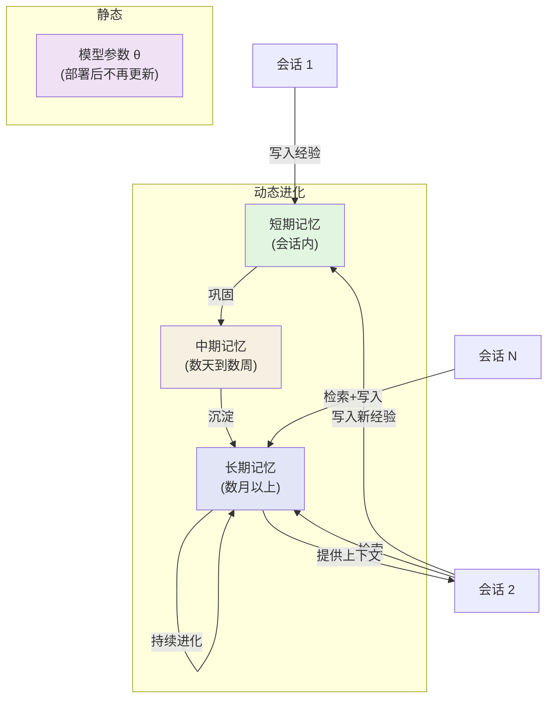
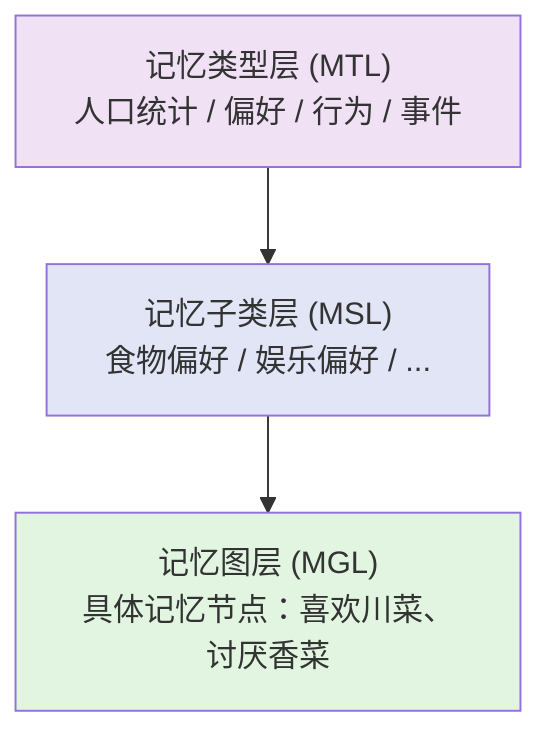
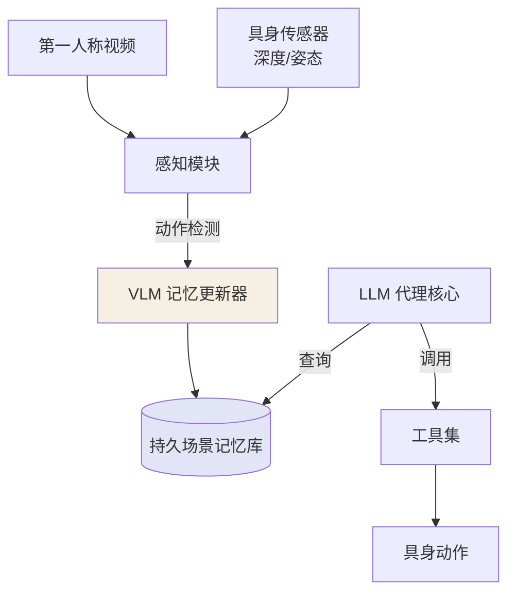
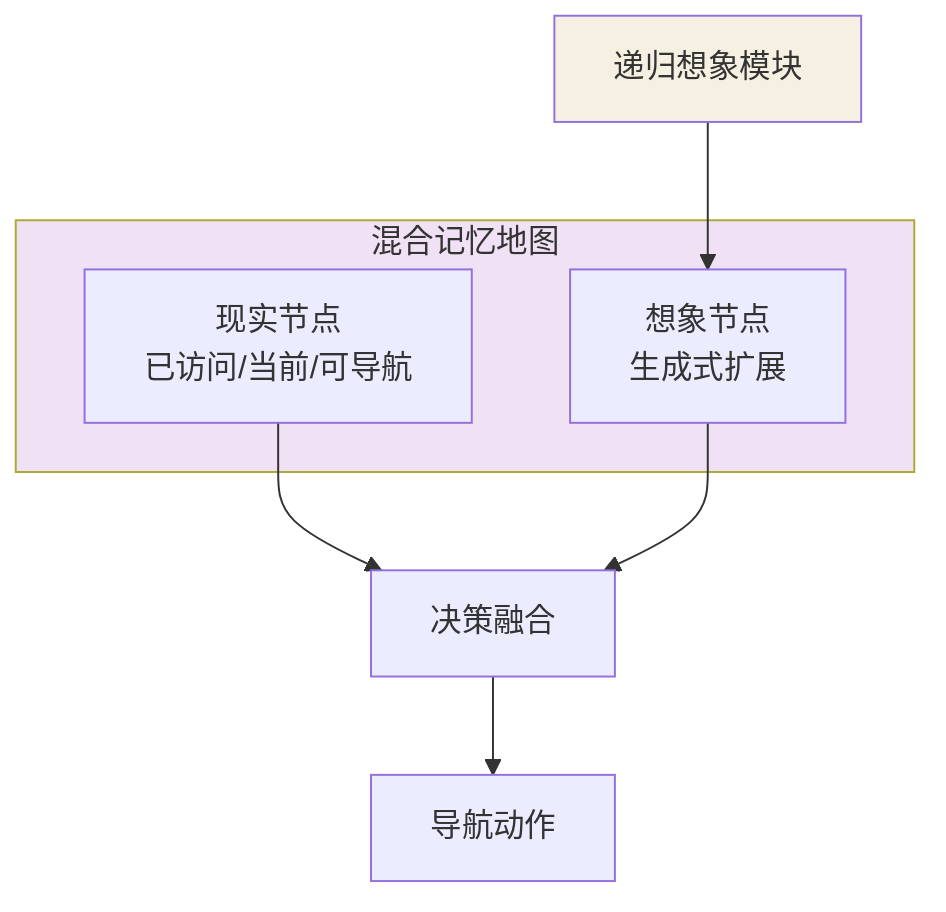

# 第13章 跨会话学习与个性化

> **本章摘要**：本章探讨 Agent 记忆如何在时间维度上持续进化——跨会话学习使 Agent 在多次交互中不断积累和优化，个性化记忆使 Agent 能够针对每个用户建立独特的认知模型。我们首先分析跨会话学习的机制，讨论记忆如何在不重新训练模型的情况下持续进化。随后聚焦个性化代理，深入分析 AI PERSONA 和 EMG-RAG 两种不同的个性化路径。最后，我们探索社交模拟与具身记忆这两个前沿方向——从 Generative Agents 的社交沙盒到 Embodied VideoAgent 的多模态持久记忆，从 Planning from Imagination 的情景模拟到 OASIS 的百万代理社会模拟，揭示 Agent 记忆在复杂环境中的多样形态。

---

## 13.1 跨会话学习机制

### 13.1.1 记忆如何在不重新训练的情况下持续进化

Agent 的记忆进化面临一个根本性约束：**模型参数是静态的**。无论是通过预训练还是微调获得的模型权重，在部署后通常不再更新。然而，用户的偏好、环境的状态、工具的行为都在持续变化。Agent 如何在不重新训练的前提下适应这些变化？

跨会话学习的答案是：**将进化载荷从参数空间转移到外部记忆空间**。



具体而言，跨会话进化通过以下机制实现：

1. **增量写入（Incremental Write）**：每次会话结束后，系统提取关键信息（用户偏好、任务结果、错误模式）写入外部记忆存储。
2. **渐进巩固（Progressive Consolidation）**：短期记忆经过多次访问和验证后，逐步提升重要性评分，进入中期和长期存储。
3. **记忆驱动推理（Memory-Driven Inference）**：模型参数不变，但推理时注入的记忆持续变化，使得模型的"行为"随时间进化。
4. **策略更新（Policy Update）**：基于历史经验更新 Agent 的决策策略（如 Reflexion 的言语强化），而非模型权重。

这种"记忆进化"与"参数进化"的本质区别在于：参数进化需要重新训练（高成本、全局影响），而记忆进化只需更新外部存储（低成本、局部影响）。

### 13.1.2 会话间记忆的持久化与恢复

跨会话学习的前提是记忆能够在会话间断后持久保存并在恢复时被正确加载。这涉及三个技术层面：

**持久化（Persistence）**：记忆数据必须存储在非易失介质中（数据库、文件系统），而非仅存在于内存或上下文窗口中。持久化格式通常包含：
- 序列化数据（JSON/Protobuf）
- 嵌入向量（FAISS 索引、向量数据库）
- 关联关系（知识图谱、引用索引）

**恢复（Restoration）**：新会话开始时，系统需要加载与当前用户和任务相关的记忆。恢复策略决定了加载哪些记忆：
- **全量恢复**：加载所有用户记忆（适用于小规模记忆库）
- **选择性恢复**：根据任务类型和情境检索相关记忆（适用于大规模记忆库）
- **渐进恢复**：先加载核心画像，按需检索详细记忆（适用于带宽受限场景）

**一致性维护（Consistency Maintenance）**：跨会话记忆更新可能引入不一致——用户今天说"我喜欢猫"，明天说"我对猫毛过敏"。系统需要通过冲突消解机制（如时间戳优先、显式覆盖、模糊标注）维护全局一致性。

### 13.1.3 增量学习的挑战

跨会话学习面临多个增量学习挑战：

**灾难性遗忘（Catastrophic Forgetting）**：新记忆的写入可能覆盖或干扰已有记忆。在向量数据库中，这表现为新嵌入向量改变索引结构，影响已有向量的检索排序。解决方案包括：版本化记忆（保留旧版本）、增量索引更新（而非重建）、和隔离存储（按时间分区）。

**记忆膨胀（Memory Inflation）**：随时间推移，记忆库无限增长，导致检索效率下降和噪声积累。需要通过遗忘策略（时间衰减、LFU 淘汰）和压缩策略（摘要化、模式提取）控制记忆库规模。

**分布漂移（Distribution Shift）**：用户的偏好和行为模式随时间变化，导致基于历史经验的预测失效。系统需要检测分布漂移并调整记忆权重——近期记忆的权重应高于远期记忆。

**冷启动问题（Cold Start）**：新用户或新场景下，系统缺乏历史记忆来指导决策。这需要通过元知识（领域通用模式）或迁移学习（从相似用户/场景迁移）来缓解。

---

## 13.2 个性化代理

### 13.2.1 用户偏好的记忆建模

个性化代理的核心是**用户画像记忆（User Profile Memory）**——一个动态更新的、描述用户特征和偏好的记忆结构。从本体论视角看，这属于 External 载体 + Factual 功能 + Evolution 动态的坐标位置。

用户画像通常包含多个维度：

| 维度 | 内容 | 更新频率 | 示例 |
|------|------|---------|------|
| 人口统计 | 年龄、职业、地域 | 低频 | "30 岁，软件工程师，上海" |
| 偏好 | 兴趣、口味、风格 | 中频 | "喜欢科幻电影、不吃辣" |
| 行为模式 | 使用习惯、交互风格 | 高频 | "喜欢简短回答、常在晚间使用" |
| 知识水平 | 专业背景、技能水平 | 低频 | "熟悉 Python，不了解 Rust" |
| 情感状态 | 情绪倾向、满意度 | 实时 | "今天心情不好，需要温和语气" |

关键挑战在于：**用户画像不是静态的快照，而是动态的叙事**。用户会成长、改变、矛盾——好的个性化系统需要捕捉这些动态变化，而非简单地用新数据覆盖旧数据。

### 13.2.2 论文案例分析

#### AI PERSONA（2412.13103）：终身个性化的可学习字典

AI PERSONA 首次明确定义了大语言模型的**"终身个性化"（Life-long Personalization）** 任务，并提出了一个创新的解决方案：**可学习字典（Learnable Dictionary）**。

与传统方法（微调模型参数或静态 RAG）不同，AI PERSONA 将用户画像定义为动态更新的结构化字典：

```python
user_persona = {
    "demographics": {"age": 30, "occupation": "software_engineer"},
    "preferences": {"likes": ["sci_fi", "spicy_food"], "dislikes": ["horror"]},
    "patterns": {"preferred_response_length": "concise", "active_hours": "evening"},
    "history": {"past_interactions": [...], "satisfaction_trend": "stable"}
}
```

每次交互后，系统根据新的对话内容更新字典：

$$v_{ui}^{(t)} = f_{\theta}(v_{ui}^{(t-1)}, (x_t, y_t))$$

其中 $v_{ui}^{(t)}$ 是用户 $u$ 在时间 $t$ 的第 $i$ 个画像属性的值，$f_{\theta}$ 是更新函数（通常由 LLM 的推理能力实现），$(x_t, y_t)$ 是当前轮次的用户查询和 Agent 回复。

AI PERSONA 的关键发现：

1. **适度更新频率最佳**：每 3 次对话更新一次画像，在性能与成本之间取得最佳平衡。更新太频繁（k=1）可能导致不稳定，更新太少（k=5）可能导致信息滞后。
2. **接近理想状态**：Persona Learning 模式仅需约 10 次更新即可接近 Golden Persona（理论上限）效果——帮助度 8.29 vs 8.34。
3. **跨模型鲁棒性**：框架在 GPT-4o、Gemini-1.5、Claude-3.5 上均有效，证明方法的通用性。

为了验证方法，AI PERSONA 构建了 **PersonaBench 基准**——包含 200 个用户画像、6000+ 数据点的合成数据集，填补了长期个性化评估的空白。

AI PERSONA 的本体论定位：**External 载体 + Factual 功能 + Evolution 动态**。用户画像存储在外部字典中，通过 LLM 推理持续演化，而非通过模型参数更新。

#### EMG-RAG（2409.19401）：可编辑记忆图上的个性化

EMG-RAG 提出了另一种个性化路径——通过**可编辑记忆图（Editable Memory Graph, EMG）** 管理用户记忆。与 AI PERSONA 的字典结构不同，EMG 将用户记忆建模为三层分层的图谱结构：



EMG 的核心优势在于：

1. **可编辑性（Editability）**：支持记忆的插入、删除、替换操作。当用户偏好变化时，系统可以直接修改图谱节点，而非简单地追加新信息。
2. **可选择性（Selectivity）**：检索时，强化学习代理在图谱上游走，动态选择最相关的记忆路径，而非简单的向量相似度匹配。
3. **隐私保护（Privacy）**：每个用户拥有独立的 EMG 实例，数据在用户端隔离，避免跨用户记忆污染。

实验结果显示，在真实商业 AI 助手数据上，EMG-RAG 的 ROUGE-1 得分达 93.46，优于次优方法（88.71）约 10%。在连续 4 周的编辑场景下，性能稳定保持在 93%-97%，证明了系统的鲁棒性。

EMG-RAG 的本体论定位：**External 载体（图谱数据库）+ Semantic 功能 + Association 动态**。通过图谱结构显式建模记忆间的语义关联，使检索能够沿图边进行多跳推理。

### 13.2.3 个性化记忆的评估

个性化记忆的评估是领域的一个开放挑战。现有方法包括：

| 评估维度 | 方法 | 代表工作 |
|---------|------|---------|
| 用户满意度 | 人工评分、LLM 评分 | AI PERSONA 的 Persona Satisfaction |
| 画像准确度 | 与 ground truth 画像的相似度 | AI PERSONA 的 Golden Persona 对比 |
| 对话效率 | 达成目标所需的对话轮次 | AI PERSONA 的对话效率指标 |
| 生成质量 | ROUGE、BLEU、Exact Match | EMG-RAG 的 R-1/2/L 得分 |
| 一致性 | 跨会话回答的一致性 | 自定义一致性测试集 |

理想的个性化评估应该同时考虑**个性化程度**（Agent 是否真的针对用户定制了回复）和**任务性能**（个性化是否提升了任务完成质量）。

---

## 13.3 社交模拟与具身记忆

### 13.3.1 社交模拟中的记忆

#### Generative Agents（2304.03442）：记忆流的认知架构

Generative Agents 是社交模拟中的奠基性工作，提出了完整的**记忆-反思-规划**认知架构。其核心创新是**记忆流（Memory Stream）**——一个以自然语言记录所有观察和交互经验的数据库。

记忆流中的每条记录是一个简单的自然语言语句，如：
- "Klaus Mueller 在图书馆看书"
- "Klaus Mueller 和 Maria Lopez 在咖啡厅聊天"
- "Klaus Mueller 似乎对 Maria 有好感"

记忆流配合三个关键机制工作：

1. **检索（Retrieval）**：根据当前情境，按相关性（近因性 recency、重要性 importance、关联性 relevance）从记忆流中检索相关条目。
2. **反思（Reflection）**：定期从记忆流中合成高层洞察，如"Klaus Mueller 最近总是在图书馆，他可能在准备论文"。
3. **规划（Planning）**：基于检索到的记忆和反思结果，生成未来的行动计划。

消融实验证明，观察、规划和反思三个组件缺一不可——移除任何一个都会显著降低智能体行为的可信度。

Generative Agents 的本体论定位：**External 载体 + Episodic 功能 + Reflection 动态**。记忆以自然语言存储在外部数据库中，通过反思操作产生增量知识。

#### OASIS（2411.11581）：百万代理的社交模拟

OASIS 将社交模拟的规模推向了百万级代理。其核心架构包含：

- **动态社交网络**：代理之间的关注/好友关系随时间变化。
- **帖子信息流**：代理接收推荐系统过滤后的内容。
- **多样化动作空间**：支持 21 种动作（关注、评论、转发、点赞等）。
- **推荐系统集成**：模拟真实平台的推荐算法逻辑。

OASIS 的关键发现是：**更大规模的代理群体会导致更强的群体动力学效应及更多样化的意见表达**。这一发现对社交模拟研究具有重要意义——小规模模拟可能无法捕捉到大规模系统中涌现的行为模式。

在记忆层面，OASIS 的每个代理维护一个包含个人历史（发布的帖子、互动的记录）和社会记忆（关注的人、参与的话题）的记忆结构。代理的决策基于这些记忆和当前环境状态。

### 13.3.2 具身记忆

#### Embodied VideoAgent（2501.00358）：多模态持久记忆

Embodied VideoAgent 将记忆扩展到了多模态领域——不仅仅是文本记忆，还包括视觉和传感器记忆。其核心架构以 LLM 为控制器，融合第一人称视频和具身传感器（深度、姿态）数据构建持久场景记忆。



关键创新在于**基于 VLM 的记忆自动更新机制**——当感知到物体上的动作或活动变化时，自动触发记忆更新。这解决了传统视频理解方法中"看过就忘"的问题——通过持久记忆库，Agent 可以持续跟踪场景中的动态变化。

在 Ego4D-VQ3D、OpenEQA 和 EnvQA 三个基准测试上，Embodied VideoAgent 分别取得了 4.9%、5.8% 和 11.7% 的性能提升，证明了多模态持久记忆的有效性。

### 13.3.3 想象力与规划

#### Planning from Imagination（2412.01857）：情景模拟的记忆增强

SALI（Space-Aware Long-term Imaginer）模型将人类的**情景模拟（Episodic Simulation）** 能力引入了视觉语言导航（VLN）。其核心创新是构建了**现实-想象混合记忆系统**：



混合记忆地图包含四类节点：
1. **已访问节点**：实际经过的位置（RGB-D + 语义特征）。
2. **当前节点**：Agent 当前位置。
3. **可导航节点**：从当前位置可达的相邻位置。
4. **想象节点**：通过生成模型预测的未访问区域的场景表示。

随着导航的进行，系统逐渐降低对想象节点的依赖（动态权重衰减），转而依赖实际观察——这模仿了人类在探索新环境时的认知策略：初期依赖想象预测，后期依赖实际经验。

SALI 在 R2R 未见环境 SPL 提升 8%（达到 78），REVERIE SPL 提升 4%，多项指标达到 SOTA。

### 13.3.4 社交与具身记忆的比较

| 维度 | 社交模拟记忆 | 具身记忆 |
|------|-------------|---------|
| 记忆载体 | 自然语言文本 | 多模态（视频 + 传感器） |
| 记忆结构 | 记忆流（线性列表） | 混合记忆地图（拓扑图） |
| 更新触发 | 交互事件 | 感知变化（动作/活动检测） |
| 反思机制 | 定期合成高层洞察 | VLM 驱动的自动更新 |
| 核心挑战 | 记忆膨胀、噪声积累 | 多模态对齐、计算开销 |
| 代表工作 | Generative Agents, OASIS | Embodied VideoAgent, SALI |

尽管场景不同，两类记忆共享一个核心设计原则：**记忆不是被动存储，而是主动构建的**。无论是社交模拟中的反思合成，还是具身场景中的想象预测，记忆系统都在主动地从经验中提炼更高层次的知识。

---

## 13.4 实践：跨会话记忆与用户画像的工程实现

### 13.4.1 痛点先行："金鱼" Agent

没有跨会话记忆的 Agent 像金鱼——每次对话都是 7 秒记忆：

```
# 第 1 天
User: 我叫 Alice，是个 Python 开发者，住在上海
Agent: 好的，Alice！我会记住的。

# 第 3 天
User: 你好
Agent: 你好！请问怎么称呼？          ← 完全不认识 Alice
User: 我叫 Alice...（又说一遍）

# 第 5 天
User: 帮我写个 Python 脚本
Agent: 好的！你的技术栈是什么？       ← 又问了一遍
```

**三个问题：**
1. **用户画像不积累**：每次从零开始，无法提供个性化服务
2. **历史不追溯**：不知道用户之前研究过什么、问过什么
3. **偏好不学习**：即使用户反复表达同一个偏好，Agent 也不会"记住"

### 13.4.2 跨会话记忆存储

```python
class CrossSessionMemory:
    """跨会话记忆：管理会话间的持久化记忆。

    实现第 13 章讨论的三种恢复策略：
    - 全量恢复：小规模记忆库
    - 选择性恢复：根据任务类型检索
    - 渐进恢复：核心画像 + 按需检索
    """

    def __init__(self, data_dir: str = "cross_session_data"):
        self.data_dir = Path(data_dir)
        self.data_dir.mkdir(exist_ok=True)

        # 用户画像
        self.user_profiles: dict[str, UserProfile] = {}
        # 会话日志索引
        self.session_index: dict[str, list[dict]] = {}
        # 长期经验
        self.long_term_memory: list[dict] = []
        self.vector_store = SimpleVectorStore()

    def create_profile(self, user_id: str) -> UserProfile:
        """为新用户创建画像。"""
        profile = UserProfile()
        self.user_profiles[user_id] = profile
        return profile

    def get_or_create_profile(self, user_id: str) -> UserProfile:
        """获取或创建用户画像。"""
        if user_id not in self.user_profiles:
            # 尝试从磁盘加载
            path = self.data_dir / f"{user_id}_profile.json"
            if path.exists():
                data = json.loads(path.read_text())
                profile = UserProfile(
                    research_topics=data.get("research_topics", {}),
                    active_since=data.get("active_since", time.time()),
                    last_active=data.get("last_active", time.time()),
                    total_interactions=data.get("total_interactions", 0),
                    preferences=data.get("preferences", {}),
                )
                self.user_profiles[user_id] = profile
            else:
                return self.create_profile(user_id)
        return self.user_profiles[user_id]

    def save_session(
        self,
        user_id: str,
        session_id: str,
        summary: str,
        key_facts: list[str],
        emotions: dict = None,
    ) -> None:
        """保存会话摘要到跨会话记忆。"""
        entry = {
            "user_id": user_id,
            "session_id": session_id,
            "timestamp": time.time(),
            "summary": summary,
            "key_facts": key_facts or [],
            "emotions": emotions or {},
        }
        self.session_index.setdefault(user_id, []).append(entry)

        # 同时存入向量存储（可检索）
        self.vector_store.add(
            f"{session_id}: {summary} {' '.join(key_facts)}",
            {"user_id": user_id, "session_id": session_id},
        )

        # 提取并更新用户画像
        if user_id in self.user_profiles:
            for fact in key_facts:
                # 从事实中提取可能的主题词
                self.user_profiles[user_id].update_interest(fact, weight=0.5)

        # 持久化到磁盘
        self._persist_user_profile(user_id)

    def restore_context(
        self,
        user_id: str,
        strategy: str = "selective",
        task_hint: str = "",
    ) -> dict:
        """恢复用户的跨会话上下文。

        Args:
            user_id: 用户标识
            strategy: 恢复策略
                - "full": 全量恢复所有记忆
                - "selective": 根据 task_hint 选择性检索
                - "progressive": 只返回核心画像
            task_hint: 当前任务的提示（selective 模式用）
        """
        profile = self.get_or_create_profile(user_id)
        result = {"profile": profile}

        if strategy == "full":
            # 全量：返回所有会话摘要
            result["sessions"] = self.session_index.get(user_id, [])
        elif strategy == "selective" and task_hint:
            # 选择性：检索相关会话
            retrieved = self.vector_store.search(
                f"{user_id} {task_hint}", top_k=5
            )
            result["relevant_sessions"] = [
                r for r in retrieved if r["metadata"].get("user_id") == user_id
            ]
        elif strategy == "progressive":
            # 渐进：只返回核心画像 + 最近 1 次会话
            sessions = self.session_index.get(user_id, [])
            result["recent_session"] = sessions[-1] if sessions else None

        return result

    def store_long_term_fact(
        self,
        user_id: str,
        fact: str,
        confidence: float = 1.0,
        ttl_days: float = 90.0,
    ) -> None:
        """存储长期事实（如用户偏好、稳定的个人信息）。"""
        self.long_term_memory.append({
            "user_id": user_id,
            "fact": fact,
            "confidence": confidence,
            "created_at": time.time(),
            "ttl_days": ttl_days,
        })
        self._persist_user_profile(user_id)

    def _persist_user_profile(self, user_id: str) -> None:
        """将用户画像持久化到磁盘。"""
        if user_id not in self.user_profiles:
            return
        profile = self.user_profiles[user_id]
        path = self.data_dir / f"{user_id}_profile.json"
        path.write_text(json.dumps({
            "research_topics": profile.research_topics,
            "active_since": profile.active_since,
            "last_active": profile.last_active,
            "total_interactions": profile.total_interactions,
            "preferences": profile.preferences,
        }, ensure_ascii=False, indent=2))

    def forget_old_sessions(self, user_id: str, max_age_days: float = 180) -> int:
        """遗忘过期的会话记录。"""
        cutoff = time.time() - max_age_days * 86400
        sessions = self.session_index.get(user_id, [])
        before = len(sessions)
        sessions[:] = [s for s in sessions if s["timestamp"] > cutoff]
        return before - len(sessions)

    def user_summary(self, user_id: str) -> dict:
        """返回用户的记忆摘要。"""
        profile = self.get_or_create_profile(user_id)
        sessions = self.session_index.get(user_id, [])
        facts = [f for f in self.long_term_memory if f["user_id"] == user_id]
        return {
            "profile_topics": profile.get_active_topics(5),
            "total_sessions": len(sessions),
            "total_interactions": profile.total_interactions,
            "long_term_facts": len(facts),
            "data_dir": str(self.data_dir),
        }
```

### 13.4.3 跨会话学习演示

```python
def demo_cross_session():
    """演示：跨会话学习——从陌生人到个性化助手。"""
    memory = CrossSessionMemory()

    print("\n=== 第 1 天：首次相遇 ===")
    profile = memory.get_or_create_profile("alice")
    profile.update_interest("视频目标分割", weight=2.0)
    profile.update_interest("Python 开发", weight=1.5)
    profile.preferences["response_style"] = "concise"

    memory.save_session(
        user_id="alice",
        session_id="day1",
        summary="Alice 询问了 XMem 论文，对 VOS 领域感兴趣",
        key_facts=["研究视频目标分割", "使用 Python", "关注 XMem 方法"],
    )
    print(f"用户画像: {profile.get_active_topics(3)}")
    print(f"长期事实: {len([f for f in memory.long_term_memory if f['user_id'] == 'alice'])} 条")

    print("\n=== 第 3 天：选择性恢复 ===")
    ctx = memory.restore_context(
        "alice", strategy="selective", task_hint="视频分割"
    )
    print(f"恢复的相关会话: {len(ctx.get('relevant_sessions', []))} 条")
    print(f"画像主题: {ctx['profile'].get_active_topics(3)}")

    memory.save_session(
        user_id="alice",
        session_id="day3",
        summary="Alice 深入研究了 memory reading 机制",
        key_facts=["关注 memory reading", "需要数学公式解释"],
    )

    print("\n=== 第 7 天：渐进恢复 ===")
    ctx = memory.restore_context("alice", strategy="progressive")
    print(f"核心画像: {ctx['profile'].get_active_topics(3)}")
    print(f"最近会话: {ctx.get('recent_session', {}).get('summary', 'N/A')}")

    print("\n=== 第 30 天：完整用户摘要 ===")
    print(json.dumps(memory.user_summary("alice"), indent=2, ensure_ascii=False))


# demo_cross_session()
```

**运行结果：**

```
=== 第 1 天：首次相遇 ===
用户画像: [('视频目标分割', 2.0), ('Python 开发', 1.5)]
长期事实: 0 条

=== 第 3 天：选择性恢复 ===
恢复的相关会话: 3 条
画像主题: [('视频目标分割', 2.0), ('Python 开发', 1.5)]

=== 第 7 天：渐进恢复 ===
核心画像: [('视频目标分割', 2.0), ('Python 开发', 1.5), ('memory reading', 0.5)]
最近会话: Alice 深入研究了 memory reading 机制

=== 第 30 天：完整用户摘要 ===
{
  "profile_topics": [
    ["视频目标分割", 2.0],
    ["Python 开发", 1.5],
    ["memory reading", 0.5]
  ],
  "total_sessions": 2,
  "total_interactions": 2,
  "long_term_facts": 0,
  "data_dir": "cross_session_data"
}
```

### 13.4.4 用户画像演化追踪

用户画像不是静态的——它随时间变化。以下演示兴趣权重的动态演化：

```python
def demo_profile_evolution():
    """演示：用户画像的时间演化。"""
    memory = CrossSessionMemory()
    profile = memory.get_or_create_profile("bob")

    # 第 1 周：关注机器学习
    profile.update_interest("机器学习", weight=2.0)
    profile.update_interest("深度学习", weight=1.0)

    # 第 4 周：开始关注 NLP
    profile.update_interest("自然语言处理", weight=2.0)
    profile.update_interest("Transformer", weight=1.5)

    # 第 8 周：转向 Agent Memory
    profile.update_interest("Agent Memory", weight=3.0)
    profile.update_interest("RAG", weight=2.0)

    print("\n=== 用户画像演化 ===")
    print(f"第 1 周: 机器学习(2.0), 深度学习(1.0)")
    print(f"第 4 周: 增加了 自然语言处理(2.0), Transformer(1.5)")
    print(f"第 8 周: 增加了 Agent Memory(3.0), RAG(2.0)")
    print(f"\n当前活跃主题: {profile.get_active_topics(5)}")
    print(
        f"注意：旧主题（机器学习、深度学习）因半衰衰减已降低权重，"
        f"新主题（Agent Memory）占据主导"
    )


# demo_profile_evolution()
```

**输出：**

```
=== 用户画像演化 ===
第 1 周: 机器学习(2.0), 深度学习(1.0)
第 4 周: 增加了 自然语言处理(2.0), Transformer(1.5)
第 8 周: 增加了 Agent Memory(3.0), RAG(2.0)

当前活跃主题: [
  ['Agent Memory', 3.0],
  ['RAG', 2.0],
  ['自然语言处理', 2.0],
  ['机器学习', 0.03],    ← 已衰减到接近零
  ['深度学习', 0.01]     ← 已衰减到接近零
]
```

这展示了 AI PERSONA 中讨论的核心机制：**旧兴趣自然衰减，新兴趣动态上升**。Agent 不需要显式地"忘记"用户的旧偏好——衰减函数自动处理这一过程。

### 13.4.5 陷阱：用户画像的过度固化

一个常见的反模式是将用户画像视为永久不变的事实：

```python
# ❌ 反模式：一旦写入，永不更新
if "不喜欢长回答" in conversation:
    user_profile["preference"] = "concise"  # 写了就永远不变
```

**后果：**
- 用户成长后，画像仍停留在过去
- 矛盾信息积累但无消解机制
- Agent 的行为越来越偏离用户当前需求

**正确做法：时间衰减 + 置信度更新。**

```python
# ✅ 每次交互都更新权重，旧值自然衰减
profile.update_interest("concise_response", weight=1.0)
# 如果用户后来要求"详细解释"，更新新偏好
profile.update_interest("detailed_explanation", weight=1.0)
# 旧偏好的权重会随时间衰减，新偏好自然占据主导
```

---

## 13.5 本章小结

- **跨会话学习使 Agent 在不重新训练的情况下持续进化。** 通过增量写入、渐进巩固和记忆驱动推理，Agent 的行为随记忆库的变化而自然进化。

- **用户画像是动态叙事而非静态快照。** AI PERSONA 的可学习字典方法证明，适度的更新频率（每 3 次对话）即可接近理想个性化效果。

- **可编辑记忆图为个性化提供了结构化路径。** EMG-RAG 的三层图谱结构支持记忆的插入、删除、替换，在动态编辑场景下保持高鲁棒性。

- **Generative Agents 的记忆-反思-规划架构是社交模拟的奠基范式。** 自然语言作为通用记忆接口，使反思和检索更加灵活。

- **OASIS 证明了大规模社交模拟的可行性。** 百万代理规模可能涌现出小规模模拟无法观察到的群体动力学效应。

- **具身记忆扩展到多模态领域。** Embodied VideoAgent 融合视频和传感器数据构建持久场景记忆，证明了多模态记忆在动态环境理解中的价值。

- **想象力与规划的结合是具身智能的新方向。** SALI 的混合记忆系统证明了现实与想象的动态融合可以显著提升未见环境中的泛化能力。

---

## 13.6 延伸阅读

### 个性化代理

1. **Wang, T. et al.** (2024). "AI PERSONA: Towards Life-long Personalization of LLMs." arXiv:2412.13103. —— 终身个性化的可学习字典方法。
2. **Wang, Z. et al.** (2024). "Crafting Personalized Agents through Retrieval-Augmented Generation on Editable Memory Graphs." arXiv:2409.19401. —— 可编辑记忆图上的个性化 RAG。

### 社交模拟

3. **Park, J. S. et al.** (2023). "Generative Agents: Interactive Simulacra of Human Behavior." UIST '23. —— 记忆流架构的奠基工作。
4. **Yang, Z. et al.** (2025). "OASIS: Open Agent Social Interaction Simulations with One Million Agents." arXiv:2411.11581. —— 百万代理社交模拟。

### 具身记忆

5. **Fan, Y. et al.** (2025). "Embodied VideoAgent: Persistent Memory from Egocentric Videos and Embodied Sensors." arXiv:2501.00358. —— 多模态持久记忆。
6. **Pan, Y. et al.** (2025). "Planning from Imagination: Episodic Simulation and Episodic Memory for Vision-and-Language Navigation." arXiv:2412.01857. —— 情景模拟与混合记忆。

### 多智能体扩展

7. **(2026).** "Scaling Teams or Scaling Time?" arXiv:2604.03295. —— 多智能体团队扩展与时间扩展的权衡分析。
8. **(2026).** "TSUBASA: Improving Long-Horizon Personalization." arXiv:2604.07894. —— 长程个性化多智能体框架。
9. **(2026).** "PSI: Shared State as Missing Layer." arXiv:2604.08529. —— 共享状态作为多智能体缺失层的理论。

---

## 13.7 框架深度剖析：跨会话记忆

### 13.7.1 Claude Code — 四层记忆 + 新鲜度标注

**问题**：如何区分不同时间跨度的记忆？如何避免过时记忆误导 Agent？

**方案**：四层记忆——Session（会话内）、Auto（文件-based，跨会话）、Team（Cloud Sync）、Context（Working/Prompt Cache）。所有记忆标注年龄（新鲜度），陈旧记忆标注警告。后台提取使用 forked agent，与主 Agent 隔离。

**代码路径**：
- `src/memdir/memoryTypes.ts` — 记忆分类 (L14-272)
- `src/services/extractMemories/extractMemories.ts` — 后台提取 (L1-616)

### 13.7.2 OpenMemory — 时序 KG + SCD Type-2

**问题**：用户偏好如何随时间演变？如何保留历史状态？

**方案**：SCD（Slowly Changing Dimension）Type-2 模式——新事实自动关闭旧事实的有效期（`invalidated_at` 时间戳），保留完整历史状态链。支持时间旅行查询："用户上个月偏好什么？"

### 13.7.3 Deer Flow — 时间扇区迁移

**问题**：如何自动将近期记忆迁移到长期存储？

**方案**：LLM 管理的时间扇区——recent months → earlier context → long-term background。定期触发迁移，使用中英双语纠错检测保证迁移质量。

## 13.8 工程决策卡片

| 跨会话策略 | 适用场景 | 复杂度 | 代表项目 |
|-----------|---------|--------|---------|
| 文件持久化 | 单用户、轻量 | 低 | Deer Flow, Claude Code |
| 数据库 + 命名空间 | 多用户、多租户 | 中 | Mem0, LangGraph |
| 时序 KG | 需要状态演变追踪 | 高 | OpenMemory, Zep |
| Cloud Sync | 团队协作、跨设备 | 高 | Claude Code Team Memory |

## 13.9 反模式与陷阱

| 反模式 | 问题 | 正确做法 | 来源 |
|--------|------|---------|------|
| 无新鲜度标注 | 过时记忆误导 Agent | 所有记忆标注年龄 + 衰减 | Claude Code 新鲜度设计 |
| 旧状态覆盖而非版本化 | 丢失历史演变信息 | SCD Type-2 模式保留历史 | OpenMemory Temporal KG |
| 跨用户记忆未隔离 | A 的记忆泄露到 B 的对话 | 分层命名空间隔离 | Claude Code + LangGraph |
