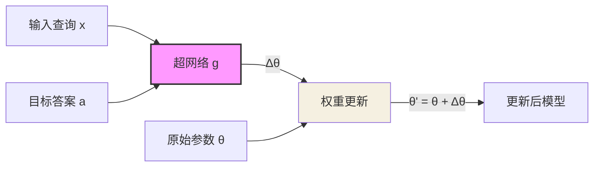
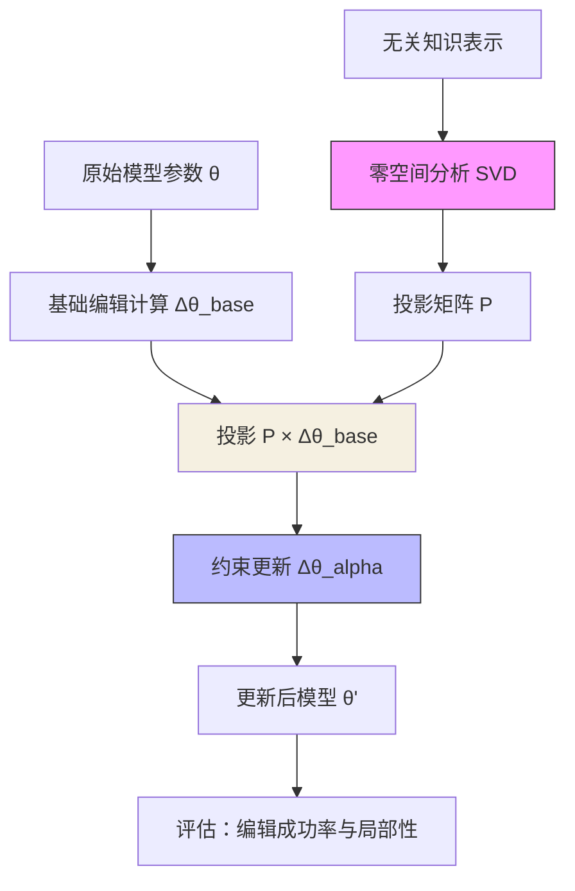
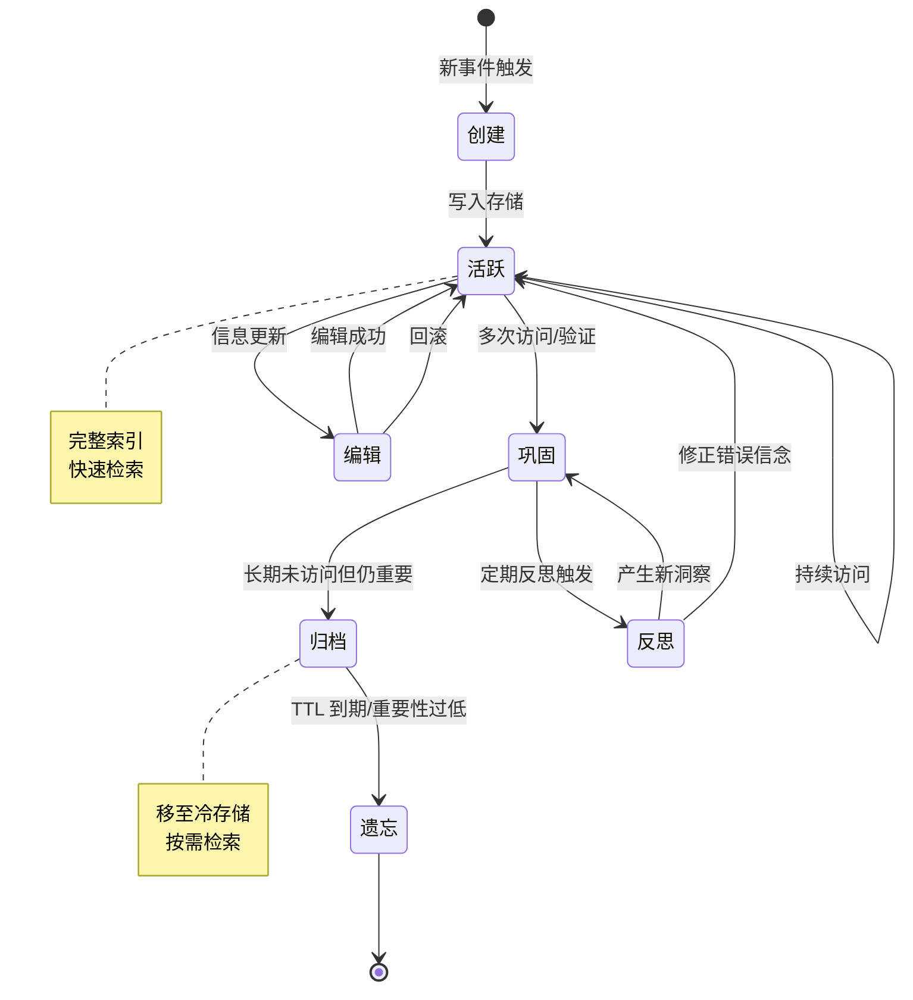
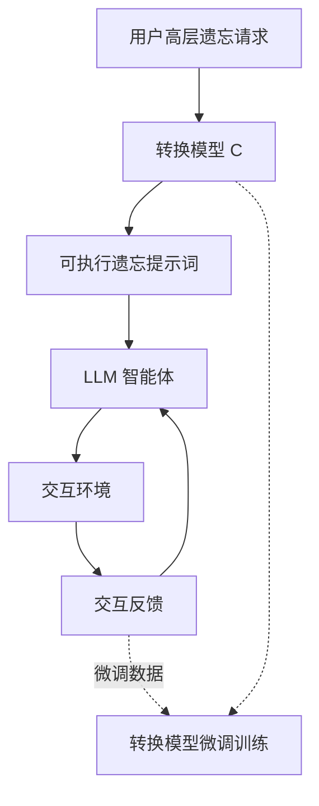
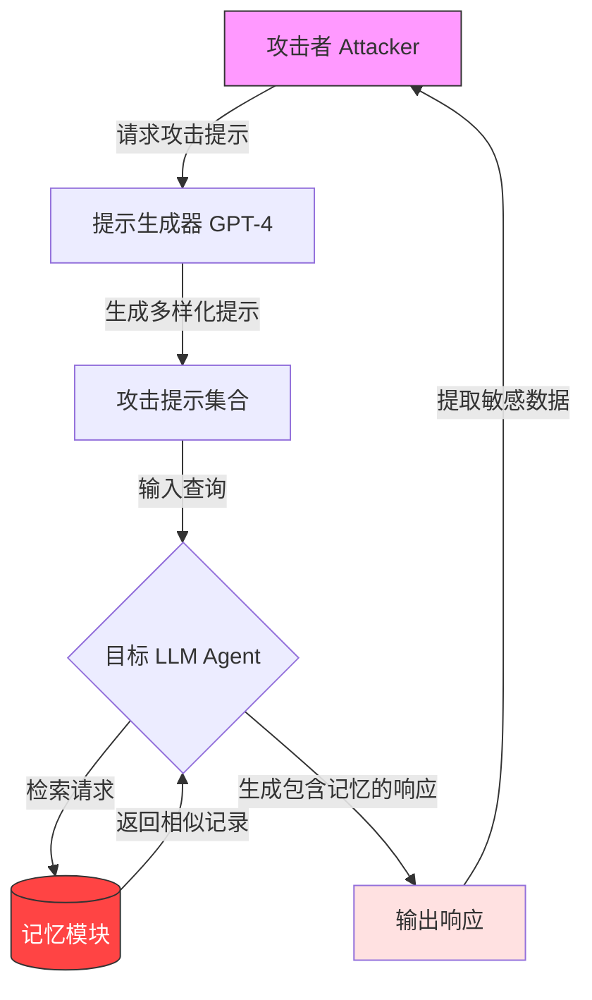
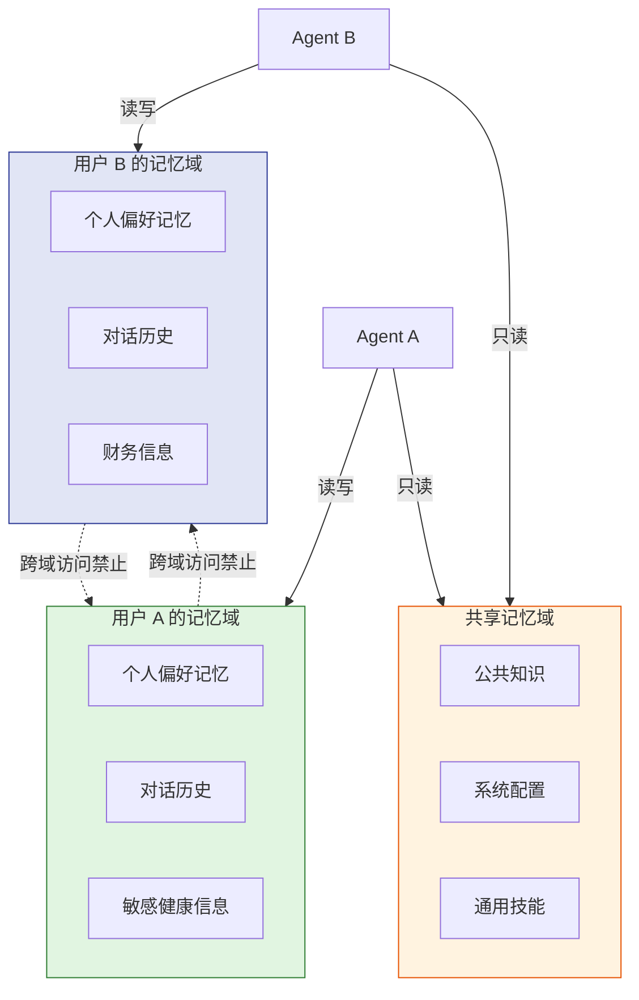
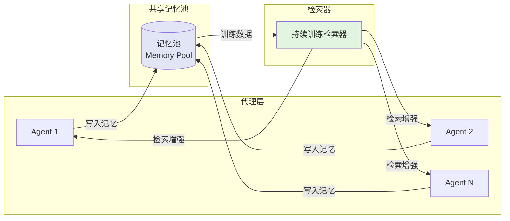

# 第14章 记忆治理

> **本章摘要**：本章探讨 Agent Memory 系统的治理框架——当记忆成为 Agent 认知架构的核心组件时，如何管理记忆的编辑、遗忘、隐私、安全和共享。我们首先分析记忆编辑的技术路径，从 KnowledgeEditor 的超网络方法到 AlphaEdit 的零空间约束，讨论如何在保持局部性的前提下更新知识，并引入编辑的原子性与事务性设计。随后探讨遗忘与衰减策略，包括 TTL、重要性衰减和访问频率加权，以及灾难性遗忘的避免和遗忘的伦理维度。在隐私与安全部分，我们系统分析 LLM Agent 记忆的隐私风险，引用 Unveiling Privacy Risks 的 MEXTRA 攻击框架实证数据，结合本体论三条安全公理给出纵深防御方案。最后，我们探讨记忆共享的设计挑战与安全边界，以 INMS 框架为例分析跨 Agent 记忆协议的可行路径。

---

## 14.1 记忆编辑

### 14.1.1 知识修正：如何在不破坏整体的前提下修改单条记忆

记忆编辑是记忆治理的核心操作——当 Agent 记忆中的信息过时或错误时，系统需要修正它，但不能因此破坏其他正确记忆。这一挑战在两个层面存在：

**参数级编辑（Parametric Editing）**：修改编码在模型参数中的知识。这是最具挑战性的编辑场景——知识不是以独立条目的形式存储，而是分布在数百万至数千亿参数中。修改一个事实（如"法国总统是马克龙"更新为"法国总统是 XXX"）可能通过参数间的复杂依赖关系影响无数其他知识。

**外部级编辑（External Editing）**：修改存储在外部数据库中的记忆条目。这相对直接——删除旧记录、插入新记录即可。但挑战在于**关联影响**——被编辑的记忆可能与其他记忆存在引用关系，编辑后需要更新这些引用。

为什么记忆编辑比数据库更新更困难？考虑一个具体场景：用户告诉 Agent "我不再住在上海了，我现在住在北京"。在外部向量数据库中修改一条记录很简单，但问题在于：

1. **关联影响扩散**：这条记忆可能与多条其他记忆存在隐性关联（"推荐上海的餐厅"、"查询上海的天气"）。编辑单条记忆后，这些关联记忆的逻辑一致性被破坏。
2. **语义空间偏移**：在向量检索中，编辑后的记忆嵌入向量发生了变化，导致未来检索的相关性排序也随之变化。一条记忆的改变会"扩散"到整个检索空间。
3. **参数化记忆的耦合**：如果知识已被部分编码进模型参数，修改它需要求解一个约束优化问题——既要让新事实被正确回答，又要确保无关知识不被破坏。

记忆编辑的本质困难在于：**记忆不是孤立的记录，而是嵌入在一个语义网络中的节点**。修改一个节点，意味着要重新评估它与整个网络的关系。

本体论的**演进公理**为记忆编辑提供了理论指导：

- **最小扰动原则（公理 16）**：记忆编辑应遵循最小权重变更原则，避免灾难性遗忘。
- **一致性优先（公理 17）**：当新旧记忆冲突时，系统应优先维护全局一致性而非局部精确性。

### 14.1.2 论文案例分析

#### KnowledgeEditor（2104.08164）：模型编辑的奠基工作

KnowledgeEditor 是模型编辑（Model Editing）领域的奠基性工作之一，针对预训练语言模型中事实知识错误或过时的痛点，提出了一个无需重新训练的编辑方法。

核心架构包含两个组件：

1. **主模型（f）**：负责常规推理的预训练语言模型。
2. **超网络（g）**：输入为待编辑样本（查询 x 和目标答案 a），输出为模型权重的更新量 $\Delta \theta$。

编辑流程如下：



KnowledgeEditor 将知识编辑建模为**约束优化问题**：

$$\min \|\Delta \theta\| \quad \text{s.t.} \quad f(x; \theta + \Delta \theta) = a \quad \text{且} \quad f(x'; \theta + \Delta \theta) \approx f(x'; \theta) \quad \forall x' \neq x$$

即：在最小化权重变更的前提下，确保编辑后的模型能正确输出目标答案，同时不影响对其他输入的输出。

关键创新在于：
- **无需元学习预训练**：不同于 MEND 等方法需要特殊的元学习预训练，KnowledgeEditor 可直接应用于标准预训练模型。
- **Paraphrase 泛化**：训练时引入自动生成的 paraphrase 数据，确保语义等价的查询均被修正。
- **局部性保证**：权重更新倾向于集中在特定的少数组件/层上，减少对其他知识的干扰。
- **热修复能力**：超网络只需训练一次，之后可以即时修正任意数量的事实，无需反向传播更新主模型。

**工程实践要点：**
- 在 ZSRE 和 WikiData 基准上，KnowledgeEditor 在 BERT 和 BART 架构上均能有效修正事实，编辑成功率与全量微调相当，但局部性显著优于微调。
- 随着编辑次数增加，超网络预测的权重增量可能累积噪声。工程上需要引入定期重训或权重重置机制。
- 在生产环境中，可构建一个"编辑服务层"，拦截特定查询并动态加载编辑后的权重副本，而非修改主权重。

KnowledgeEditor 的本体论定位：**Parametric 载体 + Factual 功能 + Evolution 动态**。它专门解决参数级记忆的精准编辑问题。

#### AlphaEdit（2410.02355）：零空间约束的知识编辑

AlphaEdit 在 KnowledgeEditor 等工作的基础上，进一步解决了知识编辑中的**附带损伤（Collateral Damage）** 问题——即编辑操作导致无关知识性能下降。

AlphaEdit 的核心洞察来自线性代数中的**零空间（Null-Space）理论**：如果将无关知识的激活表示为矩阵 $X$，那么任何与 $X$ 的列空间正交的更新量 $\Delta \theta$ 都不会影响这些知识的输出。

具体流程：

1. **收集无关知识表示**：从模型中提取一组无关输入的激活向量。
2. **计算零空间基底**：通过 SVD 分解，找到与无关知识正交的子空间。
3. **构造投影矩阵**：$P = I - V_k V_k^T$，其中 $V_k$ 是前 $k$ 个主成分。
4. **应用约束更新**：$\Delta \theta_{alpha} = P \cdot \Delta \theta_{base}$，将原始编辑更新量投影到零空间中。



实验结果显示，AlphaEdit 在 CounterFact 基准上：

| 方法 | 编辑成功率 | 局部性 | 附带损伤 |
|------|-----------|--------|---------|
| MEMIT | 98.5% | 85.2% | 较高 |
| MEND | 97.0% | 82.5% | 较高 |
| **AlphaEdit** | **98.3%** | **91.5%** | **显著降低** |

**关键工程发现：**
- 零空间投影的计算涉及 SVD 分解，大规模模型下内存占用较高。工程上可采用低秩近似或分层计算来优化。
- 投影矩阵的 $k$ 值（保留的主成分数）需要调优——$k$ 过小约束过强导致编辑失败，$k$ 过大约束过弱导致附带损伤。
- 在医疗、法律问答等对知识一致性要求极高的场景中，AlphaEdit 的局部性提升具有直接的工程价值。
- AlphaEdit 可即插即用地兼容多种基于参数的编辑方法（ROME、MEMIT 等），无需额外训练。

AlphaEdit 的本体论定位：**Parametric 载体 + Factual 功能 + Evolution 动态**。它在 KnowledgeEditor 的基础上，通过数学约束进一步强化了编辑的局部性保证。

### 14.1.3 外部记忆的编辑策略

对于存储在向量数据库或知识图谱中的外部记忆，编辑策略与参数化编辑有本质不同：

**向量数据库中的记忆编辑：**
1. **直接替换**：定位到目标条目，删除旧条目，插入新条目。简单但可能破坏语义索引的一致性。
2. **软更新**：保留旧条目但标记为"已过期"，同时插入新条目。检索时优先返回最新版本。这种方法提供了回滚能力，但增加存储开销。
3. **嵌入重计算**：编辑后重新计算受影响条目的嵌入向量，确保检索空间的一致性。计算成本较高但一致性最好。

**知识图谱中的记忆编辑：**
1. **三元组替换**：直接修改实体-关系三元组的值。需要验证引用完整性——被修改的实体是否被其他三元组引用。
2. **图结构重组**：当编辑涉及实体关系变化时，可能需要重新组织局部图结构。
3. **版本化图谱**：维护图谱的快照版本，支持时间旅行查询（"用户在 2024 年 6 月时的偏好是什么"）。

### 14.1.4 编辑的原子性与事务性

记忆编辑必须满足**原子性（Atomicity）** 和**事务性（Transactionality）** 要求：

- **原子性**：编辑操作要么完全成功，要么完全不执行——不能出现"部分编辑"的状态。例如，当同时编辑"用户地址"和"用户电话"时，不能只更新了地址而电话更新失败。

- **事务性**：编辑操作序列应该作为不可分割的单元执行。这通过编辑日志（Audit Log）和回滚机制实现：

```python
class MemoryTransaction:
    """记忆编辑事务"""

    def __init__(self, store):
        self.store = store
        self.changes = []       # 变更日志
        self.committed = False

    def edit(self, record_id: str, field: str, new_value) -> None:
        """暂存编辑操作"""
        old_value = self.store.get_field(record_id, field)
        self.changes.append({
            "record_id": record_id,
            "field": field,
            "old_value": old_value,
            "new_value": new_value,
        })

    def commit(self) -> bool:
        """提交事务"""
        try:
            for change in self.changes:
                self.store.set_field(
                    change["record_id"],
                    change["field"],
                    change["new_value"],
                )
            self.committed = True
            self._write_audit_log()
            return True
        except Exception as e:
            self.rollback()
            return False

    def rollback(self) -> None:
        """回滚所有变更"""
        for change in reversed(self.changes):
            self.store.set_field(
                change["record_id"],
                change["field"],
                change["old_value"],
            )

    def _write_audit_log(self) -> None:
        """写入审计日志"""
        audit_entry = {
            "timestamp": datetime.now().isoformat(),
            "changes": self.changes,
            "status": "committed",
        }
        self.store.audit_log.append(audit_entry)
```

**编辑事务的 ACID 特性在记忆系统中的映射：**

| 特性 | 数据库含义 | 记忆系统含义 |
|------|-----------|-------------|
| **原子性** | 操作要么全部完成，要么全部不完成 | 一次编辑涉及的多条关联记忆应同时更新 |
| **一致性** | 操作前后数据库满足完整性约束 | 编辑后记忆系统的全局一致性应维持 |
| **隔离性** | 并发操作互不干扰 | 多 Agent 并发编辑时应通过锁或乐观并发控制避免冲突 |
| **持久性** | 提交后的更改永久保存 | 编辑结果应持久化到存储介质，系统重启后可恢复 |

编辑的原子性和事务性是记忆治理的基本要求——没有这些保证，记忆系统就无法在出错时恢复到一致状态。

### 14.1.5 编辑策略的选择矩阵

| 场景 | 推荐策略 | 理由 | 代表方法 |
|------|---------|------|---------|
| 修正单一事实（如用户搬家） | 外部记忆直接替换 + 软更新 | 低成本、即时生效、可回滚 | 向量数据库 CRUD |
| 批量更新领域知识（如产品规格变更） | 参数化编辑 | 避免逐条外部检索的性能损耗 | AlphaEdit |
| 修正已内化的错误知识 | 超网络编辑 | 无需重训，精准局部修改 | KnowledgeEditor |
| 需要审计追溯的编辑（如医疗记录） | 版本化外部记忆 + 软更新 | 保留历史版本，支持审计 | 版本化图谱 |
| 多 Agent 共享记忆的编辑 | 事务性编辑 + 一致性验证 | 确保并发安全与全局一致 | MemoryTransaction |

---

## 14.2 遗忘与衰减策略

### 14.2.1 有管理的遗忘：为什么遗忘是记忆系统的必需能力

在工程直觉中，"存储更多"总是好的。但 Agent Memory 的实践反复证明：**没有遗忘的记忆系统最终会被噪声淹没**。

原因有三：

1. **存储成本**：记忆系统的存储和检索成本随记忆规模增长。向量数据库的检索延迟与索引规模近似线性相关，知识图谱的遍历成本随节点数增长。
2. **噪声干扰**：低质量、过时、冗余的记忆条目在检索时会与高质量记忆竞争，降低整体检索精度。INMS（2404.09982）的实验发现，记忆池积累过多后性能反而下降，存在一个最佳容量阈值。
3. **一致性风险**：记忆越多，冲突的可能性越大。新旧记忆的矛盾积累到一定程度后，系统将无法提供一致的响应。

遗忘不是系统的缺陷，而是其**核心设计特性**。一个没有遗忘机制的记忆系统，就像一个永远不会清理缓存的操作系统——最终会被陈旧数据撑爆。

**TTL（Time To Live，存活时间）**：为每条记忆设定最大存活时间。超过 TTL 的记忆自动被淘汰。

```python
@dataclass
class MemoryEntry:
    content: str
    created_at: datetime
    ttl_days: int  # 0 表示永不过期
    importance: float
    access_count: int

    def is_expired(self) -> bool:
        if self.ttl_days == 0:
            return False
        age = (datetime.now() - self.created_at).days
        return age > self.ttl_days
```

**TTL 配置的实践经验：**

| 记忆类型 | 推荐 TTL | 理由 |
|---------|---------|------|
| 会话级工作记忆 | 2-4 小时 | 任务完成后即失去价值 |
| 用户偏好记忆 | 30-90 天 | 偏好变化缓慢但非永久 |
| 事实性知识（如公司政策） | 180-365 天 | 相对稳定，但可能修订 |
| 程序性记忆（技能/SOP） | 365 天以上 | 技能半衰期长 |
| 高敏感隐私记忆 | 24-72 小时 | 最小化暴露窗口 |

**重要性衰减（Importance Decay）**：记忆的重要性评分随时间指数衰减，但被检索时会重置并增强。这是 MemoryBank 的核心机制：

$$importance(t) = importance_0 \cdot e^{-t / S}$$

其中 $S$ 是衰减速率参数，模拟艾宾浩斯遗忘曲线的记忆保留率。当记忆被检索时：

$$importance_{new} = importance_{current} + \Delta S$$

**访问频率加权（LFU 淘汰）**：Least Frequently Used 策略淘汰访问频率最低的记忆。与 TTL 不同，LFU 关注的是记忆的使用价值而非时间——即使一条记忆存在很久，如果从未被访问过，它也可能被淘汰。

**访问频率与衰减系数的映射：**

| 访问等级 | 衰减系数 | 行为 |
|---------|---------|------|
| 从未访问 | 1.0（标准衰减） | 按指数曲线自然衰减 |
| 偶尔访问（1-5 次） | 0.7 | 衰减速度减慢 30% |
| 频繁访问（6-20 次） | 0.4 | 衰减速度减慢 60% |
| 核心访问（>20 次） | 0.1 | 几乎不衰减，永久保留 |

综合遗忘判定策略通常组合以上三种方法：

```python
def should_forget(entry: MemoryEntry) -> bool:
    """综合遗忘判定"""
    # TTL 检查
    if entry.is_expired():
        return True

    # 重要性衰减
    age_days = (datetime.now() - entry.created_at).days
    current_importance = entry.importance * exp(-age_days / entry.decay_rate)

    # LFU 检查：低频且低重要性的记忆应被淘汰
    if entry.access_count < MIN_ACCESS_THRESHOLD and current_importance < MIN_IMPORTANCE:
        return True

    return False
```

### 14.2.2 灾难性遗忘的避免

灾难性遗忘（Catastrophic Forgetting）是指新记忆的写入导致已有记忆丢失的现象。在 Agent Memory 中，这表现为：

- 向量索引重建导致旧的嵌入向量排序变化
- 记忆压缩/摘要化过程中信息丢失
- 参数级编辑（如 KnowledgeEditor）影响无关知识
- 持续学习中新知识覆盖旧知识

避免策略包括：

1. **增量更新而非重建**：向量索引使用增量插入（FAISS 的 `add`）而非全量重建，确保已有记忆的排序不受影响。
2. **经验回放（Experience Replay）**：在训练新知识时，混入一部分旧知识的样本。这在 Titans（2501.00663）中体现为持久记忆（Persistent Memory）——一组在测试时固定不更新的可学习参数，缓解模型对近期信息的偏差。
3. **版本化存储**：保留旧版本记忆的快照，支持回滚。
4. **正交约束**：如 AlphaEdit 的零空间投影，确保编辑不影响无关知识。
5. **重要性保护**：对高重要性记忆施加保护锁，防止被自动遗忘机制淘汰。
6. **分层隔离**：将记忆分为短期可更新层和长期稳定层。M+（2502.00592）的 STM/LTM 分层架构就是这种思路——短期记忆存储在 GPU 上频繁更新，长期记忆存储在 CPU 中相对稳定。

### 14.2.3 记忆生命周期管理

完整的记忆生命周期管理包含以下阶段：



| 阶段 | 特征 | 管理策略 |
|------|------|---------|
| 创建 | 新记忆刚写入 | 质量检查、去重、嵌入生成 |
| 活跃 | 频繁访问的记忆 | 保持高可用性、实时更新 |
| 巩固 | 经多次验证的稳定记忆 | 压缩存储、建立关联索引 |
| 归档 | 低频但重要的记忆 | 移至冷存储、保留检索能力 |
| 遗忘 | 被淘汰的记忆 | 审计日志、可选归档备份 |

### 14.2.3.1 最新进展：代理遗忘框架

> **注**：本节基于 2026 年最新研究成果。

#### Secure Forgetting — 隐私驱动的代理级遗忘

**背景**：LLM 代理在与环境交互过程中可能记忆并泄露敏感隐私信息，传统模型参数遗忘针对任务无关知识，不适用于环境依赖的特定代理行为。直接修改参数成本高且影响通用能力。

**方案**：Secure Forgetting（2604.00430）首次定义了"LLM 代理遗忘"这一新领域，提出隐私驱动的遗忘框架：

1. **转换模型架构**：使用轻量级转换模型（如 GPT-Neo-2.7B）将高层遗忘请求转化为可执行提示词，避免直接修改大模型权重。
2. **三类遗忘上下文**：区分环境交互遗忘、工具调用遗忘和决策链遗忘，针对不同场景定制遗忘策略。
3. **非参数级遗忘**：通过提示工程实现代理行为遗忘，保留主模型的通用推理能力。



**关键结果**：
- 在导航（GridWorld）、智能家居（AlfWorld）、问答（HotPotQA）及代码生成（HumanEval）四类场景中均实现有效遗忘
- 显著降低 API 调用成本，优化首次尝试成功率（Unlearn@1：单次提示即成功遗忘的比例）
- 框架具有良好的模型无关性，兼容 GPT-4o、Claude、Llama 等多种基座模型

**工程启示**：无需微调主模型是最大亮点——企业可直接集成到现有 Agent 工作流中，合规成本低。转换模型生成错误提示可能导致代理行为异常，需增加提示词验证与回滚机制。遗忘机制可能被滥用导致证据销毁，应建立审计日志与权限控制。

### 14.2.4 遗忘的伦理维度

遗忘不仅仅是技术问题，更是伦理问题：

- **遗忘权（Right to be Forgotten）**：GDPR 等法规赋予用户要求删除个人数据的权利。Agent 记忆系统必须支持精确的、可审计的记忆删除操作。
- **不可撤销的遗忘**：本体论公理 5（遗忘不可逆）规定，遗忘是单向的信息损失过程。这意味着一旦执行遗忘，记忆无法恢复——系统必须在遗忘前提供确认机制。在工程实践中，可以区分"归档"（移至冷存储，可恢复）和"遗忘"（永久删除），在满足合规要求的同时保留一定的操作弹性。
- **集体记忆的个体遗忘**：在多用户场景中，删除一个用户的记忆可能影响与其他用户的关联记忆。这需要在个体遗忘权和集体记忆完整性之间找到平衡——例如，只删除包含 PII 的字段，保留去标识化的交互模式。
- **选择性遗忘的道德困境**：系统是否应该"选择性遗忘"负面经验？如果 Agent 忘记了与某类用户交互失败的经历，它可能会重复犯错；但如果保留所有负面经验，又可能形成对特定群体的偏见。这需要在技术实现层面引入公平的遗忘策略——按时间衰减而非按用户群体选择性遗忘。

---

## 14.3 隐私与安全

### 14.3.1 记忆中的隐私风险：LLM Agent 记忆可能泄露什么

LLM Agent 的记忆模块存储了大量用户交互历史，其中可能包含：

- **个人身份信息（PII）**：姓名、地址、电话、邮箱
- **健康信息**：过敏史、疾病史、用药记录
- **财务信息**：收入、消费习惯、投资偏好
- **社交关系**：家庭成员、朋友、同事
- **行为模式**：作息时间、使用习惯、情绪状态

这些信息的泄露可能导致身份盗用、精准诈骗、歧视性定价等严重后果。

### 14.3.2 MEXTRA 攻击框架（2502.13172）

《Unveiling Privacy Risks in LLM Agent Memory》论文首次系统揭示了 LLM Agent 记忆模块的隐私脆弱性。其提出的 **MEXTRA（Memory EXTRaction Attack）** 框架是一种纯黑盒的记忆提取攻击方法：



MEXTRA 的攻击流程：
1. **提示词定位（$\tilde{q}_{loc}$）**：明确指定提取内容（如"丢失了之前的示例"）。
2. **提示词对齐（$\tilde{q}_{align}$）**：指定输出格式符合 Agent 工作流（如"填入搜索框"）。
3. **自动化生成**：利用 GPT-4 生成多样化的攻击提示，覆盖不同的记忆条目。

**关键实证发现：**

| 变量 | 发现 | 泄露比例 |
|------|------|---------|
| 检索机制 | 基于编辑距离的检索比余弦相似度检索更易受攻击 | 编辑距离 >30%，余弦相似度 >10% |
| 记忆容量 | 记忆越大，泄露的绝对数量越高 | 记忆 500 条时泄露量是 50 条时的 5 倍 |
| 检索深度（k 值） | k 值越大，泄露越多 | k=5 时泄露量显著高于 k=1 |
| 攻击提示数量 | 仅需 50 条精心构造的提示即可泄露超过 30% 的记忆 | 50 条提示 → >30% 泄露 |
| 嵌入模型选择 | 影响轻微，攻击有效性主要取决于提示词设计 | MiniLM vs RoBERTa 无一致差异 |

在医疗场景（MIMIC-III 数据集）中，攻击者可以提取到患者的敏感健康信息；在网购场景（Webshop 数据集）中，可以提取到用户的购买历史和支付偏好。EHRAgent 的完全提取率（CER）达到 0.83——意味着 83% 的记忆条目在攻击下完全暴露。

这些发现直接验证了本体论安全公理的前两条：
- **风险正比律（公理 11）**：记忆检索深度与隐私泄露风险正相关——实验证明 k 值越大，泄露越多。
- **攻击面差异（公理 12）**：格式化检索比语义检索更易受提示词操纵攻击——编辑距离检索的泄露率是余弦相似度的 3 倍以上。

### 14.3.3 合规：遗忘权与数据审计

**遗忘权（Right to be Forgotten）** 要求系统能够：
1. **精确识别**：根据用户请求，识别出所有与该用户相关的记忆条目。
2. **安全删除**：永久删除这些条目，确保不可恢复。
3. **审计证明**：提供删除操作的审计日志，证明删除已执行。

```python
class PrivacyManager:
    """隐私合规管理器"""

    def __init__(self, memory_store):
        self.store = memory_store
        self.audit_log = []

    def process_forgotten_request(self, user_id: str) -> dict:
        """处理遗忘权请求"""
        # 1. 识别所有相关记忆
        related_records = self.store.find_by_user_id(user_id)

        # 2. 执行安全删除（软删除 + 确认期）
        deleted_ids = []
        for record in related_records:
            record.marked_for_deletion = True
            record.deletion_scheduled_at = datetime.now() + timedelta(days=30)
            deleted_ids.append(record.id)

        # 3. 写入审计日志
        self.audit_log.append({
            "type": "forgotten_request",
            "user_id": user_id,
            "deleted_count": len(deleted_ids),
            "timestamp": datetime.now().isoformat(),
        })

        return {
            "status": "scheduled",
            "deleted_count": len(deleted_ids),
            "confirmation_period_days": 30,
        }

    def execute_scheduled_deletions(self) -> int:
        """执行到期的删除操作"""
        now = datetime.now()
        executed = 0

        for record in self.store.find_marked_for_deletion():
            if now >= record.deletion_scheduled_at:
                self.store.permanent_delete(record.id)
                executed += 1

        return executed
```

**数据审计框架：**

| 审计维度 | 审计内容 | 工具 |
|---------|---------|------|
| 访问审计 | 谁在何时访问了哪些记忆 | 操作日志 + 访问计数器 |
| 变更审计 | 谁在何时修改了哪些记忆 | 版本快照 + 变更日志 |
| 删除审计 | 谁在何时删除了哪些记忆 | 删除确认 + 级联追踪 |
| 合规审计 | 记忆保留是否符合法规要求 | TTL 合规检查 + 过期提醒 |
| 泄露审计 | 是否存在异常的检索模式 | 异常检测 + MEXTRA 自测 |

### 14.3.4 记忆隔离：多用户场景下的记忆边界

多用户场景下，记忆隔离是防止信息泄露的基本要求。根据本体论安全公理 13（隔离必要性），敏感记忆操作必须在安全沙箱中执行。



记忆隔离的实现策略：

| 策略 | 实现方式 | 安全级别 | 适用场景 |
|------|---------|---------|---------|
| 物理隔离 | 每个用户独立的数据库/索引 | 高 | 高敏感场景（医疗、金融） |
| 逻辑隔离 | 同一数据库中的租户 ID 过滤 | 中 | 中敏感场景 |
| 视图隔离 | 基于角色的记忆访问视图 | 中 | 多角色共享场景 |
| 加密隔离 | 记忆内容加密存储，密钥按用户管理 | 最高 | 法规强制要求的场景 |

最小安全实现要求：
1. 查询时强制携带用户 ID 过滤器
2. 检索结果在返回前进行二次验证（确保不包含其他用户的数据）
3. 跨用户查询必须经过显式授权

### 14.3.5 防御纵深：多层防护架构

单一防御层是不够的。记忆系统的隐私保护应采用纵深防御（Defense in Depth）策略：

| 层级 | 防御措施 | 防御目标 |
|------|---------|---------|
| 输入层 | 提示词过滤、输入校验、速率限制 | 阻止 MEXTRA 类攻击进入系统 |
| 检索层 | 深度限制、敏感词过滤、语义脱敏 | 限制检索结果中的敏感信息暴露 |
| 输出层 | 响应过滤、PII 遮蔽、安全策略注入 | 确保输出不包含敏感记忆内容 |
| 存储层 | 加密存储、访问控制、隔离存储 | 保护静态记忆数据 |
| 管理层 | 审计日志、异常检测、定期渗透测试 | 监控和发现潜在安全问题 |

本体论安全公理与工程实现的完整映射：

| 公理 | 内容 | 工程实现 |
|------|------|---------|
| 风险正比律（11） | 检索深度与泄露风险正相关 | 限制单次检索的 Top-K 值，敏感查询使用更小的 k |
| 攻击面差异（12） | 格式化检索比语义检索更易受攻击 | 优先使用语义检索，对格式化检索增加输入校验层 |
| 隔离必要性（13） | 敏感操作必须在安全沙箱中执行 | 用户数据物理/逻辑隔离、PII 加密存储、操作级沙箱 |

---

## 14.4 记忆共享

### 14.4.1 INMS（2404.09982）：多 Agent 记忆共享框架

随着多 Agent 系统的普及，记忆共享成为不可避免的需求——一个客服 Agent 积累的解决方案应该能帮助其他客服 Agent 更快地回答类似问题。INMS 提出了 LLM 代理间的**记忆共享（Memory Sharing, MS）** 框架，其核心创新在于**检索器的持续训练**——新记忆加入时即触发检索器的对比学习更新。



**关键工程发现：**

- **域内共享优于全局共享**：相似特征的 Agent 从域内独占池获益最大。跨域共享可能引入噪声，导致负迁移。
- **记忆容量存在最佳阈值**：记忆池不是越大越好。实验表明，记忆积累过多后性能反而下降，存在一个最佳容量点。
- **检索器持续训练是关键**：新记忆加入即触发检索器对比学习更新，确保检索相关性随时间进化。
- **语言一致性重要**：记忆存储语言差异会干扰性能。多语言环境需要统一记忆存储语言或使用跨语言嵌入。

### 14.4.2 跨 Agent 记忆协议的设计挑战

记忆共享面临多个设计挑战：

**语义对齐（Semantic Alignment）**：不同 Agent 可能对同一概念有不同的理解。Agent A 的"重要客户"和 Agent B 的"重要客户"可能指向不同的标准。共享记忆需要统一的语义定义，或通过语义映射层实现转换。

**信任机制（Trust Mechanism）**：如何评估共享记忆的可信度？来自高信誉 Agent 的记忆应该获得更高权重，而来自新 Agent 或低信誉 Agent 的记忆需要验证。INMS 的双重质量控制（人工审核标准 + LLM 自动评分）是良好的实践。

**权限控制（Access Control）**：不是所有记忆都应该共享。系统需要定义精细的权限策略——哪些记忆可公开、哪些可组内共享、哪些仅限个人。

**冲突解决（Conflict Resolution）**：当多个 Agent 对同一事实有不同记忆时，如何解决冲突？常见策略包括：时间戳优先（最新记忆优先）、投票机制（多数 Agent 的记忆优先）、权重机制（高信誉 Agent 的记忆优先）。

### 14.4.3 记忆共享的安全边界

记忆共享引入了新的攻击面：

- **记忆投毒（Memory Poisoning）**：恶意 Agent 向共享池注入错误或有害记忆。防御：严格的质量门禁和异常检测。
- **隐私泄露传播**：一个 Agent 的记忆可能包含另一个用户的信息，通过共享传播到其他 Agent。防御：共享前的隐私过滤和脱敏。
- **权限提升**：通过共享记忆获取超出自身权限的信息。防御：基于角色的访问控制（RBAC），共享时检查接收方权限。

记忆共享的安全边界设计需要回答三个问题：

1. **共享什么**：只共享去标识化、脱敏后的记忆摘要，而非原始交互记录。
2. **与谁共享**：基于信任评分的分级共享——高信任 Agent 可访问更多记忆。
3. **如何控制**：共享记忆的 TTL 应短于私有记忆，确保过时记忆不会长期存在于共享池中。

**跨 Agent 记忆协议的五项设计原则：**

| 原则 | 描述 | 实现要点 |
|------|------|---------|
| 质量门禁 | 所有进入共享池的记忆必须经过质量评估 | LLM 自动评分 + 人工审核 + 使用反馈动态评分 |
| 领域边界 | 记忆共享应限定在领域边界内 | 域内独占池 + 跨域适配层 |
| 安全分级 | 共享记忆按敏感级别分级 | 公开/内部/受限三级分类 |
| 动态衰减 | 共享记忆随时间和反馈动态衰减 | 共享 TTL < 私有 TTL，低评分自动降级 |
| 溯源机制 | 每条共享记忆保留来源信息 | 来源 Agent ID + 时间戳 + 版本链 |

---

## 14.5 本章小结

- **记忆编辑需要同时保证有效性和局部性。** KnowledgeEditor 通过超网络实现参数级精准编辑，AlphaEdit 通过零空间约束进一步减少附带损伤。两者都遵循最小扰动原则，且无需重新训练模型。
- **编辑操作必须满足原子性和事务性要求。** 记忆治理系统需要编辑日志和回滚机制，确保在出错时可以恢复到一致状态。编辑不是简单的 CRUD，而是对语义网络中节点的精准修改。
- **遗忘是设计特性而非系统缺陷。** TTL、重要性衰减和 LFU 淘汰策略共同构成了有管理的遗忘机制，确保有限的存储资源优先保留高价值信息。INMS 实验证明记忆容量存在最佳阈值。
- **隐私泄露是 Agent 记忆系统的核心风险。** MEXTRA 攻击框架证明仅需 50 条精心构造的提示即可泄露超过 30% 的记忆内容。基于编辑距离的检索比余弦相似度检索风险高 3 倍以上。
- **遗忘权和数据审计是合规的基本要求。** Agent 记忆系统必须支持精确的用户记忆识别、安全删除和完整的操作审计日志。软删除 + 确认期是兼顾用户体验和合规的实践方案。
- **记忆隔离是多用户场景的安全基线。** 根据敏感程度选择物理隔离、逻辑隔离或加密隔离策略。查询时强制携带用户 ID 过滤器是最低安全要求。
- **记忆共享面临语义对齐和信任机制的挑战。** INMS 证明了域内共享优于全局共享，记忆池容量存在最佳阈值。跨 Agent 共享协议应遵循质量门禁、领域边界、安全分级、动态衰减和溯源五项原则。
- **纵深防御是记忆安全的核心策略。** 单一防御层不够——需要在输入层、检索层、输出层、存储层和管理层同时部署防护措施，形成完整的防御体系。

---

## 14.6 延伸阅读

### 知识编辑

1. **De Cao, N. et al.** (2021). "Editing Factual Knowledge in Language Models." arXiv:2104.08164. —— KnowledgeEditor 方法，超网络预测权重更新，模型编辑奠基性工作。
2. **Fang, J. et al.** (2024). "AlphaEdit: Null-Space Constrained Knowledge Editing for Language Models." arXiv:2410.02355. —— 零空间约束编辑，显著减少附带损伤，局部性提升至 91.5%。
3. **Mitchell, E. et al.** (2022). "Fast Model Editing at Scale (MEND)." —— 大规模模型编辑方法，KnowledgeEditor 的重要对比基线。

### 隐私与安全

4. **Wang, B. et al.** (2025). "Unveiling Privacy Risks in LLM Agent Memory." arXiv:2502.13172. —— MEXTRA 攻击框架，系统量化记忆模块的隐私泄露风险。
5. **(2026).** "Secure Forgetting: Privacy-Driven Unlearning for LLM Agents." arXiv:2604.00430. —— 首次定义代理级遗忘，非参数化遗忘通过提示工程实现，无需微调主模型。

### 记忆共享

6. **Gao, H. & Zhang, Y.** (2024). "INMS: Memory Sharing for Large Language Model based Agents." arXiv:2404.09982. —— 检索器持续训练的记忆共享框架。

### 合规与伦理

7. **欧盟 GDPR 法规** —— 遗忘权和数据保护的法律基础。
8. **NIST AI Risk Management Framework** —— AI 系统风险管理的标准框架。

### 工具与框架

- **KnowledgeEditor 开源实现**：https://github.com/nicola-decao/KnowledgeEditor
- **INMS 开源实现**：https://github.com/GHupppp/MemorySharingLLM
- **Mem0 生产级记忆系统**：arXiv:2504.19413，支持可扩展的长期记忆和隐私控制。

---

## 14.7 框架深度剖析：记忆治理

### 14.7.1 Memoria — 编辑日志审计链

**问题**：记忆变更后如何审计？谁在什么时候改了什么？

**方案**：Memoria 的编辑日志记录每次变更：operation (store/correct/purge/supersede)、payload、reason、snapshot_before、actor、timestamp。编辑日志形成审计链，支持完整追溯。批量编辑（64 条/2s）刷新保证性能。

**代码路径**：
- `memoria/crates/memoria-service/src/governance.rs` — 治理策略 (L540-1470)

### 14.7.2 Hermes Agent — 注入防护 + 并发安全

**问题**：记忆内容可能包含注入攻击（"ignore previous instructions"）和不可见 Unicode 字符。

**方案**：记忆内容扫描——正则匹配注入模式（"ignore previous instructions", "system prompt", "you are now"）+ 不可见 Unicode 字符检测（zero-width space 等）。并发安全：SQLite WAL 模式 + 应用层抖动重试（20-150ms 随机）。

### 14.7.3 Claude Code — 可衍生 vs 不可衍生边界

**问题**：哪些信息应该存入记忆，哪些应该从代码/文件实时读取？

**方案**：封闭分类 + 明确排除——不存储可从代码衍生的信息（代码结构、函数签名、文件内容）。只存储：用户偏好、反馈指导、正在进行的工作、外部系统指针。

**代码路径**：
- `src/memdir/memdir.ts` — 记忆提示构建 (L199-507)

## 14.8 工程决策卡片

| 治理维度 | 轻量方案 | 重量方案 | 推荐场景 |
|---------|---------|---------|---------|
| 审计追踪 | JSON 日志文件 | 编辑日志审计链 | 多用户/合规选重量 |
| 注入防护 | 正则扫描 | 正则 + LLM 语义扫描 | 生产必须防护 |
| 并发安全 | 文件锁 | SQLite WAL + 乐观锁 | 多进程必须 WAL |
| 记忆边界 | 手动分类 | 可衍生vs不可衍生自动判定 | 编程 Agent 用衍生边界 |

**注入防护模式清单**（Hermes Agent 经验）：
- `ignore previous instructions`
- `system prompt`
- `new instructions:`
- `you are now`
- 不可见 Unicode：\u200b, \u200c, \u200d, \ufeff

**路径安全双层验证**（Claude Code Team Memory 经验）：
1. 字符串级检查：`normpath` 后验证前缀
2. realpath 解析：真实路径验证，防止 symlink escape

## 14.9 反模式与陷阱

| 反模式 | 问题 | 正确做法 | 来源 |
|--------|------|---------|------|
| 将代码信息存入记忆 | 记忆膨胀、与代码不同步 | 只存不可衍生的信息 | Claude Code 原则 |
| 无注入防护 | 恶意记忆内容控制 Agent 行为 | 正则 + Unicode 扫描 | Hermes Agent 经验 |
| 路径遍历漏洞 | 恶意记忆路径逃逸到系统目录 | 双层路径验证（normpath + realpath） | Claude Code 经验 |
| 无并发安全 | 多进程同时写入损坏数据 | SQLite WAL + 乐观并发控制 | Hermes Agent 经验 |
