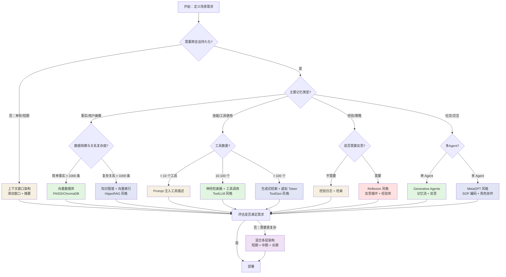
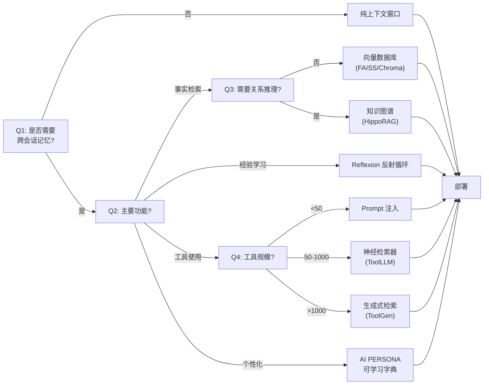
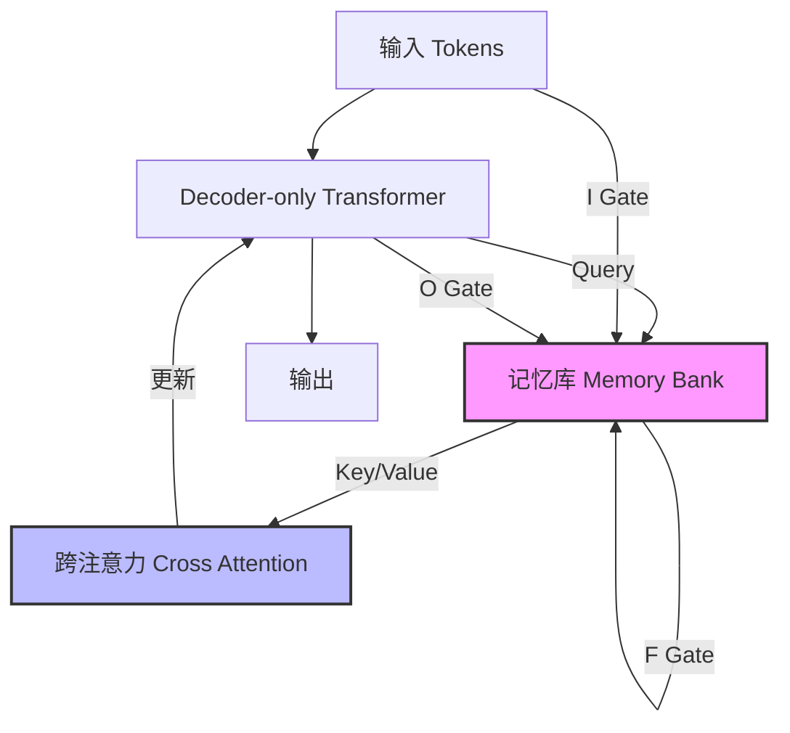
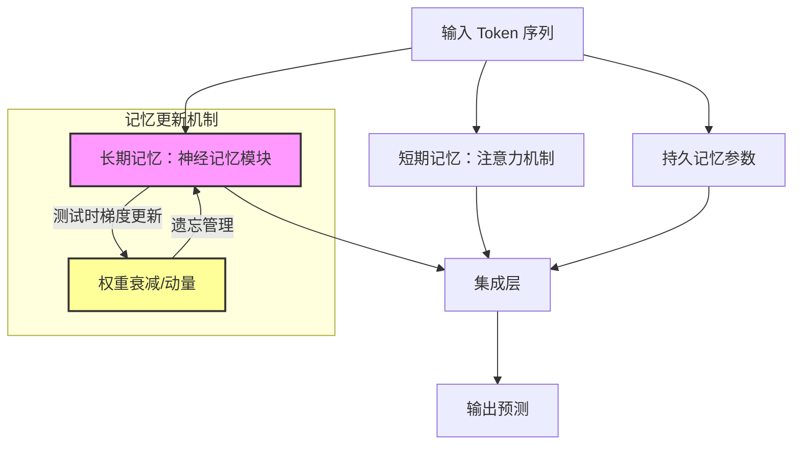
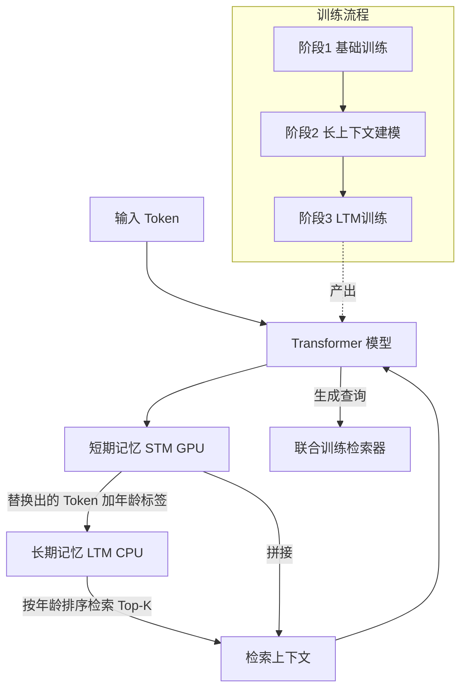

# 第15章 工程决策地图与未来展望

> **本章摘要**：本章为全书的工程实践指南与未来展望。我们首先提供一份工程决策地图——从场景到记忆类型再到推荐架构，帮助读者根据自身需求选择最合适的记忆方案，并给出从简单到复杂的渐进式演进路径和常见反模式清单。随后探讨前沿范式：Large Memory Models 将记忆内化于模型架构（LM2、Titans、M+），测试时记忆打破了训练与推理的边界，多模态记忆扩展了记忆的载体维度（Time-VLM、Video-RAG、Embodied VideoAgent）。最后，我们讨论开放问题：记忆与参数的边界在哪里？大规模记忆系统是否会产生涌现行为？Agent Memory 会不会有自己的"HTTP 协议"？本章以全书总结收尾，为核心观点、行动建议和未来展望做最后梳理。

---

## 15.1 工程决策地图

### 15.1.1 场景 → 记忆类型 → 推荐架构

Agent Memory 的设计不是"越大越好"或"越复杂越好"——关键在于**匹配场景需求**。一个只有 100 个用户的内部工具不需要百万级记忆图谱，而一个面向千万用户的 AI 伴侣也不能仅靠滑动窗口支撑。

以下决策地图帮助读者根据具体需求选择记忆架构：

**决策指南详解：**

1. **跨会话持久化**：如果 Agent 只需要在单次会话内工作（如一次性问答机器人），纯上下文窗口足够。一旦需要记住用户偏好、历史对话或跨会话学习，就必须引入外部存储。
2. **事实 vs 关系**：如果记忆以独立事实为主（"用户喜欢辣"），向量数据库即可。如果记忆涉及实体间关系（"用户 A 是用户 B 的同事，他们共同喜欢餐厅 C"），知识图谱的多跳推理能力不可替代。
3. **工具规模**：少量工具直接注入 Prompt；中等规模需要神经检索器按需召回；大规模工具集需要生成式检索（将工具 ID 作为虚拟 Token 生成）。
4. **反思需求**：需要 Agent 从经验中学习改进的场景（如代码调试助手、谈判助手），反思循环是必需的。
5. **多 Agent 协作**：单 Agent 用 Generative Agents 的记忆流架构即可；多 Agent 需要 SOP 编码和角色协作机制。

### 15.1.2 从简单到复杂的演进路径

推荐的演进路径是**渐进式的**——从简单架构开始，随需求增长逐步扩展。避免一开始就构建过度复杂的系统，这不仅浪费资源，还会掩盖真正的需求。

**阶段 1：上下文窗口（最小可行记忆）**

- 架构：滑动窗口 + 摘要压缩
- 适用场景：单轮对话、短期任务、POC 验证
- 优点：零基础设施、即时实现、无运维成本
- 缺点：无跨会话持久化、窗口溢出时信息丢失
- 代表实现：简单的对话历史截断、递归摘要

**阶段 2：外部向量存储**

- 架构：上下文窗口 + FAISS/ChromaDB/Pinecone
- 适用场景：需要用户画像、跨会话对话、简单事实检索
- 优点：跨会话持久化、语义检索、可扩展
- 缺点：无结构化关系、检索结果可能缺乏上下文关联
- 代表实现：MemoryBank（2305.10250）、Mem0

**阶段 3：结构化记忆 + 反思**

- 架构：向量存储 + 知识图谱 + 经验库 + 反思循环
- 适用场景：需要 Agent 持续改进的场景、知识密集型任务
- 优点：自我优化、经验积累、关系推理
- 缺点：系统复杂度增加、需要维护多个存储后端
- 代表实现：Generative Agents（2304.03442）、Reflexion（2303.11366）、HippoRAG（2405.14831）

**阶段 4：混合多层架构**

- 架构：短期（上下文窗口）+ 中期（向量/图存储）+ 长期（参数化/归档）+ 记忆控制器
- 适用场景：大规模、多用户、长期运行的 Agent 系统
- 优点：全功能覆盖、各层各司其职
- 缺点：运维成本高、需要专业的记忆治理团队
- 代表实现：MemGPT（2310.08560）、MIRIX（2507.07957）

### 15.1.3 常见陷阱与反模式

在 Agent Memory 工程实践中，以下是一些常见的陷阱：

| 反模式 | 描述 | 后果 | 解决方案 |
|--------|------|------|---------|
| **上下文膨胀** | 将所有历史对话注入上下文 | 注意力稀释、推理延迟飙升、成本失控 | 选择性检索 + 摘要压缩 |
| **记忆孤岛** | 不同类型记忆互不关联 | 检索不全面、决策缺乏全局视角 | 建立记忆间的关联索引 |
| **过度记忆** | 存储所有信息，无遗忘机制 | 记忆膨胀、检索噪声、性能衰退（INMS 已证实） | 实施 TTL + 重要性衰减 |
| **静态记忆** | 记忆写入后不再更新 | 信息过时、与新事实冲突 | 定期巩固 + 冲突消解 |
| **信任所有记忆** | 不对记忆进行可信度评估 | 错误记忆影响决策质量 | 引入置信度评分 |
| **反射弧过长** | 反思触发条件过于宽松 | 计算资源浪费在无关反思上 | 基于惊喜度的条件触发 |
| **检索深度失控** | 每次检索返回过多记忆 | 上下文污染、隐私泄露风险增加 | 限制 Top-K，基于场景动态调整 |
| **共享记忆无门禁** | 多 Agent 共享记忆池无质量控制 | 低质记忆污染、负迁移 | 双重质量控制（INMS 模式） |

### 15.1.4 决策树：选择你的记忆架构

**决策指南**：

1. **跨会话记忆**：如果 Agent 只需要在单次会话内工作，纯上下文窗口足够。否则需要外部存储。
2. **主要功能**：确定 Agent 的核心记忆需求——是存储事实、积累经验、使用工具还是个性化服务。
3. **关系推理**：如果需要跨实体的多跳推理（如"A 的朋友 B 推荐了 C"），知识图谱优于向量数据库。
4. **工具规模**：少量工具可直接注入 Prompt；中等规模需要神经检索器；大规模工具需要生成式检索。

> **注意**：本章包含两个工具规模决策树——图 15.1（详细设计树）使用 <10/10-100/>100 的阈值，图 15.2（快速参考树）使用 <50/50-1000/>1000 的阈值。两者反映了不同粒度的场景划分：详细设计树适用于精细评估单个 Agent 的工具栈，快速参考树适用于粗略分类。阈值的绝对值并非精确分界，实际工程中应根据工具的复杂度（API 调用成本、描述长度、依赖关系）灵活调整。

---

## 15.2 前沿范式

### 15.2.1 Large Memory Models：将记忆内化于模型架构

Large Memory Models（LMM）代表了一种全新的思路：**将记忆内化于模型架构本身**，而非依赖外部检索系统。这一范式有三个代表性工作，分别展示了三种不同的内化路径。

#### LM2（2502.06049）：辅助记忆模块

LM2 在 Decoder-only Transformer 中引入了一个**独立的记忆库（Memory Bank）**，通过跨注意力机制与输入令牌交互，并通过输入（I）、输出（O）、遗忘（F）三个门控机制更新记忆。

**关键结果**：

| 基准 | 对比基线 | 提升幅度 |
|------|---------|---------|
| BABILong（长上下文推理） | 优于 RMT（记忆增强基线） | +37.1% |
| BABILong（长上下文推理） | 优于 Llama-3.2 | +86.3% |
| MMLU（通用知识） | 优于预训练 vanilla 模型 | +5.0% |

LM2 的核心洞察是：**显式记忆可以大幅提升长程推理能力，且不会损害通用泛化能力**。这打破了"记忆增强会损害通用能力"的担忧。

**工程启示**：LM2 的架构改动适中（增加记忆库和跨注意力层），但需要重新训练或微调。对于需要处理超长文档、多跳推理的生产环境，LM2 风格的架构是值得考虑的方向。

#### Titans（2501.00663）：测试时记忆更新

Titans 提出了更具颠覆性的思路——**在测试时动态更新记忆权重**。其架构包含三种记忆：

1. **短期记忆（STM）**：标准注意力机制，处理当前上下文。
2. **长期记忆（LTM）**：神经记忆模块，在推理阶段通过梯度下降更新权重。
3. **持久记忆（PM）**：可学习参数，测试时固定不更新，缓解注意力隐式偏差。

Titans 的"惊喜度"机制尤为创新：记忆强度由输入梯度的大小决定——**与已有知识差异越大的信息，被记忆得越深**。这模拟了人类大脑对意外事件的强记忆特性。

**关键结果**：

| 方法 | 340M 参数准确率 | 760M 参数准确率 | 上下文窗口 |
|------|---------------|---------------|-----------|
| Transformer++ | 42.92% | 48.69% | 标准 |
| Mamba2 | 43.59% | - | 线性扩展 |
| **Titans (MAG)** | **47.54%** | - | 线性扩展 |
| **Titans (MAC)** | - | **52.51%** | **>2M tokens** |

**理论贡献**：Titans 证明了其架构能解决超越 $TC^0$ 复杂度的问题——这是标准 Transformer 无法做到的。

**工程启示**：测试时更新权重虽好，但需权衡推理延迟。可能适合离线处理或对延迟不敏感的场景。代码尚未公开，超大规模（7B+）下的表现待验证。

#### M+（2502.00592）：CPU 长期记忆池

M+ 解决了潜在空间记忆模型的显存瓶颈问题。它将记忆分为两层：

- **短期记忆（STM）**：存储在 GPU 上（每层 10,240 tokens）
- **长期记忆（LTM）**：存储在 CPU 上（最大 150k tokens），被替换的短期记忆 token 被赋予"年龄"标签转入 LTM

**关键结果**：

| 方法 | 显存占用 | 有效记忆长度 | 推理延迟 |
|------|---------|-------------|---------|
| SnapKV | 32,574 MB | 48k Context | 标准 |
| Llama-3.1-3B-128k | 30,422 MB | 128k Context | 标准 |
| **M+** | **17,973 MB** | **>160k Tokens** | **+3% (128k 输入)** |

M+ 在显存效率上具有显著优势——仅需 18GB 显存即可处理超过 160k tokens 的长期记忆，远低于基线的 32GB+。联合训练检索器显著优于基于注意力分数的检索（召回率约 30% vs 3%）。

**工程启示**：M+ 的显存优化效果显著，适合显存受限场景（如消费级 GPU 部署、边缘计算）。但需注意 CPU-GPU 通信开销在高并发场景下可能成为瓶颈。

### 15.2.2 测试时记忆（Learning to Memorize at Test Time）

Titans 的测试时记忆更新代表了一个更广泛的范式转变：**记忆不再是训练阶段的副产品，而是推理阶段的主动过程**。

这一范式转变的意义在于：

- **打破训练/推理边界**：模型在推理过程中持续学习，而非仅使用训练阶段学到的知识。这从根本上改变了我们对"模型部署"的理解——部署不是终点，而是持续学习的起点。
- **个性化即时生效**：用户交互直接影响记忆权重，个性化无需额外的微调或检索阶段。每个用户的使用都在"定制"模型的长期记忆。
- **计算代价可控**：Titans 通过将梯度下降重构为矩阵乘法，使测试时更新的吞吐量与 Mamba2 相当，证明了这一范式在计算上的可行性。

**挑战与局限**：
- 测试时更新增加了推理延迟，在对实时性要求高的场景中可能不适用。
- 权重的持续更新可能导致模型行为漂移——需要监控和约束机制。
- 目前仅在 340M-760M 参数规模上验证，更大规模的效果待确认。

### 15.2.3 多模态记忆：从文本到视觉、传感器

多模态记忆将记忆的载体从纯文本扩展到视觉、音频、时间序列和传感器数据。以下是三个代表性工作：

#### Time-VLM（2502.04395）：时间序列的多模态增强

Time-VLM 探索了将通用视觉-语言模型（VLM）用于时间序列预测的可能性。其核心创新是**多模态自增强**——无需外部数据，将一维时序数据转换为视觉和文本两种辅助模态：

- **视觉增强学习器（VAL）**：通过 FFT 频域编码将时序转换为 64x64 图像，利用 VLM 提取视觉嵌入。
- **文本增强学习器（TAL）**：生成包含统计特征、趋势、周期性的结构化文本提示。
- **检索增强学习器（RAL）**：Patch 嵌入 + 分层记忆机制（局部 + 全局）。

**关键发现**：在少样本场景下（5% 数据），ETTh1 数据集 MSE 比 TimeLLM 降低 29.5%。参数量仅 143M（约为 TimeLLM 的 1/20），显存占用 2-24GB 动态适配。但文本模态贡献有限（消融显示移除 TAL 仅下降 2.1% MSE）。

#### Video-RAG（2411.13093）：长视频理解的检索增强

Video-RAG 将 RAG 范式迁移至视频领域，通过外部工具链构建视觉对齐的辅助文本库：

- **OCR 提取**：EasyOCR 提取视频中的文字信息。
- **ASR 转录**：Whisper 转录音频内容。
- **物体检测（DET）**：APE+ 检测关键帧中的物体和场景关系。
- **语义检索**：Contriever 编码 + FAISS 索引，按需检索相关信息。

**关键发现**：72B 模型在 Video-MME 上得分 75.7%，超越 Gemini-1.5-Pro（75.0%）。每个视频仅增加约 2.0K tokens 辅助文本，完全开源、无需微调、即插即用。物体检测贡献最大（+10.1%），其次是 OCR（+2.3%）和 ASR（+0.9%）。

#### Embodied VideoAgent（2501.00358）：具身传感器的持久记忆

Embodied VideoAgent 将多模态记忆扩展至具身场景，融合第一人称视频和具身传感器（深度、相机姿态）构建持久场景记忆：

- **VLM 自动更新**：当感知到物体上的动作/活动时，自动更新持久记忆。
- **LLM 代理推理**：LLM 作为核心控制器，调用工具查询记忆并规划动作。
- **多模态工具调用**：物体理解、问答等多种工具协同。

**关键发现**：在 Ego4D-VQ3D 上提升 4.9%，OpenEQA 上提升 5.8%，EnvQA 上提升 11.7%。具身传感器对动态场景理解至关重要——消融显示无传感器输入时性能显著下降。

### 15.2.4 成熟度评估

| 前沿范式 | 代表工作 | 技术成熟度 | 工程可行性 | 学术影响力 | 时间预期 |
|---------|---------|-----------|-----------|-----------|---------|
| Large Memory Models (LM2) | 2502.06049 | 中等（预印本） | 中（需架构修改和重训） | 高（BABILong +86.3%） | 1-2 年内工程化 |
| 测试时记忆 (Titans) | 2501.00663 | 初期（理论验证） | 低（需训练基础设施，代码未公开） | 高（突破 $TC^0$） | 2-3 年 |
| CPU-GPU 分层记忆 (M+) | 2502.00592 | 中等（开源实现） | 高（显存优化直接可用） | 中高（解决显存瓶颈） | 6-12 月 |
| 多模态时间序列 (Time-VLM) | 2502.04395 | 初期 | 中（依赖通用 VLM） | 中（特定场景有效） | 1-2 年 |
| 视频 RAG (Video-RAG) | 2411.13093 | 较高（即插即用） | 高（无需训练，开源工具链） | 中高（超越专有模型） | 6-12 月 |
| 具身多模态记忆 (Embodied VideoAgent) | 2501.00358 | 初期 | 低（多模型协同复杂度高） | 中（具身 AI 场景） | 2-3 年 |

---

## 15.3 开放问题

### 15.3.1 记忆与参数的边界：未来的 Agent 还需要外部记忆吗？

随着 LM2、Titans、M+ 等工作将记忆内化于模型架构，一个根本性问题浮现：**未来的 Agent 还需要外部记忆吗？**

**参数化记忆的优势**：
- **零推理延迟**：知识已融入模型本身，无需额外检索步骤。
- **端到端优化**：记忆与推理在同一框架内联合优化，避免检索-生成的信息损失。
- **隐式泛化**：参数化记忆天然支持泛化——相似查询自然获得相似响应。

**外部记忆的不可替代性**：
- **可解释性**：外部记忆以人类可读的形式存储（文本、图谱），可以审计、编辑、共享。参数化记忆是"黑盒"——你无法直接定位或修改某个具体"记忆"。
- **个性化**：外部记忆可以按用户隔离，实现个性化服务。参数化记忆是全局共享的——要为每个用户定制参数化记忆，需要为每个用户微调一个模型副本，成本不可持续。
- **实时性**：外部记忆可以即时更新。参数化记忆的更新需要训练或编辑，存在延迟。
- **规模不受限**：外部存储理论上无限扩展。参数化记忆受模型容量限制。

**未来更可能出现的架构是混合式的**：参数化记忆处理通用的、稳定的知识（如语言理解、推理能力、常识），外部记忆处理个性化的、频繁更新的知识（如用户偏好、实时信息、领域特定事实）。两者的边界不是取代，而是互补——正如人类的内隐记忆（技能、习惯）和外显记忆（事实、事件）协同工作。

### 15.3.2 记忆的涌现能力：大规模记忆系统是否会产生不可预测的行为？

随着记忆系统规模的扩大，一个令人不安又令人兴奋的问题是：**大规模记忆系统是否会产生不可预测的行为？**

Generative Agents（2304.03442）已经在 25 个智能体的小规模系统中观察到了涌现的社会行为——智能体自主组织情人节派对、传播八卦、建立友谊。OASIS（2411.11581）将规模推向百万代理，发现更大的代理群体会导致更强的群体动力学效应。

这些观察引发了更深层的担忧：

1. **检索组合的不可预测性**：当 Agent 的记忆库积累到数百万条记录时，检索到的"相关记忆"组合可能产生设计者未曾预期的推理路径。单次检索可能安全，但多次检索结果的组合可能产生有害推论。
2. **集体幻觉的传播**：当多个 Agent 共享记忆池时，错误的信念可能通过记忆共享在网络中传播。一个 Agent 的错误记忆可能被其他 Agent 采纳，形成正反馈循环，最终整个系统相信一个错误的事实。
3. **自我强化的信念循环**：当 Agent 的反思机制持续运行时，可能产生自我强化的信念循环——Agent 基于有偏差的记忆做出有偏差的反思，反思结果又写入记忆，进一步强化偏差。
4. **记忆投毒的级联效应**：恶意注入的记忆可能通过关联机制扩散，影响大量看似无关的记忆条目，产生远超预期的破坏范围。

这些问题没有简单的答案。但它们提醒我们：**记忆系统的设计不仅要关注功能正确性，还要关注系统行为的长期稳定性。** 可能需要引入"记忆系统论"——类似于控制论，研究记忆系统的稳定性、鲁棒性和可预测性。

### 15.3.3 标准化：Agent Memory 会不会有自己的"HTTP 协议"？

Web 的成功很大程度上归功于 HTTP 协议的标准化——任何服务器和客户端只要遵循同一协议就能互操作。Agent Memory 领域目前缺乏类似的标准化：

- **记忆格式**：不同系统使用不同的记忆表示（JSON、图谱、向量、自然语言、潜在向量）。
- **检索接口**：不同系统使用不同的检索协议（FAISS ANN、图遍历、关键词匹配、跨注意力）。
- **共享协议**：不同系统之间的记忆互不兼容，无法跨系统迁移。一个 Agent 在 MemGPT 中积累的记忆无法被 MemoryBank 使用。

一个理想的 Agent Memory 标准化协议应该定义：

1. **记忆数据模型**：统一的记忆记录格式，包含内容、元数据（时间戳、重要性、置信度、来源）、载体类型和功能标签。
2. **检索操作集**：标准化的检索操作（如 `GET /memories?query=...&top_k=5&carrier=External`），支持多种检索策略的统一接口。
3. **权限模型**：标准化的访问控制语义，定义谁可以在什么条件下读写哪些记忆。
4. **共享协议**：跨系统记忆迁移的标准格式，类似 Web 的 HTML——任何 Agent 系统都能理解和处理。
5. **生命周期操作**：标准化的形成、更新、遗忘、反思操作接口。

标准化不会一蹴而就——它需要社区的共识和头部项目的引领。但正如 HTTP 之于 Web、SQL 之于数据库、REST 之于 API，标准化将是 Agent Memory 从研究领域走向工业标准的关键一步。

**可能的演进路径**：
1. **短期**：头部开源项目（如 MemGPT、Mem0）的 API 格式成为事实标准。
2. **中期**：行业联盟（类似 W3C 之于 Web）定义统一的记忆数据模型和检索协议。
3. **长期**：标准化的记忆协议成为 Agent 基础设施的一部分，如同 HTTP 之于今天的互联网。

---

## 15.4 本章小结与全书总结

### 本章小结

- **工程决策应遵循渐进式路径。** 从最简单的上下文窗口架构开始，随需求增长逐步引入外部存储、结构化记忆、反思循环和混合架构。避免一开始就构建过度复杂的系统——先用最小可行记忆验证核心假设。
- **常见反模式包括上下文膨胀、记忆孤岛、过度记忆、静态记忆、信任所有记忆、反射弧过长、检索深度失控和共享记忆无门禁。** 识别并避免这些陷阱是构建可靠记忆系统的前提。
- **Large Memory Models 将记忆内化于架构。** LM2 的辅助记忆模块在 BABILong 上提升 86.3%，Titans 的测试时更新突破 $TC^0$ 复杂度，M+ 的 CPU-GPU 分层将显存降至 18GB。三种路径互补而非竞争。
- **测试时记忆打破了训练/推理边界。** 模型在推理过程中持续学习，个性化即时生效，但需权衡推理延迟和行为漂移风险。
- **多模态记忆是必然趋势。** 从文本到视觉到传感器数据，记忆的载体维度正在扩展。Video-RAG 已证明开源工具链可达到商用级性能，Embodied VideoAgent 展示了具身场景的记忆管理路径。
- **记忆与参数不会相互取代，而是互补。** 参数化记忆处理通用知识，外部记忆处理个性化知识。混合架构是未来方向。
- **标准化是领域成熟的必经之路。** Agent Memory 需要自己的"HTTP 协议"来实现互操作性。短期看头部项目的 API 格式，中期看行业联盟，长期看标准化协议。

### 全书核心观点回顾

回顾《智能体记忆工程》全书的核心论点：

1. **LLM 本质上是无记忆的。** 自回归生成的零起点特性决定了每次推理从零开始。上下文窗口是输入缓冲区，不是记忆。窗口溢出导致的信息丢失是结构性的，无法通过扩大窗口来解决。

2. **记忆是 Agent 的第四支柱。** 感知-规划-行动-记忆构成 Agent 的四大核心能力。没有记忆，Agent 就没有身份一致性、个性化和经验积累。记忆不仅是独立的支柱，更是串联其他三者的粘合剂。

3. **三维正交分类是理解记忆的分析工具。** 载体（Token-level / Parametric / External / Latent）、功能（Factual / Semantic / Episodic / Procedural / Experiential / Working / Reflection）、动态（Formation / Retrieval / Evolution / Forgetting / Reflection / Association）三个维度为正交分类提供了统一框架，使不同工作的比较和组合成为可能。

4. **记忆是动态的生命周期闭环。** 形成、组织、巩固、检索、遗忘、反思六个阶段持续循环，其中反思是唯一能产生增量知识的阶段。记忆不是静态存储，而是持续演化的认知系统。

5. **记忆治理是不可回避的议题。** 编辑、遗忘、隐私、安全、共享——记忆不仅仅是性能优化，更是系统工程。KnowledgeEditor 和 AlphaEdit 展示了精准编辑的路径，MEXTRA 揭示了隐私风险的严重性，INMS 证明了共享的可行性与边界。

6. **没有"唯一正确"的记忆架构。** 架构选择取决于场景需求——社交模拟适合外部检索，长文档处理适合上下文窗口管理，AI 伴侣适合心理学启发的动态更新，复杂系统适合混合多层架构。决策地图帮助读者找到适合自己的路径。

### 给读者的行动建议

1. **从你的场景出发，而不是从论文出发。** 不要追求"最先进"的架构，而是选择最适合你场景的架构。参考本章的决策地图，先回答"我需要跨会话记忆吗"这个最基本的问题。

2. **先验证，再扩展。** 用最小的可行记忆系统（如简单的向量检索）验证核心假设——记忆是否真的能提升你的 Agent 性能？如果答案是肯定的，再逐步增加复杂度。

3. **重视记忆治理，从第一天开始。** 从一开始就设计编辑、遗忘、隐私保护机制，而非事后补救。记忆治理的缺失在系统规模扩大后会呈指数级恶化。

4. **关注前沿但不盲从。** Large Memory Models、测试时记忆、多模态记忆等前沿范式值得关注，但在工程落地前需要等待技术成熟。M+ 的显存优化方案可能在未来 6-12 个月内可用，而 Titans 的测试时更新可能还需要 2-3 年。

5. **贡献社区，分享经验。** Agent Memory 领域仍在快速演化。分享你的实践经验、发现的反模式、成功的架构设计，帮助整个社区成长。领域的标准化需要每一个参与者的贡献。

### 对领域未来的展望

Agent Memory 领域正处于从**工程探索**向**系统化学科**演化的关键阶段。

**短期（2025-2026）：基础设施标准化**——统一检索接口以减少工程碎片化，建立质量评估基准（新鲜度/一致性/置信度），完善检索增强场景下的隐私防御，扩展多模态记忆载体支持。M+ 风格的显存优化和 Video-RAG 风格的多模态 RAG 将率先落地。

**中期（2027-2028）：认知能力深化**——实现自动化反思与信念更新循环，建立跨 Agent 记忆共享协议，开发记忆演化可观测工具链，标准化记忆-决策因果链路分析。LM2 风格的架构增强和 Titans 风格的测试时记忆可能在此阶段成熟。

**长期（2029+）：理论体系建立**——探索记忆自组织结构与涌现智能，建立 Agent Memory 形式化验证体系，实现跨模态记忆迁移与泛化，定义 Agent Memory 伦理与安全框架。标准化的记忆协议可能成为 Agent 基础设施的一部分。

记忆，这个曾被 LLM 架构忽视的维度，正在成为 Agent 智能的核心引擎。而《智能体记忆工程》记录的，正是这一变革的起点。

---

## 15.5 延伸阅读

### 大型记忆模型

1. **Kang, J. et al.** (2025). "LM2: Large Memory Models." arXiv:2502.06049. —— 辅助记忆模块与门控机制，BABILong +86.3%。
2. **Behrouz, A. et al.** (2025). "Titans: Learning to Memorize at Test Time." arXiv:2501.00663. —— 测试时记忆更新的里程碑工作，突破 $TC^0$ 复杂度。
3. **Wang, Y. et al.** (2025). "M+: Extending MemoryLLM with Scalable Long-Term Memory." arXiv:2502.00592. —— CPU-GPU 分层记忆，显存降至 18GB。

### 多模态记忆

4. **Zhong, S. et al.** (2025). "Time-VLM: Exploring Multimodal Vision-Language Models for Augmented Time Series Forecasting." arXiv:2502.04395. —— 时序-视觉-文本三模态自增强。
5. **Luo, Y. et al.** (2024). "Video-RAG: Visually-aligned Retrieval-Augmented Long Video Comprehension." arXiv:2411.13093. —— 即插即用的视频 RAG，超越 Gemini-1.5-Pro。
6. **Fan, Y. et al.** (2025). "Embodied VideoAgent: Persistent Memory from Egocentric Videos and Embodied Sensors." arXiv:2501.00358. —— 具身传感器的持久场景记忆。

### 综述

7. **"人工智能代理时代的记忆：形式、功能与动态综述"** (2512.13564). —— Agent Memory 领域综述。

### 评测与轻量方案

8. **(2026).** "Lightweight LLM Agent Memory." arXiv:2604.07798. —— 轻量级小模型 Agent 记忆方案。
9. **(2026).** "ImplicitMemBench." arXiv:2604.08064. —— 隐式记忆评测基准。

### 开源工具

- **LM2 开源实现**：https://github.com/convergence-ai/lm2
- **MemoryLLM/M+ 开源实现**：https://github.com/wangyu-ustc/MemoryLLM
- **Mem0 生产级记忆系统**：arXiv:2504.19413

---

## 15.6 开源框架全景对比

> 本节基于对 16 个 Agent Memory 开源项目的深度代码级分析。

### 15.6.1 按部署模式分类

| 模式 | 项目 | 核心思想 |
|------|------|---------|
| **框架基础设施** | LangGraph, Claude Code, Claw Code | 记忆是框架的基础设施层 |
| **外部记忆服务** | Mem0, Zep, Supermemory, Redis AMS, Forgetful | 记忆是独立服务，Agent 通过 API 调用 |
| **Agent 自管理** | MemGPT (Letta), Deer Flow, Hermes Agent | Agent 通过 tool call 管理自身记忆 |
| **SDK 嵌入** | LangMem, Agent Memory OS, OpenMemory | 记忆作为库嵌入 Agent 代码 |
| **版本控制** | Memoria | 记忆需要 Git 级别的版本管理 |
| **操作系统** | MemOS | 记忆是 OS，覆盖存储/检索/管理 |

### 15.6.2 核心架构模式（重复出现的模式）

1. **分层记忆架构**：几乎所有项目都采用 2-4 层记忆（工作→短期→长期→图谱），类比人类记忆系统
2. **向量 + 图谱混合**：向量搜索处理语义相似度，图谱处理关系推理，两者互补
3. **LLM 作为记忆编排器**：Mem0/Deer Flow/MemGPT/LangMem 都使用 LLM 决定记忆的生命周期
4. **防抖/批处理**：Deer Flow/LangMem/Redis AMS 都有后台防抖队列，减少 LLM 调用
5. **命名空间隔离**：LangGraph/Claude Code/Mem0/Agent Memory OS 都用命名空间实现多租户
6. **时间旅行/版本控制**：Memoria (Git), Claude Code (freshness), MemGPT (BlockHistory), Claw Code (compaction history)
7. **MCP 集成**：Forgetful/Claude Code/Supermemory/MemOS/Memoria/Redis AMS/Agent Memory OS 都通过 MCP 暴露记忆能力

### 15.6.3 独特创新模式清单

| 创新 | 项目 | 价值 |
|------|------|------|
| 冻结快照 | Hermes Agent | 写入不改变 prompt = 前缀缓存稳定 |
| Git-for-Data | Memoria | 数据库级别的零拷贝分支/合并 |
| OS 虚拟内存类比 | MemGPT | Agent 自主管理 context window=RAM, vector DB=disk |
| 认知五扇区 | OpenMemory | 直接模拟人类认知心理学的扇区分类 |
| Hebbian 学习 | OpenMemory | 检索时增强邻居节点权重 |
| 静态/动态档案分离 | Supermemory | ~50ms 档案检索免搜索 |
| 可衍生 vs 不可衍生边界 | Claude Code | 不缓存可从代码衍生的信息 |
| Tool-Use 边界保护 | Claw Code | 压缩时不拆分配对消息 |
| 影子 Git 检查点 | Hermes Agent | 自动突变前快照，零污染 |
| Spreading Activation | Memoria/OpenMemory/Zep | 认知启发的激活传播检索 |

### 15.6.4 未来趋势预测

1. **图谱检索成为标配**：单纯向量搜索已无法满足复杂推理需求
2. **时序推理普及**：有效期的时间推理从 Zep/Mem0/OpenMemory 扩展到更多项目
3. **记忆版本控制**：从 Memoria 的 Git-for-Data 向下渗透
4. **认知建模深化**：OpenMemory 的五扇区+Hebbian 学习代表新方向
5. **MCP 成为标准接口**：已有 7/16 项目支持 MCP，趋势明确
6. **记忆治理自动化**：定期清理、压缩、质量检查成为必要能力
7. **多模态记忆**：MemOS 的四模态（文本+KV+LoRA+偏好）代表扩展方向
