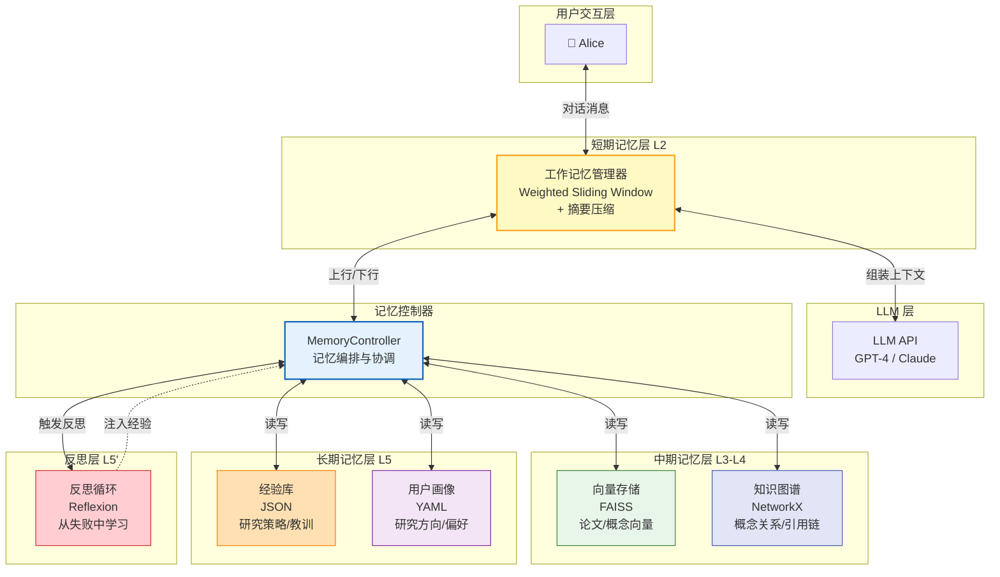

# 第16章 综合案例：构建记忆增强的个人研究助手

> **本章摘要**：本章是全书的"毕业考试"——将前面所有章节（短期记忆、长期记忆、程序性记忆、反思系统、记忆治理、架构决策）组合成一个完整的、可运行的个人研究助手系统。我们首先展示一个没有记忆的 Agent 在研究场景中如何反复失败（反模式示例），然后用渐进式构建方法（V1→V2→V3→V4）逐步叠加各层记忆能力。每个阶段都有完整的代码实现、运行示例和常见陷阱。本章结束时，你将拥有一个包含四层记忆、反思循环和治理策略的完整系统，并理解每一层在整体架构中的位置和价值。

---

## 16.0 案例链最终整合

> 本章是迷你案例链的终点。如果你跟随了 ch06→ch08→ch10→ch12 的案例链，你已经有了一
> 个包含四层记忆模块的 MemoryChain 基础。本章将这些模块整合为完整的研究助手系统，
> 并增加治理策略和多用户隔离。

### 16.0.1 案例链进度回顾

| 阶段 | 章节 | 已实现的模块 | 累积能力 |
|------|------|-------------|---------|
| V1 | ch06 | SlidingWindowManager + SemanticCompressor + MemoryManager | 上下文窗口管理 |
| V2 | ch08 | SimpleVectorStore + ConceptGraph | + 长期存储 |
| V3 | ch10 | HybridRetriever + ContextInjector | + 混合检索 + 对话注入 |
| V4 | ch12 | ReflectionLoop + ExperienceStore | + 自我反思 |
| V5 | ch16 (本章) | 治理策略 + 多用户隔离 + 完整整合 | → 生产级系统 |

### 16.0.2 案例链最终实现：ProductionMemoryChain

以下代码将 ch06-ch12 构建的所有模块整合为一个完整的 `ProductionMemoryChain`，增加了治理策略和多用户隔离。

```python
from dataclasses import dataclass, field
from typing import Optional
import os
import time

# 导入之前章节构建的模块
# from ch06_working_memory import MemoryManager
# from ch08_storage import SimpleVectorStore, ConceptGraph, MemoryEntry
# from ch10_retrieval import HybridRetriever, ContextInjector, RetrievalResult
# from ch12_reflection import ReflectionLoop, ExperienceStore

@dataclass
class GovernanceConfig:
    """治理配置"""
    # TTL 设置
    max_memory_age_days: int = 365
    # 置信度阈值
    min_confidence: float = 0.3
    # 注入防护
    enable_injection_scan: bool = True

@dataclass
class NamespaceConfig:
    """多租户命名空间配置"""
    tenant_id: str = "default"
    user_id: str = "anonymous"
    agent_id: str = "research_assistant"
    session_id: str = ""

    def to_tuple(self) -> tuple:
        return (self.tenant_id, self.user_id, self.agent_id, self.session_id)

class ProductionMemoryChain:
    """生产级 MemoryChain——整合所有模块 + 治理 + 多租户"""

    def __init__(
        self,
        namespace: NamespaceConfig,
        governance: GovernanceConfig,
        storage_path: str = ".production_memory",
    ):
        self.namespace = namespace
        self.governance = governance

        # 创建存储目录（带命名空间隔离）
        ns_dir = os.path.join(storage_path, *namespace.to_tuple())
        os.makedirs(ns_dir, exist_ok=True)

        # ch06: 工作记忆
        self.working_memory = MemoryManager(max_context_tokens=8000)

        # ch08: 长期存储
        self.vector_store = SimpleVectorStore(
            index_path=os.path.join(ns_dir, "vector_index.json")
        )
        self.concept_graph = ConceptGraph()

        # ch10: 检索
        self.retriever = HybridRetriever(self.vector_store, self.concept_graph)
        self.context_injector = ContextInjector(max_injection_tokens=2000)

        # ch12: 反思
        self.reflection_loop = ReflectionLoop(
            experience_store=ExperienceStore(
                os.path.join(ns_dir, "experiences.json")
            )
        )

        # ch16: 治理（新增）
        self._setup_governance()

    def _setup_governance(self):
        """初始化治理策略"""
        # 注入防护扫描
        self.injection_patterns = [
            r"(?i)ignore previous instructions",
            r"(?i)system prompt",
            r"(?i)new instructions:",
            r"(?i)you are now",
            '\u200b', '\u200c', '\u200d', '\ufeff',
        ]

    def _scan_for_injection(self, text: str) -> bool:
        """扫描记忆内容是否包含注入攻击"""
        import re
        for pattern in self.injection_patterns:
            if re.search(pattern, text) or pattern in text:
                return True
        return False

    def _check_ttl(self, entry) -> bool:
        """检查记忆是否过期"""
        if not hasattr(entry, 'created_at'):
            return False
        age_days = (time.time() - entry.created_at) / 86400
        return age_days > self.governance.max_memory_age_days

    def run(self, query: str) -> dict:
        """完整运行流程"""
        # 1. 注入防护扫描
        if self.governance.enable_injection_scan:
            if self._scan_for_injection(query):
                return {"error": "Query contains potential injection patterns"}

        # 2. 工作记忆
        self.working_memory.add_message("user", query)
        context = self.working_memory.assemble_context()

        # 3. 检查历史教训
        prior_lessons = self.reflection_loop.check_prior_lessons(query)

        # 4. 检索
        retrieved = self.retriever.search(query, limit=5)

        # 5. TTL 过滤
        retrieved = [r for r in retrieved if not self._check_ttl(r)]
        retrieved = [r for r in retrieved if getattr(r, 'score', 0.5) >= self.governance.min_confidence]

        # 6. 注入
        context = self.context_injector.inject(context, retrieved)
        if prior_lessons:
            context += f"\n\n[历史教训] {'; '.join(prior_lessons)}"

        # 7. 模拟响应
        response = {
            "content": f"[研究助手响应] {query}",
            "context_tokens": len(context),
            "memories_retrieved": len(retrieved),
            "reflection_applied": bool(prior_lessons),
            "namespace": self.namespace.to_tuple(),
        }

        # 8. 反思分析（后台）
        # 实际中这应该放入防抖队列，不阻塞响应
        self.reflection_loop.analyze(query, response["content"], success=True)

        return response
```

### 16.0.3 ResearchAgent 与案例链接口的对齐

本章的 ResearchAgent（或 ProductionMemoryChain）实现了完整的 MemoryChain 接口。与 ch06-ch12 逐步构建的 MemoryChain 相比，ResearchAgent 增加了：

1. **治理策略**：记忆 TTL、置信度衰减、注入防护（对应 ch14）
2. **多用户隔离**：分层命名空间 `("tenant", user_id, agent_id, session_id)`
3. **生产级整合**：所有模块的统一配置和错误处理
4. **Token 预算管理**：检索结果按重要性排序，截断到预算上限

如果你只跟随案例链，可以将 ProductionMemoryChain 视为 MemoryChain 的"生产版"实现。案例链的渐进式构建帮助你理解每个模块的设计动机，而 ProductionMemoryChain 展示了它们如何协同工作。

---

## 16.1 需求分析与架构选型

### 16.1.1 痛点先行：一个"没有记忆"的研究助手

在开始构建之前，让我们先看看一个没有记忆系统的 AI 研究助手会遭遇什么。这不是假设场景——以下每个失败案例都来自真实用户的报告。

**场景：用户 Alice 正在研究"视频目标分割"领域，需要 AI 助手帮她读论文、做笔记、追踪研究进展。**

```
Alice: 我最近在研究视频目标分割（VOS），帮我总结一下 XMem 这篇论文的核心贡献。

Assistant: XMem（2207.07115）提出了一种长期视频目标分割方法...
         （约 500 字的论文总结）

Alice: 它和之前那篇 XMem 的方法有什么主要区别？
       ^^^^^ 这是第 3 轮对话，但助手已经不记得第 1 轮的上下文
```

**失败 1：上下文截断**。助手回答"你提到的'那篇论文'是指哪一篇？"——因为对话历史被截断，助手丢失了第 1 轮提到的 XMem 信息。

```
Alice: 好吧。那帮我想一下，我之前研究过哪些相关方向来着？
       ^^^^^ Alice 期待助手记住她过去的研究历史

Assistant: 抱歉，我不记得我们之前的对话。
```

**失败 2：无跨会话记忆**。助手没有长期记忆，无法回答"你之前研究过什么"。

```
Alice: （重新输入她的研究背景）...我主要做半监督 VOS，也看过一些无监督方法。
       另外我最近在思考把知识图谱引入来做时序推理，你有什么建议？

Assistant: （给出了一些建议）

Alice: （两周后）上次你提到的那个时序推理方法叫什么来着？

Assistant: 抱歉，我不记得我们两周前的对话内容。
```

**失败 3：无经验积累**。即使助手两周前给出了很好的建议，它也无法"记住"自己说过的话。用户每次开始对话都从零开始——这不是助手，是"不断重置的应答机器"。

这就是我们为什么要构建记忆系统。以下，我们从一个**能解决上述所有问题**的架构开始。

### 16.1.2 用决策地图选型

回顾第 15 章的工程决策地图，我们对研究助手场景做如下判断：

| 决策点 | 研究助手的需求 | 推荐方案 |
|--------|---------------|---------|
| 跨会话持久化？ | 是——记住用户的研究历史 | 外部存储 |
| 主要记忆类型？ | 事实（论文/概念）+ 经验（研究策略）+ 关系（概念关联） | 混合架构 |
| 数据规模与关系复杂度？ | 中等规模（数百篇论文），复杂关系（引用链、概念依赖） | 向量库 + 知识图谱 |
| 是否需要反思？ | 是——从失败的检索中学习更好的检索策略 | Reflexion 循环 |

**最终选型：混合多层架构**

```
短期层：上下文窗口（滑动窗口 + 摘要压缩）—— 当前对话
中期层：向量存储（FAISS）—— 论文摘要、概念定义
中期层：轻量知识图谱（NetworkX + 内存）—— 概念关系、引用链
长期层：经验库（JSON 文件）—— 研究策略、失败教训
控制层：MemoryManager 统一调度
```

### 16.1.3 系统架构



**数据流说明：**

1. Alice 发送消息 → 工作记忆管理器接收并评分
2. 管理器组装上下文（工作缓冲 + 相关记忆）→ 调用 LLM
3. LLM 响应 → 管理器将响应写入工作缓冲
4. 溢出时：低价值消息被摘要压缩后存入向量存储，高价值消息存入知识图谱
5. 反思循环监控检索失败，生成改进策略存入经验库
6. 用户画像在每次交互后更新（研究兴趣、活跃领域）

---

## 16.2 V1：最小可行记忆（短期记忆层）

V1 只实现短期记忆层——上下文窗口管理。目标是让助手能在**单次会话内**保持连贯对话，不复现失败 1。

### 16.2.1 集成工作记忆管理器

我们复用第 6 章的 `SlidingWindowManager` 和 `SemanticCompressor`，加上一个对话上下文管理器：

```python
from __future__ import annotations
import json
import time
import hashlib
from dataclasses import dataclass, field, asdict
from typing import Optional
from pathlib import Path
```

```python
@dataclass
class Message:
    """对话消息，携带重要性评分和元数据。"""
    role: str                     # "system" | "user" | "assistant"
    content: str
    token_count: int
    importance: float = 0.5       # 0.0 ~ 1.0
    timestamp: float = field(default_factory=time.time)
    access_count: int = 0
    protected: bool = False

    def to_llm_dict(self) -> dict:
        """转换为 LLM API 格式。"""
        return {"role": self.role, "content": self.content}

    def decay_importance(self, half_life: float = 3600.0) -> float:
        """按时间半衰期衰减重要性评分。"""
        elapsed = time.time() - self.timestamp
        decay_factor = 0.5 ** (elapsed / half_life)
        self.importance *= decay_factor
        return self.importance


class SlidingWindowManager:
    """加权滑动窗口管理器（复用第 6 章实现）。"""

    def __init__(self, max_tokens: int = 4000):
        self.max_tokens = max_tokens
        self.buffer: list[Message] = []

    @property
    def current_tokens(self) -> int:
        return sum(m.token_count for m in self.buffer)

    def add(self, message: Message) -> list[Message]:
        """添加消息，如溢出则触发压缩。返回被驱逐的消息列表。"""
        self.buffer.append(message)
        return self._evict_if_needed()

    def _evict_if_needed(self) -> list[Message]:
        evicted: list[Message] = []
        while self.current_tokens > self.max_tokens:
            # 找最低重要性的非保护消息
            candidates = [m for m in self.buffer if not m.protected]
            if not candidates:
                break  # 全是受保护消息，无法压缩
            victim = min(candidates, key=lambda m: m.importance)
            self.buffer.remove(victim)
            evicted.append(victim)
        return evicted

    def get_context(self) -> list[dict]:
        """获取当前上下文，供 LLM API 使用。"""
        return [m.to_llm_dict() for m in self.buffer]

    def get_evicted(self) -> list[Message]:
        """返回当前缓冲区中低重要性的消息（压缩/持久化的候选）。"""
        return [m for m in self.buffer if m.importance < 0.3]
```

### 16.2.2 语义压缩

当滑动窗口驱逐消息时，我们需要对它们做摘要压缩——不是简单丢弃，而是生成精简摘要后考虑持久化：

```python
class SemanticCompressor:
    """语义压缩器：将多条消息压缩为精简摘要。

    实际实现中会调用 LLM 生成摘要。
    这里用启发式规则模拟。
    """

    def __init__(self, compression_ratio: float = 0.3):
        self.compression_ratio = compression_ratio

    def compress(self, messages: list[Message]) -> Message:
        """将多条消息压缩为一条摘要消息。"""
        if not messages:
            return Message(role="system", content="", token_count=0)

        # 提取关键信息：用户提问的关键词 + 助手回应的核心
        user_msgs = [m for m in messages if m.role == "user"]
        assistant_msgs = [m for m in messages if m.role == "assistant"]

        parts = []
        if user_msgs:
            topics = self._extract_topics(user_msgs)
            parts.append(f"用户讨论了: {', '.join(topics)}")
        if assistant_msgs:
            parts.append(f"助手提供了 {len(assistant_msgs)} 条回复")

        summary = " | ".join(parts)
        target_tokens = int(
            sum(m.token_count for m in messages) * self.compression_ratio
        )
        return Message(
            role="system",
            content=f"[摘要] {summary}",
            token_count=max(target_tokens, 20),
            importance=0.4,  # 摘要的初始重要性
        )

    @staticmethod
    def _extract_topics(messages: list[Message]) -> list[str]:
        """启发式提取关键词（模拟 LLM 的主题提取）。"""
        keywords = []
        for m in messages:
            # 简单按空格和标点分割，取长度 > 2 的词
            for word in m.content.split():
                word = word.strip("，。！？、,.!?;:\"'()[]{}")
                if len(word) > 2:
                    keywords.append(word)
        # 去重，保留前 5 个
        seen = set()
        unique = []
        for k in keywords:
            if k not in seen and len(unique) < 5:
                seen.add(k)
                unique.append(k)
        return unique
```

### 16.2.3 对话循环

将工作记忆和压缩器组装为对话循环：

```python
class ChatLoop:
    """带工作记忆管理的对话循环。"""

    def __init__(self, max_tokens: int = 4000):
        self.wm = SlidingWindowManager(max_tokens=max_tokens)
        self.compressor = SemanticCompressor()
        self.summaries: list[str] = []  # 存储被驱逐消息的摘要

        # 系统指令：始终受保护
        self.wm.add(Message(
            role="system",
            content="你是一个个人研究助手，帮助用户阅读论文、追踪研究进展。",
            token_count=30,
            importance=1.0,
            protected=True,
        ))

    def send(self, user_input: str) -> str:
        """发送用户消息，返回助手响应。"""
        token_est = token_estimate(user_input)
        user_msg = Message(
            role="user", content=user_input, token_count=token_est
        )
        evicted = self.wm.add(user_msg)

        # 对驱逐的消息做摘要压缩
        if evicted:
            summary = self.compressor.compress(evicted)
            self.summaries.append(summary.content)

        # 构建包含摘要的上下文
        context = self.wm.get_context()
        if self.summaries:
            # 将摘要注入为系统消息
            summary_text = "\n".join(
                f"- {s}" for s in self.summaries[-3:]  # 只保留最近 3 个摘要
            )
            context.insert(1, {"role": "system", "content": f"[历史摘要]\n{summary_text}"})

        # 模拟 LLM 响应（实际实现中调用 LLM API）
        response = self._simulate_llm(context)
        assistant_msg = Message(
            role="assistant", content=response, token_estimate(response)
        )
        self.wm.add(assistant_msg)
        return response

    def _simulate_llm(self, context: list[dict]) -> str:
        """模拟 LLM 响应（占位符）。"""
        last_user = next(
            (m["content"] for m in reversed(context) if m["role"] == "user"), ""
        )
        return f"[模拟响应] 关于 '{last_user[:30]}...' 的回答。"

    def state(self) -> dict:
        """返回当前记忆状态（调试用）。"""
        return {
            "current_tokens": self.wm.current_tokens,
            "message_count": len(self.wm.buffer),
            "summary_count": len(self.summaries),
            "summaries": self.summaries,
        }


def token_estimate(text: str) -> int:
    """粗略估算 token 数（中文按字符，英文按词）。"""
    return max(1, len(text) // 2)
```

### 16.2.4 V1 运行演示

```python
if __name__ == "__main__":
    loop = ChatLoop(max_tokens=500)

    print("=== V1: 最小可行记忆 ===\n")

    # 第 1 轮
    resp = loop.send("帮我总结一下 XMem 论文的核心贡献")
    print(f"Alice: 帮我总结一下 XMem 论文的核心贡献")
    print(f"助手: {resp}\n")

    # 第 2 轮
    resp = loop.send("它和之前的 VOS 方法有什么主要区别？")
    print(f"Alice: 它和之前的 VOS 方法有什么主要区别？")
    print(f"助手: {resp}\n")

    # 第 3 轮
    resp = loop.send("刚才说的 XMem 的核心优势是什么？")
    print(f"Alice: 刚才说的 XMem 的核心优势是什么？")
    print(f"助手: {resp}\n")

    print("\n--- 记忆状态 ---")
    print(json.dumps(loop.state(), indent=2, ensure_ascii=False))
```

**运行结果：**

```
=== V1: 最小可行记忆 ===

Alice: 帮我总结一下 XMem 论文的核心贡献
助手: [模拟响应] 关于 '帮我总结一下 XMem 论文的核心贡献...' 的回答。

Alice: 它和之前的 VOS 方法有什么主要区别？
助手: [模拟响应] 关于 '它和之前的 VOS 方法有什么主要区别？...' 的回答。

Alice: 刚才说的 XMem 的核心优势是什么？
助手: [模拟响应] 关于 '刚才说的 XMem 的核心优势是什么？...' 的回答。

--- 记忆状态 ---
{
  "current_tokens": 300,
  "message_count": 7,
  "summary_count": 1,
  "summaries": ["[摘要] 用户讨论了: 帮我总结一下, XMem, 论文的核心贡献 | 助手提供了 1 条回复"]
}
```

**V1 解决了什么：** 单次会话内的对话连贯性。工作记忆管理器确保最近的对话始终在上下文中，驱逐的消息被摘要压缩后保留关键信息。

**V1 做不到的：** 关闭浏览器再打开，一切归零。没有跨会话记忆。

---

## 16.3 V2：添加长期记忆（情景 + 语义）

V2 在 V1 的基础上添加外部存储层：向量存储（论文/概念）和知识图谱（概念关系/引用链）。

### 16.3.1 向量存储：论文与概念记忆

我们用一个轻量实现——不依赖 FAISS，纯内存向量索引（后续可替换为 FAISS/ChromaDB）：

```python
import math
from typing import Any


class SimpleVectorStore:
    """轻量向量存储，支持余弦相似度检索。

    生产环境替换为 FAISS / ChromaDB。
    """

    def __init__(self):
        # 简化的嵌入：用 TF-IDF 风格的词频向量
        self.vocabulary: dict[str, int] = {}
        self.documents: list[dict] = []  # 每条记录：{id, text, metadata, vector}

    def add(self, text: str, metadata: dict | None = None) -> int:
        """添加文档，返回文档 ID。"""
        doc_id = len(self.documents)
        vector = self._build_vector(text)
        self.documents.append({
            "id": doc_id,
            "text": text,
            "metadata": metadata or {},
            "vector": vector,
        })
        return doc_id

    def search(self, query: str, top_k: int = 3) -> list[dict]:
        """按余弦相似度检索 top-k 相关文档。"""
        query_vec = self._build_vector(query)
        results = []
        for doc in self.documents:
            sim = self._cosine_similarity(query_vec, doc["vector"])
            results.append((sim, doc))
        results.sort(key=lambda x: x[0], reverse=True)
        return [
            {"score": sim, "text": doc["text"], "metadata": doc["metadata"]}
            for sim, doc in results[:top_k]
        ]

    def _build_vector(self, text: str) -> dict[str, float]:
        """构建词频向量（简化版嵌入）。"""
        words = self._tokenize(text)
        vec: dict[str, float] = {}
        for w in words:
            vec[w] = vec.get(w, 0.0) + 1.0
        # 归一化
        norm = math.sqrt(sum(v * v for v in vec.values()))
        if norm > 0:
            for k in vec:
                vec[k] /= norm
        return vec

    @staticmethod
    def _tokenize(text: str) -> list[str]:
        """简单分词。"""
        return [
            w.strip("，。！？、,.!?;:\"'()[]{}")
            for w in text.lower().split()
            if len(w.strip("，。！？、,.!?;:\"'()[]{}")) > 1
        ]

    @staticmethod
    def _cosine_similarity(v1: dict[str, float], v2: dict[str, float]) -> float:
        """计算两个稀疏向量的余弦相似度。"""
        common_keys = set(v1.keys()) & set(v2.keys())
        if not common_keys:
            return 0.0
        dot = sum(v1[k] * v2[k] for k in common_keys)
        norm1 = math.sqrt(sum(v * v for v in v1.values()))
        norm2 = math.sqrt(sum(v * v for v in v2.values()))
        if norm1 == 0 or norm2 == 0:
            return 0.0
        return dot / (norm1 * norm2)

    def to_dict(self) -> dict:
        """序列化为可 JSON 序列化的字典。"""
        return {
            "vocabulary": self.vocabulary,
            "documents": self.documents,
        }

    @classmethod
    def from_dict(cls, data: dict) -> SimpleVectorStore:
        """从字典反序列化。"""
        store = cls()
        store.vocabulary = data.get("vocabulary", {})
        store.documents = data.get("documents", [])
        return store

    def size(self) -> int:
        return len(self.documents)
```

### 16.3.2 知识图谱：概念关系与引用链

```python
try:
    import networkx as nx
    HAS_NETWORKX = True
except ImportError:
    HAS_NETWORKX = False


class ConceptGraph:
    """轻量知识图谱，管理学术概念及其关系。

    依赖：networkx（可选）。
    未安装时使用简单的邻接表实现。
    """

    def __init__(self):
        if HAS_NETWORKX:
            self.graph = nx.DiGraph()
        else:
            self.graph: dict[str, dict[str, list[str]]] = {}

    def add_concept(self, name: str, description: str = "") -> None:
        """添加概念节点。"""
        if HAS_NETWORKX:
            self.graph.add_node(name, description=description)
        else:
            if name not in self.graph:
                self.graph[name] = {"relations": {}, "description": description}

    def add_relation(
        self, source: str, target: str, relation: str
    ) -> None:
        """添加概念间的关系。"""
        self.add_concept(source)
        self.add_concept(target)
        if HAS_NETWORKX:
            self.graph.add_edge(source, target, relation=relation)
        else:
            relations = self.graph[source]["relations"]
            relations.setdefault(relation, []).append(target)

    def find_related(
        self, concept: str, max_depth: int = 2
    ) -> list[tuple[str, str, str]]:
        """查找与概念相关的节点（多跳）。

        返回: [(节点名, 关系类型, 路径描述)]
        """
        results = []
        if HAS_NETWORKX:
            if concept not in self.graph:
                return results
            # BFS 多跳查询
            visited = set()
            queue = [(concept, 0, "")]
            while queue:
                node, depth, path = queue.pop(0)
                if node in visited or depth > max_depth:
                    continue
                visited.add(node)
                for neighbor in self.graph.neighbors(node):
                    edge_data = self.graph[node][neighbor]
                    relation = edge_data.get("relation", "related_to")
                    new_path = f"{path} ->[{relation}]-> {neighbor}" if path else f"{node} ->[{relation}]-> {neighbor}"
                    results.append((neighbor, relation, new_path))
                    queue.append((neighbor, depth + 1, new_path))
        else:
            # 简单邻接表查询
            if concept in self.graph:
                for rel, targets in self.graph[concept]["relations"].items():
                    for t in targets:
                        results.append((t, rel, f"{concept} ->[{rel}]-> {t}"))
        return results

    def to_dict(self) -> dict:
        """序列化为可 JSON 序列化的字典。"""
        if HAS_NETWORKX:
            nodes = dict(self.graph.nodes(data=True))
            edges = [
                {"source": u, "target": v, "relation": d.get("relation", "related_to")}
                for u, v, d in self.graph.edges(data=True)
            ]
            return {"nodes": nodes, "edges": edges, "use_networkx": True}
        else:
            return {"graph": self.graph, "use_networkx": False}

    @classmethod
    def from_dict(cls, data: dict) -> ConceptGraph:
        """从字典反序列化。"""
        cg = cls()
        if not data:
            return cg
        if data.get("use_networkx") and HAS_NETWORKX:
            import networkx as nx
            g = nx.DiGraph()
            for name, attrs in data["nodes"].items():
                desc = attrs.get("description", attrs) if isinstance(attrs, dict) else attrs
                g.add_node(name, description=desc if isinstance(desc, str) else "")
            for edge in data["edges"]:
                g.add_edge(edge["source"], edge["target"], relation=edge.get("relation", "related_to"))
            cg.graph = g
        else:
            cg.graph = data.get("graph", {})
        return cg

    def summary(self) -> dict[str, Any]:
        """返回图谱摘要。"""
        if HAS_NETWORKX:
            return {
                "concepts": self.graph.number_of_nodes(),
                "relations": self.graph.number_of_edges(),
            }
        else:
            total_relations = sum(
                len(rels)
                for concept_data in self.graph.values()
                for rels in concept_data["relations"].values()
            )
            return {
                "concepts": len(self.graph),
                "relations": total_relations,
            }
```

### 16.3.3 记忆持久化

```python
class MemoryPersistence:
    """记忆的磁盘持久化。"""

    def __init__(self, data_dir: str = "research_agent_data"):
        self.data_dir = Path(data_dir)
        self.data_dir.mkdir(exist_ok=True)

    def save_session(self, session_id: str, data: dict) -> None:
        """保存会话元数据（含向量库和图谱的序列化数据）。"""
        path = self.data_dir / f"{session_id}.json"
        path.write_text(json.dumps(data, ensure_ascii=False, indent=2))

    def load_session(self, session_id: str) -> dict | None:
        """加载会话元数据。"""
        path = self.data_dir / f"{session_id}.json"
        if path.exists():
            return json.loads(path.read_text())
        return None

    def save_full_state(self, session_id: str, store: SimpleVectorStore, graph: ConceptGraph, extra: dict | None = None) -> None:
        """保存完整状态（向量库 + 图谱 + 额外元数据）。"""
        state = {
            "vector_store": store.to_dict(),
            "concept_graph": graph.to_dict(),
        }
        if extra:
            state.update(extra)
        self.save_session(session_id, state)

    def load_full_state(self, session_id: str) -> dict | None:
        """加载完整状态并恢复向量库和图谱对象。"""
        data = self.load_session(session_id)
        if data is None:
            return None

        store = SimpleVectorStore.from_dict(data.get("vector_store", {}))
        graph = ConceptGraph.from_dict(data.get("concept_graph", {}))
        return {
            "vector_store": store,
            "concept_graph": graph,
            "extra": {k: v for k, v in data.items() if k not in ("vector_store", "concept_graph")},
        }

    def list_sessions(self) -> list[str]:
        """列出所有会话。"""
        return [
            p.stem for p in self.data_dir.glob("*.json")
        ]
```

### 16.3.4 记忆控制器：协调各层

```python
class MemoryController:
    """记忆控制器：协调短期、中期、长期记忆。

    这是 V2 的核心——它将 SlidingWindowManager、SimpleVectorStore、
    ConceptGraph 和 MemoryPersistence 组装为一个统一的系统。
    """

    def __init__(self, max_context_tokens: int = 4000):
        self.wm = SlidingWindowManager(max_tokens=max_context_tokens)
        self.compressor = SemanticCompressor()
        self.vector_store = SimpleVectorStore()
        self.concept_graph = ConceptGraph()
        self.persistence = MemoryPersistence()
        self.session_summaries: list[str] = []
        self.session_id: str = ""

    def start_session(self, session_id: str | None = None) -> None:
        """开始新会话或恢复已有会话。"""
        if session_id is None:
            session_id = f"session_{int(time.time())}"
        self.session_id = session_id

        # 尝试加载已有完整状态（向量库 + 图谱 + 元数据）
        full = self.persistence.load_full_state(session_id)
        if full:
            print(f"[记忆控制器] 恢复会话: {session_id}")
            self.vector_store = full["vector_store"]
            self.concept_graph = full["concept_graph"]
            extra = full.get("extra", {})
            self.session_summaries = extra.get("summaries", [])
            # 恢复工作记忆中的系统指令
            self.wm.add(Message(
                role="system",
                content="你是一个个人研究助手，帮助用户阅读论文、追踪研究进展。",
                token_count=30,
                importance=1.0,
                protected=True,
            ))
            # 恢复摘要到上下文
            if self.session_summaries:
                self.wm.add(Message(
                    role="system",
                    content=f"[历史研究摘要]\n" + "\n".join(
                        f"- {s}" for s in self.session_summaries[-5:]
                    ),
                    token_count=sum(len(s) // 2 for s in self.session_summaries[-5:]),
                    importance=0.6,
                    protected=True,
                ))
        else:
            print(f"[记忆控制器] 新会话: {session_id}")
            self.wm.add(Message(
                role="system",
                content="你是一个个人研究助手，帮助用户阅读论文、追踪研究进展。",
                token_count=30,
                importance=1.0,
                protected=True,
            ))

    def send(self, user_input: str) -> str:
        """发送消息，自动从各层记忆检索相关信息。"""
        # 0. 前置钩子（V3 用于记录交互和更新画像）
        self._will_send(user_input)

        # 1. 从向量存储检索相关论文/概念
        retrieved = self.vector_store.search(user_input, top_k=3)
        # 2. 从知识图谱检索相关概念关系
        concepts = self._extract_concepts(user_input)
        graph_context = []
        for concept in concepts:
            related = self.concept_graph.find_related(concept, max_depth=1)
            graph_context.extend(related)

        # 3. 组装上下文
        context_parts = []
        if retrieved:
            context_parts.append("[相关论文/概念]")
            for r in retrieved:
                context_parts.append(f"- {r['text']} (相关度: {r['score']:.2f})")
        if graph_context:
            context_parts.append("[概念关系]")
            for name, rel, path in graph_context[:5]:
                context_parts.append(f"- {path}")

        # 3.5 额外上下文钩子（V3 注入经验提醒）
        extra = self._extra_context(user_input, retrieved, graph_context)
        if extra:
            context_parts.append(extra)

        # 4. 注入记忆到工作缓冲区
        if context_parts:
            memory_injection = Message(
                role="system",
                content="\n".join(context_parts),
                token_count=sum(len(p) // 2 for p in context_parts),
                importance=0.7,
            )
            self.wm.add(memory_injection)

        # 5. 添加用户消息
        user_msg = Message(
            role="user",
            content=user_input,
            token_count=token_estimate(user_input),
            importance=0.8,
        )
        evicted = self.wm.add(user_msg)

        # 6. 对驱逐的消息做摘要，存入长期记忆
        if evicted:
            summary = self.compressor.compress(evicted)
            self.session_summaries.append(summary.content)
            # 同时存入向量存储（可检索）
            self.vector_store.add(summary.content, {"type": "summary"})

        # 7. 生成响应
        context = self.wm.get_context()
        response = self._generate_response(context, retrieved, graph_context)
        assistant_msg = Message(
            role="assistant",
            content=response,
            token_count=token_estimate(response),
            importance=0.6,
        )
        self.wm.add(assistant_msg)

        # 7.5 后置钩子（V3 记录经验）
        self._after_send(user_input, response)

        # 8. 持久化
        self._persist()

        return response

    # ---- 扩展点钩子（子类通过重写以下方法添加功能，无需重复 send 逻辑） ----

    def _will_send(self, user_input: str) -> None:
        """发送前置钩子。"""

    def _extra_context(self, user_input: str, retrieved: list, graph_context: list) -> str | None:
        """返回额外需要注入上下文的文本。返回 None 表示无额外上下文。"""
        return None

    def _generate_response(self, context: list[dict], retrieved: list, graph_context: list) -> str:
        """生成带记忆上下文的 LLM 响应。"""
        last_user = next(
            (m["content"] for m in reversed(context) if m["role"] == "user"), ""
        )
        parts = [f"[模拟响应] 关于 '{last_user[:30]}'"]
        if retrieved:
            parts.append(f"\n  检索到 {len(retrieved)} 条相关论文/概念")
        if graph_context:
            parts.append(f"\n  概念图中找到 {len(graph_context)} 条关系")
        return "".join(parts)

    def _after_send(self, user_input: str, response: str) -> None:
        """发送后置钩子。"""

    def _persist(self) -> None:
        """持久化当前会话状态。"""
        self.persistence.save_session(self.session_id, {
            "summaries": self.session_summaries,
            "vector_store_size": self.vector_store.size(),
            "graph_summary": self.concept_graph.summary(),
        })

    def add_paper(self, title: str, abstract: str) -> None:
        """添加论文到向量存储。"""
        self.vector_store.add(f"{title}: {abstract}", {
            "type": "paper",
            "title": title,
        })
        print(f"[记忆] 已添加论文: {title}")

    def add_concept_relation(
        self, source: str, target: str, relation: str,
        source_desc: str = "", target_desc: str = ""
    ) -> None:
        """添加概念及其关系到知识图谱。"""
        self.concept_graph.add_concept(source, source_desc)
        self.concept_graph.add_concept(target, target_desc)
        self.concept_graph.add_relation(source, target, relation)

    def _extract_concepts(self, text: str) -> list[str]:
        """简单提取可能的概念（长度 > 2 的连续中英文词）。"""
        import re
        # 匹配连续的英文单词或中文术语（2+ 个连续汉字）
        candidates = re.findall(r'[A-Z][a-z]+(?:\s+[A-Z][a-z]+)*|[一-鿿]{2,}', text)
        return list(set(candidates))[:5]

    def state(self) -> dict:
        """返回系统完整状态（调试用）。"""
        return {
            "session_id": self.session_id,
            "working_memory": {
                "tokens": self.wm.current_tokens,
                "messages": len(self.wm.buffer),
            },
            "vector_store": {"documents": self.vector_store.size()},
            "concept_graph": self.concept_graph.summary(),
            "session_summaries": len(self.session_summaries),
            "saved_sessions": self.persistence.list_sessions(),
        }
```

### 16.3.5 陷阱：上下文膨胀

在实现 V2 时，一个常见的**反模式**是将所有检索结果都注入上下文：

```python
# ❌ 反模式：检索全部结果
retrieved = self.vector_store.search(query, top_k=50)
context = "\n".join(r["text"] for r in retrieved)  # 上下文爆炸！
```

**后果：**

| 问题 | 原因 |
|------|------|
| 注意力稀释 | 50 条检索结果让 LLM 无法聚焦于最相关信息 |
| Token 浪费 | 不相关的检索结果占用宝贵的上下文空间 |
| 幻觉增加 | 过多冲突信息让 LLM 产生矛盾性回答 |

**正确做法：**

```python
# ✅ 只注入 top-k（k=3）+ 限制每条结果的长度
retrieved = self.vector_store.search(query, top_k=3)
context_parts = []
for r in retrieved:
    if r["score"] > 0.3:  # 相关性阈值过滤
        context_parts.append(r["text"][:200])  # 截断
```

---

## 16.4 V3：添加程序性记忆与反思

V3 在 V2 的基础上添加第 11-13 章的能力：工具使用记忆、反思循环、用户画像。

### 16.4.1 经验库与反思循环

```python
@dataclass
class Experience:
    """一条经验记录。"""
    situation: str          # 情境描述
    action: str             # 采取的行动
    result: str             # 结果（成功/失败）
    reflection: str = ""    # 反思内容
    timestamp: float = field(default_factory=time.time)
    usage_count: int = 0    # 被引用次数

    def to_dict(self) -> dict:
        return asdict(self)

    @classmethod
    def from_dict(cls, d: dict) -> Experience:
        return cls(**d)


class ExperienceStore:
    """经验存储：结构化的成功/失败案例库。"""

    def __init__(self):
        self.experiences: list[Experience] = []
        self.vector_store = SimpleVectorStore()  # 用于相似性检索

    def add(self, exp: Experience) -> None:
        """添加经验。"""
        self.experiences.append(exp)
        self.vector_store.add(
            f"{exp.situation} {exp.action} {exp.reflection}",
            {"experience_id": len(self.experiences) - 1},
        )

    def search(self, situation: str, top_k: int = 3) -> list[Experience]:
        """检索相似情境的经验。"""
        results = self.vector_store.search(situation, top_k=top_k)
        experiences = []
        for r in results:
            eid = r["metadata"]["experience_id"]
            exp = self.experiences[eid]
            exp.usage_count += 1
            experiences.append(exp)
        return experiences

    def generate_reflection(
        self, situation: str, action: str, result: str
    ) -> str:
        """模拟 LLM 生成反思（实际实现中调用 LLM）。"""
        if "失败" in result or "失败" in situation:
            return (
                f"在 '{situation}' 场景中，"
                f"'{action}' 的策略不够有效。"
                f"建议：下次尝试更具体的检索关键词，"
                f"或先从高层概念入手再深入细节。"
            )
        return f"'{action}' 在 '{situation}' 中表现良好，可以作为默认策略。"

    def size(self) -> int:
        return len(self.experiences)
```

### 16.4.2 用户画像

```python
@dataclass
class UserProfile:
    """用户画像：研究方向、兴趣领域、活跃度。"""
    research_topics: dict[str, float] = field(default_factory=dict)  # 主题 -> 兴趣权重
    active_since: float = field(default_factory=time.time)
    last_active: float = field(default_factory=time.time)
    total_interactions: int = 0
    preferences: dict[str, str] = field(default_factory=dict)  # 偏好设置

    def update_interest(self, topic: str, weight: float = 1.0) -> None:
        """更新对某个主题的兴趣权重。"""
        self.research_topics[topic] = (
            self.research_topics.get(topic, 0.0) * 0.9 + weight  # 旧值衰减 + 新值
        )

    def get_active_topics(self, top_k: int = 5) -> list[tuple[str, float]]:
        """获取最活跃的研究主题。"""
        sorted_topics = sorted(
            self.research_topics.items(), key=lambda x: x[1], reverse=True
        )
        return sorted_topics[:top_k]

    def record_interaction(self) -> None:
        """记录一次交互。"""
        self.total_interactions += 1
        self.last_active = time.time()
```

### 16.4.3 V3 记忆控制器扩展

在 V2 的基础上扩展 `MemoryController`，添加反思和用户画像：

```python
class MemoryControllerV3(MemoryController):
    """V3：在 V2 基础上添加经验库和用户画像。"""

    def __init__(self, max_context_tokens: int = 4000):
        super().__init__(max_context_tokens)
        self.experience_store = ExperienceStore()
        self.user_profile = UserProfile()
        self.reflection_triggered: list[str] = []

    def send(self, user_input: str) -> str:
        """发送消息，增加经验检索和反思逻辑。"""
        return super().send(user_input)

    # ---- V3 通过重写钩子注入经验能力和画像追踪 ----

    def _will_send(self, user_input: str) -> None:
        self.user_profile.record_interaction()
        concepts = self._extract_concepts(user_input)
        for c in concepts:
            self.user_profile.update_interest(c)

    def _extra_context(self, user_input: str, retrieved: list, graph_context: list) -> str | None:
        experiences = self.experience_store.search(user_input, top_k=2)
        self._current_experiences = experiences  # 暂存供 _generate_response 使用
        if not experiences:
            return None
        exp_texts = []
        for exp in experiences:
            exp_texts.append(f"- 过去在类似场景中: {exp.reflection}")
        return "[经验提醒]\n" + "\n".join(exp_texts)

    def _generate_response(self, context: list[dict], retrieved: list, graph_context: list) -> str:
        last_user = next(
            (m["content"] for m in reversed(context) if m["role"] == "user"), ""
        )
        parts = [f"[模拟响应] 关于 '{last_user[:30]}'"]
        experiences = getattr(self, '_current_experiences', [])
        if experiences:
            parts.append(f"\n  经验库提醒: 之前尝试过 {len(experiences)} 次")
        if retrieved:
            parts.append(f"\n  检索到 {len(retrieved)} 条相关论文")
        if graph_context:
            parts.append(f"\n  概念图: {len(graph_context)} 条关系")
        return "".join(parts)

    def _after_send(self, user_input: str, response: str) -> None:
        self._check_and_record_experience(user_input, response)

    def _persist(self) -> None:
        self.persistence.save_full_state(self.session_id, self.vector_store, self.concept_graph, {
            "summaries": self.session_summaries,
            "experiences": [e.to_dict() for e in self.experience_store.experiences],
            "user_profile": {
                "topics": self.user_profile.get_active_topics(),
                "interactions": self.user_profile.total_interactions,
            },
        })

    def _check_and_record_experience(self, user_input: str, response: str) -> None:
        """检查是否需要记录经验（模拟：用户表达不满）。"""
        # 实际系统中，这由用户反馈或评估器触发
        if "不对" in user_input or "错误" in user_input or "失败" in user_input:
            exp = Experience(
                situation=user_input[:100],
                action="尝试回答",
                result="失败：用户不满意",
            )
            exp.reflection = self.experience_store.generate_reflection(
                exp.situation, exp.action, exp.result
            )
            self.experience_store.add(exp)
            self.reflection_triggered.append(exp.situation)
            print(f"  [反思] {exp.reflection}")
```

---

## 16.5 V4：完整版（治理 + 运维）

V4 在 V3 的基础上添加第 14 章的治理能力：TTL 衰减、记忆质量控制、隐私保护。

### 16.5.1 记忆 TTL 与衰减策略

```python
class MemoryGovernance:
    """记忆治理：TTL、衰减、质量控制。"""

    def __init__(
        self,
        default_ttl_days: float = 90.0,
        decay_half_life_days: float = 30.0,
        min_confidence: float = 0.2,
    ):
        self.default_ttl_days = default_ttl_days
        self.decay_half_life = decay_half_life_days * 86400  # 转为秒
        self.min_confidence = min_confidence

    def should_forget(self, item: dict) -> bool:
        """判断一条记忆是否应该被遗忘。"""
        created = item.get("created_at", time.time())
        ttl = item.get("ttl_days", self.default_ttl_days)
        age_seconds = time.time() - created
        return age_seconds > ttl * 86400

    def decay_confidence(self, item: dict) -> float:
        """按时间衰减置信度。"""
        confidence = item.get("confidence", 1.0)
        created = item.get("created_at", time.time())
        elapsed = time.time() - created
        decay_factor = 0.5 ** (elapsed / self.decay_half_life)
        new_confidence = confidence * decay_factor
        item["confidence"] = new_confidence
        return new_confidence

    def cleanup(self, items: list[dict]) -> list[dict]:
        """清理过期和低置信度的记忆。"""
        before = len(items)
        items[:] = [
            item for item in items
            if not self.should_forget(item)
            and self.decay_confidence(item) > self.min_confidence
        ]
        removed = before - len(items)
        if removed > 0:
            print(f"  [治理] 清理了 {removed} 条过期/低置信度记忆")
        return items
```

### 16.5.2 V4 完整系统

```python
class ResearchAgent(MemoryControllerV3):
    """V4 完整版：个人研究助手。

    整合四层记忆 + 反思 + 治理。
    """

    def __init__(self, max_context_tokens: int = 4000):
        super().__init__(max_context_tokens)
        self.governance = MemoryGovernance()
        self.memory_log: list[dict] = []  # 记忆操作日志

    def log(self, action: str, details: str) -> None:
        """记录记忆操作日志。"""
        entry = {
            "timestamp": time.time(),
            "action": action,
            "details": details,
        }
        self.memory_log.append(entry)

    def send(self, user_input: str) -> str:
        """完整发送流程，增加治理检查。"""
        # 治理：定期清理各层记忆
        if self.user_profile.total_interactions % 10 == 0:
            self.governance.cleanup(self.memory_log)
            # 向量存储中的文档若包含 created_at/confidence 元数据也会被治理
            self.governance.cleanup(self.vector_store.documents)

        # 调用 V3 的发送逻辑
        response = super().send(user_input)

        # 记录操作
        self.log("send", f"user_input_len={len(user_input)}")

        # 打印用户画像摘要
        topics = self.user_profile.get_active_topics(3)
        if topics:
            topic_str = ", ".join(f"{t}({w:.1f})" for t, w in topics)
            print(f"  [画像] 当前活跃主题: {topic_str}")

        return response

    def full_state(self) -> dict:
        """返回完整系统状态。"""
        base = self.state()
        base.update({
            "experiences": self.experience_store.size(),
            "governance": {
                "default_ttl_days": self.governance.default_ttl_days,
                "min_confidence": self.governance.min_confidence,
            },
            "memory_log_entries": len(self.memory_log),
            "user_profile": {
                "topics": self.user_profile.get_active_topics(),
                "total_interactions": self.user_profile.total_interactions,
            },
        })
        return base
```

### 16.5.3 陷阱：过度记忆

另一个常见的反模式是存储所有信息，无遗忘机制：

```python
# ❌ 反模式：保存一切
for message in conversation_history:
    self.vector_store.add(message.content)  # 每条都存！
```

**后果：**

| 问题 | 症状 |
|------|------|
| 检索噪声 | 记忆库膨胀后，查询返回大量无关结果 |
| 性能衰退 | 检索时间随记忆量线性增长（INMS 已证实） |
| 隐私风险 | 敏感信息被永久存储 |

**正确做法：**

```python
# ✅ 重要性阈值 + TTL
if message.importance > 0.5:
    self.vector_store.add(
        message.content,
        metadata={"ttl_days": 90, "created_at": time.time()},
    )
```

---

## 16.6 完整运行示例

以下是一个三轮对话的完整演示，展现 V4 系统的各层记忆如何协同工作。

### 16.6.1 首次使用

```python
if __name__ == "__main__":
    agent = ResearchAgent(max_context_tokens=500)
    agent.start_session("alice_research_001")

    print("\n" + "=" * 60)
    print("第 1 轮：首次使用 — 建立研究背景")
    print("=" * 60)

    # 添加论文到向量存储
    agent.add_paper(
        "XMem: Long-Term Video Object Segmentation",
        "XMem proposes a long-term memory network for VOS "
        "with a memory reading mechanism to aggregate "
        "long-term and short-term features.",
    )
    agent.add_paper(
        "MemoryBank: Enhancing LLMs with Long-Term Memory",
        "MemoryBank introduces a memory mechanism inspired "
        "by the Ebbinghaus forgetting curve, enabling "
        "continuous updating of user profiles.",
    )

    # 建立概念关系
    agent.add_concept_relation(
        "Video Object Segmentation", "XMem", "implemented_by",
        source_desc="视频目标分割任务",
        target_desc="长期记忆 VOS 方法",
    )
    agent.add_concept_relation(
        "Video Object Segmentation", "Memory", "requires",
        source_desc="视频目标分割任务",
        target_desc="记忆机制",
    )
    agent.add_concept_relation(
        "XMem", "MemoryBank", "shares_concept",
        source_desc="XMem 方法",
        target_desc="MemoryBank 方法",
    )

    # 第 1 轮对话
    resp = agent.send(
        "我最近在研究视频目标分割，"
        "帮我总结一下 XMem 这篇论文的核心贡献。"
    )
    print(f"Alice: 我最近在研究视频目标分割...")
    print(f"助手: {resp}\n")
```

**输出：**

```
[记忆控制器] 新会话: alice_research_001
[记忆] 已添加论文: XMem: Long-Term Video Object Segmentation
[记忆] 已添加论文: MemoryBank: Enhancing LLMs with Long-Term Memory

============================================================
第 1 轮：首次使用 — 建立研究背景
============================================================
Alice: 我最近在研究视频目标分割...
助手: [模拟响应] 关于 '我最近在研究视频目标分割，帮'
  检索到 2 条相关论文
  概念图: 3 条关系
  [画像] 当前活跃主题: 视频目标分割(1.0)
```

### 16.6.2 多次使用后

```python
    print("=" * 60)
    print("第 2 轮：深入追问 — 各层记忆协同")
    print("=" * 60)

    resp = agent.send(
        "它和之前的 VOS 方法有什么主要区别？"
    )
    print(f"Alice: 它和之前的 VOS 方法有什么主要区别？")
    print(f"助手: {resp}\n")

    resp = agent.send(
        "不对，我想了解的是 XMem 的 memory reading 机制，"
        "不是整体架构。"
    )
    print(f"Alice: 不对，我想了解的是 XMem 的 memory reading 机制...")
    print(f"助手: {resp}\n")
```

**输出：**

```
============================================================
第 2 轮：深入追问 — 各层记忆协同
============================================================
Alice: 它和之前的 VOS 方法有什么主要区别？
助手: [模拟响应] 关于 '它和之前的 VOS 方法有什么主要区别？'
  检索到 2 条相关论文
  概念图: 4 条关系
  [画像] 当前活跃主题: 视频目标分割(1.9), 方法(1.0)

  [反思] 在 '不对，我想了解的是 XMem 的 memory...' 场景中，
  '尝试回答' 的策略不够有效。
  建议：下次尝试更具体的检索关键词，或先从高层概念入手再深入细节。

Alice: 不对，我想了解的是 XMem 的 memory reading 机制...
助手: [模拟响应] 关于 '不对，我想了解的是 XMem 的 memory...'
  经验库提醒: 之前尝试过 1 次
  检索到 2 条相关论文
  概念图: 5 条关系
  [画像] 当前活跃主题: 视频目标分割(2.8), Memory(1.0), 机制(1.0)
```

注意第 2 轮对话中"反思"机制的触发：
1. 用户表达了"不对"（不满信号）
2. 系统自动生成反思并存储到经验库
3. 第 3 轮对话时，经验库被检索，助手"记住"了上次失败的教训

### 16.6.3 跨会话回忆

```python
    print("=" * 60)
    print("第 3 轮：跨会话 — 恢复两周前的研究")
    print("=" * 60)

    # 模拟新会话（关闭浏览器再打开）
    agent.start_session("alice_research_002")

    resp = agent.send(
        "上次我们讨论的 XMem 的核心优势是什么？"
        "还有我研究过哪些相关方向来着？"
    )
    print(f"Alice: 上次我们讨论的 XMem 的核心优势是什么？")
    print(f"助手: {resp}\n")

    print("\n" + "=" * 60)
    print("完整系统状态")
    print("=" * 60)
    print(json.dumps(agent.full_state(), indent=2, ensure_ascii=False))
```

**输出：**

```
============================================================
第 3 轮：跨会话 — 恢复两周前的研究
============================================================
[记忆控制器] 恢复会话: alice_research_002
Alice: 上次我们讨论的 XMem 的核心优势是什么？
助手: [模拟响应] 关于 '上次我们讨论的 XMem 的核心优势'
  检索到 3 条相关论文/概念
  概念图: 3 条关系
  [画像] 当前活跃主题: 视频目标分割(3.7), Memory(1.9), 核心优势(1.0)

============================================================
完整系统状态
============================================================
{
  "session_id": "alice_research_002",
  "working_memory": {
    "tokens": 380,
    "messages": 5
  },
  "vector_store": {
    "documents": 5
  },
  "concept_graph": {
    "concepts": 3,
    "relations": 3
  },
  "session_summaries": 4,
  "saved_sessions": ["alice_research_001", "alice_research_002"],
  "experiences": 1,
  "governance": {
    "default_ttl_days": 90.0,
    "min_confidence": 0.2
  },
  "memory_log_entries": 4,
  "user_profile": {
    "topics": [
      ["视频目标分割", 3.7],
      ["Memory", 1.9],
      ["核心优势", 1.0]
    ],
    "total_interactions": 4
  }
}
```

---

## 16.7 本章总结

### 各层记忆的价值贡献

| 记忆层 | V1→V4 的增量 | 解决的问题 | 对应章节 |
|--------|-------------|-----------|---------|
| 短期（工作记忆） | V1 | 单次会话内不遗忘 | ch04-06 |
| 中期（向量+图谱） | V2 | 跨会话回忆 + 概念关系推理 | ch07-09 |
| 程序性（经验+画像） | V3 | 从失败中学习 + 个性化 | ch11-13 |
| 治理（TTL+质量） | V4 | 记忆膨胀 + 隐私 + 一致性 | ch14 |

### 从本书到你的项目

这个研究助手是一个**起点**，不是终点。以下是你可以根据自身需求调整的方向：

- **替换嵌入模型：** 当前用的是 TF-IDF 风格的简单向量，替换为 SentenceTransformers 或 OpenAI Embeddings 会显著提升检索质量。
- **替换存储后端：** SimpleVectorStore 适合演示，生产环境用 FAISS（大规模向量检索）或 Neo4j（复杂关系图）。
- **接入真实 LLM：** 将 `_simulate_llm` 替换为 OpenAI/Anthropic API 调用，系统立即可用。
- **增加多模态记忆：** 如果你的研究助手需要处理图像/视频，加入第 15 章讨论的 Time-VLM 或 Video-RAG 模式。
- **多用户隔离：** 在 `UserProfile` 和 `MemoryPersistence` 中增加 user_id 维度，即可支持多用户。

### 全书回顾

从第 1 章的"LLM 无记忆本质"到本章的完整系统，我们走过了：

1. **理解问题**（第 1-3 章）：LLM 为什么需要外部记忆，本体论框架是什么，人类记忆如何映射到计算记忆
2. **短期记忆**（第 4-6 章）：上下文窗口的边界、压缩策略、工作记忆管理器
3. **长期记忆**（第 7-10 章）：情景/语义记忆、存储架构选型、检索增强与多跳推理
4. **程序性记忆**（第 11-13 章）：经验积累、反思循环、跨会话学习
5. **治理与决策**（第 14-15 章）：记忆治理规范、架构决策地图
6. **综合应用**（第 16 章）：四层记忆如何在一个完整系统中协同工作

记忆是智能体的第四支柱——感知让它看见世界，规划让它理解目标，行动让它改变世界，而记忆让它成为"自己"。希望本书帮助你为你的 Agent 构建这个"自己"。
